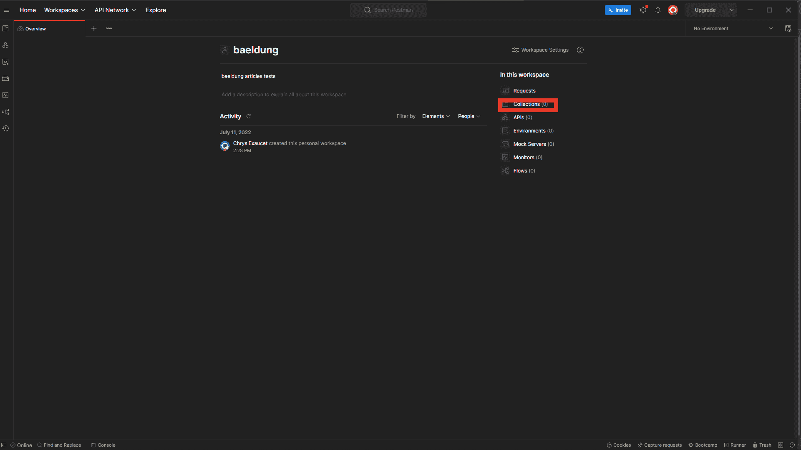
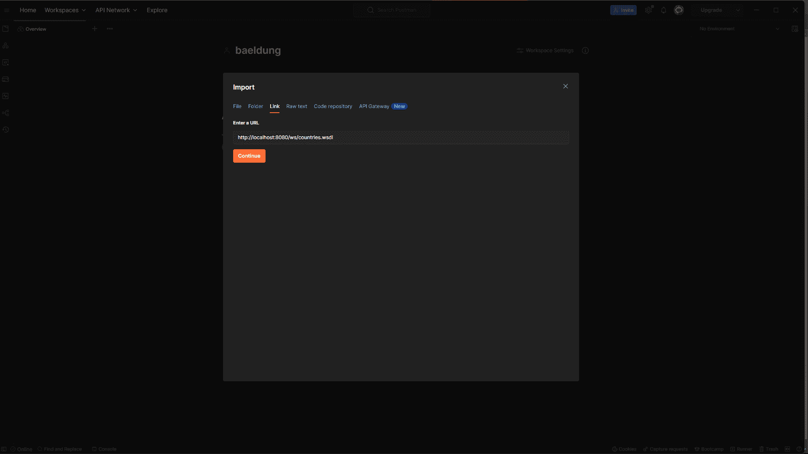
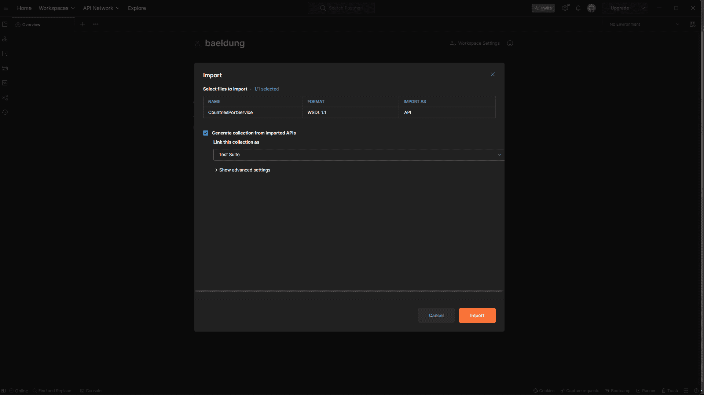
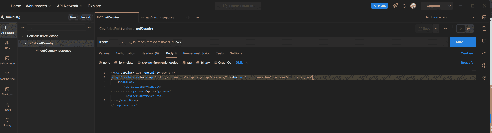

# 通过邮递员发送 SOAP 请求

> 原文:[https://web . archive . org/web/20220930061024/https://www . bael dung . com/postman-soap-request](https://web.archive.org/web/20220930061024/https://www.baeldung.com/postman-soap-request)

## 1.概观

在本文中，我们将通过[邮递员](https://web.archive.org/web/20221005120332/https://learning.postman.com/docs/sending-requests/supported-api-frameworks/making-soap-requests/)发送一个 [SOAP](/web/20221005120332/https://www.baeldung.com/spring-boot-soap-web-service) 请求。在此之前，我们将从我们的[国家 SOAP 服务](/web/20221005120332/https://www.baeldung.com/spring-boot-soap-web-service)导入 WSDL 到 API 平台。

## 2.设置

在我们能够在 Postman 中发出 SOAP 请求之前，我们需要一个正常工作的 SOAP 服务。在运行我们的[国家 SOAP 服务](/web/20221005120332/https://www.baeldung.com/spring-boot-soap-web-service#1-build-and-run-the-project)之后，端点将位于 [http://localhost:8080/ws](https://web.archive.org/web/20221005120332/http://localhost:8080/ws) ，而[WSDL](https://web.archive.org/web/20221005120332/https://github.com/eugenp/tutorials/blob/master/spring-soap/src/main/resources/countries.wsdl)可以在[http://localhost:8080/ws/countries . wsdl](https://web.archive.org/web/20221005120332/http://localhost:8080/ws/countries.wsdl)找到。

## 3.测试来自邮递员的 SOAP 请求

用 Postman 测试我们的端点有四个步骤。

### 3.1.WSDL 进口肥皂

从 Postman 8.4.0 开始，我们可以将[我们的 WSDL](https://web.archive.org/web/20221005120332/http://localhost:8080/ws/countries.wsdl) 导入到 Postman 中。我们可以直接导入我们的[国家邮差合集](https://web.archive.org/web/20221005120332/https://github.com/eugenp/tutorials/tree/master/spring-soap/src/main/resources)。以下是从 WSDL 创建新系列的几个步骤。

首先，让我们点击`Collections`:

[](/web/20221005120332/https://www.baeldung.com/wp-content/uploads/2022/08/1.png)

接下来，让我们通过提供 URL 来导入我们的 WSDL:

[](/web/20221005120332/https://www.baeldung.com/wp-content/uploads/2022/08/2.png)

也可以直接使用 [countries.wsdl WDSL 文件](https://web.archive.org/web/20221005120332/https://github.com/eugenp/tutorials/blob/master/spring-soap/src/main/resources/countries.wsdl)导入。

我们的服务来自 WSDL。我们将跳过高级设置，导入默认设置:

[](/web/20221005120332/https://www.baeldung.com/wp-content/uploads/2022/08/3.png)

导入后，我们应该能够看到我们所有的 SOAP 服务:

[](/web/20221005120332/https://www.baeldung.com/wp-content/uploads/2022/08/3.2.png)

Postman 负责为每个请求设置正确的 URL、内容类型和标题。

### 3.2.添加正文数据

接下来，让我们定制我们的请求体，在信封头中添加`Spain`作为国家`name`和`baeldung`名称空间:

```
<soapenv:Envelope xmlns:soapenv="http://schemas.xmlsoap.org/soap/envelope/"
                  xmlns:gs="http://www.baeldung.com/springsoap/gen">
    <soapenv:Header/>
    <soapenv:Body>
        <gs:getCountryRequest>
            <gs:name>Spain</gs:name>
        </gs:getCountryRequest>
    </soapenv:Body>
</soapenv:Envelope>
```

### 3.3.设置请求标题

通过导入我们的 WSDL，Postman 已经为我们设置了合适的标题。`Content-Type`被设置为`text/xml` 并为我们的请求工作。`text/xml`比`application/xml`更可取。不明确支持`text/xml`的 MIME 用户代理(和 web 用户代理)会将其视为`text/plain`，例如，将 XML MIME 实体显示为纯文本。

如果一个请求需要另一种内容类型，我们可以取消选择由 Postman 自动添加的`Content-Type` 头。然后，我们在`Key`字段中添加一个带有`Content-Type`的新行，并在`Value`字段中添加新的内容类型名称。

如果服务返回一个状态码 500，我们应该添加一个额外的头“`SOAPAction:` `#POST”`”。

### 3.4.发送 SOAP 请求

最后，让我们点击`Send`按钮来调用 SOAP 服务。如果我们的呼叫成功，Postman 会在下方选项卡中显示包含西班牙信息的响应:

```
<SOAP-ENV:Envelope xmlns:SOAP-ENV="http://schemas.xmlsoap.org/soap/envelope/">
<SOAP-ENV:Header/>
<SOAP-ENV:Body>
    <ns2:getCountryResponse xmlns:ns2="http://www.baeldung.com/springsoap/gen">
        <ns2:country>
            <ns2:name>Spain</ns2:name>
            <ns2:population>46704314</ns2:population>
            <ns2:capital>Madrid</ns2:capital>
            <ns2:currency>EUR</ns2:currency>
        </ns2:country>
    </ns2:getCountryResponse>
</SOAP-ENV:Body>
</SOAP-ENV:Envelope>
```

下面是 Postman 控制台中的输出:

[](/web/20221005120332/https://www.baeldung.com/wp-content/uploads/2022/08/4.png)

## 4.结论

在本文中，我们学习了如何通过 Postman 发送 SOAP 请求。我们首先看到了如何将我们的 WSDL 导入到 Postman 中。然后，我们成功地向我们的国家服务发送了请求。和往常一样，代码可以在 GitHub 的[上获得。](https://web.archive.org/web/20221005120332/https://github.com/eugenp/tutorials/tree/master/spring-soap)