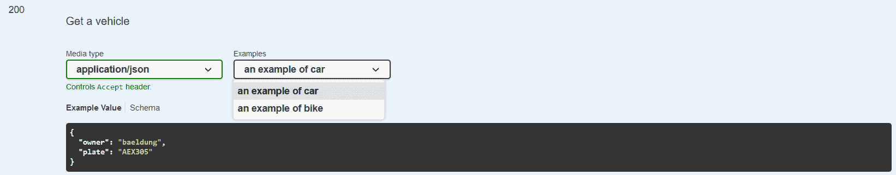
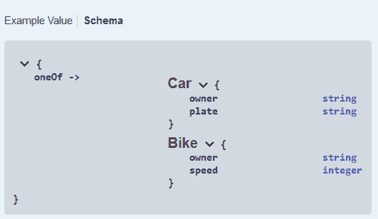
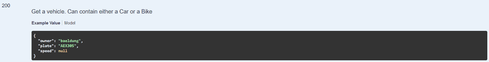
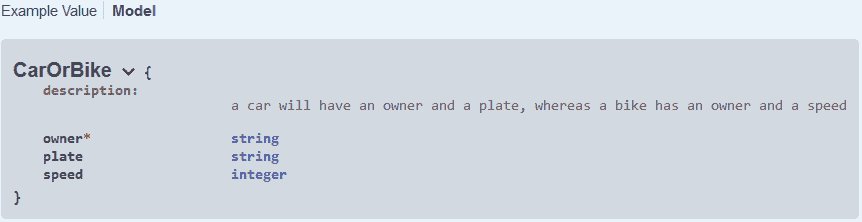

# Swagger:用相同的响应代码指定两个响应

> 原文：<https://web.archive.org/web/20220930061024/https://www.baeldung.com/swagger-two-responses-one-response-code>

## 1.概观

在本文中，我们将编写一个 API 规范，允许为同一个响应代码返回两个不同的对象。我们将演示如何使用该规范来生成 Java 代码和 Swagger 文档。

## 2.问题的呈现

让我们定义两个对象。一个`Car`有一个主人和一个盘子作为属性，都是 [`Strings`](/web/20220911070011/https://www.baeldung.com/java-string) 。另一方面，`Bike`有主人和速度。速度是一个`Integer`。

使用 OpenAPI，这些定义对应于以下描述:

[PRE0]

**我们想要描述一个端点`/vehicle`，它将接受 GET 请求并能够返回一个`Car`或一个`Bike`。**也就是说，我们要完成下面的描述符:

[PRE1]

我们将针对 OpenAPI 2 和 3 规范讨论这个主题。

## 3.OpenAPI 3 有两种不同的响应

OpenAPI 版引入了`oneOf`，这正是我们所需要的。

### 3.1.构建描述符文件

**在 OpenAPI 3 规范中，`oneOf`需要一个对象数组，并表示所提供的值应该与给定对象之一完全匹配:**

[PRE2]

此外，OpenAPI 3 引入了展示各种响应示例的可能性。为了清楚起见，我们肯定希望至少提供一个带有`Car`的示例响应和另一个带有`Bike`的示例响应:

[PRE3]

最后，让我们看看整个描述符文件:

[PRE4]

### 3.2.生成 Java 类

现在，我们将使用我们的 YAML 文件来生成我们的 API 接口。两个 [`maven`](/web/20220911070011/https://www.baeldung.com/maven) 插件 [`swagger-codegen`和`openapi-generator`](/web/20220911070011/https://www.baeldung.com/spring-boot-rest-client-swagger-codegen) ，可以用来从`api.yaml`文件生成 Java 代码。从 6.0.1 版本开始，`openapi-generator`不处理`oneOf`，所以在本文中我们将坚持使用`swagger-codegen`。

我们将对 swagger-codegen 插件使用以下配置:

[PRE5]

请注意，我们决定切换选项，只生成接口，以避免生成大量我们不感兴趣的文件。

现在让我们执行插件:

[PRE6]

我们现在可以看看生成的文件:

*   生成了`Car`和`Bike`对象
*   由于使用了 [`@JsonSubTypes`](/web/20220911070011/https://www.baeldung.com/jackson-annotations) 注释，生成了`OneOfinlineResponse200`接口来表示可以是`Car`或`Bike`的对象
*   `InlineResponse200`是`OneOfinlineResponse200`的基础实现
*   `VehicleApi`定义端点:对该端点的 get 请求返回一个`InlineResponse200`

### 3.3.生成 Swagger UI 文档

为了从我们的 YAML 描述符文件生成 Swagger UI 文档，我们将使用 [`springdoc-openapi`](/web/20220911070011/https://www.baeldung.com/spring-rest-openapi-documentation) 。让我们将对`springdoc-openapi-ui`的依赖添加到 pom.xml 中:

[PRE7]

`springdoc-openapi-ui`的**版本 1.6.10 依赖于`swagger-ui`版本 4.13.2，正确处理`oneOf`和各种响应实例。**

为了从 YAML 文件生成 Swagger UI 文档，我们需要声明一个`[SpringBootApplication](/web/20220911070011/https://www.baeldung.com/spring-boot-start)`并添加以下三个[bean](/web/20220911070011/https://www.baeldung.com/spring-bean):

[PRE8]

最后但同样重要的是，我们需要确保我们的 YAML 描述符在`resources/static`目录中，并更新`application.properties`以指定我们不想从`[Controllers](/web/20220911070011/https://www.baeldung.com/spring-controllers)`而是从 YAML 文件中生成 Swagger UI:

[PRE9]

我们现在可以开始我们的应用程序了:

[PRE10]

Swagger UI 可以通过`http://localhost:8080/swagger-ui/index.html`访问。

我们可以看到有一个下拉菜单可以在`Car`和`Bike`示例之间导航:

响应`Schema`也被正确呈现:

## 4.OpenAPI 2 有两种不同的响应

在 OpenAPI 2 中，`oneOf`并不存在。所以还是找个替代方案吧。

### 4.1.构建描述符文件

**我们能做的最好的事情就是定义一个包装对象，它将具有`Car`和`Bike`的所有属性。**公共属性将是必需的，仅属于其中一个属性的属性将保持可选:

[PRE11]

我们的 API 响应将是一个`CarOrBike`对象。我们将在描述中增加更多的洞察力。不幸的是，我们不能添加各种例子，所以我们决定只给出一个汽车的例子。

让我们来看看结果`api.yaml`:

[PRE12]

### 4.2.生成 Java 类

让我们修改我们的 swagger-codegen 插件配置来解析 OpenAPI 2 文件。**为此，我们需要使用 2.x 版本的插件。**它也位于另一个包中:

[PRE13]

现在让我们看看生成的文件:

*   CarOrBike 对象包含预期的字段，拥有一个 [`@NotNull`](/web/20220911070011/https://www.baeldung.com/javax-validation) 所有者
*   `VehicleApi`定义端点:对该端点的 get 请求返回一个`CarOrBike`

### 4.3.生成 Swagger UI 文档

我们可以像在 3.3 中一样生成文档。

我们可以看到我们的描述是这样显示的:

而我们的`CarOrBike`模型如预期描述:

## 5.结论

在本教程中，我们了解了如何为可以返回一个或另一个对象的端点编写 OpenAPI 规范。多亏了`swagger-codegen`，我们使用 YAML 描述符生成 Java 代码，并使用`springdoc-openapi-ui`生成 Swagger UI 文档。

像往常一样，代码可以在 GitHub 上的[处获得。](https://web.archive.org/web/20220911070011/https://github.com/eugenp/tutorials/tree/master/spring-boot-modules/spring-boot-swagger-2)