# 如何克隆 Jenkins 作业

> 原文:[https://web . archive . org/web/20220930061024/https://www . bael dung . com/ops/Jenkins-clone-job](https://web.archive.org/web/20220930061024/https://www.baeldung.com/ops/jenkins-clone-job)

## 1.概观

在本教程中，我们将学习如何克隆 [Jenkins](/web/20221207233112/https://www.baeldung.com/ops/jenkins-pipelines) 作业。当我们希望部分或全部重用作业的配置时，克隆作业非常有用。我们将看到不同源代码树的各种例子。

## 2.示例设置

我们将从创建新的工作开始。在 Jenkins 的左侧面板中，我们点击`New Item`:

[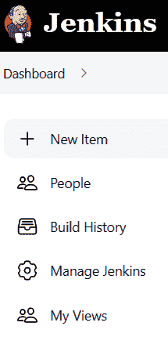](/web/20221207233112/https://www.baeldung.com/wp-content/uploads/2022/09/jenkins1.png)

项目创建界面出现。**我们将在`Enter an item name`文本字段中填入`Initial Job`，并选择`Freestyle project`选项:**

[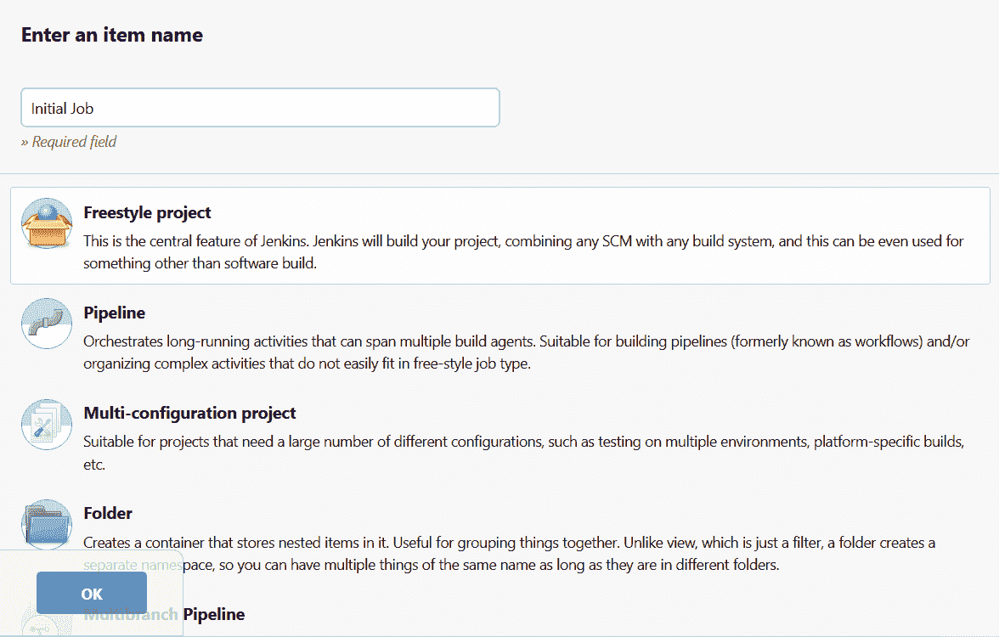](/web/20221207233112/https://www.baeldung.com/wp-content/uploads/2022/09/inital_job_creation.png)

现在我们来验证一下。将出现“作业配置”选项卡。出于本教程的考虑，我们可以将所有字段留空，直接点击`Save`按钮。这将完成作业的创建。我们现在可以回到 Jenkins 的主页，我们会看到我们的`Initial Job`列在主面板中:

[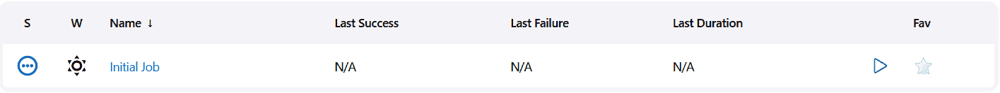](/web/20221207233112/https://www.baeldung.com/wp-content/uploads/2022/09/job_list_after_initial_job_creation.png)

## 3.将作业复制到同一文件夹中

现在让我们再次点击`New Item`。这一次，在`Enter an item name`中，我们将使用`Copy Job`这个名字。**我们现在向下滚动到`Copy from`部分:**

[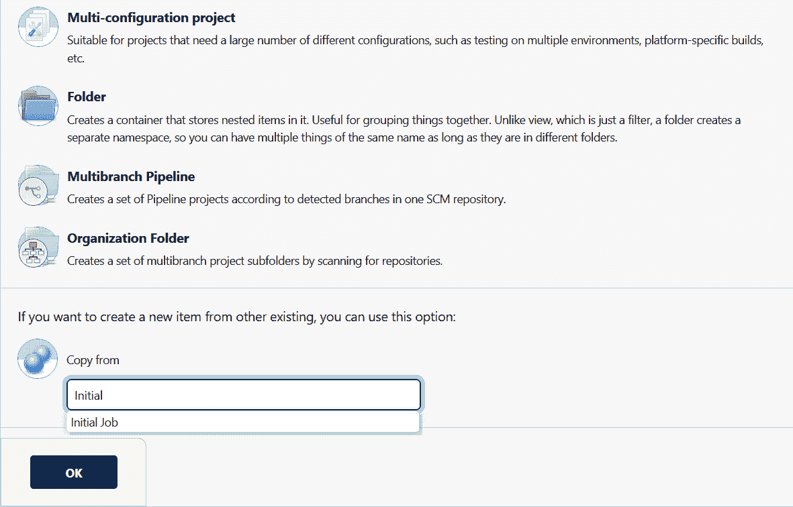](/web/20221207233112/https://www.baeldung.com/wp-content/uploads/2022/09/copy_initial_job.png)

正如我们在屏幕截图上看到的，我们可以利用自动完成来选择我们的`Initial Job`。我们现在可以进行验证，就像之前一样，直接点击`Save`来完成任务的创建。在 Jenkins 的主页上，我们现在将看到更新的工作列表:

[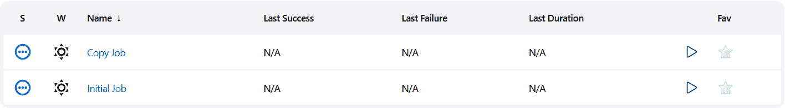](/web/20221207233112/https://www.baeldung.com/wp-content/uploads/2022/09/job_list_after_copy_job_creation.png)

## 4.将作业复制到不同的文件夹中

到目前为止，我们只在 Jenkins 的根目录下工作。让我们看看如何将我们的作业复制到其他文件夹中。

### 4.1.使用相对路径

首先，让我们在 Jenkins 中创建一个新文件夹。我们将再次点击`New Item`。这一次，我们将选择`Folder`选项。姑且称之为`Folder1`:

[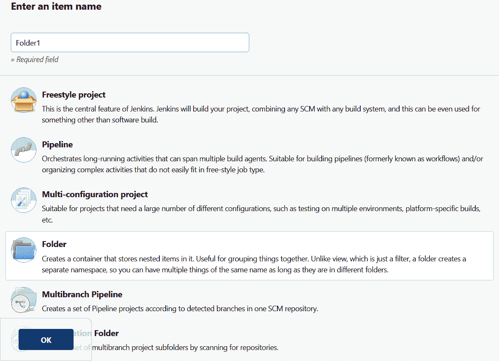](/web/20221207233112/https://www.baeldung.com/wp-content/uploads/2022/09/folder1_creation.png)

我们可以验证，并一如既往地直接保存它。

现在让我们回到主页。文件夹`Folder1`现在在项目列表中可见:

[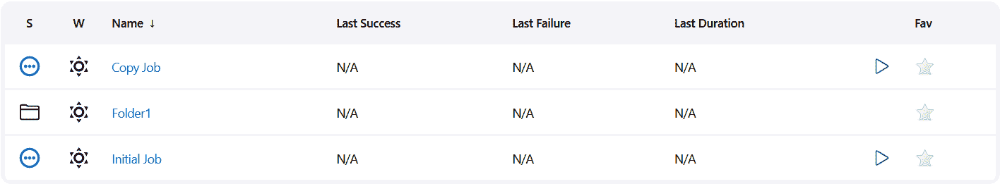](/web/20221207233112/https://www.baeldung.com/wp-content/uploads/2022/09/item_list_after_folder1_creation.png)

我们来开`Folder1`。它是空的:

[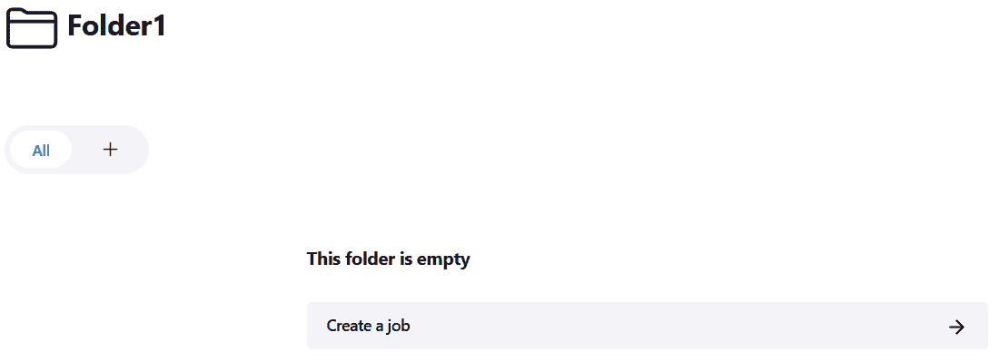](/web/20221207233112/https://www.baeldung.com/wp-content/uploads/2022/09/empty_folder1.png)

我们可以点击`Create a job`按钮。项目创建将再次出现。让我们称我们的新工作为 `Copy Job In Folder1`。由于我们这次正在创建一个工作，让我们记住选择`Freestyle project`选项。

现在让我们向下滚动到`Copy from`字段。**在这里，我们需要参考`Initial Job`的相对路径。**它位于父目录中，因此我们将这样填写该字段:

[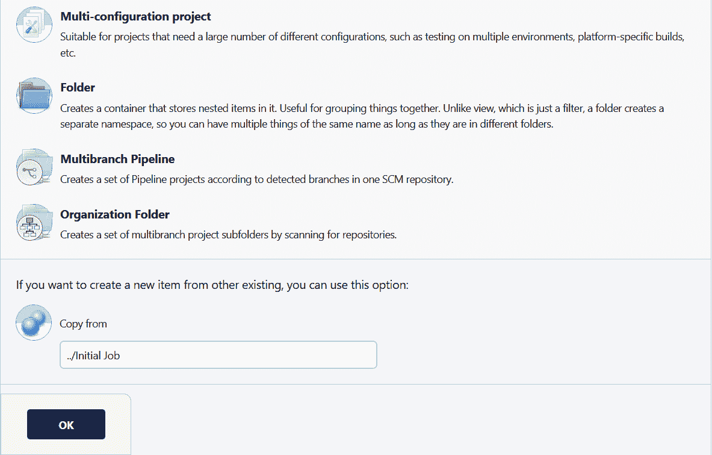](/web/20221207233112/https://www.baeldung.com/wp-content/uploads/2022/09/copy_initial_job_in_subfolder.png)

与我们在前面几节中所做的类似，我们可以验证并完成作业的创建。这将引导我们进入工作页面:

[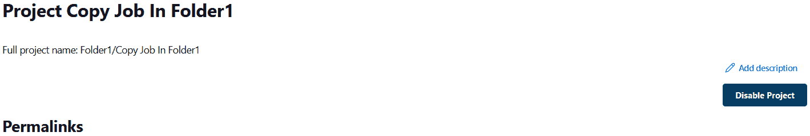](/web/20221207233112/https://www.baeldung.com/wp-content/uploads/2022/09/copy_job_in_folder1_page.png)

让我们记下完整的项目名称:`Folder1/Copy Job In Folder1`，因为我们将在下一节中使用这个信息。

### 4.2.使用绝对路径

我们现在将返回主页，按照步骤再次创建一个新文件夹。我们将这一个称为`Folder2`，从主页引导我们到下面的视图:

[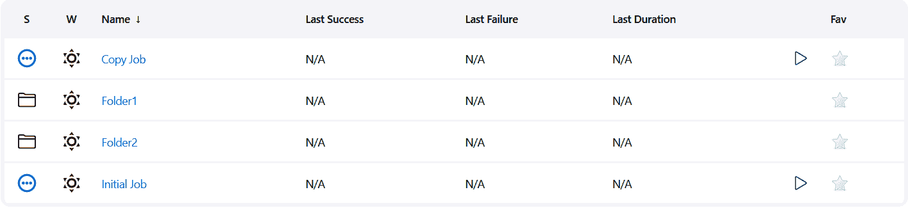](/web/20221207233112/https://www.baeldung.com/wp-content/uploads/2022/09/item_list_after_folder2_creation.png)

让我们打开`Folder2`并在其中创建一个新任务。我们将这个工作称为`Copy Job In Folder2`。这一次，我们要复制`Copy Job In Folder1`。因为我们记得它的完整项目名称`Folder1/Copy Job In Folder1`，我们可以在`Copy from`字段中输入它:

[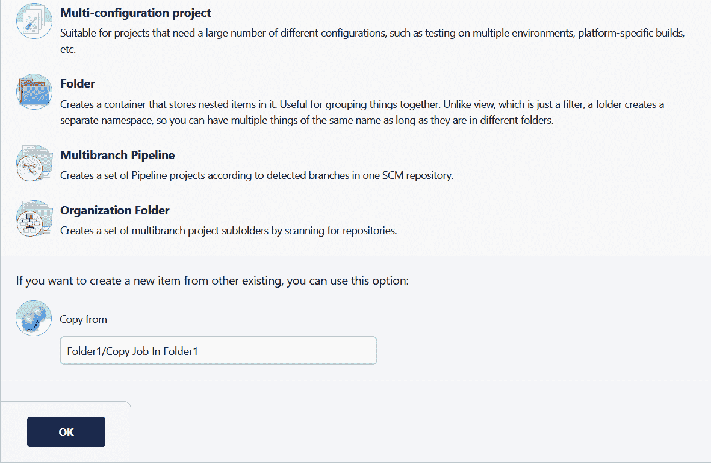](/web/20221207233112/https://www.baeldung.com/wp-content/uploads/2022/09/copy_job_with_absolute_path.png)

我们现在可以验证了，我们完成了！

## 5.结论

在本文中，我们讨论了如何克隆 Jenkins 作业。我们已经看到了编写源作业路径的各种方法。