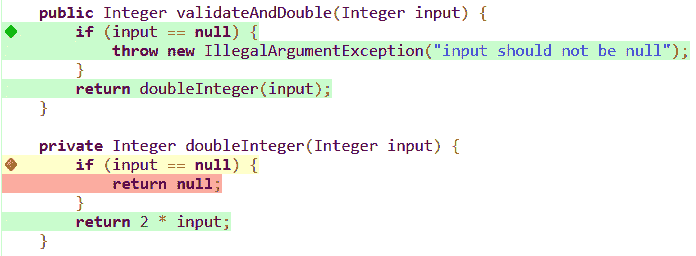

# Java 中的单元测试私有方法

> 原文：<https://web.archive.org/web/20220930061024/https://www.baeldung.com/java-unit-test-private-methods>

## 1.概观

在本文中，我们将简要解释为什么直接测试私有方法通常不是一个好主意。然后，如果有必要，我们将演示如何在 Java 中测试私有方法。

## 2.为什么我们不应该测试私有方法

通常，我们编写的单元测试应该只检查我们的公共方法契约。私有方法是我们的公共方法的调用者不知道的实现细节。此外，改变我们的实现细节不应该导致我们改变我们的测试。

一般来说，敦促测试私有方法会突出以下问题之一:

*   我们的私有方法中有死代码。
*   我们的私有方法太复杂，应该属于另一个类。
*   我们的方法本来就不是私有的。

因此，当我们觉得需要测试一个私有方法时，我们真正应该做的是修复底层的设计问题。

## 3.一个例子:从私有方法中移除死代码

让我们展示一个简单的例子。

我们将编写一个私有方法来返回一个`Integer`的 double 值。对于`null`的值，我们想返回`null`:

[PRE0]

现在，让我们编写我们的公共方法。这将是课堂之外的唯一入口。

这个方法接收一个`Integer`作为输入。它验证这个`Integer`不是`null`，否则抛出一个 [`IllegalArgumentException`](/web/20220815003257/https://www.baeldung.com/java-illegalargumentexception-or-nullpointerexception) 。之后，它调用私有方法返回两倍于`Integer`的值:

[PRE1]

让我们遵循我们的良好实践，测试我们的公共方法契约。

首先，让我们编写一个测试，确保如果输入是`null`，则抛出 [`IllegalArgumentException`](/web/20220815003257/https://www.baeldung.com/java-illegalargumentexception-or-nullpointerexception) :

[PRE2]

现在，让我们检查一个非空的`Integer`是否被正确地双精度化:

[PRE3]

让我们来看看 JaCoCo 插件报告的[覆盖范围:](/web/20220815003257/https://www.baeldung.com/jacoco)

 正如我们所看到的，我们的私有方法中的空值检查并不包含在我们的单元测试中。那我们应该测试它吗？

答案是否定的！理解我们的私有方法并不存在于真空中是很重要的。只有在我们的公共方法中验证了数据之后，才会调用它。因此，我们的私有方法中的空检查将永远不会到达:它是死代码，应该被移除。

## 4.如何在 Java 中测试私有方法

假设我们不反对测试我们的私有方法，让我们具体解释一下我们如何做。

为了测试它，**如果我们的私有方法有另一个可见性**会很有帮助。好消息是**我们将能够用[反射](/web/20220815003257/https://www.baeldung.com/java-reflection)来模拟。**

我们的封装类叫做`Utils`。这个想法是访问名为`doubleInteger`的私有方法，该方法接受一个`Integer`作为参数。然后我们将修改它的可见性，使其可以从`Utils`类外部访问。让我们看看如何做到这一点:

[PRE4]

现在，我们可以用这种方法。让我们编写一个测试，检查给定一个`null`对象，我们的私有方法是否返回`null`。我们需要将该方法应用于一个参数，这个参数将是`null`:

[PRE5]

让我们对 [`invoke`](/web/20220815003257/https://www.baeldung.com/java-method-reflection) 方法的用法再多加评论。第一个参数是我们应用该方法的对象。由于`doubleInteger`是静态的，我们传入了一个`null`。第二个参数是一个参数数组。在这种情况下，我们只有一个参数，它是`null`。

最后，让我们演示如何测试非空输入的情况:

[PRE6]

## 5.结论

在本文中，我们描述了为什么测试私有方法通常不是一个好主意。然后，我们展示了如何使用反射来测试 Java 中的私有方法。

和往常一样，代码可以在 GitHub 的[上获得。](https://web.archive.org/web/20220815003257/https://github.com/eugenp/tutorials/tree/master/core-java-modules/core-java-reflection-2)