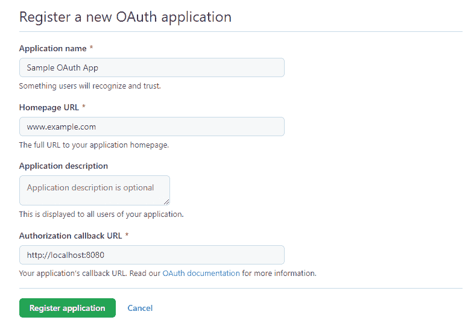

# OAuth2RestTemplate 简介

> 原文:[https://web . archive . org/web/20220930061024/https://www . bael dung . com/spring-oauth 2 rest template](https://web.archive.org/web/20220930061024/https://www.baeldung.com/spring-oauth2resttemplate)

 

It’s just plain hard to get true, **real-time visibility into a running auth flow.**

Parts of the process can be completely hidden from us; if the complete authorization process requires a redirect from a remote OAuth production server, then every debugging effort must go through the production server.

It’s practically unfeasible to debug this locally. There’s no way to reproduce the exact state and no way to inspect what is actually happening under the hood. Not ideal.

Knowing these types of challenges, we built Lightrun - a real-time production debugging tool - to allow you to understand complicated flows with code-level information. Add logs, take snapshots (virtual breakpoints), and instrument metrics without a remote debugger, without stopping the running service, and, most importantly - **in real-time and without side effects**.

**Learn more with this 5-minute tutorial** focused on debugging these kinds of scenarios using Lightrun:

[>> Debugging Authentication and Authorization Using Lightrun](/web/20220524054638/https://www.baeldung.com/lightrun-n-security)

## 1.概观

在本教程中，我们将学习**如何使用 Spring `OAuth2RestTemplate`进行 OAuth2 REST 调用**。

我们将创建一个能够列出 GitHub 帐户存储库的 Spring Web 应用程序。

## 2.Maven 配置

首先，我们需要将[spring-boot-starter-security](https://web.archive.org/web/20220524054638/https://search.maven.org/search?q=g:org.springframework.boot%20a:spring-boot-starter-security)和[spring-security-oauth 2-auto configure](https://web.archive.org/web/20220524054638/https://search.maven.org/search?q=g:org.springframework.security.oauth.boot%20a:spring-security-oauth2-autoconfigure)依赖项添加到我们的`pom.xml`中。因为我们正在构建一个 web 应用程序，所以我们还需要包含 [spring-boot-starter-web](https://web.archive.org/web/20220524054638/https://search.maven.org/search?q=g:org.springframework.boot%20a:spring-boot-starter-web) 和[spring-boot-starter-百里香叶](https://web.archive.org/web/20220524054638/https://search.maven.org/search?q=g:org.springframework.boot%20a:spring-boot-starter-thymeleaf)工件。

```
<dependency>
    <groupId>org.springframework.boot</groupId>
    <artifactId>spring-boot-starter-web</artifactId>
</dependency>
<dependency>
    <groupId>org.springframework.boot</groupId>
    <artifactId>spring-boot-starter-security</artifactId>
</dependency>
<dependency>
    <groupId>org.springframework.security.oauth.boot</groupId>
    <artifactId>spring-security-oauth2-autoconfigure</artifactId>
    <version>2.5.2</version>
</dependency>
<dependency>
    <groupId>org.springframework.boot</groupId>
    <artifactId>spring-boot-starter-thymeleaf</artifactId>
</dependency>
```

## 3.OAuth2 属性

接下来，让我们将 OAuth 配置添加到我们的`application.properties`文件中，以便能够连接 GitHub 帐户:

```
github.client.clientId=[CLIENT_ID]
github.client.clientSecret=[CLIENT_SECRET]
github.client.userAuthorizationUri=https://github.com/login/oauth/authorize
github.client.accessTokenUri=https://github.com/login/oauth/access_token
github.client.clientAuthenticationScheme=form

github.resource.userInfoUri=https://api.github.com/user
github.resource.repoUri=https://api.github.com/user/repos
```

注意，我们需要用 GitHub OAuth 应用程序中的值替换`[` `CLIENT_ID]`和`[CLIENT_SECRET]`。我们可以按照[创建 OAuth 应用](https://web.archive.org/web/20220524054638/https://docs.github.com/en/developers/apps/building-oauth-apps/creating-an-oauth-app)指南在 GitHub 上注册一个新的应用:

[](/web/20220524054638/https://www.baeldung.com/wp-content/uploads/2022/03/github-app-registering.png)

让我们确保授权回调 URL 被设置为`http://localhost:8080,`，这将把 OAuth 流重定向到我们的 web 应用程序主页。

## 4.`OAuth2RestTemplate`配置

现在，是时候创建一个安全配置来为我们的应用程序提供 OAuth2 支持了。

### 4.1.`SecurityConfig`类

首先，让我们扩展`WebSecurityConfigurerAdapter`来利用 Spring 的配置助手:

```
@Configuration
@EnableOAuth2Client
public class SecurityConfig extends WebSecurityConfigurerAdapter {
    OAuth2ClientContext oauth2ClientContext;

    public SecurityConfig(OAuth2ClientContext oauth2ClientContext) {
        this.oauth2ClientContext = oauth2ClientContext;
    }

    ...
}
```

`@EnableOAuth2Client`为我们提供了对 OAuth2 上下文的访问，我们将使用它来创建我们的`OAuth2RestTemplate`。

### 4.2.`OAuth2RestTemplate`豆子

其次，我们将为我们的`OAuth2RestTemplate`创建 bean:

```
@Bean
public OAuth2RestTemplate restTemplate() {
    return new OAuth2RestTemplate(githubClient(), oauth2ClientContext);
}

@Bean
@ConfigurationProperties("github.client")
public AuthorizationCodeResourceDetails githubClient() {
    return new AuthorizationCodeResourceDetails();
}
```

这样，我们使用 OAuth2 属性和上下文来创建模板的实例。

`@ConfigurationProperties`注释将所有的`github.client`属性注入到`AuthorizationCodeResourceDetails`实例中。

### 4.3.认证过滤器

第三，我们需要一个身份验证过滤器来处理 OAuth2 流:

```
private Filter oauth2ClientFilter() {
    OAuth2ClientAuthenticationProcessingFilter oauth2ClientFilter = new OAuth2ClientAuthenticationProcessingFilter("/login/github");
    OAuth2RestTemplate restTemplate = restTemplate();
    oauth2ClientFilter.setRestTemplate(restTemplate);
    UserInfoTokenServices tokenServices = new UserInfoTokenServices(githubResource().getUserInfoUri(), githubClient().getClientId());
    tokenServices.setRestTemplate(restTemplate);
    oauth2ClientFilter.setTokenServices(tokenServices);
    return oauth2ClientFilter;
}

@Bean
@ConfigurationProperties("github.resource")
public ResourceServerProperties githubResource() {
    return new ResourceServerProperties();
}
```

这里，我们指示过滤器在应用程序的`/login/github` URL 上启动 OAuth2 流。

### 4.4.Spring 安全配置

最后，让我们注册`OAuth2ClientContextFilter`并创建一个 web 安全配置:

```
@Override
protected void configure(HttpSecurity http) throws Exception {
    http.authorizeRequests().antMatchers("/", "/login**", "/error**")
      .permitAll().anyRequest().authenticated()
      .and().logout().logoutUrl("/logout").logoutSuccessUrl("/")
      .and().addFilterBefore(oauth2ClientFilter(), BasicAuthenticationFilter.class);
}

@Bean
public FilterRegistrationBean<OAuth2ClientContextFilter> oauth2ClientFilterRegistration(OAuth2ClientContextFilter filter) {
    FilterRegistrationBean<OAuth2ClientContextFilter> registration = new FilterRegistrationBean<>();
    registration.setFilter(filter);
    registration.setOrder(Ordered.HIGHEST_PRECEDENCE + 1);
    return registration;
}
```

我们保护我们的 web 应用程序路径，并确保在`BasicAuthenticationFilter`之前注册`OAuth2ClientAuthenticationProcessingFilter`。

## 5.使用`OAuth2RestTemplate`

**`OAuth2RestTemplate`的主要目标是减少基于 OAuth2 的 API 调用**所需的代码。它基本上满足了我们应用程序的两个需求:

*   处理 OAuth2 身份验证流
*   扩展 Spring `RestTemplate`进行 API 调用

我们现在能够将`OAuth2RestTemplate`用作 web 控制器中的自动连接 bean。

### 5.1.注册

让我们用登录和主页选项创建`index.html`文件:

```
<!DOCTYPE html>
<html lang="en"  xmlns:th="http://www.thymeleaf.org">
<head>
    <title>OAuth2Client</title>
</head>
<body>
<h3>
    <a href="/login/github" th:href="@{/home}" th:if="${#httpServletRequest?.remoteUser != undefined }">
        Go to Home
    </a>
    <a href="/hello" th:href="@{/login/github}" th:if="${#httpServletRequest?.remoteUser == undefined }">
        GitHub Login
    </a>
</h3>
</body>
</html>
```

未经身份验证的用户将看到登录选项，而经过身份验证的用户可以访问主页。

### 5.2.主页

现在，让我们创建一个控制器来问候经过身份验证的 GitHub 用户:

```
@Controller
public class AppController {

    OAuth2RestTemplate restTemplate;

    public AppController(OAuth2RestTemplate restTemplate) {
        this.restTemplate = restTemplate;
    }

    @GetMapping("/home")
    public String welcome(Model model, Principal principal) {
        model.addAttribute("name", principal.getName());
        return "home";
    }
}
```

注意，我们在`welcome`方法中有一个安全`Principal`参数。我们使用`Principal`的名字作为 UI 模型的属性。

我们来看看`home.html`模板:

```
<!DOCTYPE html>
<html lang="en"  xmlns:th="http://www.thymeleaf.org">
<head>
    <title>Home</title>
</head>
<body>
    <p>
        Welcome <b th:inline="text"> [[${name}]] </b>
    </p>
    <h3>
        <a href="/repos">View Repositories</a><br/><br/>
    </h3>

    <form th:action="@{/logout}" method="POST">
        <input type="submit" value="Logout"/>
    </form>
</body>
</html>
```

此外，我们还添加了一个查看用户存储库列表的链接和一个注销选项。

### 5.3.GitHub 仓库

现在，是时候使用在前一个控制器中创建的`OAuth2RestTemplate`来呈现用户拥有的所有 GitHub 库了。

首先，我们需要创建`GithubRepo`类来表示存储库:

```
public class GithubRepo {
    Long id;
    String name;

    // getters and setters

}
```

其次，让我们添加一个存储库映射到前面的`AppController`:

```
@GetMapping("/repos")
public String repos(Model model) {
    Collection<GithubRepo> repos = restTemplate.getForObject("https://api.github.com/user/repos", Collection.class);
    model.addAttribute("repos", repos);
    return "repositories";
}
```

**`OAuth2RestTemplate`处理向 GitHub** 发出请求的所有样板代码。此外，它将 REST 响应转换成一个`GithubRepo`集合。

最后，让我们创建`repositories.html`模板来迭代存储库集合:

```
<!DOCTYPE html>
<html lang="en"  xmlns:th="http://www.thymeleaf.org">
<head>
    <title>Repositories</title>
</head>
<body>
    <p>
        <h2>Repos</h2>
    </p>
    <ul th:each="repo: ${repos}">
        <li th:text="${repo.name}"></li>
    </ul>
</body>
</html>
```

## 6.结论

在本文中，我们学习了**如何使用`OAuth2RestTemplate`来简化对像 GitHub 这样的 OAuth2 资源服务器**的 REST 调用。

我们浏览了运行 OAuth2 流的 web 应用程序的构建块。然后，我们看到了如何调用 REST API 来检索 GitHub 用户的所有存储库。

一如既往，本教程的完整示例可以在 GitHub 上找到[。](https://web.archive.org/web/20220524054638/https://github.com/eugenp/tutorials/tree/master/spring-security-modules/spring-5-security-oauth)