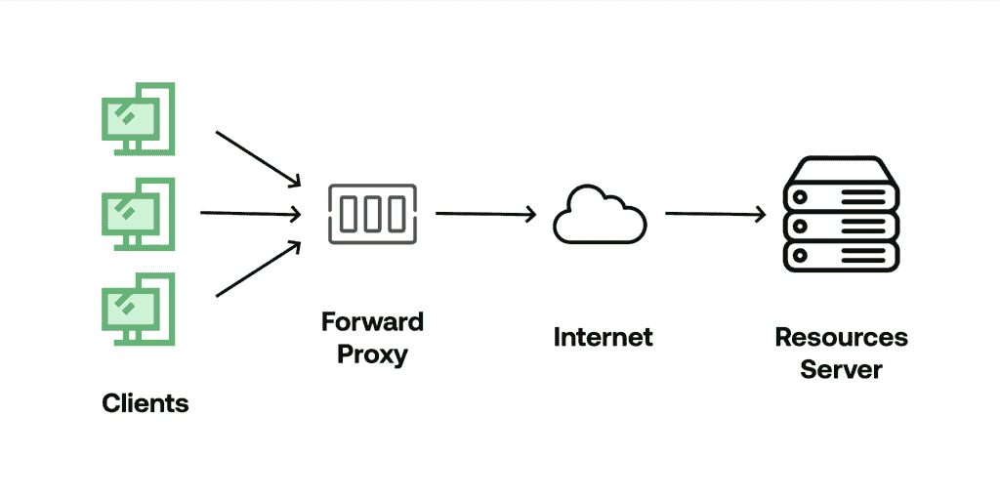

# 使用 Nginx 作为转发代理

> 原文：<https://web.archive.org/web/20220930061024/https://www.baeldung.com/nginx-forward-proxy>

## **1。**简介

说到 Nginx，它是最受欢迎的服务器之一。它速度快，重量轻，负责托管互联网上一些最大的网站。Nginx 经常被用作负载平衡器、反向代理和 HTTP 缓存等用途。

在本教程中，我们将重点学习如何使用它作为任何请求位置的前向代理。

## **2。**远期代理的动机

代理服务器是在客户端和所请求资源的主机之间充当中间人的实体。这意味着流量要通过另一台机器才能到达目的地(主机服务器)。代理代表客户端继续请求，因此当主机服务器接受请求时，它们只看到代理的 IP。相比之下，反向代理直接位于 web 的前面，将来自客户端的请求路由到正确的 web 服务器(在多个服务器的网络中)。

使用转发代理的唯一缺点是它们在应用程序级别工作，所以我们必须为我们计划路由流量的每个应用程序设置代理。

**使用转发代理的一些用例有**:

*   屏蔽 IP 和位置以获得对位置受限服务的访问
*   对于需要连接到互联网上特定资源的隔离内部网络
*   用于缓存对特定服务器的内容请求，这些内容很少更改，以便节省资源

值得注意的是**代理不加密流量，而 VPN 通过安全和加密的隧道**重定向流量。

## **3。**用 Nginx 实现转发代理

为了实现转发代理，我们将使用安装了 Nginx 的 Linux 机器。出于本教程的考虑，我们将使用 VirtualBox 和一个已经启动并运行的 Linux 发行版服务器，以及安装的 Nginx，但是你可以使用任何对你更方便的东西，比如 Docker，甚至是放在角落里多年的旧 PC。

首先，我们找到默认的`Nginx`配置文件并注释掉`server`部分，以便将其保存为归档副本。通常，我们可以在`/etc/nginx/sites-enabled/default`中找到它:

[PRE0]

接下来，让我们**创建一个名为`forward`的新文件，并添加所有需要的配置，将 Nginx 转换成一个工作的转发代理**:

[PRE1]

对于第一个配置`‘listen 8888;' –`,我们基本上是在告诉服务器，所有发送到这个端口的请求都必须用下面的配置来处理。`location`参数负责特定的服务器子划分块配置，主要告诉服务器如何处理特定 URIs 的请求。

`‘resolver 8.8.8.8'`指令指定应该使用哪些域名服务器将上游服务器的名称解析成地址，在这种情况下，8.8.8.8 对应于谷歌的域名服务器。

变量`$http_host`包含原始请求中的主机，而`$uri`包含域或 IP 之后的路径。最后两个变量`$is_args`和`$args`检查初始请求中的任何附加参数，并将它们自动添加到代理请求中。

在我们更新了所有必要的配置之后，我们需要重启`nginx.service`来使它们生效:

[PRE2]

## **4。使用转发代理**

正如我们之前提到的，转发代理在应用程序级别上工作，因此自然地，根据客户端的不同，我们可以有多种方式来配置转发代理。对于这一步，我们将使用 JavaScript 创建一个简单的客户端并跟踪请求。

在我们开始之前，让我们确保最新的 [node.js](https://web.archive.org/web/20220802202610/https://nodejs.org/en/download/) 和 npm 已经安装在我们的本地机器上。接下来，我们为客户机创建目录和文件。让我们相应地调用目录`Proxy Test`和文件`proxytest.js`。

接下来，我们需要初始化 NPM 的`package.json`，这样我们就可以安装所有需要的库。我们通过在项目目录内的终端上运行`npm init`命令来实现这一点:

[PRE3]

在我们成功初始化存储库之后，我们需要安装[请求](https://web.archive.org/web/20220802202610/https://www.npmjs.com/package/request)库，我们将使用它来构建带有代理配置的定制请求:

[PRE4]

最后，让我们打开一个 IDE 并将下面的代码粘贴到我们的`proxytest.js`文件中:

[PRE5]

现在，让我们运行这段代码:

[PRE6]

让我们后退一步，看看每一行。第一行将库导入到`request`对象中，我们稍后会用到它。

在`request`对象中，我们指定了目标服务器的 URL、HTTP 方法以及作为 URL 和端口密钥对的代理。在回调函数中，如果请求成功，我们将在控制台中记录响应体。

接下来，我们来看看 Nginx 的调试日志:

[PRE7]

正如我们看到的，我们的初始请求通过代理。紧接着，代理服务器向目标资源发起新请求，该请求包含初始请求中的所有数据。之后，它从资源中获取响应，并将其返回给我们的客户端:

[PRE8]

当请求成功发送到目的地时，我们在日志上看到一个响应“200 OK ”,这意味着请求被接受，响应被成功返回。从我们的日志中，我们还可以看到响应返回的所有 HTTP 头，逐行列出。目的服务器返回的任何 HTTP 头都会自动添加到代理返回对象中。

## **5。结论**

在本教程中，我们学习了如何使用 Nginx 服务器建立一个简单的轻量级转发代理。我们已经了解了转发代理和 VPN 之间的重要区别。最后，我们还学习了如何将基于 JavaScript 的客户机连接到我们新创建的转发代理。

完整的源代码可以在 GitHub 上找到[。](https://web.archive.org/web/20220802202610/https://github.com/eugenp/tutorials/tree/master/nginx-forward-proxy)