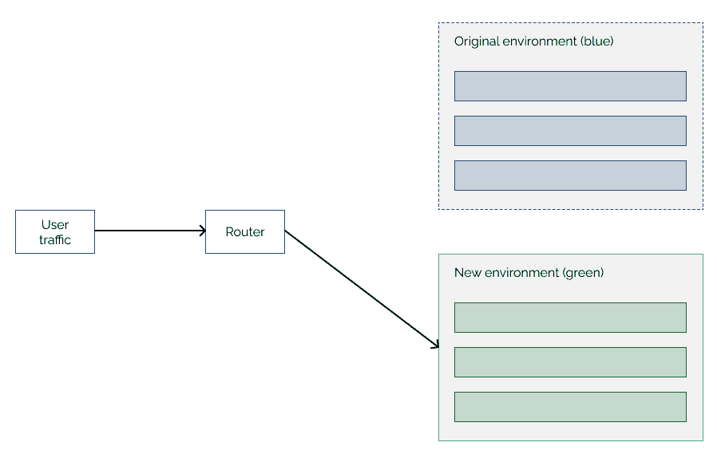
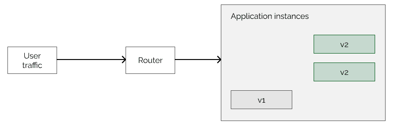
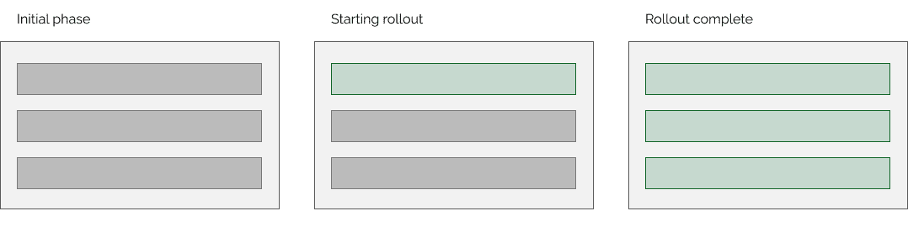
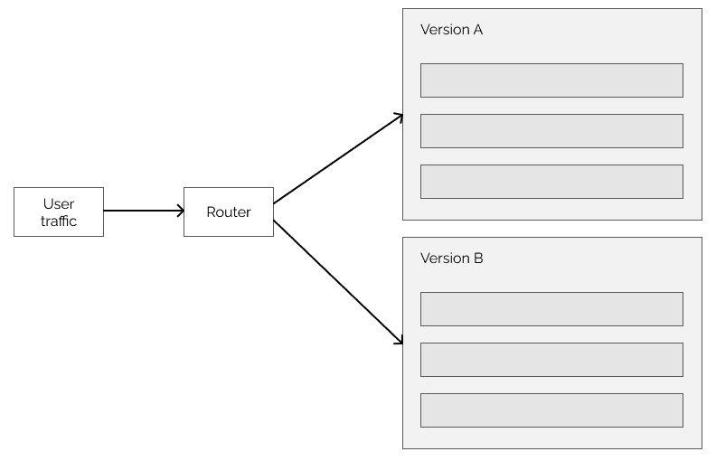
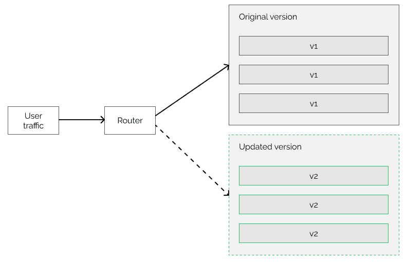

# 部署策略

> 原文：<https://web.archive.org/web/20220930061024/https://www.baeldung.com/ops/deployment-strategies>

## **1。概述**

在本教程中，我们将描述六种最常见的部署策略。

## **2。部署策略**

每当我们部署一个应用程序时，我们都必须仔细规划这个过程。我们需要考虑不同的方面，以及它如何影响用户体验。部署的目的是在不停机和不影响用户体验的情况下安装或升级应用程序。

部署策略描述了应该如何执行这些升级的过程。

## **3。重新创建部署策略**

我们讨论的最基本的策略称为“重新创建”部署策略。顾名思义，我们停下来，然后重新创建应用程序。新创建的部署运行应用程序的更新版本。

用户会经历一些停机时间，因为我们需要在新版本运行之前停止应用程序。当原始版本关闭而新版本启动时，应用程序将不可用。

**另一方面，这种策略很容易建立。**我们不必同时管理应用程序的两个不同版本。如果我们选择这种方法，更新后的应用程序将立即对所有用户可用。但是这有一个缺点，因为新版本可能会给应用程序带来错误，用户也会看到这些错误。

我们甚至可能需要完全回滚到以前的工作版本。不幸的是，**回滚也会导致停机。**要恢复部署，我们需要停止更新的应用程序并重新创建原来的应用程序。

总之，这个部署策略的设置和管理相当简单，但是在使用它之前，我们需要考虑它的缺点。

## **4。蓝绿色展开**

我们讨论的下一个部署策略称为“蓝绿色”部署。在这种情况下，我们为不同的应用程序版本分配不同的颜色。这就是这个名字的由来。**原来的、旧的版本叫蓝色环境，新更新的版本叫绿色环境。**

让我们看看这个策略是如何运作的。首先，我们有蓝色的环境。这是一个处理所有用户流量的现有应用程序。我们希望在不停机的情况下更新应用程序。为此，我们创造了一个几乎相同的环境。不过，还是有区别的。新环境将包含更新的应用程序版本。**现在，两个环境都运行我们的应用程序，但是用户仍然使用旧版本:**

上图显示了我们已经启动新版本时的状态，但用户仍在使用蓝色环境。**下一步是将所有用户流量转移到绿色环境。这种切换可以非常迅速地发生，因此用户不会经历停机时间。**此外，他们可以像以前一样使用应用程序，并且他们不知道他们的请求正由更新的应用程序处理:

如果我们需要回滚更改，可以通过将流量路由到原始的蓝色环境来立即进行。当部署完成并且我们不想回滚时，我们可以删除旧的蓝色环境。然后我们将更新后的版本从绿色重命名为蓝色。下一次发布可以遵循同样的程序。

我们可以看到，就正常运行时间和回滚能力而言，这个过程更好。然而，它也有缺点。它有更高的资源需求，因为我们创建了两个几乎相同的环境。这种设置既昂贵又耗时。其次，如果新版本做了一些非向后兼容的更改，我们可能会遇到回滚问题。例如，数据库中的更改。

## **5。滚动更新**

下一个策略叫做“滚动更新”。只有当我们有一个应用程序的多个实例时，它才适用。

最初，所有实例都运行旧版本，并且它们都可以处理用户请求。这一点在这里很重要，因为该过程将删除实例，剩下的实例必须能够为用户服务，以防止停机。

首先，我们创建一个运行更新版本的新实例。当这个新实例启动时，我们认为它是应用程序的一部分，因此用户请求可能已经被它处理了:

之后，我们从运行旧版本的实例中删除一个。这样，我们有两个运行旧版本的实例和一个运行更新版本的实例。这表明，如果我们想使用这种部署策略，我们必须能够同时支持不同的版本。否则，旧的或新的实例可能无法按预期工作。

该过程继续添加运行新版本的实例并移除它们的配对:

当最后一个实例被更新的实例替换时，部署就完成了，我们确保了应用程序按预期工作。当然，我们也可以在更新期间进行测试。如果我们发现任何问题，我们可以回滚所有更改。

这个部署策略可以参数化，以更好地满足我们的需求。我们通常可以设置一次要更新多少个实例。可以不止一个。为了简单起见，我们在示例中使用了这个值。

## **6。金丝雀部署**

我们研究的部署方法后面的称为“金丝雀部署”。**主要的想法是我们在迭代中为越来越多的用户部署更新。**

最初，只有一小部分用户会收到更新。在这一步之后，我们测试系统，以确保应用程序在更改后正常工作。这样，我们可以降低风险，即使我们向系统引入了错误，也只有一部分用户会看到。

当我们确定更新成功时，我们可以继续向所有用户推广。这也可以逐渐发生，意味着更新会逐渐覆盖越来越多的用户。例如 25%、50%、75%，然后是 100%。我们甚至可以在每次增量之间重新测试系统:

在测试过程中，我们可能会注意到应用程序工作不正常。在这种情况下，我们需要像前面的例子一样回滚更改。

Canary 部署提供了高级别的控制，但这可能很难实现。我们需要确保只有有限数量的用户收到更新。与蓝绿色部署相比，我们只需将流量从一个环境切换到另一个环境，这更具挑战性。另一方面，它给了我们更多的灵活性，降低了风险。

**这个过程不需要像蓝绿色部署那样多的资源，因为我们不复制环境。**然而，如果新的应用程序版本在数据库中做了一些重大更改，我们会面临同样的问题。

金丝雀部署策略涉及到另一个有趣的方面。我们需要选择首先获得更新的目标受众。理想情况下，他们是一个目标群体，如果发现更新有任何问题，他们会报告。但是，我们可以根据人口统计、物理位置、设备类型等来选择用户。

## 7 .**。A/B 测试**

A/B 测试与 canary 部署非常相似。可以认为是它的变种。这个过程将更新部署到用户子集，就像 canary 部署一样。 **然而，A/B 测试主要是从用户那里获得关于我们变更的反馈。**一部分用户继续使用应用程序的“版本 A ”,而另一部分用户使用“版本 B ”:

我们的目标是决定是否要向所有用户推出更新。这可能是一个复杂的过程。我们应该考虑像应用程序性能这样的技术方面，但是我们也可能希望收到用户的反馈，不管他们是否喜欢这些变化。例如，使用 A/B 测试，我们可以测量如果我们替换按钮上的文本，用户是否更有可能点击按钮。

## 8.影子部署

从使用两个相同环境的角度来看，影子部署类似于蓝绿色部署。其一是原始生产环境。另一个是影子。

但是，它与以前的部署策略不同。在所有以前的方法中，用户请求由更新的环境提供服务。**当我们使用影子部署时，两个环境都接收请求，但是响应来自最初的应用程序版本:**

这样，当我们可以在负载下监控和测试新版本时，我们就没有将错误引入系统的风险。

另一方面，进行两次部署可能成本高昂且难以管理。此外，我们需要确保新版本没有任何副作用。例如，如果我们处理支付，我们需要在新环境中模拟支付服务，以避免向用户收取两次费用。

当我们确定更新的版本是稳定的，它可以取代旧版本，我们可以将用户流量重定向到它。

## **9。结论**

在本文中，我们描述了什么是部署策略，并比较了六种不同的策略。

在选择在我们的系统中使用什么之前，我们应该考虑许多方面并比较可能的部署策略。