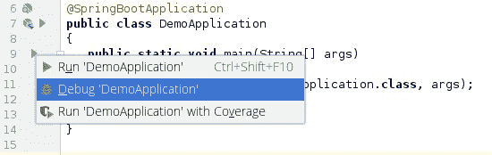
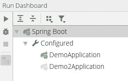
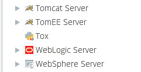
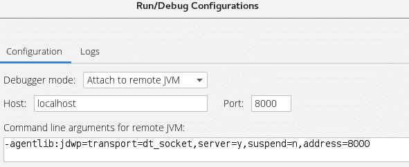
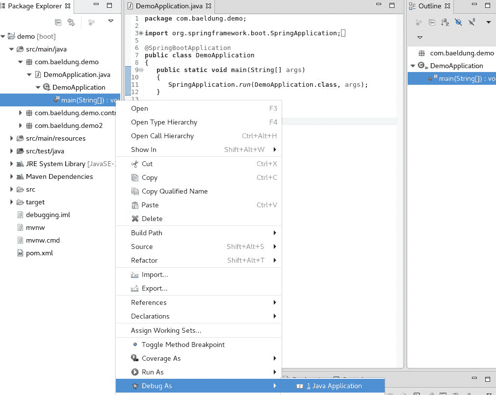
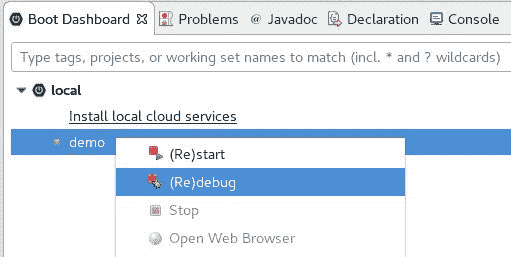
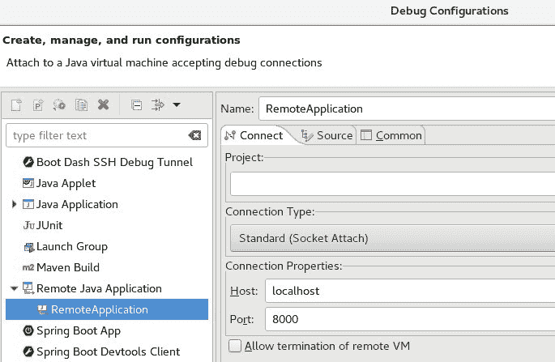

# 调试 Spring 应用程序

> 原文：<https://web.archive.org/web/20220930061024/https://www.baeldung.com/spring-debugging>

## **1。简介**

调试是编写软件最重要的工具之一。

在本教程中，我们将回顾一些调试 Spring 应用程序的方法。

我们还将看到 Spring Boot、传统应用服务器和 ide 是如何简化这一过程的。

## **2。Java 调试参数**

首先，让我们看看 Java 给了我们什么现成的东西。

**默认情况下，JVM 不启用调试**。这是因为调试会在 JVM 内部产生额外的开销。对于可公开访问的应用程序来说，这也是一个安全问题。

因此，**调试只能在开发**期间进行，而不能在生产系统上进行。

在附加调试器之前，我们必须首先配置 JVM 以允许调试。我们通过为 JVM 设置命令行参数来实现这一点:

[PRE0]

让我们来分解一下这些值的含义:

**T2`-agentlib:jdwp`**

在 JVM 中启用 Java 调试有线协议(JDWP)代理。这是启用调试的主要命令行参数。

**T2`transport=dt_socket`**

使用网络套接字进行调试连接。其他选项包括 Unix 套接字和共享内存。

**T2`server=y`**

侦听传入的调试器连接。当设置为`n`时，进程将尝试连接到调试器，而不是等待传入的连接。当设置为`n`时，需要额外的参数。

**T2`suspend=n`**

启动时不要等待调试连接。在附加调试器之前，应用程序将正常启动和运行。当设置为`y`时，该过程将不会开始，直到附加了一个调试器。

**T2`address=8000`**

JVM 将监听调试连接的网络端口。

上面的值是标准的，适用于大多数用例及操作系统。 [JPDA 连接指南](https://web.archive.org/web/20220628114829/https://docs.oracle.com/en/java/javase/11/docs/specs/jpda/conninv.html)更详细地涵盖了所有可能的值。

### 2.1.JDK9+上的绑定地址

在 JDK8 和更低版本中，将`address`属性设置为仅端口号(在上面的例子中地址=8000)意味着 JVM 监听所有可用的 IP 地址。因此，远程连接是现成可用的。

在 JDK9+中，由于安全原因，这一点有所改变。目前，默认设置只允许本地主机连接。

这意味着，如果我们想要使远程连接可用，我们需要在端口号前面加上主机名-`address`= my host:8000-或者使用星号来监听所有可用的 IP 地址-`address`= *:8000。

## **3。Spring Boot 应用程序**

Spring Boot 应用程序[可以通过几种方式启动](https://web.archive.org/web/20220628114829/https://docs.spring.io/spring-boot/docs/current/reference/html/using-boot-running-your-application.html#using-boot-running-your-application)。最简单的方法是从命令行使用带有`-jar`选项的`java`命令。

要启用调试，我们只需使用`-D`选项添加调试参数:

[PRE1]

有了 Maven，我们可以使用提供的`run`目标来启动我们的应用程序并启用调试:

[PRE2]

同样，对于 Gradle，我们可以使用`bootRun`任务。首先，我们必须更新`build.gradle`文件，以确保 Gradle 将命令行参数传递给 JVM:

[PRE3]

现在我们可以执行`bootRun`任务了:

[PRE4]

## **4。应用服务器**

虽然 Spring Boot 在最近几年变得非常受欢迎，但传统的[应用服务器](/web/20220628114829/https://www.baeldung.com/java-servers)在现代软件架构中仍然非常普遍。在这一节中，我们将看看如何为一些更流行的应用服务器启用调试。

大多数应用服务器都提供了启动和停止应用程序的脚本。启用调试通常只是向该脚本添加额外的参数和/或设置额外的环境变量。

### **4.1。Tomcat**

[Tomcat](/web/20220628114829/https://www.baeldung.com/spring-boot-war-tomcat-deploy) 的启动脚本命名为`catalina.sh`(Windows 上的`catalina.bat`)。要在启用调试的情况下启动 Tomcat 服务器，我们可以在参数前面加上`jpda`:

[PRE5]

默认的调试参数将使用一个网络套接字通过`suspend=n`监听端口 8000。这些可以通过设置以下一个或多个环境变量来改变:`JPDA_TRANSPORT`、`JPDA_ADDRESS`和`JPDA_SUSPEND`。

我们还可以通过设置`JPDA_OPTS`来完全控制调试参数。设置此变量后，它优先于其他 JPDA 变量。因此，对于 JVM 来说，它必须是一个完整的调试参数。

### **4.2 .野猫〔t1〕**

[野花](/web/20220628114829/https://www.baeldung.com/jboss-start-stop)的启动脚本是`stand-alone.sh`。要启动启用调试的 Wildfly 服务器，我们可以添加`–debug`。

默认调试模式使用带有`suspend=n`的端口 8787 上的网络监听器。我们可以通过在`–debug`参数后指定端口来覆盖它。

为了更好地控制调试参数，我们可以将完整的调试参数添加到`JAVA_OPTS`环境变量中。

### **4.3。Weblogic**

Weblogic 的启动脚本是`startWeblogic.sh`。要启动启用调试的 Weblogic server，我们可以将环境变量`debugFlag`设置为`true`。

默认的调试模式在端口 8453 上使用一个带有`suspend=n`的网络监听器。我们可以通过设置`DEBUG_PORT`环境变量来覆盖端口。

为了更好地控制调试参数，我们可以将完整的调试参数添加到`JAVA_OPTIONS`环境变量中。

Weblogic 的最新版本还提供了启动和停止服务器的 Maven 插件。这个插件将支持与启动脚本相同的环境变量。

### 4.4。Glassfish

Glassfish 的启动脚本是`asadmin`。要在启用调试的情况下启动 Glassfish 服务器，我们必须使用`–debug`:

[PRE6]

默认调试模式使用端口 9009 上的网络监听器，并带有`suspend=n`。

### **4.5。码头**

Jetty 应用服务器没有启动脚本。相反，Jetty 服务器是使用`java`命令启动的。

因此，启用调试就像添加标准 JVM 命令行参数一样简单。

## **5。从 IDE 调试**

既然我们已经看到了如何在各种应用程序类型中启用调试，那么让我们来看看如何连接调试器。

每个现代的 IDE 都提供调试支持。这既包括在启用调试的情况下启动新进程的能力，也包括调试已经运行的进程的能力。

### **5.1。IntelliJ**

[IntelliJ](/web/20220628114829/https://www.baeldung.com/intellij-debugging-tricks) 为 Spring 和 Spring Boot 应用提供一流的支持。调试非常简单，只需使用`main`方法导航到该类，右键单击三角形图标，然后选择 Debug。

如果一个项目包含多个 Spring Boot 应用程序，IntelliJ 将提供一个运行仪表板工具窗口。通过此窗口，我们可以从一个位置调试多个 Spring Boot 应用程序:

对于使用 Tomcat 或其他 web 服务器的应用程序，我们可以为调试创建自定义配置。在`Run` > `Edit Configurations`下，有许多针对最流行的应用服务器的模板:

最后，IntelliJ 使得连接到任何正在运行的进程并调试它变得非常容易。**只要应用程序使用正确的调试参数**启动，IntelliJ 就可以连接到它，即使它在另一台主机上。

在`Run/Debug Configurations`屏幕上，`Remote`模板将让我们配置如何连接到已经运行的应用程序:

注意 IntelliJ 只需要知道主机名和调试端口。为了方便起见，它告诉我们应该在我们要调试的应用程序上使用的正确的 JVM 命令行参数。

### 5.2。日食

在 Eclipse 中调试 Spring Boot 应用程序的最快方法是在`Package Explorer`或`Outline`窗口中右键单击 main 方法:

Eclipse 的默认安装不支持开箱即用的 Spring 或 Spring Boot。然而，Eclipse Marketplace 中有一个 [Spring Tools 插件](https://web.archive.org/web/20220628114829/https://www.eclipse.org/community/eclipse_newsletter/2018/february/springboot.php),它提供了与 IntelliJ 相当的 Spring 支持。

最值得注意的是**该插件提供了一个启动仪表板，让我们可以从一个地方管理多个 Spring Boot 应用程序**:

该插件还提供了一个`Spring Boot`运行/调试配置，允许对单个 Spring Boot 应用程序进行定制调试。这种定制视图与标准`Java Application`配置在所有相同的地方都可用。

为了在本地或远程主机上调试一个已经运行的进程，我们可以使用`Remote Java Application`配置:

## **6。用 Docker** 调试

调试 Docker 容器中的 [Spring 应用程序可能需要额外的配置。**如果容器在本地运行，并且没有使用主机网络模式**，那么调试端口将不能从容器外部访问。](/web/20220628114829/https://www.baeldung.com/dockerizing-spring-boot-application)

有几种方法可以在 Docker 中公开调试端口。

我们可以将`–expose`与`docker run`命令一起使用:

[PRE7]

我们还可以将`EXPOSE`指令添加到`Dockerfile`中:

[PRE8]

或者，如果我们使用 Docker Compose，我们可以将它添加到 YAML 中:

[PRE9]

## 7 .**。结论**

在本文中，我们看到了如何为任何 Java 应用程序启用调试。

通过简单地添加一个命令行参数，我们可以轻松地调试任何 Java 应用程序。

我们还看到，Maven 和 Gradle 以及大多数流行的 ide 都有专门的插件，使调试 Spring 和 Spring Boot 应用程序变得更加容易。