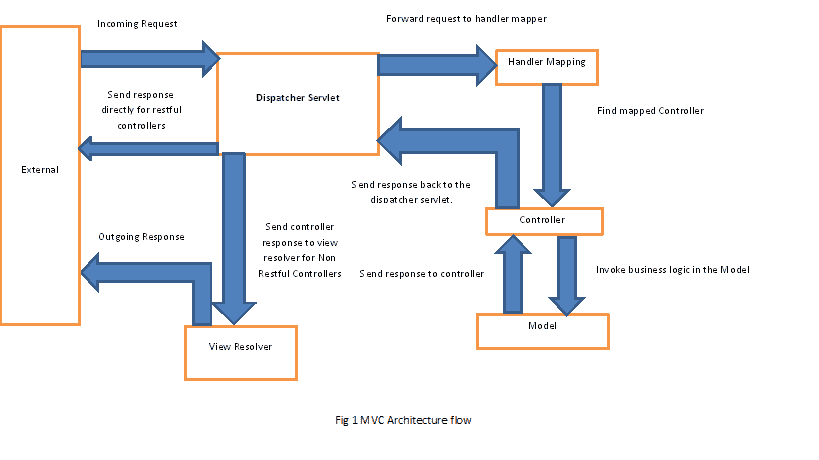
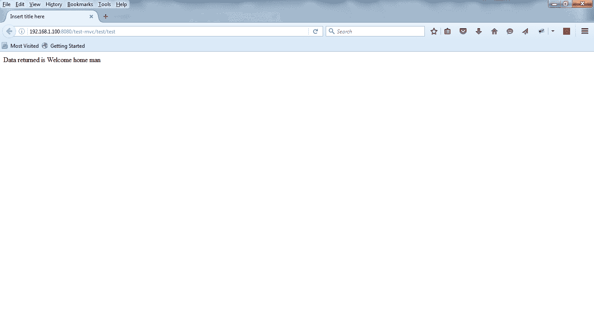
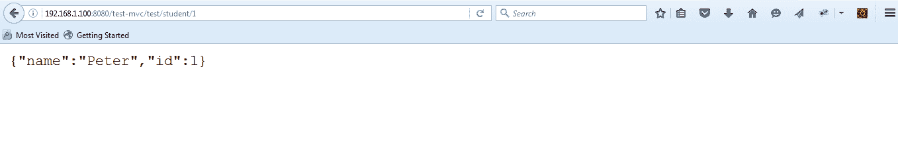

# 弹簧控制器快速指南

> 原文：<https://web.archive.org/web/20220930061024/https://www.baeldung.com/spring-controllers>

## **1。简介**

在本文中，我们将关注 Spring MVC 中的一个核心概念——控制器。

## **2。概述**

让我们先退后一步，看看典型 Spring `Model View Controller`架构中`Front Controller` 的概念**。**

从很高的层面来看，以下是我们要考虑的主要职责:

*   拦截传入的请求
*   将请求的有效负载转换为数据的内部结构
*   将数据发送到`Model`进行进一步处理
*   从`Model`获取已处理的数据，并将该数据推进到`View`进行渲染

下面是`Spring MVC`中高层流程的简图:

如您所见，`DispatcherServlet`在架构中扮演了`Front Controller`的角色。

该图既适用于典型的 MVC 控制器，也适用于 RESTful 控制器——除了一些小的差异(如下所述)。

在传统方法中，`MVC`应用程序不是面向服务的，因此有一个 V `iew Resolver`基于从`Controller`接收的数据呈现最终视图。

应用程序被设计成面向服务并返回原始数据(通常是 JSON/XML)。因为这些应用程序不做任何视图渲染，所以没有 `View Resolvers`—`Controller` 通常被期望通过 HTTP 响应直接发送数据。

让我们从 MVC0 风格的控制器开始。

## **3。Maven 依赖关系**

为了能够与`Spring MVC`一起工作，让我们首先处理 Maven 依赖项:

[PRE0]

要获得该库的最新版本，可以看看 Maven Central 上的 [spring-webmvc。](https://web.archive.org/web/20220930030929/https://mvnrepository.com/artifact/org.springframework/spring-webmvc)

## **4。项目 Web 配置**

现在，在查看控制器本身之前，我们首先需要建立一个简单的 web 项目并进行快速的`Servlet`配置。

让我们首先看看如何在不使用`web.xml`的情况下设置`DispatcherServlet`——而是使用初始化器:

[PRE1]

要设置没有 XML 的东西，请确保在您的类路径中有`servlet-api` 3.1.0。

下面是`web.xml` 的样子:

[PRE2]

我们在这里设置了`contextConfigLocation` 属性——指向用于加载 Spring 上下文的`XML`文件。如果该属性不存在，Spring 将搜索名为`{servlet_name}-servlet.xml`的文件。

在我们的例子中，`servlet_name`是`test-mvc`，因此，在这个例子中，`DispatcherServlet` 将搜索一个名为`test-mvc-servlet.xml`的文件。

最后，让我们设置`DispatcherServlet` 并将其映射到一个特定的`URL`——在这里完成我们基于`Front Controller`的系统:

[PRE3]

因此，在这种情况下，`DispatcherServlet` 将拦截模式`/test/*`中的所有请求。

## **5。Spring MVC Web 配置**

现在让我们看看如何使用 `Spring Config`设置`Dispatcher Servlet`:

[PRE4]

现在让我们看看如何使用`XML`来设置`Dispatcher Servlet`。`DispatcherServlet XML`文件的快照——`DispatcherServlet` 用来加载自定义`controllers`和其他`Spring` `entities`的`XML`文件如下所示:

[PRE5]

基于这个简单的配置，框架当然会初始化它在类路径中找到的任何控制器 bean。

注意，我们还定义了视图解析器，负责视图渲染——这里我们将使用 Spring 的`InternalResourceViewResolver`。这需要解析一个`view`的名称，这意味着通过使用前缀和后缀(都在 `XML`配置中定义)找到相应的页面。

例如，如果`Controller`返回一个名为“`welcome”**,**` 的`view`，`view`，`resolver`将尝试解析`WEB-INF`文件夹中一个名为`“welcome.jsp”`的页面。

## **6。MVC 控制器**

现在让我们最终实现 MVC 风格的控制器。

注意我们是如何返回一个`ModelAndView`对象的——它包含一个`model map`和一个`view object`；两者都将被 V `iew Resolver`用于数据渲染:

[PRE6]

我们到底在这里设置了什么？

首先，我们创建了一个名为`TestController`的控制器，并将其映射到`“/test”`路径。在这个类中，我们创建了一个方法，它返回一个`ModelAndView`对象并映射到一个`GET`请求，因此任何以`test`结尾的 URL 调用都将由`DispatcherServlet`路由到`TestController`中的`getTestData` 方法。

当然，为了更好地测量，我们返回了带有一些模型数据的`ModelAndView`对象。

视图对象的名称设置为“`welcome`”。如上所述， `View Resolver`将在`WEB-INF`文件夹中搜索一个名为“`welcome.jsp`的页面。

下面你可以看到一个示例`GET`操作的结果:

注意`URL`以`“test”`结尾。*网址*的图案是`“/test/test`。

第一个`“/test”`来自 Servlet，第二个来自控制器的映射。

## **7。REST 的更多 Spring 依赖项**

现在让我们开始看看 RESTful 控制器。当然，一个好的起点是我们需要的额外的 Maven 依赖项:

[PRE7]

请参考 [jackson-core](https://web.archive.org/web/20220930030929/https://mvnrepository.com/artifact/com.fasterxml.jackson.core/jackson-core) 、 [spring-webmvc](https://web.archive.org/web/20220930030929/https://mvnrepository.com/artifact/org.springframework/spring-webmvc) 和 [spring-web](https://web.archive.org/web/20220930030929/https://mvnrepository.com/artifact/org.springframework/spring-web) 链接，获取这些依赖项的最新版本。

当然，这并不是强制性的，但这确实是启用 JSON 支持的好方法。如果您有兴趣更深入地了解这种支持，可以看看这里的[消息转换器文章](/web/20220930030929/https://www.baeldung.com/spring-httpmessageconverter-rest)。

## **8。休息控制器**

`Spring RESTful`应用程序的设置与`MVC`应用程序的设置相同，唯一的区别是没有 V `iew Resolvers`和`model map.`

API 通常会简单地将原始数据返回给客户端——`XML`和`JSON`表示——`DispatcherServlet`绕过了`view resolvers`而**直接在 HTTP 响应体**中返回数据。

让我们来看看一个简单的 RESTful 控制器实现:

[PRE8]

注意方法上的`@ResponseBody` 注释——它指示 Spring 绕过`view resolver`和**,实质上是将输出直接写到 HTTP 响应**的主体中。

下面显示了输出的快速快照:

上面的输出是用 `1`的学生`id` 向 API 发送`GET`请求的结果。

这里有一个简单的注意事项——[`@RequestMapping`注释](/web/20220930030929/https://www.baeldung.com/spring-requestmapping)是其中一个核心注释，为了充分发挥它的潜力，你真的必须探索它。

## **9。Spring Boot 与`@RestController`注解**

Spring Boot 的`@RestController`注释基本上是一个快捷的方式，让我们不必总是定义`@ResponseBody`。

下面是使用这个新注释的前一个示例控制器:

[PRE9]

## 10。结论

在本指南中，我们将从典型的 MVC 应用程序和 RESTful API 的角度，探索在 Spring 中使用控制器的基础知识。

当然，文章中的所有代码都可以在 GitHub 上获得[。](https://web.archive.org/web/20220930030929/https://github.com/eugenp/tutorials/tree/master/spring-web-modules/spring-mvc-basics-4)