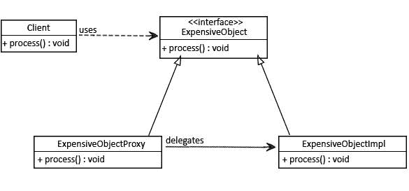

# Java 中的代理模式

> 原文：<https://web.archive.org/web/20220930061024/https://www.baeldung.com/java-proxy-pattern>

## **1。概述**

代理模式允许我们创建一个中介，作为另一个资源的接口，同时隐藏组件的底层复杂性。

## **2。代理模式示例**

考虑一个需要一些初始配置的大型 Java 对象(比如 JDBC 连接或`SessionFactory`)。

我们只希望这样的对象按需初始化，一旦初始化，我们希望在所有调用中重用它们:

现在让我们为这个对象创建一个简单的接口和配置:

[PRE0]

以及该接口的实现具有较大的初始配置:

[PRE1]

我们现在将利用代理模式并按需初始化我们的对象:

[PRE2]

每当我们的客户调用`process()` 方法时，他们只能看到处理过程，初始配置总是隐藏的:

[PRE3]

注意，我们调用了两次`process()` 方法。在幕后，设置部分只会出现一次——当对象第一次初始化时。

对于每一个其他的后续调用，该模式将跳过初始配置，并且只进行处理:

[PRE4]

## **3。何时使用代理**

理解如何使用模式是很重要的。

**了解何时**使用它至关重要。

让我们讨论一下何时使用代理模式:

*   当我们想要一个复杂或沉重物体的简化版本时。在这种情况下，我们可以用一个按需加载原始对象的骨架对象来表示它，也称为惰性初始化。这就是所谓的虚拟代理
*   **当原始对象存在于不同的地址空间，而我们想在本地表示它**。我们可以创建一个代理来做所有必要的样板工作，比如创建和维护连接、编码、解码等。，而客户端访问它，因为它存在于它们的本地地址空间中。这被称为远程代理
*   **当我们想给原来的底层对象增加一层安全，以提供基于客户端**访问权限的受控访问时。这被称为保护代理

## 4.结论

在本文中，我们看了一下代理设计模式。在下列情况下，这是一个很好的选择:

*   当我们想要一个对象的简化版本或者更安全地访问对象时
*   当我们需要远程对象的本地版本时

这个例子的完整源代码可以在 GitHub 的[上找到。](https://web.archive.org/web/20221027164210/https://github.com/eugenp/tutorials/tree/master/patterns-modules/design-patterns-structural)