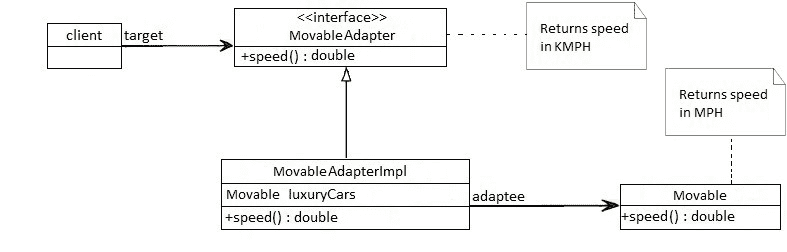

# Java 中的适配器模式

> 原文：<https://web.archive.org/web/20220930061024/https://www.baeldung.com/java-adapter-pattern>

## 1.概观

在这个快速教程中，我们将看看适配器模式及其 Java 实现。

## **2。适配器模式**

适配器模式充当两个不兼容接口之间的连接器，否则这两个接口不能直接连接。一个适配器用一个新的接口包装一个现有的类，这样它就可以与客户端的接口兼容。

使用这种模式的主要动机是将现有的接口转换成客户机期望的另一个接口。它通常是在应用程序设计完成后实现的。

### **2.1。适配器模式示例**

考虑一个场景，有一个在美国开发的应用程序，它返回豪华汽车的最高速度，以英里每小时(MPH)为单位。现在，我们需要为我们在英国的客户使用相同的应用程序，希望得到相同的结果，但以公里/小时(km/h)为单位。

为了解决这个问题，我们将创建一个适配器，它将转换这些值并给出我们想要的结果:

首先，我们将创建原始接口`Movable`,它应该返回一些豪华车的速度，单位是英里/小时:

[PRE0]

我们现在将创建该接口的一个具体实现:

[PRE1]

现在我们将创建一个适配器接口`MovableAdapter`，它将基于同一个 `Movable`类。它可能会稍加修改，以在不同的情况下产生不同的结果:

[PRE2]

该接口的实现将由用于转换的私有方法`convertMPHtoKMPH()` 组成:

[PRE3]

现在我们将只使用我们的适配器中定义的方法，我们将得到转换后的速度。在这种情况下，以下断言将为真:

[PRE4]

正如我们在这里可以注意到的，对于这种特殊情况，我们的适配器将`268 mph`转换为`431 km/h`。

### **2.2。何时使用适配器模式**

*   **当外部组件提供了我们想要重用的迷人功能，但它与我们当前的应用程序不兼容时**。可以开发合适的适配器来使它们彼此兼容
*   当我们的应用程序与客户期望的接口不兼容时
*   当我们想在应用程序中重用遗留代码而不对原始代码做任何修改时

## 3.结论

在本文中，我们了解了 Java 中的适配器设计模式。

这个例子的完整源代码可以在 GitHub 的[上找到。](https://web.archive.org/web/20220928091945/https://github.com/eugenp/tutorials/tree/master/patterns-modules/design-patterns-structural)