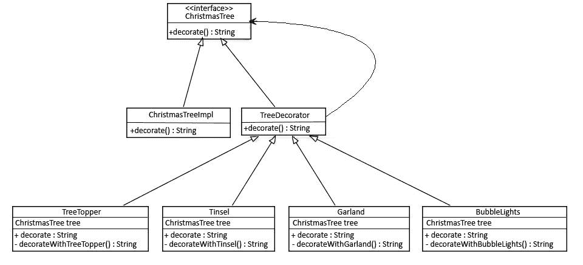

# Java 中的装饰模式

> 原文：<https://web.archive.org/web/20220930061024/https://www.baeldung.com/java-decorator-pattern>

## **1。概述**

装饰模式可以用来静态或动态地给一个对象附加额外的责任。装饰器为原始对象提供了一个增强的接口。

在这种模式的实现中，我们更喜欢组合而不是继承——这样我们就可以减少为每个修饰元素反复创建子类的开销。这种设计中的递归可以根据我们的需要多次修饰我们的对象。

## **2。装饰模式示例**

假设我们有一棵圣诞树，我们想装饰它。装饰并没有改变物体本身；只是除了圣诞树之外，我们还添加了一些装饰品，比如花环、金属箔片、树顶、泡泡灯等等。：

**在这个场景中，我们将遵循最初的四人组设计和命名约定。**首先，我们将创建一个`ChristmasTree` 接口及其实现:

[PRE0]

这个接口的实现看起来像这样:

[PRE1]

我们现在将为这个树创建一个抽象的`TreeDecorator`类。这个装饰器将实现`ChristmasTree` 接口并持有相同的对象。从同一个接口实现的方法将简单地从我们的接口调用`decorate()` 方法:

[PRE2]

我们现在将创建一些装饰元素。这些装饰者将扩展我们的抽象`TreeDecorator`类，并将根据我们的需求修改它的`decorate()` 方法:

[PRE3]

对于这种情况，以下情况成立:

[PRE4]

注意，在第一个`tree1`对象中，我们只用一个`Garland`来装饰它，而另一个`tree2`对象我们用一个`BubbleLights`和两个`Garlands`来装饰。这种模式给了我们在运行时添加任意多装饰器的灵活性。

## **4。结论**

在本文中，我们看了一下装饰设计模式。在下列情况下，这是一个很好的选择:

*   当我们希望添加、增强甚至移除对象的行为或状态时
*   当我们只想修改类的单个对象的功能而不改变其他对象时

这个例子的完整源代码可以在 GitHub 的[上找到。](https://web.archive.org/web/20221107145304/https://github.com/eugenp/tutorials/tree/master/patterns-modules/design-patterns-structural)