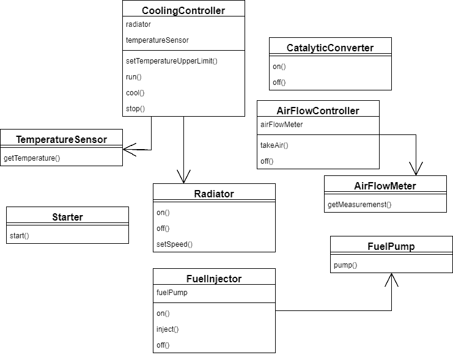

# Java 中的外观设计模式

> 原文：<https://web.archive.org/web/20220930061024/https://www.baeldung.com/java-facade-pattern>

## **1。简介**

在这个快速教程中，我们将看一看**结构设计模式之一:外观**。

首先，我们将给出该模式的概述，列出它的好处，并描述它能解决什么问题。

然后，我们将用 Java 将 facade 模式应用到一个现有的实际问题中。

## **2。什么是门面？**

简单地说，facade 在一个简单的接口后面封装了一个复杂的子系统。它隐藏了大部分复杂性，使子系统易于使用。

同样，如果我们需要直接使用复杂的子系统，我们仍然可以这样做；我们并不总是被迫使用门面。

除了更简单的界面，使用这种设计模式还有一个好处。它将客户端实现从复杂的子系统中分离出来。得益于此，我们可以对现有子系统进行更改，而不会影响客户端。

让我们看看正面的作用。

## 3.**例子**

假设我们想启动一辆汽车。下图显示了允许我们这样做的遗留系统:

如您所见，**这可能相当复杂，需要一些努力才能正确启动发动机**:

[PRE0]

同样，停止发动机也需要几个步骤:

[PRE1]

我们这里正需要一个门面。**我们将用两种方法隐藏所有的复杂性:`startEngine()`和`stopEngine()`** 。

让我们看看如何实现它:

[PRE2]

现在，**要启动和停止一辆汽车，我们只需要 2 行代码，而不是 13 行:**

[PRE3]

## **4。缺点**

facade 模式不会强迫我们进行不必要的权衡，因为它只是增加了额外的抽象层。

有时在简单的场景中会过度使用该模式，这将导致冗余的实现。

## 5.结论

在本文中，我们解释了 facade 模式，并演示了如何在现有系统上实现它。

这些例子的实现可以在 GitHub 的[中找到。](https://web.archive.org/web/20221204134440/https://github.com/eugenp/tutorials/tree/master/patterns-modules/design-patterns-structural)