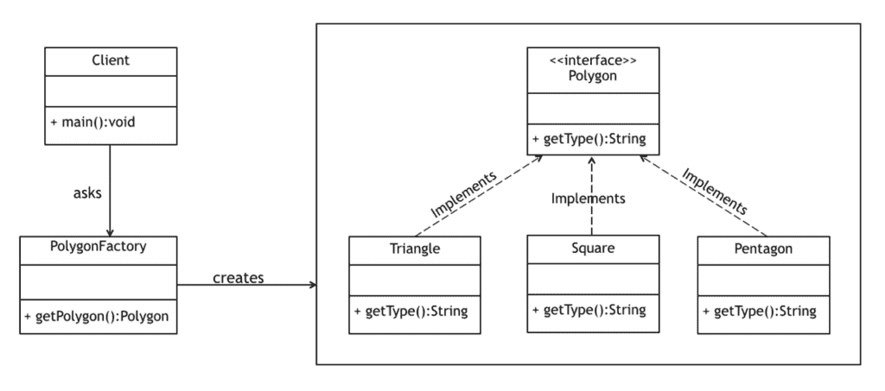

# 创造性设计模式介绍

> 原文：<https://web.archive.org/web/20220930061024/https://www.baeldung.com/creational-design-patterns>

## **1。简介**

在软件工程中，设计模式描述了软件设计中最常见问题的解决方案。它代表了经验丰富的软件开发人员经过长期的反复试验而形成的最佳实践。

在 Erich Gamma、John Vlissides、Ralph Johnson 和 Richard Helm 于 1994 年出版了《设计模式:可重用面向对象软件的元素》一书之后，设计模式开始流行起来。

在本文中，我们将探索创造性的设计模式及其类型。我们还将查看一些代码示例，并讨论这些模式适合我们的设计的情况。

## **2。创造性的设计模式**

创造性的设计模式与创建对象的方式有关。他们通过以可控的方式创建对象来降低复杂性和不稳定性。

`new` 操作符通常被认为是有害的，因为它将对象分散到整个应用程序中。随着时间的推移，更改实现会变得很有挑战性，因为类变得紧密耦合。

创造性的设计模式通过将客户端与实际的初始化过程完全分离来解决这个问题。

在本文中，我们将讨论四种类型的创造性设计模式:

1.  singleton–确保在整个应用程序中最多只存在一个对象实例
2.  工厂方法–创建几个相关类的对象，而不指定要创建的确切对象
3.  抽象工厂——创建相关依赖对象的系列
4.  构建器**–**使用逐步方法构建复杂的对象

现在让我们详细讨论一下这些模式。

## **3。单一设计模式**

Singleton 设计模式旨在通过**确保整个 Java 虚拟机中只有一个对象实例来检查特定类的对象初始化。**

单例类还为对象提供了一个唯一的全局访问点，这样每个后续的访问点调用都只返回那个特定的对象。

### **3.1。单例模式示例**

尽管单例模式是由 GoF 引入的，但已知最初的实现在多线程场景中是有问题的。

所以在这里，我们将遵循一个更优化的方法，利用一个静态内部类:

[PRE0]

在这里，我们创建了一个`static` 内部类，它保存了`Singleton`类的实例。它只在有人调用`getInstance()`方法时创建实例，而不是在加载外部类时。

对于单例类来说，这是一种广泛使用的方法，因为它不需要同步，是线程安全的，强制惰性初始化，并且样板文件相对较少。

另外，注意构造函数有`private` 访问修饰符。**这是创建单例的一个要求，因为`public`构造函数意味着任何人都可以访问它并开始创建新的实例。**

记住，这不是最初的 GoF 实现。关于原始版本，请访问[这篇关于 Java 中单例的链接文章](/web/20221103034412/https://www.baeldung.com/java-singleton)。

### **3.2。何时使用单例设计模式**

*   对于创建成本高昂的资源(如数据库连接对象)
*   将所有记录器保持为单件是一个很好的做法，这样可以提高性能
*   提供对应用程序配置设置的访问的类
*   包含以共享模式访问的资源的类

## **4。工厂方法设计模式**

工厂设计模式或工厂方法设计模式是 Java 中最常用的设计模式之一。

按照 GoF 的说法，这个模式**”定义了一个创建对象的接口，但是让子类决定实例化哪个类。工厂方法让一个类将实例化推迟到子类。**

这种模式通过创建一种类型的虚拟构造函数，将初始化类的责任从客户端委托给特定的工厂类。

为了实现这一点，我们依赖一个为我们提供对象的工厂，隐藏实际的实现细节。使用公共接口访问创建的对象。

### **4.1。工厂方法设计模式示例**

在这个例子中，我们将创建一个由几个具体类实现的`Polygon`接口。一个`PolygonFactory` 将用于从这个系列中获取对象:

让我们首先创建`Polygon` 接口:

[PRE1]

接下来，我们将创建一些实现，如`Square`、 `Triangle,` 等。实现这个接口并返回一个`Polygon`类型的对象。

现在，我们可以创建一个工厂，它将边数作为参数，并返回该接口的适当实现:

[PRE2]

注意客户端如何依赖这个工厂给我们一个合适的`Polygon`，而不需要直接初始化对象。

### **4.2。何时使用工厂方法设计模式**

*   当接口或抽象类的实现预计会频繁更改时
*   当当前的实现不能适应新的变化时
*   当初始化过程相对简单，并且构造函数只需要少量参数时

## **5。抽象工厂设计模式**

在上一节中，我们看到了如何使用工厂方法设计模式来创建与单个系列相关的对象。

相比之下，抽象工厂设计模式用于创建相关或依赖对象的系列。它有时也被称为工厂中的工厂。

关于详细的解释，请查看我们的[抽象工厂](/web/20221103034412/https://www.baeldung.com/java-abstract-factory-pattern)教程。

## **6。构建器设计模式**

生成器设计模式是另一种创造性的模式，旨在处理相对复杂的对象的构造。

当创建对象的复杂性增加时，构建器模式可以通过使用另一个对象(构建器)来构建对象，从而分离出实例化过程。

然后，该构建器可用于通过简单的逐步方法创建许多其他类似的表示。

### **6.1。构建器模式示例**

GoF 引入的原始构建器设计模式侧重于抽象，在处理复杂对象时非常好，然而，设计有点复杂。

Joshua Bloch 在他的书《有效的 Java》中介绍了一个改进版本的 builder 模式，它简洁、可读性高(因为它利用了 [fluent design](https://web.archive.org/web/20221103034412/https://en.wikipedia.org/wiki/Fluent_interface) )并且从客户的角度来看易于使用。在这个例子中，我们将讨论那个版本。

这个例子只有一个类`BankAccount`，它包含一个构建器作为`static` 内部类:

[PRE3]

注意，字段上的所有访问修饰符都被声明为`private`，因为我们不希望外部对象直接访问它们。

构造函数也是`private`，这样只有分配给这个类的构建器才能访问它。构造函数中设置的所有属性都是从我们作为参数提供的 builder 对象中提取的。

我们已经在一个`static`内部类中定义了`BankAccountBuilder`:

[PRE4]

注意，我们已经声明了外部类包含的相同字段集。任何强制字段都需要作为内部类的构造函数的参数，而其余的可选字段可以使用 setter 方法指定。

该实现还通过让 setter 方法返回 builder 对象来支持 fluent 设计方法。

最后，build 方法调用外部类的私有构造函数，并将自身作为参数传递。返回的`BankAccount`将用`BankAccountBuilder`设置的参数进行实例化。

让我们来看一个实际使用的构建器模式的快速示例:

[PRE5]

### 6.2。何时使用构建器模式

1.  当创建一个对象的过程非常复杂，有许多强制和可选的参数时
2.  当构造函数参数数量的增加导致构造函数列表变大时
3.  当客户期望构造的对象有不同的表示时

## **7。结论**

在本文中，我们学习了 Java 中的创造性设计模式。我们还讨论了它们的四种不同类型，即单例、工厂方法、抽象工厂和生成器模式，它们的优点、例子以及何时应该使用它们。

和往常一样，完整的代码片段可以在 GitHub 上找到。