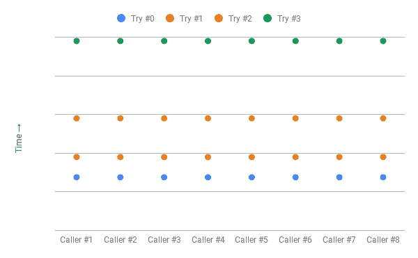
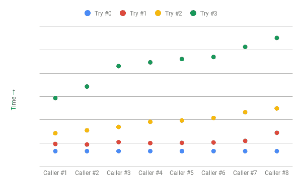

# 更好的重试，具有指数级回退和抖动

> 原文：<https://web.archive.org/web/20220930061024/https://www.baeldung.com/resilience4j-backoff-jitter>

## 1.**概述**

在本教程中，我们将探讨如何通过两种不同的策略来提高客户端重试:指数退避和抖动。

## 2.重试

在分布式系统中，众多组件之间的网络通信随时可能失败。**客户端应用通过执行** **重试**来处理这些故障。

让我们假设我们有一个调用远程服务的客户端应用程序——`PingPongService`。

[PRE0]

如果`PingPongService`返回一个`PingPongServiceException`，客户端应用程序必须重试。在下面几节中，我们将研究实现客户端重试的方法。

## 3.Resilience4j 重试

对于我们的例子，我们将使用 [Resilience4j](/web/20220929005048/https://www.baeldung.com/resilience4j) 库，特别是它的[重试](https://web.archive.org/web/20220929005048/https://resilience4j.readme.io/docs/retry)模块。我们需要将 resilience4j-retry 模块添加到我们的`pom.xml`:

[PRE1]

要复习使用重试，别忘了查看我们的[resilience 4j](/web/20220929005048/https://www.baeldung.com/resilience4j)指南。

## 4.指数后退

客户端应用程序必须负责任地实现重试。**当客户端在没有等待的情况下重试失败的呼叫时，它们可能会使系统不堪重负**，并导致已经处于困境中的服务进一步降级。

指数补偿是处理失败网络呼叫重试的常用策略。简单来说，**客户端在连续重试之间等待的时间间隔逐渐变长**:

[PRE2]

在哪里，

*   `base`是初始间隔，即等待第一次重试
*   `n`是已经发生的失败次数
*   `multiplier`是一个任意乘数，可以替换为任何合适的值

通过这种方法，我们为系统提供了一个喘息空间，以便从间歇性故障或更严重的问题中恢复过来。

我们可以通过配置它的接受一个`initialInterval`和一个`multiplier`的`IntervalFunction `，在 Resilience4j 重试中使用指数补偿算法。

重试机制将`IntervalFunction`用作睡眠功能:

[PRE3]

让我们模拟一个真实的场景，假设我们有几个客户端并发地调用`PingPongService`:

[PRE4]

让我们看看`NUM_CONCURRENT_CLIENTS`等于 4 的远程调用日志:

[PRE5]

我们在这里可以看到一个清晰的模式——客户端等待指数增长的时间间隔，但是在每次重试(冲突)时，所有客户端都在完全相同的时间调用远程服务。

我们只解决了问题的一部分——我们不再用重试来打击远程服务，而是将工作负载分散到不同的时间，将工作周期穿插到更多的空闲时间中。这种行为类似于[雷群问题](https://web.archive.org/web/20220929005048/https://en.wikipedia.org/wiki/Thundering_herd_problem)。

## 5.引入抖动

在我们以前的方法中，客户端等待时间逐渐变长，但仍然是同步的。**增加抖动提供了一种打破客户端间同步的方法，从而避免冲突**。在这种方法中，我们增加了等待间隔的随机性。

[PRE6]

其中，`random_interval`被加上(或减去)以中断客户端之间的同步。

我们不会深入计算随机时间间隔的机制，但是随机化必须将峰值间隔开，以使客户端调用的分布更加平滑。

我们可以通过配置也接受`randomizationFactor`的指数随机退避`IntervalFunction `，在 Resilience4j 重试中使用带抖动的指数退避:

[PRE7]

让我们回到现实场景，看看带有抖动的远程调用日志:

[PRE8]

现在我们有一个更好的传播。我们已经**消除了冲突和空闲时间，除了最初的高峰之外，客户端调用**的速率几乎保持不变。

注意:为了便于说明，我们夸大了时间间隔，在真实场景中，我们会有更小的间隔。

## 6.结论

在本教程中，我们探讨了如何通过增加抖动的指数补偿来改善客户端应用程序重试失败调用的方式。

教程中使用的示例的源代码可以从 GitHub 上的[处获得。](https://web.archive.org/web/20220929005048/https://github.com/eugenp/tutorials/tree/master/patterns-modules/design-patterns-cloud)