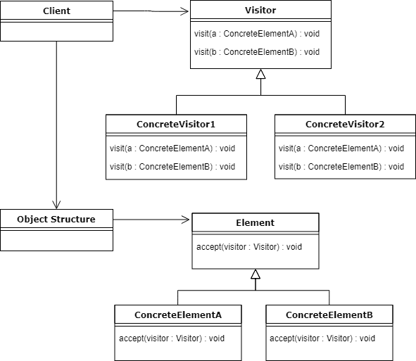

# Java 中的访问者设计模式

> 原文：<https://web.archive.org/web/20220930061024/https://www.baeldung.com/java-visitor-pattern>

## 1.概观

在本教程中，我们将介绍一种行为 GoF 设计模式——访问者。

首先，我们将解释它的目的和它试图解决的问题。

接下来，我们将看看 Visitor 的 UML 图和实际例子的实现。

## 2.访问者设计模式

访问者模式的目的是在不修改现有对象结构的情况下定义新的操作。

设想我们有一个由[](/web/20221012141731/https://www.baeldung.com/java-composite-pattern)****组成的复合物体。对象的结构是固定的——我们要么不能改变它，要么不打算向结构中添加新类型的元素。****

 ****现在，我们如何在不修改现有类的情况下向代码中添加新功能呢？

访问者设计模式可能是一个答案。简单地说，**我们要做的就是给结构的每个元素添加一个接受 visitor 类的函数。**

这样，我们的组件将允许访问者实现“访问”它们，并对该元素执行任何所需的操作。

换句话说，我们将从类中提取应用于对象结构的算法。

因此，**我们将很好地利用开放/封闭原则**，因为我们不会修改代码，但我们仍然能够通过提供新的`Visitor `实现来扩展功能。

## 3.UML 图

[](/web/20221012141731/https://www.baeldung.com/wp-content/uploads/2018/06/Visitor-UML.png)

在上面的 UML 图中，我们有两个实现层次，专门的访问者和具体的元素。

首先，客户端使用访问者实现，并将其应用于对象结构。复合对象遍历其组件，并将访问者应用于每个组件。

现在，特别相关的是，**的具体元素`(ConcreteElementA `和`ConcreteElementB) `正在接受一个`Visitor, `简单地允许它`visit `它们。**

最后，这个方法对于结构中的所有元素都是一样的，它执行[双重分派](https://web.archive.org/web/20221012141731/https://en.wikipedia.org/wiki/Double_dispatch)，并通过`this` 关键字将自己传递给访问者的访问方法。

## 4.履行

我们的例子将是由 JSON 和 XML 具体元素组成的定制`Document `对象；这些元素有一个共同的抽象超类`Element.`

`Document`类:

```
public class Document extends Element {

    List<Element> elements = new ArrayList<>();

    // ...

    @Override
    public void accept(Visitor v) {
        for (Element e : this.elements) {
            e.accept(v);
        }
    }
}
```

`Element`类有一个接受`Visitor `接口的抽象方法:

```
public abstract void accept(Visitor v);
```

因此，当创建新元素时，将其命名为`JsonElement`，我们将不得不提供这个方法的实现。

然而，由于访问者模式的性质，实现是相同的，所以在大多数情况下，需要我们从其他已经存在的元素中复制粘贴样板代码:

```
public class JsonElement extends Element {

    // ...

    public void accept(Visitor v) {
        v.visit(this);
    }
}
```

因为我们的元素允许任何访问者访问它们，假设我们想要处理我们的`Document `元素，但是每个元素都以不同的方式处理，这取决于它的类类型。

因此，我们的访问者对于给定的类型将有一个单独的方法:

```
public class ElementVisitor implements Visitor {

    @Override
    public void visit(XmlElement xe) {
        System.out.println(
          "processing an XML element with uuid: " + xe.uuid);
    }

    @Override
    public void visit(JsonElement je) {
        System.out.println(
          "processing a JSON element with uuid: " + je.uuid);
    }
}
```

这里，我们的具体访问者实现了两个方法，对应于每种类型的`Element`。

这使我们能够访问结构的特定对象，并在其上执行必要的操作。

## 5.测试

出于测试目的，让我们看看`VisitorDemo`类:

```
public class VisitorDemo {

    public static void main(String[] args) {

        Visitor v = new ElementVisitor();

        Document d = new Document(generateUuid());
        d.elements.add(new JsonElement(generateUuid()));
        d.elements.add(new JsonElement(generateUuid()));
        d.elements.add(new XmlElement(generateUuid()));

        d.accept(v);
    }

    // ...
}
```

首先，我们创建一个`Element`访问者，它保存我们将应用于元素的算法。

接下来，我们用适当的组件设置我们的`Document `,并应用将被对象结构的每个元素接受的访问者。

输出应该是这样的:

```
processing a JSON element with uuid: fdbc75d0-5067-49df-9567-239f38f01b04
processing a JSON element with uuid: 81e6c856-ddaf-43d5-aec5-8ef977d3745e
processing an XML element with uuid: 091bfcb8-2c68-491a-9308-4ada2687e203
```

它表明 visitor 已经访问了我们结构中的每个元素，根据`Element `类型，它将处理分派给适当的方法，并可以从每个底层对象中检索数据。

## 6.下降趋势

正如每个设计模式一样，即使是访问者也有它的缺点，特别是，如果我们需要向对象的结构中添加新元素，它的用法**会使维护代码变得更加困难。**

例如，如果我们添加新的`YamlElement,`，那么我们需要用处理这个元素所需的新方法更新所有现有的访问者。进一步说，如果我们有十个或更多的具体访问者，更新所有的访问者可能会很麻烦。

除此之外，当使用这种模式时，与一个特定对象相关的业务逻辑分布在所有的访问者实现中。

## 7.结论

访问者模式可以很好地将算法与它所操作的类分开。除此之外，它使得添加新的操作更加容易，只需提供一个新的 Visitor 实现。

此外，我们不依赖于组件接口，如果它们不同，那也没关系，因为我们有一个单独的算法来处理每个具体的元素。

此外，访问者最终可以根据它所遍历的元素聚集数据。

要查看访问者设计模式的更专业版本，请查看 Java NIO 中的[访问者模式——该模式在 JDK 中的使用。](/web/20221012141731/https://www.baeldung.com/java-nio2-file-visitor)

像往常一样，完整的代码可以在 [Github 项目](https://web.archive.org/web/20221012141731/https://github.com/eugenp/tutorials/tree/master/patterns-modules/design-patterns-behavioral)上获得。****