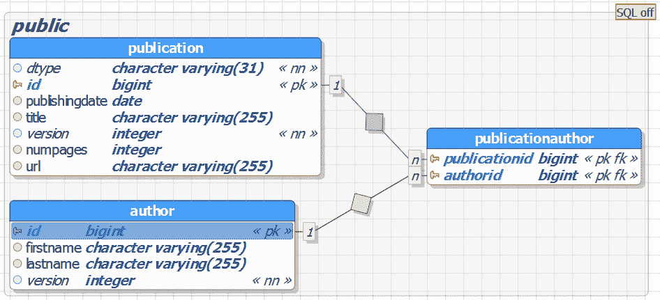

# Hibernate 技巧书籍摘录:如何将继承层次映射到一个表

> 原文:[https://web . archive . org/web/20220930061024/https://www . bael dung . com/hibernate-tips-how-to-map-a-inheritance-hierarchy-to-one-table](https://web.archive.org/web/20220930061024/https://www.baeldung.com/hibernate-tips-how-to-map-an-inheritance-hierarchy-to-one-table)

## **1。简介**

继承是 Java 的关键概念之一。所以，大多数领域模型使用它也就不足为奇了。但不幸的是，这个概念在关系数据库中并不存在，你需要找到一种方法将继承层次映射到关系表模型。

JPA 和 Hibernate 支持不同的策略，将继承层次映射到不同的表模型。让我们来看看我的新书《Hibernate Tips——常见 Hibernate 问题的 70 多种解决方案》中的一章，我在其中解释了`SingleTable`策略。它将继承层次的所有类映射到同一个数据库表。

我在我的 [Hibernate 技巧书](https://web.archive.org/web/20220524034614/https://www.amazon.com/Hibernate-Tips-solutions-common-problems/dp/1544869177)中解释了 Hibernate 的其他继承映射策略。这是一本包含 70 多种现成方法的食谱，主题包括基本和高级映射、日志记录、Java 8 支持、缓存以及静态和动态定义的查询。本周你可以在亚马逊上以 2.99 美元的特价买到它。

* * *

## **2。Hibernate 技巧——如何将继承层次映射到一个表中**

### **2.1。问题**

我的数据库包含一个表，我想将它映射到实体的继承层次结构。我如何定义这样的映射？

### **2.2。解决方案**

JPA 和 Hibernate 支持不同的继承策略，允许您将实体映射到不同的表结构。`SingleTable`策略就是其中之一，它将实体的继承层次映射到一个数据库表。

在我解释`SingleTable`策略的细节之前，我们先来看看实体模型。`Authors`可以写不同种类的`Publications`，像`Books`和`BlogPosts`。`Publication`类是`Book`和`BlogPost`类的超类。

[](/web/20220524034614/https://www.baeldung.com/wp-content/uploads/2017/04/InheritanceEntityModel.png)

`SingleTable`策略将继承层次的三个实体映射到`publication`表。

[](/web/20220524034614/https://www.baeldung.com/wp-content/uploads/2017/04/New-InheritanceSingleTable.png)

如果您想使用这种继承策略，您需要用一个`@Inheritance`注释来注释超类，并提供`InheritanceType.SINGLE_TABLE`作为`strategy`属性的值。

您还可以用`@DiscriminatorColumn`注释来注释超类，以定义鉴别器值的名称。Hibernate 使用这个值来确定它必须将数据库记录映射到的实体。如果您没有定义鉴别器列，就像我在下面的代码片段中所做的那样，Hibernate 和所有其他 JPA 实现都使用列`DTYPE`。

```
@Entity
@Inheritance(strategy = InheritanceType.SINGLE_TABLE)
public abstract class Publication {

    @Id
    @GeneratedValue(strategy = GenerationType.AUTO)
    @Column(name = "id", updatable = false, nullable = false)
    private Long id;

    @Version
    private int version;

    private String title;

    private LocalDate publishingDate;

    @ManyToMany
    @JoinTable(
      name="PublicationAuthor",
      joinColumns={@JoinColumn(name="publicationId", referencedColumnName="id")},
      inverseJoinColumns={@JoinColumn(name="authorId", referencedColumnName="id")})
    private Set<Author> authors = new HashSet<Author>();

    ...
}
```

子类需要扩展超类，您需要用一个`@Entity`注释来注释它们。

JPA 规范还建议用一个`@DiscriminatorValue`注释对其进行注释，以定义这个实体类的鉴别器值。如果不提供这个注释，JPA 实现会生成一个鉴别器值。

但是 JPA 规范没有定义如何生成鉴别器值，并且您的应用程序可能无法移植到其他 JPA 实现。Hibernate 使用简单的实体名作为鉴别器。

```
@Entity
@DiscriminatorValue("Book")
public class Book extends Publication {

    private int numPages;

    ...
}
```

如果您想要选择特定的实体、执行多态查询或遍历多态关联，那么`SingleTable`策略不需要 Hibernate 生成任何复杂的查询。

```
Author a = em.find(Author.class, 1L);
List<Publication> publications = a.getPublications();
```

所有实体都存储在同一个表中，Hibernate 可以从那里选择它们，而不需要额外的`JOIN`子句。

```
15:41:28,379 DEBUG [org.hibernate.SQL] - 
    select
        author0_.id as id1_0_0_,
        author0_.firstName as firstNam2_0_0_,
        author0_.lastName as lastName3_0_0_,
        author0_.version as version4_0_0_ 
    from
        Author author0_ 
    where
        author0_.id=?
15:41:28,384 DEBUG [org.hibernate.SQL] - 
    select
        publicatio0_.authorId as authorId2_2_0_,
        publicatio0_.publicationId as publicat1_2_0_,
        publicatio1_.id as id2_1_1_,
        publicatio1_.publishingDate as publishi3_1_1_,
        publicatio1_.title as title4_1_1_,
        publicatio1_.version as version5_1_1_,
        publicatio1_.numPages as numPages6_1_1_,
        publicatio1_.url as url7_1_1_,
        publicatio1_.DTYPE as DTYPE1_1_1_ 
    from
        PublicationAuthor publicatio0_ 
    inner join
        Publication publicatio1_ 
            on publicatio0_.publicationId=publicatio1_.id 
    where
        publicatio0_.authorId=?
```

### **2.3。源代码**

您可以在[书](https://web.archive.org/web/20220524034614/https://www.amazon.com/Hibernate-Tips-solutions-common-problems/dp/1544869177)中找到一个下载链接，该链接包含针对这个 Hibernate 技巧的可执行测试用例。

### **2.4。了解更多信息**

您还可以将继承层次的实体映射到多个数据库表。在第`How to map an inheritance hierarchy to multiple tables`章，我会告诉你怎么做。

## **3。总结**

正如您在这篇 Hibernate 技巧文章中看到的，JPA 和 Hibernate 提供了一个简单的选项来将继承层次结构映射到单个数据库表。你只需要用`@Inheritance(strategy = InheritanceType.SINGLE_TABLE)`注释超类，你也应该用`@DiscriminatorValue(“Book”)`注释子类。

你可以在我的新书 [冬眠小贴士:常见冬眠问题的 70 多种解决方案](https://web.archive.org/web/20220524034614/https://www.amazon.com/Hibernate-Tips-solutions-common-problems-ebook/dp/B06XXGYZHS/) 中获得更多这样的食谱。 它为您提供了 70 多种现成的方法，涉及基本和高级映射、日志记录、Java 8 支持、缓存以及静态和动态定义的查询等主题。 短短几天，你就可以在亚马逊 上拿到 2.99 美元的电子书和 12.99 美元的平装本 [。](https://web.archive.org/web/20220524034614/https://www.amazon.com/Hibernate-Tips-solutions-common-problems-ebook/dp/B06XXGYZHS/)