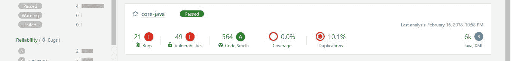
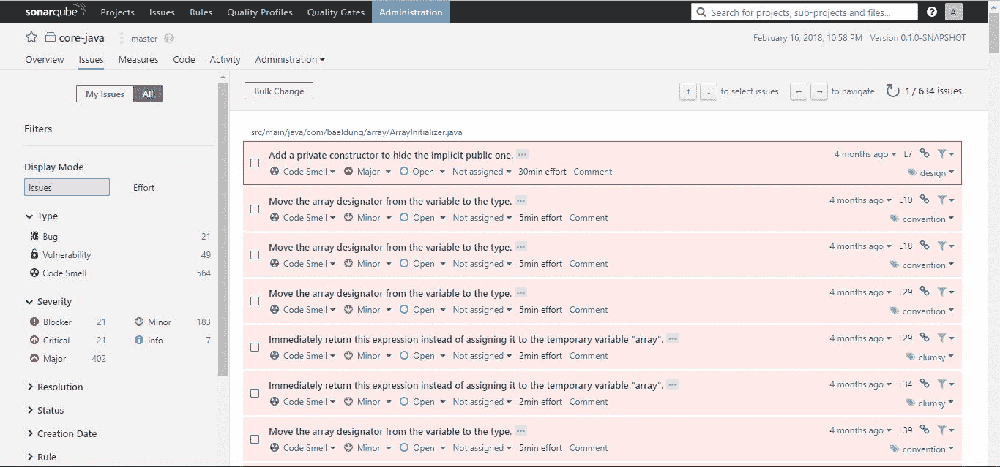
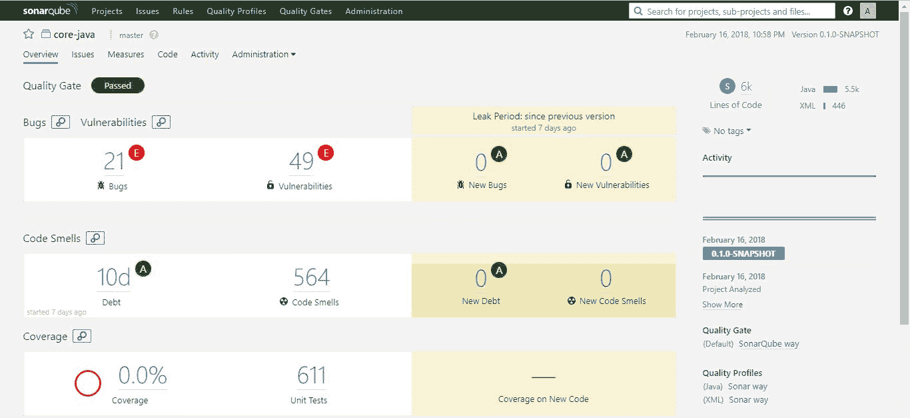
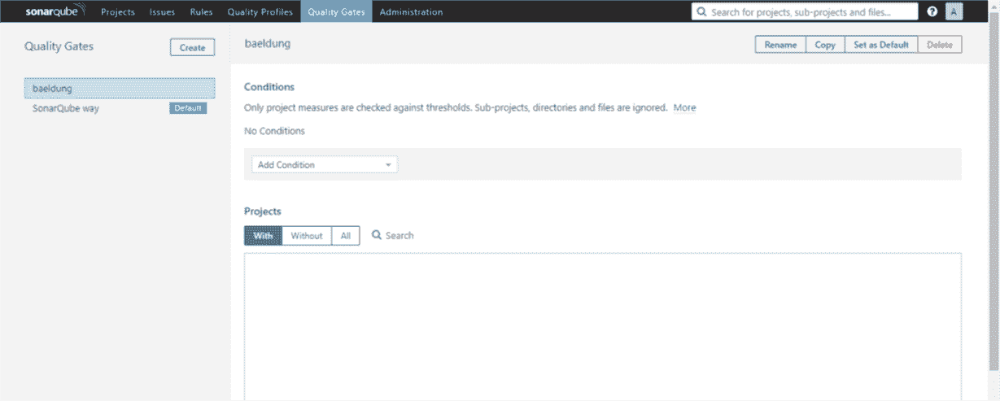
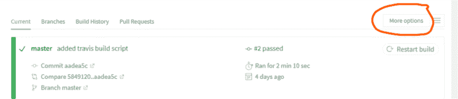
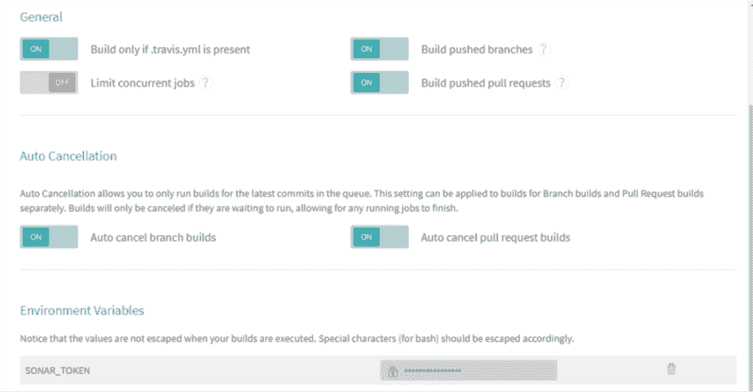

# 使用 SonarQube 进行代码分析

> 原文：<https://web.archive.org/web/20220930061024/https://www.baeldung.com/sonar-qube>

## **1。概述**

在本文中，我们将会看到使用[sonar cube](https://web.archive.org/web/20220926153104/https://www.sonarqube.org/)的静态源代码分析，这是一个用于确保代码质量的开源平台。

让我们从一个核心问题开始——为什么首先要分析源代码？简而言之，确保项目生命周期中的质量、可靠性和可维护性；编写糟糕的代码库维护起来总是更加昂贵。

好了，现在让我们开始从[下载页面](https://web.archive.org/web/20220926153104/https://www.sonarqube.org/downloads/)下载最新的 LTS 版 SonarQube，并按照[快速入门指南](https://web.archive.org/web/20220926153104/https://docs.sonarqube.org/latest/setup/get-started-2-minutes/)中的描述设置我们的本地服务器。

## **2。分析源代码**

Now that we're logged in, we're required to create a token by specifying a name – which can be our username or any other name of choice and click on the generate button.

我们将在稍后分析我们的项目时使用这个令牌。我们还需要选择主要语言(Java)和项目的构建技术(Maven)。

让我们在`pom.xml`中定义插件:

```
<build>
    <pluginManagement>
        <plugins>
            <plugin>
                <groupId>org.sonarsource.scanner.maven</groupId>
                <artifactId>sonar-maven-plugin</artifactId>
                <version>3.4.0.905</version>
            </plugin>
        </plugins>
    </pluginManagement>
</build>
```

该插件的最新版本可从[这里](https://web.archive.org/web/20220926153104/https://search.maven.org/classic/#search%7Cgav%7C1%7Cg%3A%22org.sonarsource.scanner.maven%22%20AND%20a%3A%22sonar-maven-plugin%22)获得。现在，我们需要从项目目录的根目录执行这个命令来扫描它:

```
mvn sonar:sonar -Dsonar.host.url=http://localhost:9000 
  -Dsonar.login=the-generated-token
```

我们需要用上面的令牌替换`the-generated-token`。

**我们在本文中使用的项目可以从[这里](https://web.archive.org/web/20220926153104/https://github.com/eugenp/tutorials/tree/master/security-modules/cas/cas-secured-app)获得。**

我们将 SonarQube 服务器的主机 URL 和登录(生成的令牌)指定为 Maven 插件的参数。

执行命令后，结果将出现在项目仪表板上——在`http://localhost:9000`。

我们可以将其他参数传递给 Maven 插件，甚至从 web 界面设置这些参数；`sonar.host.`网址、`sonar.projectKey`和`sonar.sources`为必填项，其他为可选项。

其他分析参数及其默认值在此为[和](https://web.archive.org/web/20220926153104/https://docs.sonarqube.org/latest/analysis/analysis-parameters/)。另外，注意每个语言插件都有分析兼容源代码的规则。

## **3。分析结果**

现在我们已经分析了我们的第一个项目，我们可以在`http://localhost:9000`进入 web 界面并刷新页面。

在那里，我们将看到报告摘要:

[](/web/20220926153104/https://www.baeldung.com/wp-content/uploads/2018/02/9029390_overview.jpg)

发现的问题可能是 Bug、漏洞、代码味道、覆盖或重复。每个类别都有相应的问题数量或百分比值。

此外，问题可以有五种不同的严重级别:`blocker, critical, major, minor`和`info.`在项目名称的前面是一个图标，显示质量关状态——通过(绿色)或失败(红色)。

单击项目名称会将我们带到一个专用的控制面板，在那里我们可以更详细地探索项目特有的问题。

我们可以从项目控制面板中查看项目代码、活动和执行管理任务——每一项都在单独的选项卡上提供。

虽然有一个全局`Issues`选项卡，但项目仪表板上的`Issues`选项卡仅显示特定于相关项目的问题:

[](/web/20220926153104/https://www.baeldung.com/wp-content/uploads/2018/02/383732889_issues.jpg)

“问题”选项卡始终显示类别、严重性级别、标记以及纠正问题所需的计算工作量(关于时间)。

在“问题”选项卡中，可以将问题分配给另一个用户，对其进行评论，并更改其严重性级别。点击问题本身将显示有关该问题的更多详细信息。

“问题”选项卡左侧带有复杂的过滤器。这些有助于确定问题。那么，如何知道代码库是否足够健康，可以部署到产品中呢？这就是质量门的作用。

## **4。sonar Quality Gate**

在这一部分，我们将了解 SonarQube 的一个关键特性——质量关。然后，我们将看到一个例子，如何建立一个自定义的。

### **4.1。什么是质量关？**

质量关是项目在有资格进行产品发布之前必须满足的一组条件。它回答了一个问题:我能不能将我的代码以当前的状态投入生产？

在修复现有代码的同时，确保“新”代码的质量是一种长期维护良好代码库的好方法。质量关有助于建立规则，以便根据 随后的 分析来验证添加到代码库中的每个新代码。

质量门中设置的条件仍然影响未修改的代码段。如果我们能够防止新的问题出现，随着时间的推移，我们将消除所有问题。

这种方法相当于从源头[修复漏水](https://web.archive.org/web/20220926153104/https://docs.sonarqube.org/7.4/user-guide/fixing-the-water-leak/)。**这给我们带来了一个特殊的术语——渗漏期。这是项目的两个分析/版本之间的时期**。

如果我们在同一个项目上重新运行分析，项目仪表板的 overview 选项卡将显示泄漏期的结果:

[](/web/20220926153104/https://www.baeldung.com/wp-content/uploads/2018/02/36326789289_leak_period.jpg)

在 web 界面中,“质量关卡”标签可让我们访问所有已定义的质量关卡。默认情况下，`SonarQube way`是服务器预装的。

在以下情况下，`SonarQube way` 的默认配置将代码标记为失败:

*   新代码的覆盖率低于 80%
*   新代码中重复行的百分比大于 3
*   可维护性、可靠性或安全性比 A 级差

有了这种理解，我们就可以创建一个定制的质量关卡。

### **4.2。添加定制质量门**

首先，我们需要**点击`Quality Gates`选项卡，然后点击页面左侧的`Create`按钮**。我们需要给它一个名字——`baeldung`。

现在我们可以设置我们想要的条件:

[](/web/20220926153104/https://www.baeldung.com/wp-content/uploads/2018/02/create-custom-gate-1.png)

**从`Add Condition`下拉列表中，我们选择** `**Blocker Issues**;` 它会立即出现在条件列表中。

我们将指定`is greater than` 为`Operator,` ，为`Error`列设置零(0)并检查`Over Leak Period`列:

[](/web/20220926153104/https://www.baeldung.com/wp-content/uploads/2018/02/create-custom-gate-2.png)

**然后，我们将点击`Add`按钮，使更改**生效。让我们按照与上面相同的过程添加另一个条件。

我们将从`Add Condition`下拉框中选择`issues`，并勾选`Over Leak Period`栏。

O `perator`列的值将被设置为“`is less than”` ，我们将增加一(1)作为`Error`列的值。这个意思是`if the number of issues in the new code added is less than 1, mark the Quality Gate as failed`。

我知道这在技术上没有意义，但是让我们为了学习而使用它。不要忘记点击`Add`按钮保存规则。

最后一步，我们需要将一个项目附加到我们的定制质量关口。我们可以通过向下滚动页面到项目部分来实现。

在那里，我们需要点击所有，然后标记我们选择的项目。我们也可以从页面的右上角将其设置为默认的质量关口。

我们将再次扫描项目源代码，就像之前使用 Maven 命令一样。完成后，我们将转到“项目”选项卡并刷新。

这一次，项目将不会满足质量关标准，并且会失败。为什么？因为在我们的一个规则中，我们已经指定，如果没有新的问题，它应该失败。

让我们回到“质量门”标签，将 `issues`的条件更改为`is greater than`。我们需要单击“更新”按钮来实现这一更改。

这次将对源代码进行新的扫描。

## **5。将 SonarQube 集成到 CI 中**

使 SonarQube 成为持续集成过程的一部分是可能的。如果代码分析不满足质量关条件，这将自动导致构建失败。

为了实现这一点，我们将使用 [SonarCloud](https://web.archive.org/web/20220926153104/https://sonarcloud.io/) ，这是 SonaQube 服务器的云托管版本。我们可以在这里创建一个账户[。](https://web.archive.org/web/20220926153104/https://sonarcloud.io/sessions/new)

从我的帐户>组织中，我们可以看到组织密钥，它通常采用`xxxx-github`或`xxxx-bitbucket`的形式。

同样从`My Account > Security`开始，我们可以像在服务器的本地实例中一样生成一个令牌。记下令牌和组织密钥以备后用。

在本文中，我们将使用 Travis CI，并且我们将使用现有的 Github 配置文件在这里创建一个帐户[。它将加载我们所有的项目，我们可以在任何一个项目上打开开关来激活 Travis CI。](https://web.archive.org/web/20220926153104/https://travis-ci.org/)

我们需要将我们在 SonarCloud 上生成的令牌添加到 Travis 环境变量中。我们可以通过单击我们为 CI 激活的项目来实现这一点。

然后，我们将单击“更多选项”>“设置”，然后向下滚动到“环境变量”:

[](/web/20220926153104/https://www.baeldung.com/wp-content/uploads/2018/02/travis-ci-1.png)

我们将添加一个名为`SONAR_TOKEN`的新条目，并使用 SonarCloud 上生成的令牌作为值。Travis CI 会对其进行加密并隐藏起来，不让公众看到:

[](/web/20220926153104/https://www.baeldung.com/wp-content/uploads/2018/02/travis-ci-2.png)

最后，我们需要添加一个`.travis.yml` 文件到我们的项目的根目录，内容如下:

```
language: java
sudo: false
install: true
addons:
  sonarcloud:
    organization: "your_organization_key"
    token:
      secure: "$SONAR_TOKEN"
jdk:
  - oraclejdk8
script:
  - mvn clean org.jacoco:jacoco-maven-plugin:prepare-agent package sonar:sonar
cache:
  directories:
    - '$HOME/.m2/repository'
    - '$HOME/.sonar/cache'
```

请记住用上述组织密钥替换您的组织密钥。提交新代码并推送到 Github repo 将触发 Travis CI 构建，并反过来激活声纳扫描。

## **6。结论**

在本教程中，我们已经了解了如何在本地设置 SonarQube 服务器，以及如何使用 Quality Gate 来定义产品发布项目的适用性标准。

sonar cube[文档](https://web.archive.org/web/20220926153104/https://docs.sonarqube.org/latest/)有更多关于平台其他方面的信息。