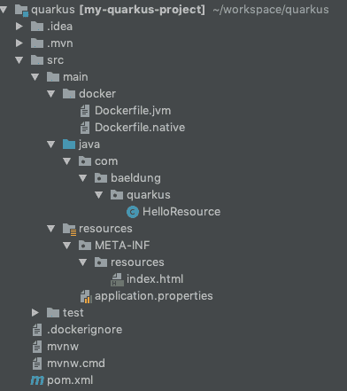
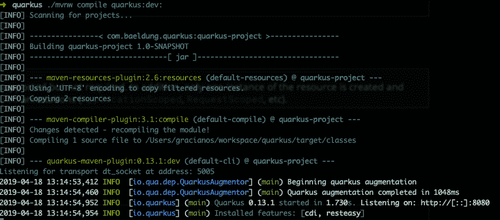
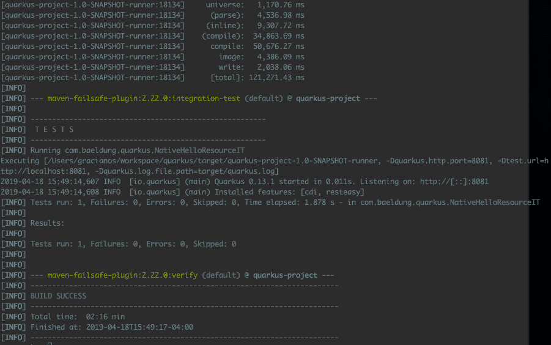

# 夸特斯指南

> 原文:[https://web . archive . org/web/20220930061024/https://www . bael dung . com/quar kus-io](https://web.archive.org/web/20220930061024/https://www.baeldung.com/quarkus-io)

## 1.介绍

如今，编写一个应用程序并部署到云上而不担心基础架构是非常常见的。无服务器和 FaaS 已经变得非常流行。

在这种频繁创建和销毁实例的环境中，启动时间和首次请求时间非常重要，因为它们可以创建完全不同的用户体验。

在这种情况下，JavaScript 和 Python 等语言总是备受关注。换句话说，有着巨大罐子和长启动时间的 Java 从来都不是最强有力的竞争者。

在本教程中，**我们将介绍 Quarkus，并讨论它是否是将 Java 更有效地引入云的替代方案**。

## 2.夸库斯

[QuarkusIO](https://web.archive.org/web/20221206032224/https://quarkus.io/) ，超音速亚原子 Java，**承诺提供小工件、极快的启动时间和更低的首次请求时间。**当与 [GraalVM](/web/20221206032224/https://www.baeldung.com/graal-java-jit-compiler) 结合时，Quarkus 将提前编译(AOT)。

而且，由于 Quarkus 是建立在标准之上的，我们不需要学习任何新的东西。因此，我们可以使用 CDI 和 JAX-RS 等。另外， [Quarkus 有很多扩展](https://web.archive.org/web/20221206032224/https://quarkus.io/extensions/)，包括支持 Hibernate、Kafka、OpenShift、Kubernetes 和 Vert.x 的扩展

## 3.我们的第一个应用

创建新的 Quarkus 项目最简单的方法是打开一个终端并键入:

```
mvn io.quarkus:quarkus-maven-plugin:0.13.1:create \
    -DprojectGroupId=com.baeldung.quarkus \
    -DprojectArtifactId=quarkus-project \
    -DclassName="com.baeldung.quarkus.HelloResource" \
    -Dpath="/hello"
```

这将生成项目框架、一个带有公开的`/hello`端点的`HelloResource`、配置、Maven 项目和 docker 文件。

一旦导入到我们的 IDE 中，我们将有一个类似于下图所示的结构:



让我们检查一下`HelloResource`类的内容:

```
@Path("/hello")
public class HelloResource {

    @GET
    @Produces(MediaType.TEXT_PLAIN)
    public String hello() {
        return "hello";
    }
}
```

到目前为止一切看起来都很好。至此，我们有了一个简单的应用程序，它只有一个 RESTEasy JAX-RS 端点。让我们打开一个终端并运行以下命令来测试它:

```
./mvnw compile quarkus:dev:
```



我们的 REST 端点应该在 localhost:8080/hello 处公开。让我们用`curl`命令测试一下:

```
$ curl localhost:8080/hello
hello
```

## 4.热重装

当在开发模式(`./mvn compile quarkus:dev`)下运行时，Quarkus 提供了热重装功能。换句话说，**一旦浏览器被刷新**，对 Java 文件或配置文件所做的更改将被自动编译。这里最令人印象深刻的特点是，我们不需要保存我们的文件。这可能是好的，也可能是坏的，取决于我们的偏好。

我们现在将修改我们的示例来演示热重新加载功能。如果应用程序停止了，我们可以简单地在开发模式下重启它。我们将使用与之前相同的示例作为我们的起点。

首先，我们将创建一个`HelloService`类:

```
@ApplicationScoped
public class HelloService {
    public String politeHello(String name){
        return "Hello Mr/Mrs " + name;
    }
}
```

现在，我们将修改`HelloResource`类，注入`HelloService`并添加一个新方法:

```
@Inject
HelloService helloService;

@GET
@Produces(MediaType.APPLICATION_JSON)
@Path("/polite/{name}")
public String greeting(@PathParam("name") String name) {
    return helloService.politeHello(name);
}
```

接下来，让我们测试我们的新端点:

```
$ curl localhost:8080/hello/polite/Baeldung
Hello Mr/Mrs Baeldung
```

我们将再做一个更改，以证明同样的情况也可以应用到属性文件。让我们编辑`application.properties`文件并再添加一个键:

```
greeting=Good morning
```

之后，我们将修改`HelloService`来使用我们的新属性:

```
@ConfigProperty(name = "greeting")
private String greeting;

public String politeHello(String name){
    return greeting + " " + name;
}
```

如果我们执行相同的`curl`命令，我们现在应该看到:

```
Good morning Baeldung
```

我们可以通过运行以下命令轻松打包应用程序:

```
./mvnw package 
```

这将在`target`目录中生成 2 个 jar 文件:

*   `quarkus-project-1.0-SNAPSHOT-runner.jar` —一个可执行的 jar，其依赖项被复制到`target/lib`
*   `quarkus-project-1.0-SNAPSHOT.jar` —包含类和资源文件

我们现在可以运行打包的应用程序:

```
java -jar target/quarkus-project-1.0-SNAPSHOT-runner.jar
```

## 5.原生图像

接下来，我们将生成应用程序的本机映像。本机映像将缩短启动时间和首次响应时间。换句话说，它**包含了运行所需的一切，包括运行应用程序**所需的最小 JVM。

首先，我们需要安装 [GraalVM](https://web.archive.org/web/20221206032224/https://www.graalvm.org/) 并配置 GRAALVM_HOME 环境变量。

我们现在将停止应用程序(Ctrl + C ),如果还没有停止的话，并运行命令:

```
./mvnw package -Pnative
```

这可能需要几秒钟才能完成。因为本机映像试图创建所有代码 AOT 来更快地启动，所以我们将有更长的构建时间。

我们可以运行`./mvnw verify -Pnative`来验证我们的本机工件是否被正确构建:



其次，我们将**使用本地可执行文件**创建一个容器映像。为此，我们必须在我们的机器上运行一个容器运行时(即 [Docker](/web/20221206032224/https://www.baeldung.com/docker-test-containers) )。让我们打开一个终端窗口并执行:

```
./mvnw package -Pnative -Dnative-image.docker-build=true 
```

这将创建一个 Linux 64 位可执行文件，因此如果我们使用不同的操作系统，它可能不再运行。暂时没关系。

项目一代为我们创造了一个`Dockerfile.native`:

```
FROM registry.fedoraproject.org/fedora-minimal
WORKDIR /work/
COPY target/*-runner /work/application
RUN chmod 775 /work
EXPOSE 8080
CMD ["./application", "-Dquarkus.http.host=0.0.0.0"] 
```

如果我们检查这个文件，我们就知道接下来会发生什么。首先，我们将**创建一个 docker 图像**:

```
docker build -f src/main/docker/Dockerfile.native -t quarkus/quarkus-project .
```

现在，我们可以使用以下命令运行容器:

```
docker run -i --rm -p 8080:8080 quarkus/quarkus-project
```


集装箱启动时间低得令人难以置信，只有 0.009 秒，这是 Quarkus 的优势之一。

最后，我们应该测试修改后的 REST 来验证我们的应用程序:

```
$ curl localhost:8080/hello/polite/Baeldung
Good morning Baeldung
```

## 6.部署到 OpenShift

一旦我们使用 Docker 完成本地测试，我们将把我们的容器部署到 [OpenShift](/web/20221206032224/https://www.baeldung.com/spring-boot-deploy-openshift) 。假设我们的注册表中有 Docker 映像，我们可以按照以下步骤部署应用程序:

```
oc new-build --binary --name=quarkus-project -l app=quarkus-project
oc patch bc/quarkus-project -p '{"spec":{"strategy":{"dockerStrategy":{"dockerfilePath":"src/main/docker/Dockerfile.native"}}}}'
oc start-build quarkus-project --from-dir=. --follow
oc new-app --image-stream=quarkus-project:latest
oc expose service quarkus-project
```

现在，我们可以通过运行以下命令来获取应用程序 URL:

```
oc get route
```

最后，我们将访问同一个端点(注意，URL 可能不同，这取决于我们的 IP 地址):

```
$ curl http://quarkus-project-myproject.192.168.64.2.nip.io/hello/polite/Baeldung
Good morning Baeldung
```

## 7.结论

在本文中，我们展示了 Quarkus 是一个很好的补充，它可以更有效地将 Java 带到云中。例如，现在可以在 AWS Lambda 上想象 Java。此外，Quarkus 基于 JPA 和 JAX/RS 等标准。因此，我们不需要学习任何新的东西。

Quarkus 最近引起了很多关注，每天都有很多新功能加入。在 [Quarkus GitHub 库](https://web.archive.org/web/20221206032224/https://github.com/quarkusio/quarkus-quickstarts)有几个 quickstart 项目供我们尝试 Quarkus。

和往常一样，这篇文章的代码可以在 GitHub 上找到[。编码快乐！](https://web.archive.org/web/20221206032224/https://github.com/eugenp/tutorials/tree/master/quarkus-modules/quarkus)