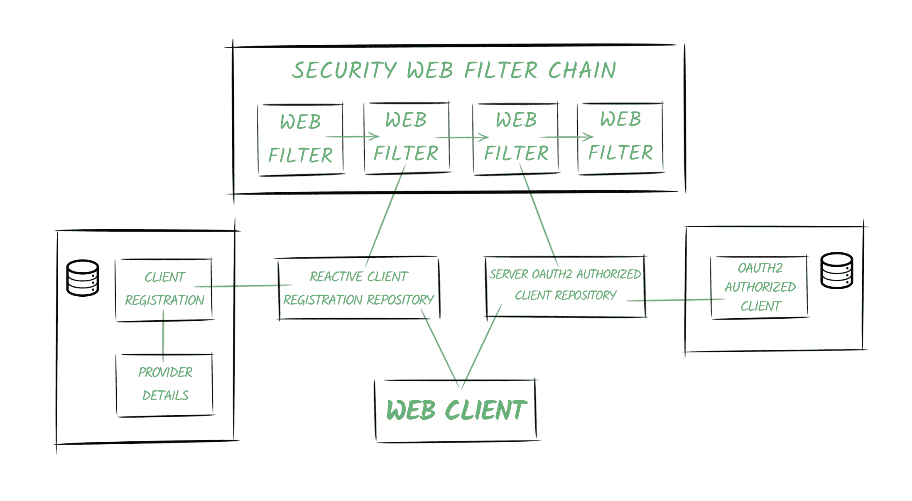

# Spring WebClient 和 OAuth2 支持

> 原文：<https://web.archive.org/web/20220930061024/https://www.baeldung.com/spring-webclient-oauth2>

## 1.概观

Spring Security 5 为 Spring Webflux 的非阻塞`[WebClient](/web/20220617075720/https://www.baeldung.com/spring-5-webclient)`类提供了 OAuth2 支持。

在本教程中，我们将分析使用这个类访问安全资源的不同方法。

此外，我们将深入了解 Spring 如何处理 OAuth2 授权过程。

## 2.设置场景

**内联[oauth 2 规范](https://web.archive.org/web/20220617075720/https://tools.ietf.org/html/rfc6749)，除了我们的客户端——这是本文的主题——我们自然需要一个授权服务器和一个资源服务器。**

我们可以使用知名的授权提供商，如 Google 或 Github。为了更好地理解 OAuth2 客户端的角色，我们也可以使用我们自己的服务器，[以及这里的实现](https://web.archive.org/web/20220617075720/https://github.com/Baeldung/spring-security-oauth)。我们不会展示完整的配置，因为这不是本教程的主题，了解以下内容就足够了:

*   授权服务器将是:
    *   在端口`8081`上运行
    *   暴露`/oauth/authorize,` `/oauth/token` 和`oauth/check_token`端点来执行期望的功能
    *   配置了示例用户(例如`john` / `123`)和单个 OAuth 客户端(`fooClientIdPassword` / `secret`)
*   资源服务器将与身份验证服务器分离，并将:
    *   在端口`8082`上运行
    *   提供一个简单的`Foo`对象安全资源，可使用`/foos/{id} `端点进行访问

注意:了解几个 Spring 项目正在提供不同的 OAuth 相关特性和实现是很重要的。我们可以在[这个春季项目矩阵](https://web.archive.org/web/20220617075720/https://github.com/spring-projects/spring-security/wiki/OAuth-2.0-Features-Matrix)中检查每个库提供了什么。

`WebClient`和所有与 Webflux 相关的功能都是 Spring Security 5 项目的一部分。因此，在本文中，我们将主要使用这个框架。

## 3.引擎盖下的弹簧安全 5

为了充分理解前面的例子，最好了解一下 Spring Security 如何在内部管理 OAuth2 特性。

该框架提供了以下功能:

*   依靠 OAuth2 提供者帐户[将用户登录到应用程序](/web/20220617075720/https://www.baeldung.com/spring-security-5-oauth2-login)
*   将我们的服务配置为 OAuth2 客户端
*   为我们管理授权程序
*   自动刷新令牌
*   如有必要，存储凭据

下图描述了 Spring Security 的 OAuth2 世界的一些基本概念:

### 3.1.提供者

Spring 定义了 OAuth2 提供者角色，负责公开 OAuth 2.0 保护的资源。

在我们的示例中，我们的身份验证服务将提供提供者功能。

### 3.2.客户注册

`ClientRegistration` 是包含在 OAuth2(或 OpenID)提供者中注册的特定客户机的所有相关信息的实体。

在我们的场景中，它是在认证服务器中注册的客户机，由`bael-client-id` id 标识。

### 3.3.授权客户

一旦最终用户(即资源所有者)授予客户端访问其资源的权限，就会创建一个`OAuth2AuthorizedClient `实体。

它将负责将访问令牌关联到客户端注册和资源所有者(由`Principal`对象表示)。

### 3.4.仓库

此外，Spring Security 还提供了存储库类来访问上面提到的实体。

特别是，`ReactiveClientRegistrationRepository `和`ServerOAuth2AuthorizedClientRepository`类用在反应式堆栈中，它们默认使用内存存储。

Spring Boot 2.x 创建这些存储库类的 beans，并将它们自动添加到上下文中。

### 3.5.安全 Web 过滤器链

Spring Security 5 中的一个关键概念是反应性的`SecurityWebFilterChain `实体。

顾名思义，它代表了 [`WebFilter`](/web/20220617075720/https://www.baeldung.com/spring-webflux-filters) 对象的链式集合。

当我们在应用程序中启用 OAuth2 特性时，Spring Security 向链中添加了两个过滤器:

1.  一个过滤器响应授权请求(`/oauth2/authorization/{registrationId}` URI)或者抛出一个`ClientAuthorizationRequiredException`。它包含对`ReactiveClientRegistrationRepository, `的引用，负责创建授权请求以重定向用户代理。
2.  第二个过滤器根据我们添加的特性而有所不同(OAuth2 客户端功能或 OAuth2 登录功能)。在这两种情况下，这个过滤器的主要职责是创建`OAuth2AuthorizedClient `实例并使用`ServerOAuth2AuthorizedClientRepository.`存储它

### 3.6.Web 客户端

web 客户端将配置一个包含对存储库的引用的`ExchangeFilterFunction`。

它将使用它们来获取访问令牌，以便自动将其添加到请求中。

## 4.Spring Security 5 支持–客户端凭证流

Spring Security 允许将我们的应用程序配置为 OAuth2 客户端。

**在这篇文章中，我们将使用一个`WebClient` 实例来检索资源，首先使用“客户端凭证”授权类型，然后使用“授权代码”流。**

我们要做的第一件事是配置客户机注册和我们将用来获取访问令牌的提供者。

### 4.1.客户端和提供商配置

正如我们在 OAuth2 登录文章的[中看到的，我们可以通过编程方式配置它，或者通过使用属性定义我们的注册来依赖 Spring Boot 自动配置:](/web/20220617075720/https://www.baeldung.com/spring-security-5-oauth2-login#setup)

[PRE0]

这些是我们使用`client_credentials `流检索资源所需的所有配置。

### 4.2.使用`WebClient`

在没有最终用户与我们的应用程序交互的机器对机器通信中，我们使用这种授权类型。

例如，假设我们有一个`cron`作业试图在我们的应用程序中使用`WebClient`来获得一个安全的资源:

[PRE1]

### 4.3.配置`WebClient`

接下来，让我们设置已经在调度任务中自动连接的`webClient`实例:

[PRE2]

正如我们所说的，客户端注册存储库是由 Spring Boot 自动创建并添加到上下文中的。

这里要注意的下一件事是我们使用了一个`UnAuthenticatedServerOAuth2AuthorizedClientRepository `实例。这是因为这是一种机器对机器的通信，没有最终用户会参与到这个过程中。最后，我们声明我们将默认使用`bael `客户端注册。

否则，我们必须在 cron 作业中定义请求时指定它:

[PRE3]

### 4.4.测试

如果我们在启用了`DEBUG`日志记录级别的情况下运行我们的应用程序，我们将能够看到 Spring Security 正在为我们执行的调用:

[PRE4]

我们还会注意到，任务第二次运行时，应用程序请求资源而没有首先请求令牌，因为最后一个令牌还没有过期。

## 5.Spring Security 5 支持——使用授权代码流实现

这种授权类型通常用于不太受信任的第三方应用程序需要访问资源的情况。

### 5.1.客户端和提供商配置

为了使用授权代码流执行 OAuth2 流程，我们需要为我们的客户端注册和提供者定义更多的属性:

[PRE5]

除了我们在上一节中使用的属性之外，这次我们还需要包括:

*   要在身份验证服务器上进行身份验证的端点
*   包含用户信息的端点的 URL
*   我们的应用程序中的一个端点的 URL，用户代理将在认证后被重定向到该端点

当然，对于知名提供商来说，前两点不需要特别说明。

重定向端点由 Spring Security 自动创建。

默认情况下，为它配置的 URL 是`/[action]/oauth2/code/[registrationId],` ，只允许`authorize `和`login`动作(为了避免无限循环)。

该端点负责:

*   接收认证码作为查询参数
*   使用它来获得访问令牌
*   创建授权的客户端实例
*   将用户代理重定向回原始端点

### 5.2.HTTP 安全配置

接下来，我们需要配置`SecurityWebFilterChain.`

最常见的场景是使用 Spring Security 的 OAuth2 登录功能来认证用户，并允许他们访问我们的端点和资源。

如果这是我们的情况，那么**只需在`ServerHttpSecurity `定义中包含`oauth2Login`指令就足以让我们的应用程序也作为 OAuth2 客户端工作:**

[PRE6]

### 5.3.配置`WebClient`

现在是时候放置我们的`WebClient`实例了:

[PRE7]

这一次，我们将从上下文中注入客户机注册存储库和授权客户机存储库。

我们还启用了`setDefaultOAuth2AuthorizedClient `选项。有了它，框架将尝试从 Spring Security 中管理的当前`Authentication`对象中获取客户机信息。

我们必须考虑到，有了它，所有的 HTTP 请求都将包含访问令牌，这可能不是我们想要的行为。

稍后，我们将分析备选方案，以向客户端指示特定的`WebClient`事务将使用的方案。

### 5.4.使用`WebClient`

**授权码需要一个用户代理，该用户代理可以进行重定向(如浏览器)以执行该程序。**

因此，当用户与我们的应用程序交互时，我们使用这种授权类型，通常调用 HTTP 端点:

[PRE8]

### 5.5.测试

最后，我们将调用端点并通过检查日志条目来分析发生了什么。

在我们调用端点之后，应用程序验证我们尚未在应用程序中进行身份验证:

[PRE9]

应用程序重定向到授权服务的端点，使用提供者的注册中心中存在的凭证进行身份验证(在我们的例子中，我们将使用`bael-user/bael-password`):

[PRE10]

通过身份验证后，用户代理被发送回重定向 URI，连同作为查询参数的代码和第一次发送的状态值(以避免 [CSRF 攻击](https://web.archive.org/web/20220617075720/https://spring.io/blog/2011/11/30/cross-site-request-forgery-and-oauth2)):

[PRE11]

然后，应用程序使用该代码来获取访问令牌:

[PRE12]

它获取用户信息:

[PRE13]

它将用户代理重定向到原始端点:

[PRE14]

最后，我们的`WebClient`实例可以成功请求安全资源:

[PRE15]

## 6.另一种方法是在电话中进行客户注册

前面，我们看到使用`setDefaultOAuth2AuthorizedClient` 意味着应用程序将在我们与客户端实现的任何调用中包含访问令牌。

如果我们从配置中删除这个命令，我们需要在定义请求时明确指定客户机注册。

当然，一种方法是使用`clientRegistrationId `，就像我们之前在客户端凭证流中所做的那样。

**由于我们将`Principal`与授权客户关联起来，我们可以使用`@RegisteredOAuth2AuthorizedClient `注释:**来获得`OAuth2AuthorizedClient `实例

[PRE16]

## 7.避免 OAuth2 登录功能

正如我们所说的，最常见的场景是依赖 OAuth2 授权提供者在我们的应用程序中登录用户。

但是，如果我们想避免这种情况，但仍然能够使用 OAuth2 协议访问受保护的资源呢？然后，我们需要对我们的配置进行一些更改。

首先，为了清楚起见，在定义重定向 URI 属性时，我们可以使用`authorize `动作而不是`login `动作:

[PRE17]

我们也可以删除与用户相关的属性，因为我们不会在应用程序中使用它们来创建`Principal`。

**现在，我们将配置`SecurityWebFilterChain `而不包括`oauth2Login`命令，取而代之的是，我们将包括`oauth2Client`命令。**

即使我们不想依赖 OAuth2 登录，我们仍然希望在访问端点之前对用户进行身份验证。出于这个原因，我们还将在这里包含`formLogin`指令:

[PRE18]

现在让我们运行应用程序，看看当我们使用`/auth-code-annotated `端点时会发生什么。

我们首先必须使用表单 log in 登录到我们的应用程序。

之后，应用程序会将我们重定向到授权服务登录，以授予对我们的资源的访问权限。

**注意:这样做之后，我们应该被重定向回我们调用的原始端点。然而，Spring Security 似乎正在重定向回根路径“/”，这似乎是一个 bug。触发 OAuth2 dance 的请求之后的下列请求将成功运行。**

我们可以在端点响应中看到，这次授权的客户端与一个名为`bael-client-id `的主体相关联，而不是与以身份验证服务中配置的用户命名的`bael-user, `相关联。

## 8.Spring 框架支持–手动方法

开箱即用， **Spring 5 只提供了一个与 OAuth2 相关的服务方法，可以很容易地将承载令牌头添加到请求中。这是`HttpHeaders#setBearerAuth `方法。**

现在，我们将通过一个示例来了解如何通过手动执行 OAuth2 舞蹈来获取我们的安全资源。

简单地说，我们需要链接两个 HTTP 请求:一个从授权服务器获取认证令牌，另一个使用这个令牌获取资源:

[PRE19]

这个例子主要是为了理解利用遵循 OAuth2 规范的请求有多麻烦，并了解如何使用`setBearerAuth` 方法。

在现实生活中，我们会让 Spring Security 以透明的方式为我们处理所有困难的工作，就像我们在前面章节中所做的那样。

## 9.结论

在本教程中，我们看到了如何将我们的应用程序设置为 OAuth2 客户端，更具体地说，我们如何配置和使用`WebClient`来检索全反应堆栈中的安全资源。

最后但同样重要的是，我们已经分析了 Spring Security 5 OAuth2 机制是如何遵循 OAuth2 规范的。

和往常一样，完整的例子可以在 Github 上找到。