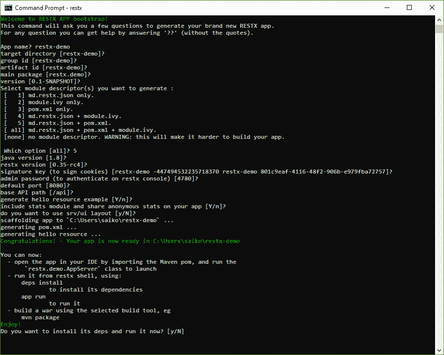
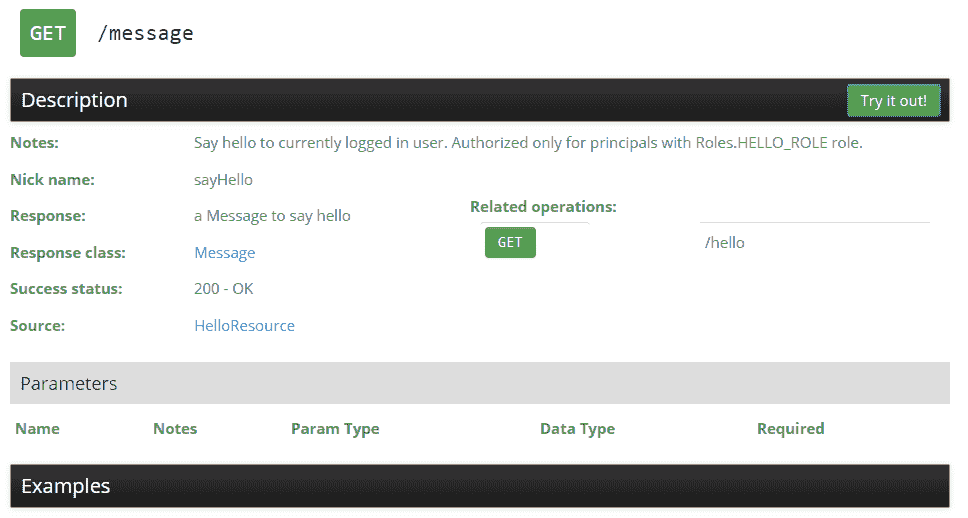
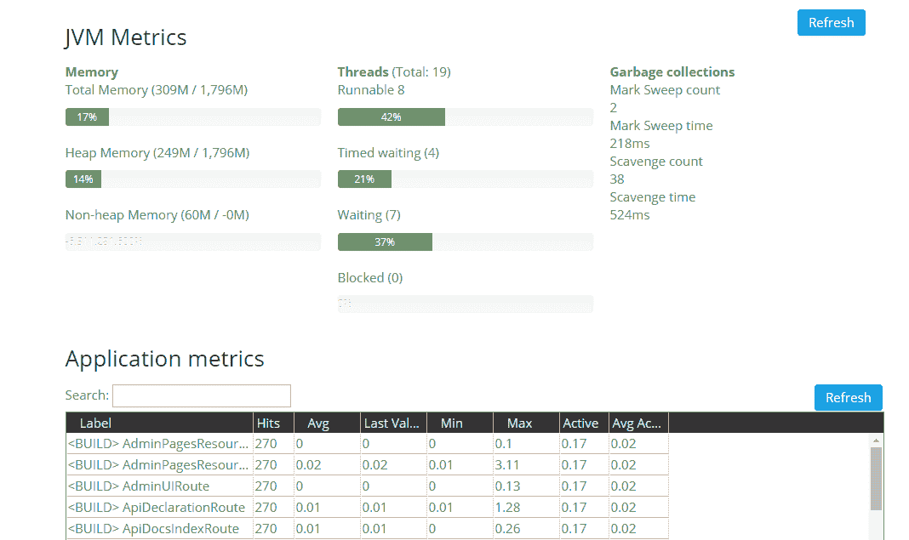
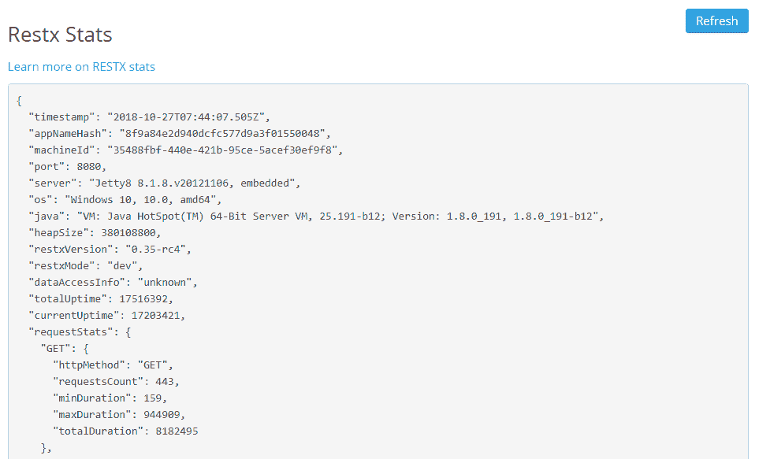

# RESTX 简介

> 原文:[https://web . archive . org/web/20220930061024/https://www . bael dung . com/Java-restx](https://web.archive.org/web/20220930061024/https://www.baeldung.com/java-restx)

## 1.概观

在本教程中，我们将游览轻量级 Java REST 框架 [RESTX](https://web.archive.org/web/20221206160439/http://restx.io/) 。

## 2.特征

使用 RESTX 框架构建 RESTful API 非常容易。它拥有我们可以从 REST 框架中期待的所有默认功能，比如服务和消费 JSON、查询和路径参数、路由和过滤机制、使用统计和监控。

RESTX 还附带了一个直观的管理 web 控制台和命令行安装程序，便于引导。

它也获得了 Apache License 2 的许可，并由开发人员社区维护。RESTX 对 Java 的最低要求是 JDK 7。

## 3.配置

RESTX 附带了一个方便的 shell/command 应用程序，对于快速启动 Java 项目非常有用。

我们需要先安装应用程序，然后才能继续。详细的安装说明见[此处](https://web.archive.org/web/20221206160439/http://restx.io/docs/install.html)。

## 4.安装核心插件

现在，是时候安装核心插件，以便能够从外壳本身创建应用程序了。

在 RESTX shell 中，让我们运行以下命令:

```
shell install
```

然后它会提示我们选择要安装的插件。我们需要选择指向`io.restx:restx-core-shell`的数字。**安装完成后，shell 将自动重启。**

## 5.Shell 应用程序引导

使用 RESTX shell 可以非常方便地引导一个新的应用程序。它提供了基于向导的指南。

我们首先在 shell 上执行以下命令:

```
app new
```

该命令将触发向导。然后，我们可以使用默认选项，也可以根据我们的要求进行更改:

[](/web/20221206160439/https://www.baeldung.com/wp-content/uploads/2018/11/shell-app-bootstrap.png)

由于我们已经选择生成一个`pom.xml,` ,这个项目可以很容易地导入到任何标准的 Java IDE 中。

在少数情况下，我们可能需要调整 IDE 设置。

我们的下一步将是构建项目:

```
mvn clean install -DskipTests
```

**一旦构建成功，我们就可以在 IDE** 中将`AppServer`类作为 Java 应用程序运行。这将使用管理控制台启动服务器，监听端口 8080。

我们可以浏览到`[http://127.0.0.1:8080/api/@/ui](https://web.archive.org/web/20221206160439/http://127.0.0.1:8080/api/@/ui) `，看到基本的 UI。

**以`/@/`开头的路由用于管理控制台，这是 RESTX 中的保留路径。**

**要登录管理控制台，我们可以使用默认用户名“admin `“`和我们在创建应用程序时提供的密码。**

在我们使用控制台之前，让我们研究一下代码并理解向导生成了什么。

## 6.RESTX 资源

路线在<`main_package>.rest.HelloResource`类中定义:

```
@Component
@RestxResource
public class HelloResource {
    @GET("/message")
    @RolesAllowed(Roles.HELLO_ROLE)
    public Message sayHello() {
        return new Message().setMessage(String.format("hello %s, it's %s", 
          RestxSession.current().getPrincipal().get().getName(),
          DateTime.now().toString("HH:mm:ss")));
    }
}
```

显而易见，RESTX 使用默认的 J2EE 注释进行安全性和 REST 绑定。在很大程度上，它使用自己的注释进行依赖注入。

RESTX 还支持将方法参数映射到请求的许多合理的默认值。

**并且，除了这些标准注释之外还有`@RestxResource`，它将其声明为 RESTX 识别的资源。**

基本路径被添加到`src/main/webapp/WEB-INF/web.xml.` 中，在我们的例子中，它是`/api`，所以我们可以发送一个 GET 请求到`http://localhost:8080/api/message`，假设正确的认证。

`Message`类只是一个由 RESTX 序列化为 JSON 的 Java bean。

我们通过使用由引导程序生成的`HELLO_ROLE`指定`RolesAllowed`注释来控制用户访问。

## 7.模块类

如前所述，RESTX 使用 J2EE 标准的依赖注入注释，如`@Named`，并在需要的地方发明自己的注释，很可能是从 Dagger 框架中得到`@Module`和`@Provides.`的启示

**它使用这些来创建应用程序的主模块，其中定义了管理员密码:**

```
@Module
public class AppModule {

    @Provides
    public SignatureKey signatureKey() {
        return new SignatureKey("restx-demo -44749418370 restx-demo 801f-4116-48f2-906b"
            .getBytes(Charsets.UTF_8));
    }

    @Provides
    @Named("restx.admin.password")
    public String restxAdminPassword() {
        return "1234";
    }

    @Provides
    public ConfigSupplier appConfigSupplier(ConfigLoader configLoader) {
        return configLoader.fromResource("restx/demo/settings");
    } 

    // other provider methods to create components 
}
```

`@Module `定义了一个可以定义其他组件的类，类似于 Dagger 中的`@Module`，或者 Spring 中的`@Configuration `。

`@Provides`以编程方式公开一个组件，比如 Dagger 中的`@Provides `，或者 Spring 中的`@Bean`。

最后，`@Named`注释用于指示所生产的组件的名称。

`AppModule`还提供了一个`SignatureKey`用于签署发送给客户端的内容。例如，在为示例应用程序创建会话时，这将设置一个 cookie，用配置的密钥签名:

```
HTTP/1.1 200 OK
...
Set-Cookie: RestxSessionSignature-restx-demo="ySfv8FejvizMMvruGlK3K2hwdb8="; RestxSession-restx-demo="..."
...
```

查看 RESTX 的组件工厂/依赖注入文档了解更多信息。

## 8.启动器类

最后，`AppServer`类用于在嵌入式 Jetty 服务器中将应用程序作为标准 Java 应用程序运行:

```
public class AppServer {
    public static final String WEB_INF_LOCATION = "src/main/webapp/WEB-INF/web.xml";
    public static final String WEB_APP_LOCATION = "src/main/webapp";

    public static void main(String[] args) throws Exception {
        int port = Integer.valueOf(Optional.fromNullable(System.getenv("PORT")).or("8080"));
        WebServer server = 
            new Jetty8WebServer(WEB_INF_LOCATION, WEB_APP_LOCATION, port, "0.0.0.0");
        System.setProperty("restx.mode", System.getProperty("restx.mode", "dev"));
        System.setProperty("restx.app.package", "restx.demo");
        server.startAndAwait();
    }
}
```

这里，在开发阶段使用`dev`模式来启用自动编译等功能，这缩短了开发反馈循环。

**我们可以将应用打包成一个`war` (web archive)文件，部署在一个独立的 J2EE web 容器中。**

让我们在下一节了解如何测试应用程序。

## 9.使用规格进行集成测试

RESTX 的一个强大特性是它的“规格”概念。样本`spec`应该是这样的:

```
title: should admin say hello
given:
  - time: 2013-08-28T01:18:00.822+02:00
wts:
  - when: |
      GET hello?who=xavier
    then: |
      {"message":"hello xavier, it's 01:18:00"}
```

测试是在一个 [YAML](https://web.archive.org/web/20221206160439/http://yaml.org/) 文件内的[给定-何时-然后](https://web.archive.org/web/20221206160439/https://en.wikipedia.org/wiki/Given-When-Then)结构中编写的，该文件基本上定义了在给定系统当前状态(`given`)的情况下，API 应该如何响应(`then`)特定请求(`when`)。

`src/test/resources`中的`HelloResourceSpecTest`类将触发上述规范中编写的测试:

```
@RunWith(RestxSpecTestsRunner.class)
@FindSpecsIn("specs/hello")
public class HelloResourceSpecTest {}
```

`RestxSpecTestsRunner`类是一个[自定义 JUnit runner](/web/20221206160439/https://www.baeldung.com/junit-4-custom-runners) 。它包含自定义的 JUnit 规则，用于:

*   设置嵌入式服务器
*   准备系统的状态(根据规格中的`given`部分)
*   发出指定的请求，以及
*   验证预期的响应

`@FindSpecsIn`注释指向应该运行测试的规范文件的路径。

该规范有助于编写集成测试，并在 API 文档中提供示例。规范对于[模拟 HTTP 请求和记录请求/响应对](https://web.archive.org/web/20221206160439/http://restx.io/docs/ref-specs.html)也很有用。

## 10.人工测试

我们也可以通过 HTTP 手动测试。我们首先需要登录，为此，我们需要在 RESTX 控制台中散列管理员密码:

```
hash md5 <clear-text-password>
```

然后我们可以将它传递给`/sessions`端点:

```
curl -b u1 -c u1 -X POST -H "Content-Type: application/json" 
  -d '{"principal":{"name":"admin","passwordHash":"1d528266b85cf052803a57288"}}'
  http://localhost:8080/api/sessions
```

(注意 Windows 用户需要先[下载](https://web.archive.org/web/20221206160439/https://curl.haxx.se/windows/) curl。)

现在，如果我们将会话作为我们的`/message`请求的一部分:

```
curl -b u1 "http://localhost:8080/api/message?who=restx"
```

然后我们会得到这样的结果:

```
{"message" : "hello admin, it's 09:56:51"}
```

## 11.探索管理控制台

管理控制台提供了控制应用程序的有用资源。

让我们通过浏览到 [`http://127.0.0.1:8080/admin/@/ui`](https://web.archive.org/web/20221206160439/http://127.0.0.1:8080/admin/@/ui) 来看看关键特性。

### 11.1。API 文档

API 文档部分列出了所有可用的路线，包括所有选项:

[](/web/20221206160439/https://www.baeldung.com/wp-content/uploads/2018/11/admin-api-docs.png)

我们可以单击单个路线，并在控制台上进行试验:

[](/web/20221206160439/https://www.baeldung.com/wp-content/uploads/2018/11/admin-api-docs-2.png)

### 11.2。监控

**JVM 指标**部分显示了活动会话、内存使用和线程转储的应用程序指标:

[](/web/20221206160439/https://www.baeldung.com/wp-content/uploads/2018/11/admin-monitoring.png)

在**应用指标**下，默认情况下我们主要监控两类元素:

*   `BUILD`对应于应用组件的实例化
*   `HTTP`对应于 RESTX 处理的 HTTP 请求

### 11.3。统计数据

RESTX 允许用户选择在应用程序上收集和共享匿名统计数据，以便向 RESTX 社区提供信息。**我们可以通过排除`restx-stats-admin`模块来轻松选择退出。**

统计数据报告底层操作系统和 JVM 版本等信息:

[](/web/20221206160439/https://www.baeldung.com/wp-content/uploads/2018/11/admin-stats.png)

**由于此页面显示敏感信息，** **[务必查看其配置选项](https://web.archive.org/web/20221206160439/http://restx.io/stats.html)** 。

除此之外，管理控制台还可以帮助我们:

*   检查服务器日志(日志)
*   查看遇到的错误(错误)
*   检查环境变量(配置)

## 12.批准

默认情况下，RESTX 端点是安全的。这意味着如果对于任何端点:

```
@GET("/greetings/{who}")
public Message sayHello(String who) {
    return new Message(who);
}
```

在没有认证的情况下调用时会默认返回一个`401 `。

为了使端点成为公共的，我们需要在方法或类级别使用`@PermitAll`注释:

```
@PermitAll 
@GET("/greetings/{who}")
public Message sayHello(String who) {
    return new Message(who);
}
```

注意，在类的层次上，所有的方法都是公共的。

此外，该框架还允许使用`@RolesAllowed`注释来指定用户角色:

```
@RolesAllowed("admin")
@GET("/greetings/{who}")
public Message sayHello(String who) {
    return new Message(who);
}
```

有了这个注释，RESTX 将验证经过身份验证的用户是否也分配了 admin 角色。如果没有管理员角色的认证用户试图访问端点，应用程序将返回一个`403 `而不是一个`401`。

默认情况下，用户角色和凭证存储在文件系统的不同文件中。

因此，带有加密密码的用户 id 存储在`/data/credentials.json`文件下:

```
{
    "user1": "$2a$10$iZluUbCseDOvKnoe",
    "user2": "$2a$10$oym3Swr7pScdiCXu"
}
```

并且，用户角色在`/data/users.json`文件中定义:

```
[
    {"name":"user1", "roles": ["hello"]},
    {"name":"user2", "roles": []}
]
```

在示例应用程序中，文件通过`FileBasedUserRepository`类加载到`AppModule`中:

```
new FileBasedUserRepository<>(StdUser.class, mapper, 
  new StdUser("admin", ImmutableSet.<String> of("*")), 
  Paths.get("data/users.json"), Paths.get("data/credentials.json"), true)
```

`StdUser`类保存用户对象。它可以是一个定制的用户类，但需要序列化成 JSON。

当然，我们可以使用不同的 [`UserRepository`](https://web.archive.org/web/20221206160439/https://raw.githubusercontent.com/restx/restx/master/restx-security-basic/src/main/java/restx/security/UserRepository.java) 实现，就像点击数据库一样。

## 13.结论

本教程概述了基于 Java 的轻量级 RESTX 框架。

该框架仍在开发中，可能会有一些粗糙的边缘使用它。查看官方文档了解更多细节。

在我们的 [GitHub 资源库](https://web.archive.org/web/20221206160439/https://github.com/eugenp/tutorials/tree/master/web-modules/restx)中可以找到示例引导应用程序。