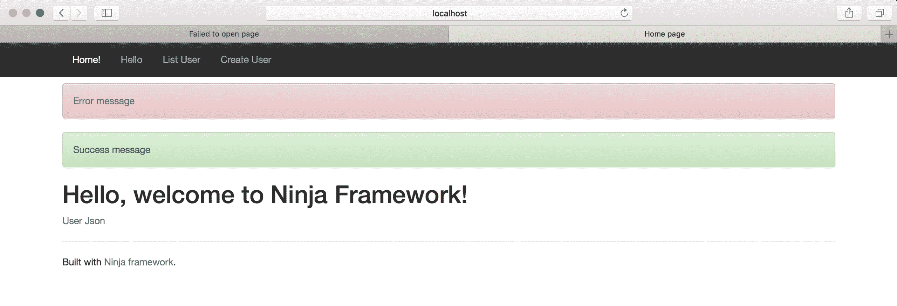

# 忍者框架简介

> 原文：<https://web.archive.org/web/20220930061024/https://www.baeldung.com/ninja-framework-intro>

## 1.概观

如今，有许多基于 JEE 的框架，如 [Spring](/web/20221128054812/https://www.baeldung.com/spring-tutorial) 、 [Play](/web/20221128054812/https://www.baeldung.com/java-intro-to-the-play-framework) 和 [Grails](/web/20221128054812/https://www.baeldung.com/grails-gorm-tutorial) 可用于 web 应用程序开发。

我们可能有理由选择其中的一个。然而，我们的选择也取决于用例以及我们试图解决的问题。

在这个入门教程中，我们将探索 Ninja web 框架并创建一个简单的 web 应用程序。同时，我们将研究它提供的一些基本特性。

## 2.忍者

Ninja 是一个全栈的轻量级 web 框架，它利用现有的 Java 库来完成工作。

从 HTML 到 JSON 渲染，从持久性到测试，它是构建可伸缩 web 应用程序的一站式解决方案。

它遵循**约定-过度配置**范例，并将代码分类到类似`models`、`controllers,`和`services`的包中。

Ninja 将流行的 Java 库用于关键特性，如用于 JSON/XML 呈现的 **[Jackson](/web/20221128054812/https://www.baeldung.com/jackson) 、用于依赖管理的 [Guice](/web/20221128054812/https://www.baeldung.com/guice) 、用于持久性的 [Hibernate](/web/20221128054812/https://www.baeldung.com/hibernate-5-bootstrapping-api) 以及用于数据库迁移的[Flyway](/web/20221128054812/https://www.baeldung.com/database-migrations-with-flyway)**。

为了快速开发，它提供了 [SuperDevMode](https://web.archive.org/web/20221128054812/https://www.ninjaframework.org/documentation/basic_concepts/super_dev_mode.html) 用于代码的热重载。因此，它允许我们立即看到开发环境中的变化。

## 3.设置

Ninja 需要一套标准的工具来创建 web 应用程序:

*   Java 1.8 或更高版本
*   Maven 3 或更高版本
*   IDE (Eclipse 或 IntelliJ)

我们将使用一个 [Maven 原型](/web/20221128054812/https://www.baeldung.com/maven-archetype#creating-archetype)来快速建立 Ninja 项目。它将提示我们提供一个组 id、一个工件 id 和一个版本号，后面是一个项目名称:

[PRE0]

或者，对于现有的 Maven 项目，我们可以将最新的[忍者核心](https://web.archive.org/web/20221128054812/https://search.maven.org/search?q=g:org.ninjaframework%20a:ninja-core)依赖项添加到`pom.xml`:

[PRE1]

然后，我们将第一次运行 Maven 命令来编译文件:

[PRE2]

最后，让我们使用 Ninja 提供的 Maven 命令运行应用程序:

[PRE3]

瞧啊。我们的应用程序已经启动，将在`localhost:8080` :
 访问

## 4.项目结构

我们来看看 Ninja 创建的类似 Maven 的项目结构:

 框架基于约定创建几个包。

**Java 类被分类在`src/main/java.`** 中的`conf`、`controllers`、`models`和`services`目录下

同样，`src/test/java`保存了相应的单元测试类。

`src/main/java`下的`views`目录包含 HTML 文件。此外，`src/main/java/assets` 目录包含图像、样式表和 JavaScript 文件等资源。

## 5.控制器

我们将讨论这个框架的一些基本特性。控制器是接收请求并返回带有特定结果的响应的类。

首先，让我们讨论一些要遵循的惯例:

*   在`controllers`包中创建一个类，并在名字后面加上`Controller`
*   服务于请求的方法必须返回 [`Result`](https://web.archive.org/web/20221128054812/http://www.ninjaframework.org/apidocs/ninja/Result.html) 类的对象

让我们用一个简单的方法创建`ApplicationController`类来呈现 HTML:

[PRE4]

这里，`index`方法将通过调用`[Results](https://web.archive.org/web/20221128054812/http://www.ninjaframework.org/apidocs/ninja/Results.html)`类的`html`方法来呈现一个 HTML。`Result`对象包含呈现内容所需的一切，如响应代码、头和 cookies。

注意: **Guice 的`[@Singleton](https://web.archive.org/web/20221128054812/https://google.github.io/guice/api-docs/latest/javadoc/index.html?com/google/inject/Singleton.html)`注释在整个**应用中只允许控制器的一个实例。

## 6.视角

对于`index`方法，Ninja 会在`views/ApplicationController`目录下寻找 HTML 文件——`index``.ftl.html` 。

**忍者使用 [Freemarker](/web/20221128054812/https://www.baeldung.com/freemarker-operations) 模板引擎进行 HTML 渲染**。所以，`views`下的所有文件都应该有`.ftl.html`扩展名。

让我们为`index`方法创建`i` `ndex` `.ftl.html`文件:

[PRE5]

这里，我们使用了 Ninja 提供的`i18n`标签从`message.properties`文件中获取`helloMsg`属性。我们将在后面的国际化部分进一步讨论这一点。

## 7.途径

接下来，我们将定义请求到达`index`方法的路径。

Ninja 使用`conf`包中的`Routes`类将 URL 映射到控制器的特定方法。

让我们添加一个路由来访问`ApplicationController`的`index`方法:

[PRE6]

就是这样！我们已经准备好在`localhost:8080/index` :
 进入`index`页面

## 8.JSON 渲染

正如已经讨论过的，Ninja 使用 Jackson 进行 JSON 渲染。为了呈现 JSON 内容，我们可以使用`Results`类的`json`方法。

让我们在`ApplicationController`类中添加`userJson`方法，并在 JSON 中呈现一个简单`HashMap`的内容:

[PRE7]

然后，我们将添加访问`userJson`所需的路由:

[PRE8]

现在，我们可以使用 `localhost:8080/userJson` :
 来渲染 JSON

## 9.服务

我们可以创建一个服务，将业务逻辑从控制器中分离出来，并在需要的地方注入我们的服务。

首先，让我们创建一个简单的`UserService`接口来定义抽象:

[PRE9]

然后，我们将在`UserServiceImpl`类中实现`UserService`接口，并覆盖`getUserMap`方法:

[PRE10]

然后，我们将使用 Guice 提供的 Ninja 的依赖注入特性将`UserService`接口与`UserServiceImpl`类绑定。

让我们在`conf`包中可用的`Module`类中添加绑定:

[PRE11]

最后，我们将使用 [`@Inject`](https://web.archive.org/web/20221128054812/https://google.github.io/guice/api-docs/latest/javadoc/index.html?com/google/inject/Inject.html) 注释在`ApplicationController`类中注入`UserService`依赖项:

[PRE12]

因此，我们都准备在`ApplicationController`中使用`UserService`的`getUserMap`方法:

[PRE13]

## 10.闪光灯范围

Ninja 通过其名为 Flash Scope 的特性提供了一种简单而有效的方法来处理来自请求的成功和错误消息。

为了在控制器中使用它，我们将把`FlashScope`参数添加到方法中:

[PRE14]

注意:`Results`类的`redirect`方法将目标重定向到提供的 URL。

然后，我们将向`showFlashMsg`方法添加一个路由`/flash`，并修改视图以显示 flash 消息:

[PRE15]

现在，我们可以看到`FlashScope`在`localhost:8080/flash`的动作:

## 11.国际化

Ninja 提供了易于配置的内置国际化特性。

首先，我们将在 `application.conf`文件中定义支持的语言列表:

[PRE16]

然后，我们将为英语创建默认属性文件—`messages.properties`——为消息创建键值对:

[PRE17]

类似地，我们可以在特定于语言的属性文件的文件名中添加语言代码—例如，`message_fr.properties` 文件表示法语:

[PRE18]

一旦配置就绪，我们就可以轻松地在`ApplicationController`类中启用国际化。

我们有两种方法，要么使用`[Lang](https://web.archive.org/web/20221128054812/https://www.ninjaframework.org/apidocs/ninja/i18n/Lang.html)`类，要么使用 [`Messages`](https://web.archive.org/web/20221128054812/https://www.ninjaframework.org/apidocs/ninja/i18n/Messages.html) 类:

[PRE19]

然后，使用`Lang`类，我们可以设置结果的语言:

[PRE20]

类似地，使用`Messages`类，我们可以获得特定于语言的消息:

[PRE21]

## 12.坚持

Ninja 支持 JPA 2.0，并利用 Hibernate 来支持 web 应用程序中的持久性。此外，它还为快速开发提供了内置的 H2 数据库支持。

### 12.1.模型

我们需要一个`Entity`类来连接数据库中的一个表。为此，Ninja 遵循在`models`包中寻找实体类的惯例。所以，我们将在那里创建`User`实体类:

[PRE22]

然后，我们将配置 Hibernate 并设置数据库连接的细节。

### 12.2.配置

对于 Hibernate 配置，Ninja 希望`persistence.xml`文件在`src/main/java/META-INF`目录中:

[PRE23]

然后，我们将数据库连接细节添加到`application.conf`:

[PRE24]

### 12.3.`EntityManager`

最后，我们将使用 Guice 的 [`Provider`](https://web.archive.org/web/20221128054812/https://google.github.io/guice/api-docs/latest/javadoc/index.html?com/google/inject/Provider.html) 类在`ApplicationController`中注入 [`EntityManager`](/web/20221128054812/https://www.baeldung.com/hibernate-entitymanager) 的实例:

[PRE25]

因此，我们准备使用`EntityManager`来持久化`User`对象:

[PRE26]

类似地，我们可以使用`EntityManager`从数据库中读取`User`对象:

[PRE27]

在这里，Ninja 的 [`@UnitOfWork`](https://web.archive.org/web/20221128054812/https://www.ninjaframework.org/apidocs/ninja/jpa/UnitOfWork.html) 注释将处理所有关于数据库连接的事情，而不处理事务。因此，它对于只读查询来说非常方便，因为我们通常不需要事务。

## 13.确认

**Ninja 通过遵循 JSR303 规范**为 bean 验证提供内置支持。

让我们通过用 [`@NotNull`](https://web.archive.org/web/20221128054812/https://docs.oracle.com/javaee/7/api/javax/validation/constraints/NotNull.html) 注释来注释`User`实体中的一个属性来检查这个特性:

[PRE28]

然后，我们将修改已经讨论过的`ApplicationController`中的`insertUser` 方法来启用验证:

[PRE29]

我们已经使用 Ninja 的`[@JSR303Validation](https://web.archive.org/web/20221128054812/https://www.ninjaframework.org/apidocs/ninja/validation/JSR303Validation.html) `注释来启用对`User`对象的验证。然后，我们添加了 [`Validation`](https://web.archive.org/web/20221128054812/https://www.ninjaframework.org/apidocs/ninja/validation/Validation.html) 参数，通过`hasViolations`、`getViolations`和`addViolation.`等方法进行验证

最后，`FlashScope`对象用于在屏幕上显示验证错误。

注意:Ninja 遵循 JSR303 规范进行 bean 验证。然而，JSR380 规范( [Bean Validation 2.0](/web/20221128054812/https://www.baeldung.com/javax-validation) )是新的标准。

## 14.结论

在本文中，我们探索了 Ninja web 框架——这是一个全栈框架，使用流行的 Java 库提供了方便的特性。

首先，我们使用`controllers`、`models,`和`services`创建了一个简单的 web 应用程序。然后，我们在应用程序中启用 JPA 支持来实现持久性。

与此同时，我们看到了一些基本特性，如路由、JSON 渲染、国际化和 Flash 范围。

最后，我们探讨了框架提供的验证支持。

像往常一样，所有的代码实现都可以在 GitHub 上获得[。](https://web.archive.org/web/20221128054812/https://github.com/eugenp/tutorials/tree/master/web-modules/ninja)