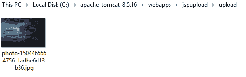

# 用 Servlets 和 JSP 上传文件

> 原文:[https://web . archive . org/web/20220930061024/https://www . bael dung . com/upload-file-servlet](https://web.archive.org/web/20220930061024/https://www.baeldung.com/upload-file-servlet)

## **1。简介**

在这个快速教程中，我们将看到如何从 servlet 上传文件。

为了实现这一点，我们将首先看到由本地`@MultipartConfig`注释提供文件上传功能的普通 Jakarta EE 解决方案。

然后，我们将查看 Apache Commons [`FileUpload`](https://web.archive.org/web/20220628052442/https://commons.apache.org/proper/commons-fileupload/using.html) 库，了解 Servlet API 的早期版本。

## **2。使用雅加达 EE `@MultipartConfig`**

**Jakarta EE 能够支持开箱即用的多部分上传。**

因此，在用文件上传支持丰富 Jakarta EE 应用程序时，这可能是默认的选择。

首先，让我们向 HTML 文件添加一个表单:

```
<form method="post" action="multiPartServlet" enctype="multipart/form-data">
    Choose a file: <input type="file" name="multiPartServlet" />
    <input type="submit" value="Upload" />
</form>
```

表单应该使用`enctype=”multipart/form-data”`属性来定义，以表示多部分上传。

接下来，**我们将使用`@MultipartConfig`注释**用正确的信息注释我们的`HttpServlet`:

```
@MultipartConfig(fileSizeThreshold = 1024 * 1024,
  maxFileSize = 1024 * 1024 * 5, 
  maxRequestSize = 1024 * 1024 * 5 * 5)
public class MultipartServlet extends HttpServlet {
    //...
} 
```

然后，让我们确保设置了默认的服务器上传文件夹:

```
String uploadPath = getServletContext().getRealPath("") + File.separator + UPLOAD_DIRECTORY;
File uploadDir = new File(uploadPath);
if (!uploadDir.exists()) uploadDir.mkdir(); 
```

最后，**我们可以使用`getParts()` 方法**轻松地从`request` 中检索我们的入站`File` ，并将其保存到磁盘:

```
for (Part part : request.getParts()) {
    fileName = getFileName(part);
    part.write(uploadPath + File.separator + fileName);
} 
```

注意，在这个例子中，我们使用了一个助手方法 getFileName():

```
private String getFileName(Part part) {
    for (String content : part.getHeader("content-disposition").split(";")) {
        if (content.trim().startsWith("filename"))
            return content.substring(content.indexOf("=") + 2, content.length() - 1);
        }
    return Constants.DEFAULT_FILENAME;
}
```

**针对 Servlet 3.1。项目，我们可以选择使用`Part.getSubmittedFileName()`方法:**

```
fileName = part.getSubmittedFileName();
```

## **3。使用 Apache Commons 文件上传**

如果我们不在 Servlet 3.0 项目中，我们可以直接使用 Apache Commons FileUpload 库。

### **3.1。设置**

我们希望使用下面的`pom.xml`依赖关系来运行我们的示例:

```
<dependency> 
    <groupId>commons-fileupload</groupId>
    <artifactId>commons-fileupload</artifactId>
    <version>1.4</version>
</dependency>
<dependency>
    <groupId>commons-io</groupId>
    <artifactId>commons-io</artifactId>
    <version>2.11.0</version>
</dependency>
```

在 Maven 的中央存储库中快速搜索就可以找到最新版本: [commons-fileupload](https://web.archive.org/web/20220628052442/https://search.maven.org/classic/#search%7Cga%7C1%7Ca%3A%22commons-fileupload%22%20AND%20g%3A%22commons-fileupload%22) 和 [commons-io](https://web.archive.org/web/20220628052442/https://search.maven.org/classic/#search%7Cga%7C1%7Cg%3A%22commons-io%22%20AND%20a%3A%22commons-io%22) 。

### **3.2。上传 Servlet**

整合 Apache 的`FileUpload`库的三个主要部分如下:

*   一个`.jsp`页面中的上传表单。
*   配置您的`DiskFileItemFactory`和`ServletFileUpload`对象。
*   处理多部分文件上载的实际内容。

上传表单与上一节中的表单相同。

让我们继续创建 Jakarta EE servlet。

在我们的请求处理方法中，我们可以用一个检查来包装传入的`HttpRequest`,看看它是否是一个多部分上传。

我们还将在`DiskFileItemFactory.` 上指定临时(在处理过程中)分配给文件上传的资源

最后，**我们将创建一个`ServletFileUpload` 对象，它将代表实际的文件本身**。它将为最终的持久性服务器端公开多部分上传的内容:

```
if (ServletFileUpload.isMultipartContent(request)) {

    DiskFileItemFactory factory = new DiskFileItemFactory();
    factory.setSizeThreshold(MEMORY_THRESHOLD);
    factory.setRepository(new File(System.getProperty("java.io.tmpdir")));

    ServletFileUpload upload = new ServletFileUpload(factory);
    upload.setFileSizeMax(MAX_FILE_SIZE);
    upload.setSizeMax(MAX_REQUEST_SIZE);
    String uploadPath = getServletContext().getRealPath("") 
      + File.separator + UPLOAD_DIRECTORY;
    File uploadDir = new File(uploadPath);
    if (!uploadDir.exists()) {
        uploadDir.mkdir();
    }
    //...
}
```

然后，我们可以提取这些内容并将其写入磁盘:

```
if (ServletFileUpload.isMultipartContent(request)) {
    //...
    List<FileItem> formItems = upload.parseRequest(request);
    if (formItems != null && formItems.size() > 0) {
        for (FileItem item : formItems) {
	    if (!item.isFormField()) {
	        String fileName = new File(item.getName()).getName();
	        String filePath = uploadPath + File.separator + fileName;
                File storeFile = new File(filePath);
                item.write(storeFile);
                request.setAttribute("message", "File "
                  + fileName + " has uploaded successfully!");
	    }
        }
    }
}
```

## **4。运行示例**

在我们将项目编译成 `.war`之后，我们可以将它放入本地 Tomcat 实例并启动它。

从那里，我们可以调出主上传视图，在那里我们看到一个表单:

[](/web/20220628052442/https://www.baeldung.com/wp-content/uploads/2018/05/choosefile.png)

成功上传文件后，我们应该看到消息:

[](/web/20220628052442/https://www.baeldung.com/wp-content/uploads/2018/05/filesuccess.png)

最后，我们可以检查 servlet 中指定的位置:

[](/web/20220628052442/https://www.baeldung.com/wp-content/uploads/2018/05/imagesaved.png)

## **5。结论**

就是这样！我们已经学习了如何使用 Jakarta EE 以及 Apache 的公共`FileUpload`库来提供多部分文件上传！

代码片段一如既往地可以在 GitHub 上找到[。](https://web.archive.org/web/20220628052442/https://github.com/eugenp/tutorials/tree/master/javax-servlets)