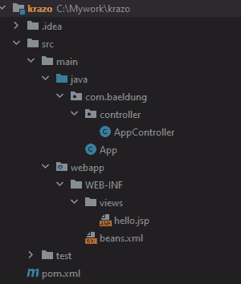
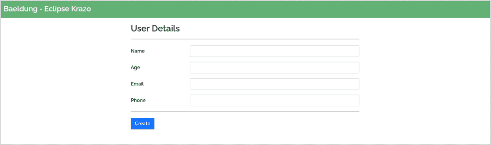
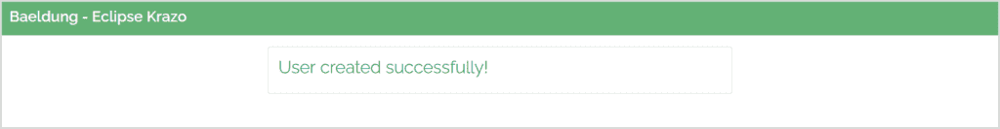
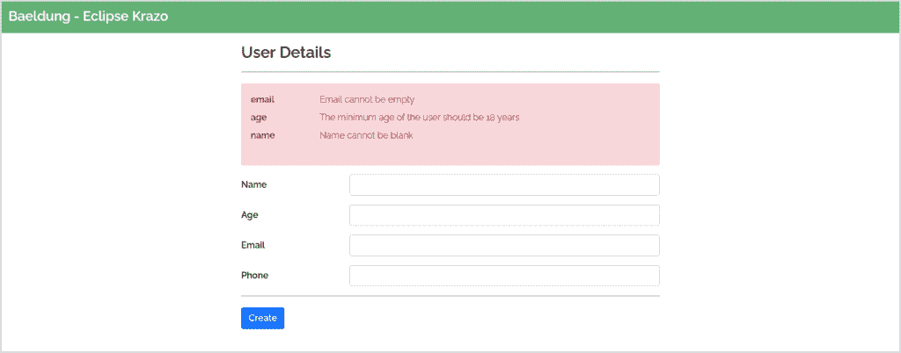
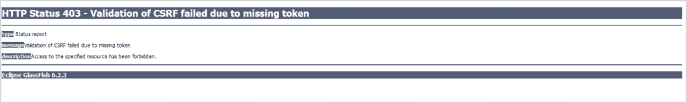

# Jakarta EE MVC / Eclipse Krazo 简介

> 原文：<https://web.archive.org/web/20220930061024/https://www.baeldung.com/java-ee-mvc-eclipse-krazo>

## 1.介绍

模型视图控制器(MVC)是构建 web 应用程序的一种流行的设计模式。几年来，它已经成为构建现代基于 web 的应用程序的事实上的设计原则。

在本教程中，让我们学习如何使用 Jakarta EE MVC 2.0 构建一个带有网页和 REST API 的 web 应用程序。

## 2.JSR-371

**雅加达 MVC 2.0(前身为 [JSR 371](https://web.archive.org/web/20221221020726/https://jcp.org/en/jsr/detail?id=371) MVC 1.0)是一个基于动作的 web 框架，构建在[雅加达 RESTful Web 服务](https://web.archive.org/web/20221221020726/https://jakarta.ee/specifications/restful-ws/)或 JAX-RS(前身为[RESTful Web 服务的 Java API](/web/20221221020726/https://www.baeldung.com/jax-rs-spec-and-implementations))之上。** JSR-371 用额外的注释补充了 JAX-RS，使构建 web 应用程序更加方便。

JSR 371 或 Jakarta MVC 规范了我们如何用 Java 开发 web 应用程序。此外，主要目标是利用现有的 [CDI(上下文和依赖注入)](https://web.archive.org/web/20221221020726/https://jcp.org/en/jsr/detail?id=346)和 [Bean 验证](https://web.archive.org/web/20221221020726/https://jcp.org/en/jsr/detail?id=349)，并支持[JSP](/web/20221221020726/https://www.baeldung.com/jsp)和 [Facelets](https://web.archive.org/web/20221221020726/https://javaee.github.io/tutorial/jsf-facelets.html) 作为视图技术。

目前，Jakarta MVC 2.1 规范的工作正在进行中，可能会随着 Jakarta EE 10 的发布而发布。

## 3.JSR-371 注解

除了 JAX-RS 注解之外，JSR-371 还定义了一些注解。**A**ll 这些注释是`jakarta.mvc.*`包的一部分。

### 3.1.`jakarta.mvc.Controller`

`@Controller`注释将资源标记为 MVC 控制器。当用于一个类时，该类中的所有资源方法都成为控制器。类似地，在资源方法上使用该注释会使该方法成为控制器。通常，如果我们想在同一个类中定义 MVC 控制器和 REST APIs，在一个方法上定义`@Controller`是很有帮助的。

例如，让我们定义一个控制器:

```
@Path("user")
public class UserController {
    @GET
    @Produces("text/html")
    @Controller
    public String showUserForm(){
        return "user.jsp";
    }
    @GET
    @Produces("application/json")    
    public String getUserDetails(){
        return getUserDetails();
    }
}
```

这个类有一个呈现用户表单的`@Controller`(`showUserForm`)和一个返回用户详细信息 JSON 的 REST API(`getUserDetails`)。

### 3.2.`jakarta.mvc.View`

像`@Controller`一样，我们可以用`@View` 标注来标记一个资源类或者一个资源方法。通常，返回`void`的资源方法应该有一个`@View`。带有`@View` 的类表示带有`void`类型的类中控制器的默认视图。

例如，让我们用`@View`定义一个控制器:

```
@Controller
@Path("user")
@View("defaultModal.jsp")
public class UserController {
    @GET
    @Path("void")
    @View("userForm.jsp")
    @Produces("text/html")
    public void showForm() {
        getInitFormData();
    }

    @GET
    @Path("string")
    @Produces("text/html")
    public void showModal() {
        getModalData();
    }
}
```

这里，资源类和资源方法都有`@View` 注释。控制器`showForm` 呈现视图`userForm.jsp.` 类似地，`showModal` 控制器呈现资源类上定义的`defaultModal.jsp,` 。

### 3.3.`jakarta.mvc.binding.MvcBinding`

Jakarta RESTful Webservices 拒绝有绑定和验证错误的请求。类似的设置可能不适用于与网页交互的用户。幸运的是，即使发生绑定和验证错误，Jakarta MVC 也会调用控制器。通常，用户应该充分了解数据绑定错误。

控制器注入一个 [`BindingResult`](https://web.archive.org/web/20221221020726/https://jakarta.ee/specifications/mvc/2.0/apidocs/jakarta/mvc/binding/bindingresult) 来向用户呈现可读的验证和绑定错误消息。例如，让我们定义一个带有`@MvcBinding`的控制器:

```
@Controller
@Path("user")
public class UserController {
    @MvcBinding
    @FormParam("age")
    @Min(18)
    private int age;
    @Inject
    private BindingResult bindingResult;
    @Inject
    private Models models;
    @POST
    public String processForm() {
        if (bindingResult.isFailed()) {
            models.put("errors", bindingResult.getAllMessages());
            return "user.jsp";
        }
    }
}
```

在这里，如果用户输入一个小于 18 的`age` ，用户将返回到带有绑定错误的同一个页面。使用表达式语言(EL)的`user.jsp` 页面可以检索请求属性`errors`并在页面上显示它们。

### 3.4.`jakarta.mvc.RedirectScoped`

考虑一个用户填写并提交数据的表单(HTTP POST)。服务器处理数据并将用户重定向到成功页面(HTTP GET)。这种模式被广泛称为 [PRG (Post-Redirect-Get)模式](https://web.archive.org/web/20221221020726/https://en.wikipedia.org/wiki/Post/Redirect/Get)。在一些场景中，我们希望在 POST 和 GET 之间保存数据。在这些场景中，模型/bean 的范围超出了单个请求。

当用`@RedirectScoped,` 对 bean 进行注释时，bean 的状态超出了单个请求的范围。然而，在 POST、redirect 和 Get 完成之后，状态被破坏。在 POST、Redirect 和 GET 完成后，用`@RedirectScoped` 标记的 bean 被销毁。

例如，假设 bean `User` 有注释`@RedirectScoped`:

```
@RedirectScoped
public class User
{
    private String id;
    private String name;
    // getters and setters
}
```

接下来，将这个 bean 注入控制器:

```
@Controller
@Path("user")
public class UserController {
    @Inject
    private User user;
    @POST
    public String post() {
        user.setName("John Doe");
        return "redirect:/submit";
    }
    @GET
    public String get() {
        return "success.jsp";
    }
}
```

这里，bean `User` 可用于 POST 和后续的重定向和 GET。因此，`success.jsp`可以使用 EL 访问 bean 的`name`属性。

### 3.5.`jakarta.mvc.UriRef`

我们只能对资源方法使用`@UriRef`注释。`@UriRef`使我们能够为资源方法提供一个名称。我们可以在视图中使用这些名称来调用我们的控制器，而不是控制器路径 URIs。

假设有一个带有`href`的用户表单:

```
<a href="/app/user">Clich Here</a>
```

点击`Click Here`调用映射到`GET /app/user`的控制器。

```
@GET
@UriRef("user-details")
public String getUserDetails(String userId) {
    userService.getUserDetails(userId);
} 
```

在这里，我们用`user-details`来命名我们的控制器。现在，我们可以在视图中引用这个名称，而不是 URI:

```
<a href="${mvc.uri('user-details')}">Click Here</a>
```

### 3.6.`jakarta.mvc.security.CsrfProtected`

该注释要求 CSRF 验证是调用资源方法所必需的。如果 CSRF 令牌无效，客户端会收到一个`ForbiddenException` (HTTP 403)异常。只有资源方法可以有这个注释。

考虑一个控制器:

```
@POST
@Path("user")
@CsrfProtected
public String saveUser(User user) {
    service.saveUser(user);
}
```

假设控制器有一个`@CsrfProtected` 注释，只有当请求包含有效的 CSRF 令牌时，它才会到达控制器。

## 4.构建 MVC 应用程序

接下来，让我们用 REST API 和控制器构建一个 web 应用程序。最后，让我们在最新版本的 [Eclipse Glassfish](https://web.archive.org/web/20221221020726/https://projects.eclipse.org/projects/ee4j.glassfish) 中部署 web 应用程序。

### 4.1.生成项目

首先，让我们使用 Maven `archetype:generate`来生成 Jakarta MVC 2.0 项目:

```
mvn archetype:generate 
  -DarchetypeGroupId=org.eclipse.krazo
  -DarchetypeArtifactId=krazo-jakartaee9-archetype
  -DarchetypeVersion=2.0.0 -DgroupId=com.baeldung
  -DartifactId=krazo -DkrazoImpl=jersey
```

上面的原型生成了一个带有所需工件的 maven 项目，类似于:

[](/web/20221221020726/https://www.baeldung.com/wp-content/uploads/2022/03/1.png)

同样，生成的`pom.xml` 包含了`[jakarta.platform](https://web.archive.org/web/20221221020726/https://search.maven.org/search?q=jakarta.jakartaee-web-api), [jakarta.mvc](https://web.archive.org/web/20221221020726/https://search.maven.org/search?q=jakarta.mvc)` 和 [`org.eclipse.krazo`](https://web.archive.org/web/20221221020726/https://search.maven.org/search?q=a:krazo-jersey) 的依赖关系:

```
<dependency>
    <groupId>jakarta.platform</groupId>
    <artifactId>jakarta.jakartaee-web-api</artifactId>
    <version>9.1.0</version>
    <scope>provided</scope>
</dependency>
<dependency>
    <groupId>jakarta.mvc</groupId>
    <artifactId>jakarta.mvc-api</artifactId>
    <version>2.0.0</version>
</dependency>
<dependency>
    <groupId>org.eclipse.krazo</groupId>
    <artifactId>krazo-jersey</artifactId>
    <version>2.0.0</version>
</dependency>
```

### 4.2.控制器

接下来，让我们定义用于显示表单、保存用户详细信息的控制器，以及用于获取用户详细信息的 API。但是，首先，让我们定义我们的应用程序路径:

```
@ApplicationPath("/app")
public class UserApplication extends Application {
}
```

应用路径定义为`/app`。接下来，让我们定义将用户转发到用户详细信息表单的控制器:

```
@Path("users")
public class UserController {
    @GET
    @Controller
    public String showForm() {
        return "user.jsp";
    }
}
```

接下来，在`WEB-INF/views,` 下，我们可以创建一个视图`user.jsp,` 并构建和部署应用程序:

```
mvn clean install glassfish:deploy
```

这个 [Glassfish Maven](https://web.archive.org/web/20221221020726/https://search.maven.org/search?q=g:org.glassfish.maven.plugin%20a:maven-glassfish-plugin) 插件在端口 8080 上构建、部署和运行。成功部署后，我们可以打开浏览器并点击 URL:

`http://localhost:8080/mvc-2.0/app/users` :

[](/web/20221221020726/https://www.baeldung.com/wp-content/uploads/2022/03/form-1.png)

接下来，让我们定义一个处理表单提交动作的 HTTP POST:

```
@POST
@Controller
public String saveUser(@Valid @BeanParam User user) {   
    return "redirect:users/success";
}
```

现在，当用户点击`Create`按钮时，控制器处理 POST 请求并将用户重定向到成功页面:

[](/web/20221221020726/https://www.baeldung.com/wp-content/uploads/2022/03/success.png)

让我们利用 Jakarta 验证、CDI 和`@MvcBinding` 来提供表单验证:

```
@Named("user")
public class User implements Serializable {

    @MvcBinding
    @Null
    private String id;

    @MvcBinding
    @NotNull
    @Size(min = 1, message = "Name cannot be blank")
    @FormParam("name")
    private String name;
    // other validations with getters and setters 
}
```

一旦我们有了表单验证，让我们检查绑定错误。如果有任何绑定错误，我们必须向用户显示验证消息。为此，让我们注入`BindingResult` 来处理无效的表单参数。让我们更新一下我们的`saveUser`方法:

```
@Inject
private BindingResult bindingResult;

public String saveUser(@Valid @BeanParam User user) {
    if (bindingResult.isFailed()) {
        models.put("errors", bindingResult.getAllErrors());
        return "user.jsp";
    }  
    return "redirect:users/success";
}
```

验证就绪后，如果用户提交的表单没有强制参数，我们将显示验证错误:

[](/web/20221221020726/https://www.baeldung.com/wp-content/uploads/2022/03/validations.png)

接下来，让我们使用`@CsrfProtected`来保护我们的 POST 方法免受 CSRF 攻击。将`@CsrfProtected` 添加到`saveUser`方法中:

```
@POST
@Controller
@CsrfProtected
public String saveUser(@Valid @BeanParam User user) {
}
```

接下来，让我们试着点击`Create`按钮:

[](/web/20221221020726/https://www.baeldung.com/wp-content/uploads/2022/03/403.png)

当控制器被保护免受 CSRF 攻击时，客户端应该总是传递 CSRF 令牌。因此，让我们在`user.jsp` 中添加一个隐藏字段，在每个请求中添加一个 CSRF 令牌:

```
<input type="hidden" name="${mvc.csrf.name}" value="${mvc.csrf.token}"/>
```

类似地，现在让我们开发一个 [REST API](/web/20221221020726/https://www.baeldung.com/jax-rs-spec-and-implementations) :

```
@GET
@Produces(MediaType.APPLICATION_JSON)
public List<User> getUsers() {
    return users;
}
```

这个 HTTP GET API 返回一个用户列表。

## 5.结论

在本文中，我们了解了 Jakarta MVC 2.0 以及如何使用 Eclipse Krazo 开发 web 应用程序和 REST API。我们已经看到了 MVC 2.0 如何标准化我们用 Java 构建基于 MVC 的 web 应用程序的方式。

和往常一样，完整的源代码可以在 GitHub 上找到[。](https://web.archive.org/web/20221221020726/https://github.com/eugenp/tutorials/tree/master/web-modules/jakarta-ee)