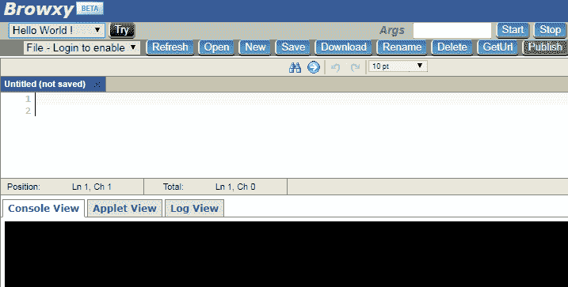
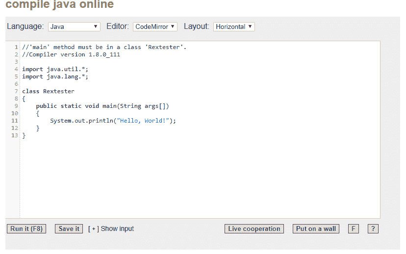
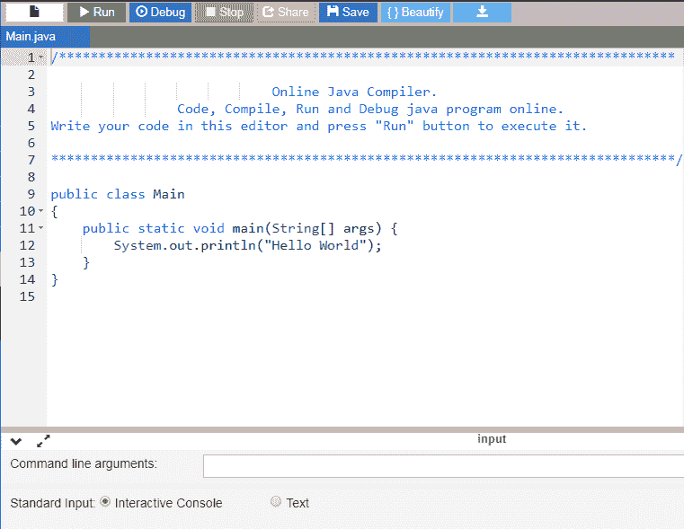
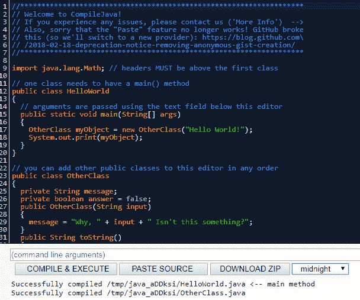
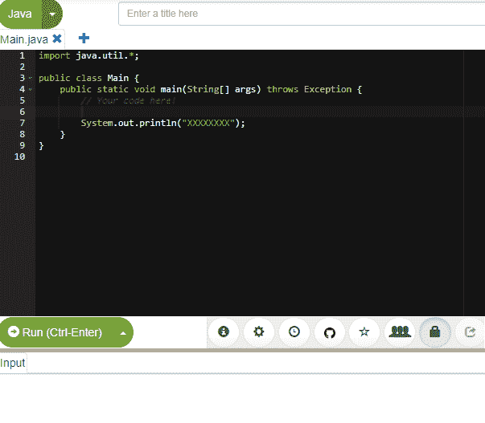
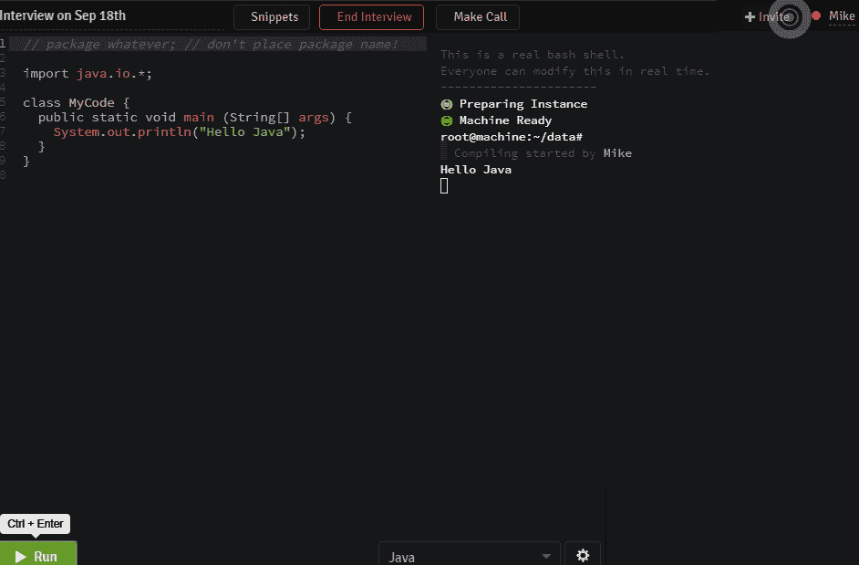
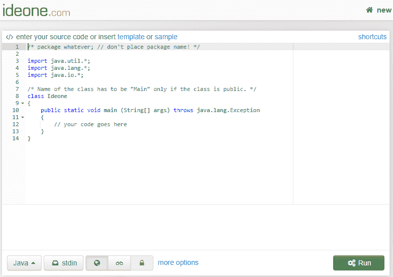
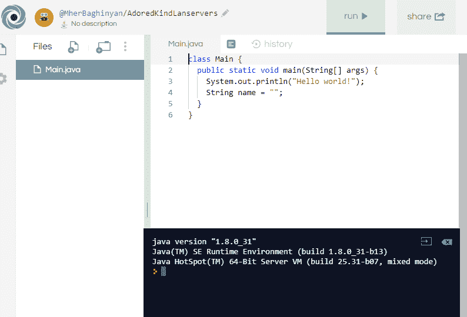

# 在线 Java 编译器

> 原文:[https://web . archive . org/web/20220930061024/https://www . bael dung . com/Java-online-compilers](https://web.archive.org/web/20220930061024/https://www.baeldung.com/java-online-compilers)

## **1。简介**

**在线[编译器](/web/20220916162702/https://www.baeldung.com/cs/how-compilers-work)** **是一个让我们可以编译源代码并在线执行的工具**。这是一个很好的选择，尤其是对于新的 Java 学生、导师或面试官。此外，在私人或小组会议中共享代码或协作也非常容易。

此外，**我们不需要安装 JDK 或者 IDE** 。

在本文中，我们将探索顶级的 Java 在线编译器。

## **2。JDoodle**

JDoodle 是一种在包括 Java 在内的许多编程语言中编译和运行源代码的简单快捷的方法。此外，JDoodle 还提供了一个与 MySql 和 MongoDB 协同工作的终端、对等编程工具、一个远程执行代码的 API 以及一个博客或网站的嵌入特性。

它的用户界面有一个用户友好的编辑器和输入字段，包括:

*   命令行参数
*   对话方式
*   **JDK 版本 8 到 17 可用**
*   **直接从 Maven 库连接外部库**。我们所需要的就是指定组、工件 id 和库的版本。

此外，我们可以打开、保存和下载源文件。

此外，该工具以秒为单位显示编译和执行以及 CPU 时间。内存使用以千字节为单位显示。

值得注意是，JDoodle 有一个用于简单的单个文件程序和更快执行的基本 IDE，以及另一个用于多个文件、自定义库和文件读/写的高级 IDE。

## **3。Codiva**

这款在线编译器因其独特的功能而绝对处于领先地位。为了开始在 [Codiva](https://web.archive.org/web/20220916162702/https://www.codiva.io/) 工作，我们需要启动一个新项目。

它的设计类似于常见的 IDE 接口。左边是项目结构，右边是源文件编辑器。默认情况下，工作目录是`src > hello > com > example`。我们可以通过点击文件名旁边的`+`符号来轻松添加新的 java 文件。

源文件立即被添加到工作树中:

 
要开始，让我们点击右上角的`Run`按钮。当我们开始输入时，它编译代码。此外， **Codiva 显示编译**期间的所有错误，并在我们完成键入时显示程序执行结果。

另外，**它提供了语法高亮和自动完成功能来节省时间**。

最后但同样重要的是，我们可以将 Java 项目嵌入任何博客或网站。首先，我们需要按下`Share`按钮并公开项目。之后，Codiva 给出了两个共享选项:

*   公共 URL
*   HTML 代码复制并粘贴到我们的网站

缺点是，这个工具不支持编译器设置，只适用于 Java、C、C++语言。

## **4。布朗西**

与其他在线编译器相比，Browxy 的运行速度相对较快。可用的语言有 C、C++、C#、Java、Python 和 PHP。

我们可以很容易地在网上分享源文件。`GetUrl`按钮生成文件的 URL，允许我们共享文件。更有甚者，**登录的用户可以公开发布他们的代码**。

点击`Publish`按钮后，项目出现在`Published Code`部分:

它有单独的控制台、小程序和日志输出视图。

**另一个优点是对运行代码**的最小限制。我们可以进行外部 URL 调用来测试一些 API。

## **5。Rextester**

最初， [Rextester](https://web.archive.org/web/20220916162702/http://rextester.com/l/java_online_compiler) 被设计为正则表达式测试器。后来，它发展成为支持绝大多数编程语言的在线 IDE。

它支持不同的编辑器和布局视图:

现场合作功能也值得一提。按下适当的按钮后，Rextester 生成一个可共享的 URL。

任何拥有该网址的人都可以在一个永久的实时会话中编码。我们可以看到别人做出的改变，也可以做出自己的改变。

## **6。OnlineGDB**

**[OnlineGDB](https://web.archive.org/web/20220916162702/https://www.onlinegdb.com/online_java_compiler) 是包括 Java** 在内的众多编码语言的编译器和调试器。代码格式化也可以使编码更舒适。

更重要的是，**我们可以通过简单地点击我们想要观察的行**来添加断点。按下`Debug`按钮后，调试模式开始。它将逐步通过先前设置的断点。

用户可以在适当的窗口中观察局部变量值或调用堆栈:

## **7。编译 java**

[Compilejava](https://web.archive.org/web/20220916162702/https://www.compilejava.net/) 是一款运行 java 代码的简单在线工具。它有许多主题，包括截图中显示的`midnight`。Java 初学者，学生，可以把它用于教育目的。

它总是运行在最新版本的 Java 上。**我们可以通过提供 URL 从要点**导入代码片段:

## **8。Paiza.io**

这个在线编译器具有友好和易于使用的界面。像其他高级编译器一样， [Paiza](https://web.archive.org/web/20220916162702/https://paiza.io/en/projects/new?language=java) 拥有如下所有特性:

*   支持多个文件
*   快速自动完成
*   在 GitHub 或 Gist 中链接和共享代码
*   通过网络进行公共或私人共享
*   与用户群的协作
*   任务调度

它支持大多数顶级编程语言，包括 C、C++、C#、JVM 语言和 Python。

## **9。远程面试**

[RemoteInterview](https://web.archive.org/web/20220916162702/https://www.remoteinterview.io/online-java-compiler) 专注于帮助大多数常见编程语言的在线面试过程。**提供现场结对编程，**分享代码片段，**进行视频通话，录制并保存采访**。

面试官可以通过共享邀请链接邀请任何人参加实时会话:

## 10。Ideone

Ideone 编译并执行 60 多种编程语言的代码。它允许代码共享为:

*   公共–对所有人开放
*   secret–仅向与我们共享 URL 的人开放
*   私有–仅提供给所有者

Ideone 允许我们提交的程序有时间限制和内存使用约束:

*   10 秒编译时间
*   5 秒的执行时间(对于未登录的用户)和 15 秒的登录用户
*   256 MB 用于内存使用

最后，在`samples`部分，我们可以找到最近运行和执行的代码片段。我们可以自己用叉子试一试。

## **11。Repl.it**

Repl.it 拥有支持多种语言的交互式编程环境。此外，我们可以创建一个简单的 web 项目，包括 HTML 和 JS 文件来练习基本的 web 技能。它在教师、面试官、大学和学院中非常受欢迎。

首先，我们需要在平台上注册。值得一提的是，这个要求在前面列出的任何编译器中都不存在:

**一个重要的特性是内置的版本控制**,它允许保存当前的工作，稍后使用会话，或者比较每个版本的变化。

另外，**拥有多功能终端仿真器**，提供丰富的 API 和代码共享/协作工具，第三方库支持。

## **12。总结**

在本指南中，我们简要总结了许多可用的 Java 在线编译器。

其中一些提供了独特的功能，如边输入边编译、代码提示、自动完成、内置调试或代码格式化。

尽管如此，与桌面版本相比，现代在线编译器的能力仍然有限。