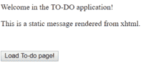

# 控制器、服务和 DAO 以 Spring Boot 和 JSF 为例

> 原文：<https://web.archive.org/web/20220930061024/https://www.baeldung.com/jsf-spring-boot-controller-service-dao>

## **1。简介**

JavaServer Faces 是一个服务器端的基于组件的用户界面框架。最初它是作为 Jakarta EE 的一部分开发的。在本教程中，我们将研究如何将 JSF 集成到 Spring Boot 应用程序中。

例如，我们将实现一个简单的应用程序来创建待办事项列表。

## **2。Maven 依赖关系**

我们必须扩展我们的`pom.xml`来使用 JSF 技术:

[PRE0]

[`javax.faces`](https://web.archive.org/web/20220709004013/https://search.maven.org/search?q=a:javax.faces) 工件包含 JSF API 和实现。详细信息可以在这里[找到。](https://web.archive.org/web/20220709004013/https://javaee.github.io/javaserverfaces-spec/)

## 3.配置 JSF Servlet

JSF 框架使用 XHTML 文件来描述用户界面的内容和结构。服务器端根据 XHTML 描述生成 JSF 文件。

让我们从在`src/main/webapp`目录下的`index.xhtml`文件中创建一个静态结构开始:

[PRE1]

该内容将在`<your-url>/index.jsf`可用。但是，如果我们在这个阶段尝试访问内容，我们会在客户端收到一条错误消息:

[PRE2]

将不会有后端错误消息。即便如此，我们也能发现**我们需要一个 JSF servlet 来处理请求**和 servlet 映射来匹配请求和处理程序。

由于我们在 Spring Boot，我们可以轻松地扩展我们的应用程序类来处理所需的配置:

[PRE3]

这看起来很棒，也很合理，但不幸的是仍然不够好。当我们现在试图打开`<your-url>/index.jsf`时，我们会得到另一个错误:

[PRE4]

**不幸的是，除了 Java 配置，我们还需要一个`web.xml`。**让我们在`src/webapp/WEB-INF`中创建它:

[PRE5]

现在，我们的配置已经准备就绪。打开`<your-url>/index.jsf`:

[PRE6]

在我们创建用户界面之前，让我们创建应用程序的后端。

## **4。实现 DAO 模式**

DAO 代表数据访问对象。通常，DAO 类负责两个概念。封装持久层的细节，为单个实体提供 CRUD 接口。你可以在[本](/web/20220709004013/https://www.baeldung.com/java-dao-pattern)教程中找到详细描述。

为了实现 DAO 模式，**我们将首先定义一个通用接口**:

[PRE7]

现在让我们在这个待办事项应用程序中创建第一个也是唯一一个域类:

[PRE8]

下一个类将是`Dao<Todo>`的实现。这种模式的美妙之处在于，我们可以随时提供这种接口的新实现。

因此，我们可以改变持久层，而不影响代码的其余部分。

对于我们的例子，**我们将使用内存中的存储类**:

[PRE9]

## **5。服务层**

DAO 层的主要目标是处理持久性机制的细节。而服务层站在它的上面来处理业务需求。

请注意，DAO 接口将从服务中引用:

[PRE10]

这里，服务是一个命名的组件。我们将使用该名称来引用 JSF 上下文中的 bean。

此外，这个类有一个会话范围，这对于这个简单的应用程序来说是令人满意的。

想了解更多关于弹簧示波器的信息，请看[这篇](/web/20220709004013/https://www.baeldung.com/spring-bean-scopes)教程。**由于 Spring 的内置作用域与 JSF 的模型不同，因此有必要考虑定义一个自定义作用域。**

关于这一点的更多指导可在[本](/web/20220709004013/https://www.baeldung.com/spring-custom-scope)教程中获得。

## **6。控制器**

就像在 JSP 应用程序中一样，控制器将处理不同视图之间的导航。

接下来，我们将实现一个极简控制器。它将从开始页面导航到待办事项列表页面:

[PRE11]

**导航基于返回的名称。**因此`loadTodoPage`会将我们发送到我们接下来要实现的`todo.xhtml`页面。

## 7 .**。连接 JSF 和春豆**

让我们看看如何从 JSF 上下文中引用我们的组件。首先，我们将扩展`index.xthml`:

[PRE12]

这里我们在表单元素中引入了一个`commandButton`。**这很重要，因为每个`UICommand`元素(如`commandButton)`** **)都必须放在`UIForm`元素(如表单)的内部。**

在这个阶段，我们可以开始我们的应用程序并检查`<your-url>/index.jsf`:

不幸的是，当我们点击按钮时，我们会得到一个错误:

[PRE13]

该消息清楚地说明了问题:`jsfController`解析为`null.`相应的组件要么没有创建，要么至少从 JSF 上下文中是不可见的。

在这种情况下，后者是正确的。

**我们需要在`webapp/WEB-INF/faces-config.xml` :** 中连接 Spring 上下文和`JSF`上下文

[PRE14]

现在我们的控制器已经准备好工作了，我们需要`todo.xhtml`！

## **8。与来自 JSF 的服务互动**

我们的页面有两个目的。首先，它将显示所有的待办事项元素。

第二，提供向列表中添加新元素的机会。

为此，UI 组件将直接与之前声明的服务进行交互:

[PRE15]

上述两个目的在两个独立的`div`元素中实现。

首先，我们使用一个`dataTable`元素来表示来自`todoService.AllTodo`的所有值。

第二个`div`包含一个表单，我们可以在其中修改`TodoService.`中的`Todo`对象的状态

**我们使用`inputText`元素接受用户输入，其中第二个输入被自动转换成带有`commandButton,`的`int.`** ，用户可以用`todoService.save`将`Todo`对象持久化(保存到内存中)。

## **9。结论**

JSF 框架可以集成到 Spring 框架中。您必须选择哪个框架来管理 beans。在本教程中，我们使用了 Spring 框架。

然而，范围模型与 JSF 框架有点不同。因此，您可以考虑在 Spring 上下文中定义自定义范围。

和往常一样，代码可以在 GitHub 的[上获得。](https://web.archive.org/web/20220709004013/https://github.com/eugenp/tutorials/tree/master/spring-boot-modules/spring-boot-mvc)