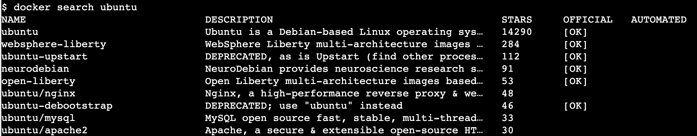

# Docker 注册表 API–列出图像和标签

> 原文：<https://web.archive.org/web/20220930061024/https://www.baeldung.com/ops/docker-registry-api-list-images-tags>

## 1.概观

在本教程中，我们将探索如何在远程 [Docker](/web/20221128054910/https://www.baeldung.com/tag/docker/) 注册表中列出图像，以及如何获取图像的标签。

这有助于找出注册表中可用的特定图像的版本，并决定使用哪个版本。

## 2.docker registry api(坞站注册表 API)

Docker 注册表提供了与注册表交互的 API。这个 **API 包含 Docker CLI 在后台使用的各种[端点](https://web.archive.org/web/20221128054910/https://docs.docker.com/registry/spec/api/#detail)来执行各种任务，如拉、推和标记图像。**

我们还可以直接使用这些端点与注册中心进行交互，而无需使用 Docker CLI。

让我们看看注册表 API 的端点格式:

```
/<api-version>/<repository-name>/<resource>/<params> 
```

让我们来看看这个端点的不同组件:

*   API 版本**–**API 的版本。例如，当前版本是 v2 `.`
*   存储库(映像)名称**–**映像的名称。如果是嵌套存储库，该名称还可以包含由斜杠分隔的路径。比如`/ubuntu/nginx `或者`/redis`。
*   资源**–**我们想要与之交互的 API 的细分。例如，`manifests`将处理特定图像的清单。
*   参数–这些是可选参数，可用于进一步优化操作。例如，`manifests/latest` 将获取最新标签的清单。

基于上述规则，下面是一个端点的具体示例:

```
GET /v2/ubuntu/nginx/manifests/latest 
```

## 3.dock registry API v2

在撰写本文时，V2 是注册表 API 的最新版本。让我们探索如何使用它来列出来自远程注册表的图像和标签。

假设我们在 URL `https://my-registry.io.` 部署了一个注册中心，我们将使用`curl`来执行 HTTP 请求。

### 3.1.列出图像

要在注册表中列出图像，我们可以使用 _/ `catalog`端点:

```
$ curl -X GET my-registry.io/v2/_catalog
{"repositories":["centos","ubuntu"]} 
```

我们应该注意，如果已经启用了身份验证，那么访问某些存储库可能需要身份验证。在这种情况下，我们可以使用`-u `选项将用户名和密码作为参数传递给`curl`命令。

```
$ curl -u user:password -X GET my-registry.io/v2/_catalog 
{"repositories":["centos","ubuntu"]}
```

### 3.2.分页列表图像

有时，注册表会有大量的图像。在这种情况下，**我们可以向 _/ `catalog`端点添加一个`n=<number of results>`参数，以获得分页的响应:**

```
$ curl -X GET my-registry.io/v2/_catalog?n=1
{"repositories":["centos"]} 
```

现在，响应只包含第一个图像。

我们可以使用对第一个请求的响应来获得下一页的结果。这需要对 curl 命令进行两处修改:

*   `A l` `ast`参数到 _/ `catalog`端点，包含上一次请求中返回的最后一个图像名。
*   将新请求链接到前一个请求的标头。标题的格式如下:

```
Link: <my-registry.io/v2/_catalog?n=1&last;=centos>; rel="next" 
```

**URL 两边的括号是必需的。该 URL 与新请求的 URL 相同。根据 [RFC 5988](https://web.archive.org/web/20221128054910/https://tools.ietf.org/html/rfc5988) ，一个`rel=”next”`报头表示新请求是前一个请求的延续。**

所以让我们提出下一个要求:

```
$ curl -H 'Link: <my-registry.io/v2/_catalog?n=1&last;=centos>; rel="next"' -X GET "my-registry.io/v2/_catalog?n=1&last;=centos"
{"repositories":["ubuntu"]} 
```

响应返回包含一幅图像的下一页结果。

### 3.3.列表标签

要列出图像的[标签，我们可以使用`/tags/list`端点:](/web/20221128054910/https://www.baeldung.com/ops/docker-tag)

```
$ curl -X GET my-registry.io/v2/ubuntu/tags/list
{"name":"ubuntu","tags":["latest","16.04"]} 
```

响应包含图像的名称和与之相关的标签数组。

We can also use pagination with the same rules as we saw for image listing.

## 4.坞站注册表 API V1

注册 API v1 在 Docker 17.06 中被弃用，并在 Docker 17.12 中被删除。然而，如果我们遇到在弃用之前托管的注册中心，我们可以使用 v1 API。让我们探索一下在这种情况下我们的请求是如何变化的。

### 4.1.列出图像

v1 中没有列出图像的直接端点。相反，我们可以使用`docker search`命令来搜索包含给定字符串的图像:

```
$ docker search my-registry.io/centos 
```

这将返回名称或描述中包含字符串“centos”的图像列表。

如果我们不指定注册表，搜索将在默认注册表中执行。默认存储库是 Docker Hub 存储库。

例如，下图显示了我们在没有指定任何存储库的情况下搜索术语“ubuntu”时的输出。

[](/web/20221128054910/https://www.baeldung.com/wp-content/uploads/2022/05/Screenshot-2022-05-22-at-11.13.01-AM.png)

### 4.2.列表标签

列出标签的方法类似于 v2 API。但是，在这种情况下，输出是不同的:

```
$ curl -X GET https://registry.hub.docker.com/v1/repositories/baeldung/mesos-marathon-demo/tags
[{"layer": "", "name": "32"}, {"layer": "", "name": "33"}, {"layer": "", "name": "34"}] 
```

正如我们所看到的，我们有一个对象数组，而不是一个标签数组。**每个对象包括标签的名称和图像的层 ID。**

如果需要，我们可以将响应转换为数组。为此，让我们将输出通过管道传输到[的`jq`命令](/web/20221128054910/https://www.baeldung.com/linux/jq-command-json)中，并解析 JSON:

```
$ curl -s GET https://registry.hub.docker.com/v1/repositories/baeldung/mesos-marathon-demo/tags | jq -r '[.[].name]'
[
  "32",
  "33",
  "34"
] 
```

让我们来理解这里使用的`jq`命令和表达式:

*   `-r`标志将输出作为原始文本返回。
*   表达式`.[].name`从`curl`输出中的每个对象返回`name`属性。
*   表达式两边的方括号`[]`表示我们想要在一个数组中收集输出。

最后，curl 命令需要使用 `-s`标志来抑制进度条输出。

## 5.结论

在本文中，我们探索了如何使用 Docker Registry API 来列出远程注册表中的图像和标签。

我们还研究了如何发送对图像和标签的分页请求，以及如何解析 JSON 响应。