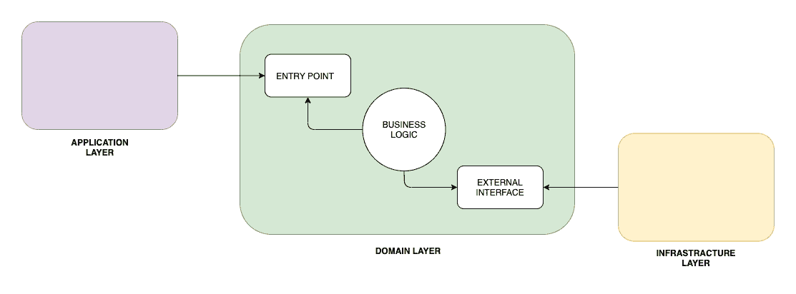
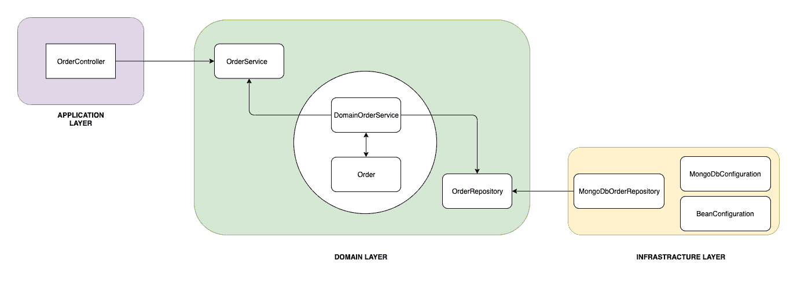

# 使用六边形架构、DDD 和 Spring 组织图层

> 原文：<https://web.archive.org/web/20220930061024/https://www.baeldung.com/hexagonal-architecture-ddd-spring>

## 1.概观

在本教程中，我们将使用 DDD 实现一个 Spring 应用程序。此外，我们将借助六边形架构来组织图层。

使用这种方法，我们可以轻松地交换应用程序的不同层。

## 2.六角形建筑

六边形架构是**围绕领域逻辑** 设计软件应用的模型，以将其与外部因素隔离开来。

领域逻辑是在业务核心中指定的，我们称之为内部部分，其余的是外部部分。 通过端口和适配器可以从外部访问域逻辑。

## 3.原则

首先，我们应该定义划分代码的原则。如前所述，六边形结构定义了内部和外部。

我们要做的是将我们的应用程序分成三层；**应用(外部)、域(内部)和基础设施(外部):**

通过**应用层，用户或任何其他程序与应用交互**。这个区域应该包含像用户界面、RESTful 控制器和 JSON 序列化库这样的东西。它包括任何向我们的应用程序公开入口并协调域逻辑执行的**。**

**在领域层，我们保留接触和实现业务逻辑的代码**。这是我们应用程序的核心。此外，这一层应该与应用程序部分和基础结构部分隔离开来。除此之外，它还应该包含定义 API 的接口，以便与域与之交互的外部部分(如数据库)进行通信。

最后，**基础设施层是包含应用程序工作所需的任何东西的部分，比如数据库配置或 Spring 配置。此外，它还从领域层实现了基础设施相关的接口。**

## 4.畴层

让我们从实现核心层开始，这是领域层。

首先，我们应该创建`Order`类:

[PRE0]

**这是我们的[聚合根](/web/20220921215025/https://www.baeldung.com/spring-persisting-ddd-aggregates)** 。任何和我们商业逻辑相关的东西都会经过这个类。此外，`Order`负责保持自身处于正确的状态:

*   订单只能用给定的 ID 创建，并且基于一个`Product –` ，构造器本身也用`CREATED`状态初始化订单
*   一旦订单完成，就无法更改`OrderItem` s
*   不可能从域对象之外改变`Order`,就像使用 setter 一样

此外，`Order`类还负责创建它的`OrderItem`。

那么让我们创建`OrderItem` 类:

[PRE1]

我们可以看到，`OrderItem`是基于一个`Product`创建的。它保存了对它的引用，并存储了`Product`的当前价格。

接下来，我们将创建一个存储库接口(六角形架构中的一个`port`)。接口的实现将在基础设施层:

[PRE2]

最后，我们应该确保`Order`在每次操作后都会被保存。为此，**我们将定义一个域服务，它通常包含不能成为我们的根**的一部分的逻辑:

[PRE3]

在六边形架构中，该服务是实现端口的适配器。此外，**我们不会将它注册为 Spring bean** **，因为从域的角度来看，它在内部，而 Spring 配置在外部。**稍后，我们将在基础设施层手动连接 Spring。

**因为领域层与应用程序和基础设施层完全分离**，**我们**，**可以**也**独立测试**:

[PRE4]

## 5.应用层

在这一节中，我们将实现应用层。我们将允许用户通过 RESTful API 与我们的应用程序进行通信。

因此，让我们创建`OrderController:`

[PRE5]

这个简单的 [Spring Rest 控制器](/web/20220921215025/https://www.baeldung.com/building-a-restful-web-service-with-spring-and-java-based-configuration) **负责协调域逻辑**的执行。

这个控制器使外部 RESTful 接口适应我们的域。它通过从`OrderService` (port)调用适当的方法来实现。

## 6.基础设施层

基础设施层包含运行应用程序所需的逻辑。

因此，我们将从创建配置类开始。首先，让我们实现一个将我们的`OrderService`注册为 Spring bean 的类:

[PRE6]

接下来，让我们创建负责启用我们将使用的 [Spring 数据](/web/20220921215025/https://www.baeldung.com/spring-data-mongodb-tutorial)存储库的配置:

[PRE7]

我们使用了`basePackageClasses` 属性，因为这些存储库只能位于基础设施层。因此，Spring 没有理由扫描整个应用程序。此外，这个类可以包含与在 MongoDB 和我们的应用程序之间建立连接相关的所有内容。

最后，我们将从领域层实现`OrderRepository`。我们将在实现中使用我们的`SpringDataMongoOrderRepository`:

[PRE8]

这个实现将我们的`Order`存储在 MongoDB 中。在六边形架构中，这个实现也是一个适配器。

## 7.利益

这种方法的第一个优点是我们**为每一层**分离工作。我们可以专注于一层而不影响其他层。

此外，它们自然更容易理解，因为它们都专注于其逻辑。

另一个很大的优势是，我们将领域逻辑与其他所有东西隔离开来。**领域部分只包含业务逻辑，可以很容易地转移到不同的环境中**。

事实上，让我们更改基础设施层，使用 [Cassandra](/web/20220921215025/https://www.baeldung.com/spring-data-cassandra-tutorial) 作为数据库:

[PRE9]

与 MongoDB 不同，我们现在使用一个`OrderEntity` 在数据库中持久化域。

**如果我们向我们的`Order` 域对象**添加特定于技术的注释，那么**我们违反了基础设施和域层**之间的解耦。

存储库使领域适应我们的持久性需求。

让我们更进一步，将 RESTful 应用程序转换成命令行应用程序:

[PRE10]

与以前不同，我们现在已经硬连线了一组与我们的领域交互的预定义动作。例如，我们可以用它来用模拟数据填充我们的应用程序。

即使我们完全改变了应用程序的目的，我们也没有触及领域层。

## 8.结论

在本文中，我们学习了如何将与应用程序相关的逻辑分离到特定的层中。

首先，我们定义了三个主要层:应用程序、域和基础设施。之后，我们描述了如何填充它们，并解释了其优点。

然后，我们提出了每一层的实现:

 最后，我们在不影响领域的情况下交换了应用层和基础设施层。

和往常一样，这些例子的代码可以在 GitHub 的[上找到。](https://web.archive.org/web/20220921215025/https://github.com/eugenp/tutorials/tree/master/ddd)