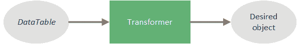

# 黄瓜数据表

> 原文:[https://web . archive . org/web/20220930061024/https://www . bael dung . com/cucumber-data-tables](https://web.archive.org/web/20220930061024/https://www.baeldung.com/cucumber-data-tables)

## 1.介绍

Cucumber 是一个行为驱动开发(BDD)框架，允许开发人员使用 Gherkin 语言创建基于文本的测试场景。在许多情况下，这些场景需要模拟数据来实现一个特性，这可能很难注入——特别是对于复杂或多个条目。

在本教程中，我们将了解如何使用 Cucumber 数据表以可读的方式包含模拟数据。

## 2.场景语法

当定义[黄瓜场景](/web/20220525133902/https://www.baeldung.com/cucumber-scenario-outline)时，我们通常会注入场景其余部分使用的测试数据:

```
Scenario: Correct non-zero number of books found by author
  Given I have the a book in the store called The Devil in the White City by Erik Larson
  When I search for books by author Erik Larson
  Then I find 1 book
```

### 2.1.数据表

虽然内联数据足以满足一本书的需求，但是当添加多本书时，我们的场景会变得混乱。为了处理这个问题，我们在我们的场景中创建了一个数据表:

```
Scenario: Correct non-zero number of books found by author
  Given I have the following books in the store
    | The Devil in the White City          | Erik Larson |
    | The Lion, the Witch and the Wardrobe | C.S. Lewis  |
    | In the Garden of Beasts              | Erik Larson |
  When I search for books by author Erik Larson
  Then I find 2 books
```

我们通过**在`Given`** **子句**的文本下缩进表格，将数据表定义为`Given`子句的一部分。使用这个数据表，我们可以通过添加或删除行来添加任意数量的书籍——只包括一本——到我们的存储中。

此外，**数据表可以与任何条款**一起使用，而不仅仅是`Given`条款。

### 2.2.包括标题

很明显，第一列代表书名，第二列代表作者。但是，每一列的含义并不总是那么明显。

当需要澄清时，**我们可以通过添加新的第一行**来包含标题:

```
Scenario: Correct non-zero number of books found by author
  Given I have the following books in the store
    | title                                | author      |
    | The Devil in the White City          | Erik Larson |
    | The Lion, the Witch and the Wardrobe | C.S. Lewis  |
    | In the Garden of Beasts              | Erik Larson |
  When I search for books by author Erik Larson
  Then I find 2 books
```

虽然标题看起来只是表中的另一行，**当我们在下一节将表解析为映射列表时，这第一行具有特殊的意义**。

## 3.步骤定义

创建场景后，我们实现`Given`步骤定义。在步骤包含数据表的情况下，**我们用`DataTable`参数**实现我们的方法:

```
@Given("some phrase")
public void somePhrase(DataTable table) {
    // ...
}
```

`DataTable`对象包含我们在场景中定义的数据表中的表格数据，以及将这些数据转换成可用信息的**方法**。一般来说，Cucumber 中的一个数据表有三种转换方式:(1)列表的列表，(2)映射的列表，(3)表转换器。

为了演示每种技术，我们将使用一个简单的`Book`域类:

```
public class Book {

    private String title;
    private String author;

    // standard constructors, getters & setters ...
}
```

此外，我们将创建一个管理`Book`对象的`BookStore`类:

```
public class BookStore {

    private List<Book> books = new ArrayList<>();

    public void addBook(Book book) {
        books.add(book);
    }

    public void addAllBooks(Collection<Book> books) {
        this.books.addAll(books);
    }

    public List<Book> booksByAuthor(String author) {
        return books.stream()
          .filter(book -> Objects.equals(author, book.getAuthor()))
          .collect(Collectors.toList());
    }
}
```

对于以下每个场景，我们将从基本的步骤定义开始:

```
public class BookStoreRunSteps {

    private BookStore store;
    private List<Book> foundBooks;

    @Before
    public void setUp() {
        store = new BookStore();
        foundBooks = new ArrayList<>();
    }

    // When & Then definitions ...
}
```

### 3.1.列表列表

处理表格数据最基本的方法是将 *DataTable* 参数转换成一系列列表。我们可以创建一个没有标题的表格来演示:

```
Scenario: Correct non-zero number of books found by author by list
  Given I have the following books in the store by list
    | The Devil in the White City          | Erik Larson |
    | The Lion, the Witch and the Wardrobe | C.S. Lewis  |
    | In the Garden of Beasts              | Erik Larson |
  When I search for books by author Erik Larson
  Then I find 2 books
```

Cucumber 通过将每一行视为列值的列表来将上面的表转换成列表的列表。因此，Cucumber 将每一行解析成一个列表，第一个元素是书名，第二个元素是作者:

```
[
    ["The Devil in the White City", "Erik Larson"],
    ["The Lion, the Witch and the Wardrobe", "C.S. Lewis"],
    ["In the Garden of Beasts", "Erik Larson"]
]
```

我们使用`asLists`方法——提供一个`String.class`参数——将`DataTable`参数转换为`List<List<String>>`。**这个** **`Class`** **参数通知`asLists`** **方法我们期望每个元素是什么数据类型**。在我们的例子中，我们希望标题和作者是`String`值。因此，我们提供`String.class`:

```
@Given("^I have the following books in the store by list$")
public void haveBooksInTheStoreByList(DataTable table) {

    List<List<String>> rows = table.asLists(String.class);

    for (List<String> columns : rows) {
        store.addBook(new Book(columns.get(0), columns.get(1)));
    }
}
```

然后我们遍历子列表的每个元素，并创建一个相应的`Book`对象。最后，我们将每个创建的`Book`对象添加到我们的`BookStore`对象中。

如果我们解析包含标题的数据，**我们将跳过第一行**,因为 Cucumber 不区分列表列表的标题和行数据。

### 3.2.地图列表

虽然列表的列表提供了从数据表中提取元素的基本机制，但是步骤实现可能是神秘的。Cucumber 提供了一个 maps 机制列表，作为可读性更好的替代方案。

在这种情况下，**我们必须为我们的表**提供一个标题:

```
Scenario: Correct non-zero number of books found by author by map
  Given I have the following books in the store by map
    | title                                | author      |
    | The Devil in the White City          | Erik Larson |
    | The Lion, the Witch and the Wardrobe | C.S. Lewis  |
    | In the Garden of Beasts              | Erik Larson |
  When I search for books by author Erik Larson
  Then I find 2 books
```

类似于列表的列表机制，Cucumber 创建了一个包含每一行的列表，但是**将列标题映射到每一列值**。Cucumber 对随后的每一行重复这个过程:

```
[
    {"title": "The Devil in the White City", "author": "Erik Larson"},
    {"title": "The Lion, the Witch and the Wardrobe", "author": "C.S. Lewis"},
    {"title": "In the Garden of Beasts", "author": "Erik Larson"}
]
```

我们使用`asMaps`方法——提供两个`String.class`参数——将`DataTable`参数转换为`List<Map<String, String>>`。**第一个参数表示键(标题)的数据类型，第二个参数表示每个列值的数据类型**。因此，我们提供两个`String.class`参数，因为我们的头(键)、标题和作者(值)都是`String`

然后我们迭代每个`Map`对象，并使用列标题作为键提取每个列值:

```
@Given("^I have the following books in the store by map$")
public void haveBooksInTheStoreByMap(DataTable table) {

    List<Map<String, String>> rows = table.asMaps(String.class, String.class);

    for (Map<String, String> columns : rows) {
        store.addBook(new Book(columns.get("title"), columns.get("author")));
    }
}
```

### 3.3.台式变压器

将数据表转换成可用对象的最后(也是最丰富的)机制是创建一个`TableTransformer`。一个 *TableTransformer* 是一个**对象，它指示 Cucumber 如何将一个`DataTable`对象转换成所需的域对象**:

[](/web/20220525133902/https://www.baeldung.com/wp-content/uploads/2019/11/TableTransformer.png)

让我们来看一个示例场景:

```
Scenario: Correct non-zero number of books found by author with transformer
  Given I have the following books in the store with transformer
    | title                                | author      |
    | The Devil in the White City          | Erik Larson |
    | The Lion, the Witch and the Wardrobe | C.S. Lewis  |
    | In the Garden of Beasts              | Erik Larson |
  When I search for books by author Erik Larson
  Then I find 2 books
```

虽然映射列表及其键控列数据比列表更精确，但我们仍然用转换逻辑来混淆步骤定义。相反，**我们应该用期望的域对象(在本例中是一个`BookCatalog`)作为参数**来定义我们的步骤:

```
@Given("^I have the following books in the store with transformer$")
public void haveBooksInTheStoreByTransformer(BookCatalog catalog) {
    store.addAllBooks(catalog.getBooks());
}
```

为此，**我们必须创建一个自定义的`TypeRegistryConfigurer`接口**的实现。

这个实现必须完成两件事:

1.  创建一个新的`TableTransformer`实现。
2.  使用`configureTypeRegistry`方法注册这个新的实现。

为了将`DataTable`捕获到可用的域对象中，我们将创建一个`BookCatalog`类:

```
public class BookCatalog {

    private List<Book> books = new ArrayList<>();

    public void addBook(Book book) {
        books.add(book);
    }

    // standard getter ...
}
```

为了执行转换，让我们实现`TypeRegistryConfigurer`接口:

```
public class BookStoreRegistryConfigurer implements TypeRegistryConfigurer {

    @Override
    public Locale locale() {
        return Locale.ENGLISH;
    }

    @Override
    public void configureTypeRegistry(TypeRegistry typeRegistry) {
        typeRegistry.defineDataTableType(
          new DataTableType(BookCatalog.class, new BookTableTransformer())
        );
    }

   //...
```

然后为我们的`BookCatalog`类实现`TableTransformer`接口:

```
 private static class BookTableTransformer implements TableTransformer<BookCatalog> {

        @Override
        public BookCatalog transform(DataTable table) throws Throwable {

            BookCatalog catalog = new BookCatalog();

            table.cells()
              .stream()
              .skip(1)        // Skip header row
              .map(fields -> new Book(fields.get(0), fields.get(1)))
              .forEach(catalog::addBook);

            return catalog;
        }
    }
}
```

注意，我们正在从表中转换英语数据，因此，我们从我们的`locale()`方法返回英语地区。当解析不同地区的数据时，我们必须**将`locale()`方法的返回类型更改为适当的地区**。

因为我们在场景中包含了一个数据表标题，**，所以我们在遍历表格单元格**时必须跳过第一行(因此有了`skip(1)`调用)。如果我们的表不包含标题，我们将删除`skip(1)`调用。

默认情况下，与一个测试相关的**粘合代码被假定在与 runner 类** 相同的[包中。因此，如果我们将`BookStoreRegistryConfigurer`包含在与 runner 类相同的包中，就不需要额外的配置。如果我们将配置器添加到不同的包中，**我们必须明确地将该包包含在**](https://web.archive.org/web/20220525133902/https://cucumber.io/docs/cucumber/api/#junit) **[runner 类](/web/20220525133902/https://www.baeldung.com/cucumber-scenario-outline#3-a-runner-class)的`@CucumberOptions` `glue`字段**中。

## 4.结论

在本文中，我们研究了如何使用数据表定义带有表格数据的小黄瓜场景。此外，我们探索了实现消费 Cucumber 数据表的步骤定义的三种方法。

虽然列表列表和映射列表足以满足基本表的需求，但是表转换器提供了更丰富的机制，能够处理更复杂的数据。

本文的完整源代码可以在 GitHub 上找到[。](https://web.archive.org/web/20220525133902/https://github.com/eugenp/tutorials/tree/master/testing-modules/testing-libraries)