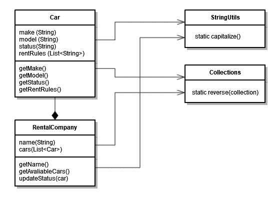

# Java 中静态方法的用例

> 原文:[https://web . archive . org/web/20220930061024/https://www . bael dung . com/Java-static-methods-use-cases](https://web.archive.org/web/20220930061024/https://www.baeldung.com/java-static-methods-use-cases)

## 1.概观

静态方法在大多数面向对象编程语言中都很常见，包括 Java。静态方法和实例方法的区别在于它们没有拥有它们的对象。相反，**静态方法是在类级别上定义的，可以在不创建实例**的情况下使用。

在本教程中，我们将看看 Java 中静态方法的定义，以及它们的局限性。然后，我们将查看使用静态方法的常见用例，并推荐何时在我们的代码中应用它们是有意义的。

最后，我们将看到如何测试静态方法以及如何模拟它们。

## 2.静态方法

实例方法基于对象的运行时类型进行多态解析。另一方面，**静态方法在编译时**根据定义它们的类来解析。

### 2.1.班级水平

Java 中的静态方法是类定义的一部分。我们可以通过给一个方法添加 [`static`](/web/20220810182131/https://www.baeldung.com/java-static) 关键字来定义一个静态方法:

```
private static int counter = 0;

public static int incrementCounter() {
    return ++counter;
}

public static int getCounterValue() {
    return counter;
}
```

为了访问静态方法，我们**使用类名后跟一个点和方法名**:

```
int oldValue = StaticCounter.getCounterValue();
int newValue = StaticCounter.incrementCounter();
assertThat(newValue).isEqualTo(oldValue + 1);
```

我们应该注意，这个静态方法可以访问`StaticCounter`类的静态状态。静态方法通常是无状态的，但是它们可以作为各种技术的一部分处理类级别的数据，包括[单例模式](/web/20220810182131/https://www.baeldung.com/java-singleton)。

虽然也可以使用对象引用静态方法，但是这种反模式通常会被工具标记为错误，例如 [Sonar](https://web.archive.org/web/20220810182131/https://rules.sonarsource.com/java/RSPEC-2209) 。

### 2.2.限制

由于**静态方法不对实例成员**进行操作，所以我们应该注意一些限制:

*   静态方法不能直接引用实例成员变量
*   静态方法不能直接调用实例方法
*   子类不能覆盖静态方法
*   我们不能在静态方法中使用关键字`this`和`super`

以上每种情况都会导致编译时错误。我们还应该注意，如果我们在子类中声明了一个同名的静态方法，它不会覆盖，而是隐藏基类方法。

## 3.用例

现在让我们看看在 Java 代码中应用静态方法有意义的常见用例。

### 3.1.标准行为

当我们**开发具有标准行为**的方法来操作它们的输入参数时，使用静态方法是有意义的。

Apache `StringUtils` 的`String`操作就是一个很好的例子:

```
String str = StringUtils.capitalize("baeldung");
assertThat(str).isEqualTo("Baeldung"); 
```

另一个很好的例子是`Collections` 类，因为它包含操作不同集合的公共方法:

```
List<String> list = Arrays.asList("1", "2", "3");
Collections.reverse(list);
assertThat(list).containsExactly("3", "2", "1");
```

### 3.2.跨实例重用

使用静态方法的一个有效原因是当我们在不同类的实例中重用标准行为时。

例如，我们通常在我们的领域和业务类中使用 Java `Collections` 和 Apache `StringUtils`:

[](/web/20220810182131/https://www.baeldung.com/wp-content/uploads/2022/07/utils_demo2.png)

由于这些功能没有自己的状态，也没有绑定到我们业务逻辑的特定部分，因此将它们放在一个可以共享的模块中是有意义的。

### 3.3.不改变状态

因为静态方法不能引用实例成员变量，所以它们是不需要任何对象状态操作的**方法的好选择。**

当我们对状态不受管理的操作使用静态方法时，方法调用更实用。调用方可以直接调用方法，而不必创建实例。

当我们通过类的所有实例共享状态时，就像在静态计数器的情况下，那么操作该状态的方法应该是静态的。管理全局状态可能是错误的来源，所以当实例方法直接写入静态字段时，Sonar 将报告一个[关键问题](https://web.archive.org/web/20220810182131/https://rules.sonarsource.com/java/RSPEC-2696)。

### 3.4.纯函数

如果一个函数的**返回值只依赖于传递的输入参数**，那么这个函数被称为纯函数。纯函数从它们的参数中获取所有数据，并从这些数据中计算出一些东西。

纯函数不对任何实例或静态变量进行操作。所以执行一个纯函数应该也是没有副作用的。

由于静态方法不允许覆盖和引用实例变量，所以它们是在 Java 中实现纯函数的最佳选择。

## 4.实用程序类别

由于 Java 没有专门的类型来容纳一组函数，所以我们经常创建一个实用程序类。实用程序类**为纯静态函数**提供了一个家。我们可以将在整个项目中重用的纯函数组合在一起，而不是一遍又一遍地编写相同的逻辑。

Java 中的实用程序类是一个无状态类，我们不应该实例化它。因此，建议将它声明为 [`final`](/web/20220810182131/https://www.baeldung.com/java-final) ，这样它就不能被子类化了(这样不会增加值)。此外，为了防止任何人试图实例化它，我们可以添加一个[私有构造函数](/web/20220810182131/https://www.baeldung.com/java-sonar-hide-implicit-constructor):

```
public final class CustomStringUtils {

    private CustomStringUtils() {
    }

    public static boolean isEmpty(CharSequence cs) { 
        return cs == null || cs.length() == 0; 
    }
}
```

我们应该注意，我们放在实用程序类中的所有方法都应该是`static`。

## 5.测试

让我们看看如何在 Java 中进行单元测试和模拟静态方法。

### 5.1.单元测试

用 [JUnit](/web/20220810182131/https://www.baeldung.com/junit-5) 对设计良好的纯静态方法进行单元测试非常简单。我们可以使用类名来调用我们的静态方法，并向它传递一些测试参数。

我们的被测单元将根据它的输入参数计算结果。因此，我们可以**对结果进行断言，并测试不同的输入输出组合**:

```
@Test
void givenNonEmptyString_whenIsEmptyMethodIsCalled_thenFalseIsReturned() {
    boolean empty = CustomStringUtils.isEmpty("baeldung");
    assertThat(empty).isFalse();
}
```

### 5.2.嘲弄的

大多数时候，**我们不需要模仿静态方法，**我们可以在测试中简单地使用真正的函数实现。模拟静态方法的需要通常暗示了代码设计问题。

如果必须的话，我们可以使用 [Mockito](/web/20220810182131/https://www.baeldung.com/mockito-mock-static-methods) 来模仿静态函数。但是，我们需要向 pom.xml 添加一个额外的 [`mockito-inline`](https://web.archive.org/web/20220810182131/https://search.maven.org/classic/#search%7Cga%7C1%7Cg%3Aorg.mockito%20a%3Amockito-inline) 依赖项:

```
<dependency>
    <groupId>org.mockito</groupId>
    <artifactId>mockito-inline</artifactId>
    <version>3.8.0</version>
    <scope>test</scope>
</dependency>
```

现在，我们可以使用`Mockito.mockStatic ` 方法来模拟对静态方法调用的调用:

```
try (MockedStatic<StringUtils> utilities = Mockito.mockStatic(StringUtils.class)) {
    utilities.when(() -> StringUtils.capitalize("karoq")).thenReturn("Karoq");

    Car car1 = new Car(1, "karoq");
    assertThat(car1.getModelCapitalized()).isEqualTo("Karoq");
}
```

## 6.结论

在本文中，**我们** **探索了在 Java 代码中使用静态方法的常见用例。**我们学习了 Java 中静态方法的定义，以及它们的局限性。

此外，我们还探索了在代码中使用静态方法的意义。我们看到，对于具有标准行为的纯函数，静态方法是一个很好的选择，这些纯函数可以跨实例重用，但不会改变它们的状态。最后，我们看了如何测试和模拟静态方法。

和往常一样，完整的源代码可以在 GitHub 上找到[。](https://web.archive.org/web/20220810182131/https://github.com/eugenp/tutorials/tree/master/core-java-modules/core-java-function)