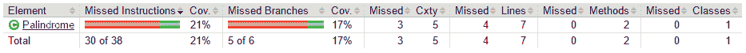
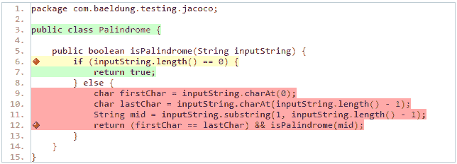
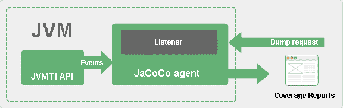
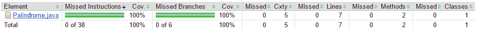
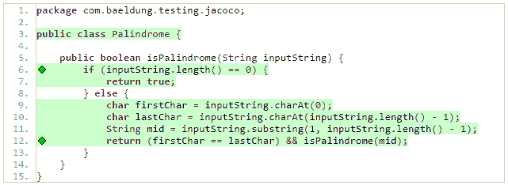

# JaCoCo 简介

> 原文：<https://web.archive.org/web/20220930061024/https://www.baeldung.com/jacoco>

## **1。概述**

**代码覆盖率**是[一个软件度量](/web/20220826045615/https://www.baeldung.com/cs/code-coverage)用来测量在自动化测试中我们的代码有多少行被执行。

在本教程中，我们将浏览使用 **JaCoCo，【Java 项目的代码覆盖报告生成器的一些实际方面。**

## 延伸阅读:

## [sonar cube 和 JaCoCo 的代码覆盖率](/web/20220826045615/https://www.baeldung.com/sonarqube-jacoco-code-coverage)

A guide to measuring code coverage using SonarQube and JaCoCo.[Read more](/web/20220826045615/https://www.baeldung.com/sonarqube-jacoco-code-coverage) →

## [从 Jacoco 报告中排除的内容](/web/20220826045615/https://www.baeldung.com/jacoco-report-exclude)

Learn how to exclude files from test coverage reports in Jacoco[Read more](/web/20220826045615/https://www.baeldung.com/jacoco-report-exclude) →

## Java 中单元测试的最佳实践

Learn about best practices for unit testing in Java.[Read more](/web/20220826045615/https://www.baeldung.com/java-unit-testing-best-practices) →

## **2。Maven 配置**

为了启动并运行 JaCoCo，我们需要在我们的`pom.xml`文件中声明这个 [maven 插件](https://web.archive.org/web/20220826045615/https://search.maven.org/classic/#search%7Cga%7C1%7Cg%3A%22org.jacoco%22%20AND%20a%3A%22jacoco-maven-plugin%22):

[PRE0]

这里提供的链接总是指向 maven 中央存储库中最新版本的插件。

## **3。代码覆盖率报告**

在我们开始研究 JaCoCo 的代码覆盖能力之前，我们需要有一个代码样本。下面是一个简单的 Java 函数，它检查一个字符串是否前后读得一样:

[PRE1]

现在我们只需要一个简单的测试:

[PRE2]

使用 JUnit 运行测试将自动启动 JaCoCo 代理。它将在目标目录 *target/jacoco.exec.* 中创建一个**二进制格式**的覆盖报告

显然我们不能单独解释输出，但其他工具和插件可以，例如 **[声纳 Qube](https://web.archive.org/web/20220826045615/https://docs.sonarqube.org/latest/analysis/coverage/)** 。

好消息是我们可以使用`jacoco:report`目标来生成几种格式的可读代码覆盖报告，比如 HTML、CSV 和 XML。

例如，现在我们可以看看`target/site/jacoco/index.html`页面，看看生成的报告是什么样子的:

按照报告中提供的链接 **`Palindrome.java`** ，我们可以钻取每个 Java 类的更详细视图:

请注意，由于有了[eclema Eclipse 插件](https://web.archive.org/web/20220826045615/http://www.eclemma.org/installation.html)，我们可以在 Eclipse 中使用 JaCoCo，用**零配置**直接管理代码覆盖率。

## **4。报告分析**

我们的报告显示 21%的指令覆盖率，17%的分支覆盖率，**圈复杂度的 3/5，**等等。

JaCoCo 在报告中显示的 38 条指令指的是**字节码指令，**与普通 Java 代码指令相对。

JaCoCo 报告通过使用带有颜色的菱形作为分支，使用背景色作为线条，帮助我们直观地分析代码覆盖率:

*   **红色菱形**表示在测试阶段没有执行任何分支。
*   **黄色菱形**表示代码被部分覆盖——一些分支尚未执行。
*   **绿色菱形**表示在测试过程中所有分支都得到了锻炼。

相同的颜色代码适用于背景色，但适用于线条覆盖。

JaCoCo 主要提供了三个重要的指标:

*   **行覆盖率**反映了基于测试所调用的 Java 字节码指令的数量而被执行的代码量。
*   **分支覆盖率**显示代码中被执行分支的百分比，通常与`if/else`和`switch`语句相关。
*   **圈复杂度**通过线性组合给出覆盖一个代码中所有可能路径所需的路径数，从而反映代码的复杂度。

举一个简单的例子，如果代码中没有`if`或`switch` 语句，圈复杂度将是 1，因为我们只需要一个执行路径来覆盖整个代码。

一般来说，圈复杂度反映了我们为了覆盖整个代码而需要实现的测试用例的数量。

## **5。概念分解**

JaCoCo 作为一个 Java 代理运行。它负责**在运行测试时插入字节码**。JaCoCo 深入每条指令，并显示在每次测试中使用了哪些行。

为了收集覆盖率数据，JaCoCo 使用 [ASM](https://web.archive.org/web/20220826045615/http://asm.ow2.org/) 进行动态代码插装，在这个过程中接收来自 [`JVM Tool Interface`](https://web.archive.org/web/20220826045615/https://docs.oracle.com/en/java/javase/11/docs/specs/jvmti.html) 的事件:

也可以在服务器模式下运行 JaCoCo 代理。在这种情况下，我们可以以`jacoco:dump`为目标运行我们的测试，以便发起一个转储请求。

我们可以通过[官方文档链接](https://web.archive.org/web/20220826045615/http://www.eclemma.org/jacoco/trunk/doc/implementation.html)了解更多关于 JaCoCo 设计的细节。

## **6。代码覆盖率得分**

现在我们已经了解了一点 JaCoCo 的工作原理，让我们来提高代码覆盖率。

为了实现 100%的代码覆盖率，我们需要引入测试来覆盖初始报告中显示的缺失部分:

[PRE3]

现在我们有足够的测试来覆盖我们的整个代码，但是为了确保这一点，让我们运行 Maven 命令`mvn jacoco:report`来发布覆盖率报告:

如我们所见，我们代码中的所有行/分支/路径都被完全覆盖了:

在现实世界的项目中，随着开发的深入，我们需要跟踪代码覆盖率得分。

JaCoCo 提供了一种简单的方法来声明应该满足的**最低需求**，否则构建将会失败。

我们可以通过在我们的`pom.xml`文件中添加以下`check`目标来做到这一点:

[PRE4]

如我们所见，我们将线条覆盖率的最低分数限制为 50%。

目标`jacoco:check`是将绑定到`verify`的**，因此我们可以运行 Maven 命令`mvn clean verify`来检查规则是否被遵守。日志将显示如下内容:**

[PRE5]

## 7 .**。结论**

在本文中，我们学习了如何利用 JaCoCo maven 插件为 Java 项目生成代码覆盖报告。

但是请记住， **100%的代码覆盖率并不一定反映有效的测试**，因为它只反映了测试期间执行的代码量。在之前的一篇文章中，我们谈到了 **[突变测试](/web/20220826045615/https://www.baeldung.com/java-mutation-testing-with-pitest)** ，与普通的**代码覆盖**相比，这是一种更复杂的跟踪测试有效性的方法。

本文提供的例子可以在 GitHub 项目 的 **[中找到。](https://web.archive.org/web/20220826045615/https://github.com/eugenp/tutorials/tree/master/testing-modules/testing-libraries)**