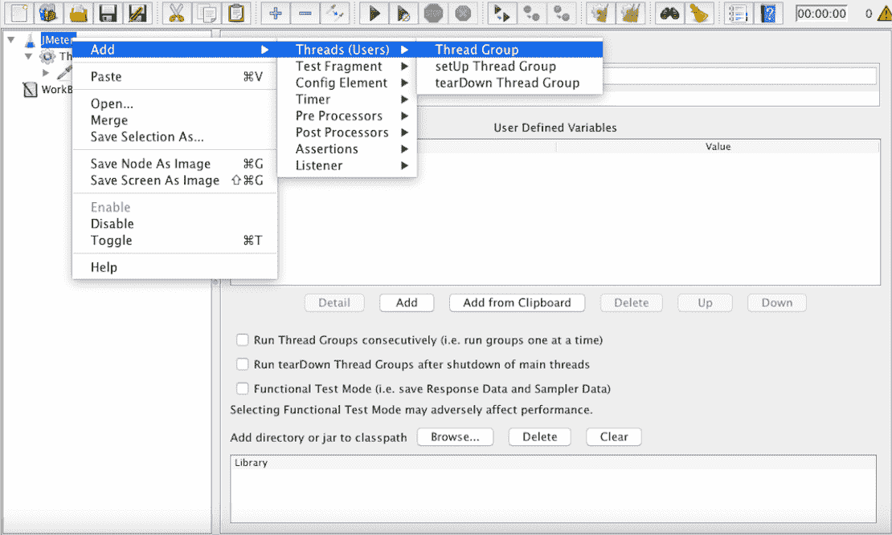
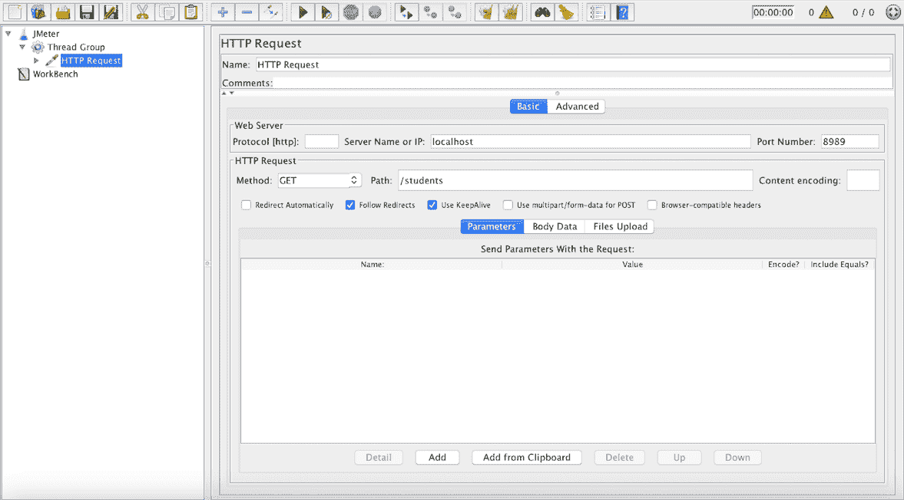
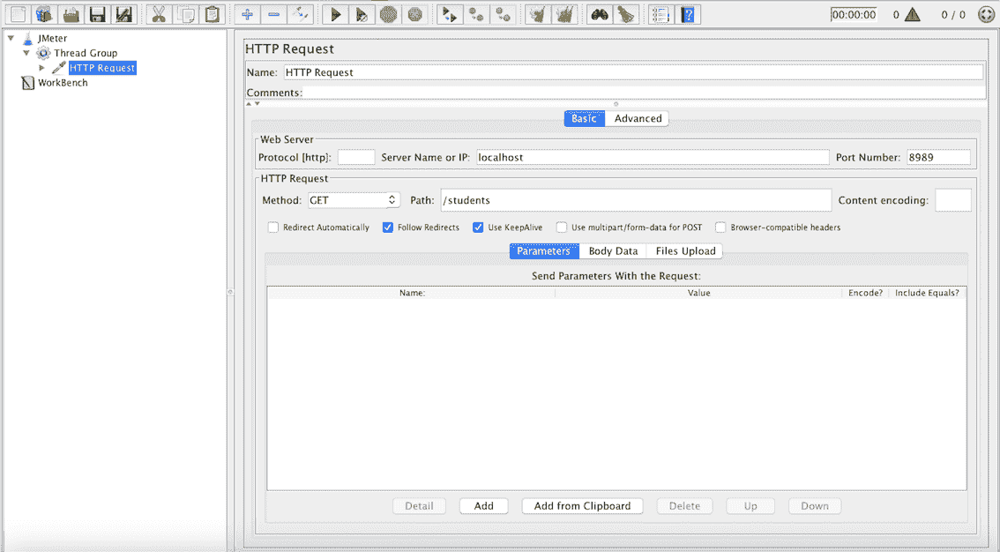
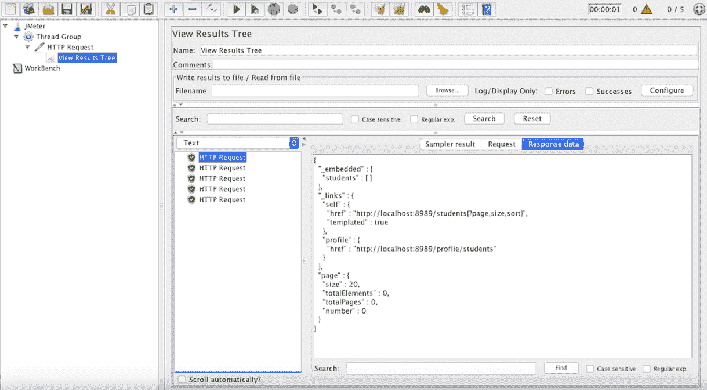
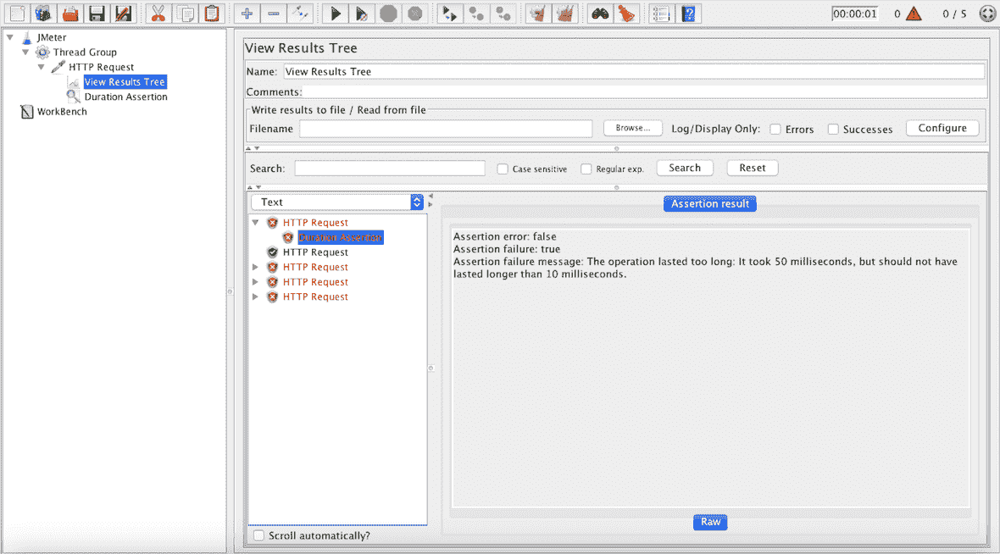
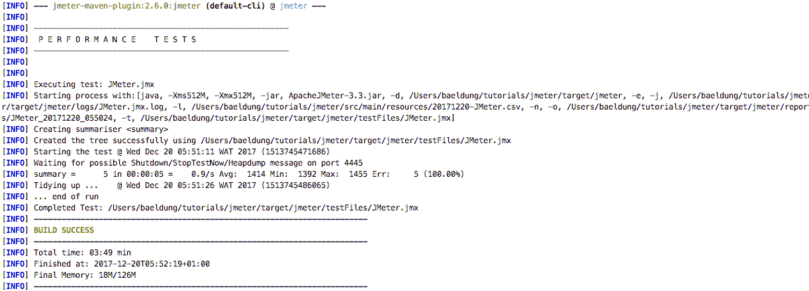

# 使用 JMeter 进行性能测试简介

> 原文：<https://web.archive.org/web/20220930061024/https://www.baeldung.com/jmeter>

## 1。概述

在本文中，我们将使用 [Apache JMeter](https://web.archive.org/web/20221126220853/https://jmeter.apache.org/) 来配置和运行性能测试。

## 2。设置 JMeter

让我们[下载 JMeter](https://web.archive.org/web/20221126220853/https://jmeter.apache.org/download_jmeter.cgi) ，将其解压缩，进入`bin`文件夹并运行可执行文件(* `.bat`用于 Windows，* `.sh`用于 Linux/Unix)。

接下来，我们只需要将这个文件夹添加到 path 环境变量中，这样就可以从命令行访问它了。

撰写本文时最稳定的版本是 3.3——我们可以在这里查看最新版本。

## 3。创建 JMeter 脚本

现在让我们编写第一个 JMeter 脚本(一个包含测试技术描述的文件)。

这个 API 是一个简单的 [SpringBoot](/web/20221126220853/https://www.baeldung.com/spring-boot-start) 应用程序，公开了一个 REST API。

先把`Test plan`那个更新一下，改个名字，再加个`Thread Group`。

一个`Thread Group`允许我们了解用户流，并模拟他们如何与应用程序交互，在 GUI 上右键单击我们的脚本名称，然后跟随所选菜单:

[](/web/20221126220853/https://www.baeldung.com/wp-content/uploads/2017/12/thread-group-menu-blur-1-1.png)

现在我们进入`Thread Group`的配置部分，在这里我们指定并行向我们的应用程序发出请求的用户数量:

[](/web/20221126220853/https://www.baeldung.com/wp-content/uploads/2017/12/create-thread-group-blur.png)

这里，我们指定了如下参数:

**–**`Name:`我们要给线程组起的名字

–`The number of Threads (users)`:并行用户的数量

–`Ramp-up time`:从 0 到申报用户数所需的时间

–`Loop count`:重复次数

添加一个`HTTP Request`,因为它是我们将模拟为来自 5 个用户中的每一个的。

让我们填写信息，以处理上面描述的 API，如下图所示:

[](/web/20221126220853/https://www.baeldung.com/wp-content/uploads/2017/12/http-request-blur.png)

我们只需填写网址、端口和具体路径。

接下来，让我们在添加了一个`View Results Tree` (如果结果是一个记录列表，则使用`View Results in Table`)之后，通过跟随菜单`Add > Listener”`来模拟用户的请求。

点击顶部的绿色右箭头按钮运行测试并查看响应数据:

[](/web/20221126220853/https://www.baeldung.com/wp-content/uploads/2017/12/http-request-view-result-blur.png)

我们可以在`Sampler result`选项卡上看到更详细的响应表示。

让我们在`HTTP Request`中添加一个`Duration Assertion`作为结束，这样持续时间超过 10 毫秒的每个请求都将被视为失败的测试:

[](/web/20221126220853/https://www.baeldung.com/wp-content/uploads/2017/12/duration-assertion-blur.png)

重新运行测试后，我们看到有些(这里是 3 个)用户无法在不到 10 毫秒的时间内获得学生列表:

[](/web/20221126220853/https://www.baeldung.com/wp-content/uploads/2017/12/duration-assertion-failed-blur.png)

现在，让我们将扩展名为`.jmx`的测试保存在 API 的 resource 文件夹中。

更多的元素可用于配置我们的测试文件:

*   [JDBC 请求](https://web.archive.org/web/20221126220853/https://jmeter.apache.org/usermanual/component_reference.html#JDBC_Request):向数据库发送 JDBC 请求(SQL 查询)很有用，在使用它之前我们需要设置一个 [JDBC 连接配置](https://web.archive.org/web/20221126220853/https://jmeter.apache.org/usermanual/component_reference.html#JDBC_Connection_Configuration)元素
*   [XML 断言](https://web.archive.org/web/20221126220853/https://jmeter.apache.org/usermanual/component_reference.html#XML_Assertion):测试响应数据是否是正确的 XML 文档
*   [大小断言](https://web.archive.org/web/20221126220853/https://jmeter.apache.org/usermanual/component_reference.html#Size_Assertion):断言响应中包含正确数量的字节
*   [JMS 发布者](https://web.archive.org/web/20221126220853/https://jmeter.apache.org/usermanual/component_reference.html#JMS_Publisher):按照 J2EE 消息传递规范向给定目标(主题/队列)发布消息

所有可用组件在[用户手册](https://web.archive.org/web/20221126220853/https://jmeter.apache.org/usermanual/component_reference.html)中有详细说明。

## 4。运行 JMeter 测试

运行 JMeter 测试有两种方法，一种是使用可用的 Maven 插件，另一种是在非 GUI 模式下使用独立的 JMeter 应用程序。

在任何情况下，两者都需要知道在哪里可以找到我们之前配置的 JMeter 脚本。

### 4.1。JMeter Maven 插件

是一个 Maven 插件，它将运行 JMeter 测试的工具作为我们构建的一部分；他现在的最新版本是 2.6.0 版,与 Apache JMeter 3.3 兼容。

让我们将它添加到我们项目的`pom.xml` 中:

```
<plugin>
    <groupId>com.lazerycode.jmeter</groupId>
    <artifactId>jmeter-maven-plugin</artifactId>
    <version>2.6.0</version>
    <executions>
        <execution>
            <id>jmeter-tests</id>
            <goals>
                <goal>jmeter</goal>
            </goals>
        </execution>
    </executions>
    <configuration>
        <testFilesDirectory>${project.basedir}/src/main/resources</testFilesDirectory>
        <resultsDirectory>${project.basedir}/src/main/resources</resultsDirectory>
    </configuration>
</plugin>
```

在这之后，我们可以用`mvn verify` 运行所有的测试，或者只用`mvn jmeter:jmeter`运行 JMeter 测试；以下是该命令的控制台输出:

[](/web/20221126220853/https://www.baeldung.com/wp-content/uploads/2017/12/run-jemeter-log.png)

注意:这里我们指定了我们的测试在项目中所处的目录，或者选择默认的目录(`${project.basedir}/src/test/jmeter`)；同样配置结果目录，否则默认目录为`${project.basedir}/target/jmeter/results`。

完整的插件文档可以从[这里](https://web.archive.org/web/20221126220853/https://github.com/jmeter-maven-plugin/jmeter-maven-plugin/wiki)获得。

### 4.2。非图形用户界面模式

另一种方法是通过 JMeter 可执行文件，假设它可以通过命令行使用，我们可以这样做:

`jmeter -Jjmeter.save.saveservice.output_format=xml`

`-n -t src/main/resources/JMeter.jmx -l src/main/resources/JMeter.jtl`

我们将 XML 设置为输出格式，它填充了测试文件和结果文件。

**注意:建议不要使用 GUI 模式进行负载测试，仅用于测试创建和测试调试。**

## 5。结论

在这个快速教程中，我们在 SpringBoot 应用程序上设置了 Apache JMeter，使用 Maven 插件运行性能测试，同时实际研究如何设计一个基本的性能测试。

和往常一样，这篇文章的源代码可以在 GitHub 上找到[。](https://web.archive.org/web/20221126220853/https://github.com/eugenp/tutorials/tree/master/jmeter)