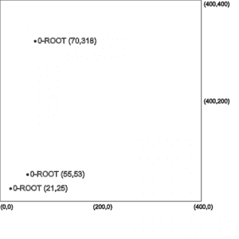
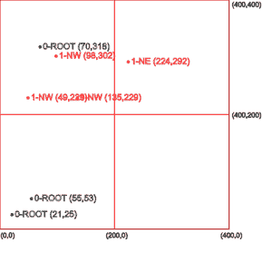
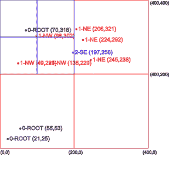

# Java 中的范围搜索算法

> 原文:[https://web . archive . org/web/20220930061024/https://www . bael dung . com/Java-range-search](https://web.archive.org/web/20220930061024/https://www.baeldung.com/java-range-search)

## 1.概观

在本教程中，我们将探索在二维空间中搜索邻居**的概念。然后，我们将浏览它在 Java 中的实现。**

## 2.一维搜索与二维搜索

我们知道[二分搜索法](/web/20220730070107/https://www.baeldung.com/java-binary-search)是一种有效的算法，它使用分治法在一系列项目中找到精确匹配。

现在让我们**考虑一个二维区域，其中每个项目由平面**中的 XY 坐标(点)表示。

然而，假设我们想要找到平面中给定点的邻居，而不是精确匹配。很明显，**如果我们想要最接近的`n`匹配，那么二分搜索法将不会工作**。这是因为二分搜索法只能在一个轴上比较两个项目，而我们需要能够在两个轴上比较它们。

在下一节中，我们将研究二叉树数据结构的一种替代方法。

## 3.四叉树

四叉树是一种空间树数据结构，其中每个节点正好有四个子节点。每个子树可以是一个点，也可以是一个包含四个子四叉树的列表。

一个`point` 存储数据——例如，XY 坐标。一个`region` 代表一个封闭的边界，在这个边界内可以存储一个点。它用于定义四叉树的可达区域。

让我们以任意顺序的 10 个坐标为例来更好地理解这一点:

```
(21,25), (55,53), (70,318), (98,302), (49,229), (135,229), (224,292), (206,321), (197,258), (245,238)
```

前三个值将作为点存储在根节点下，如最左边的图片所示。

[](/web/20220730070107/https://www.baeldung.com/wp-content/uploads/2019/12/quadtree1-300x300-1.png)[](/web/20220730070107/https://www.baeldung.com/wp-content/uploads/2019/12/quadtree2-300x300-1.png)[](/web/20220730070107/https://www.baeldung.com/wp-content/uploads/2019/12/quadtree3-300x300-1.png)

根节点现在不能容纳新的点，因为它已经达到其三个点的容量。因此，我们将**把根节点的区域分成四个相等的象限**。

这些象限中的每一个都可以存储三个点，并且在其边界内还包含四个象限。这可以递归地完成，产生一个象限树，这就是四叉树数据结构得名的原因。

在上面中间的图片中，我们可以看到从根节点创建的象限，以及接下来的四个点如何存储在这些象限中。

最后，最右边的图片显示了如何再次细分一个象限以容纳该区域中的更多点，而其他象限仍然可以接受新点。

我们现在来看看如何用 Java 实现这个算法。

## 4.数据结构

让我们创建一个四叉树数据结构。我们需要三个域类。

首先，我们将创建一个 **`Point`类来存储 XY 坐标**:

```
public class Point {
    private float x;
    private float y;

    public Point(float x, float y) {
        this.x = x;
        this.y = y;
    }

    // getters & toString()
}
```

其次，让我们创建一个 **`Region`类来定义象限**的边界:

```
public class Region {
    private float x1;
    private float y1;
    private float x2;
    private float y2;

    public Region(float x1, float y1, float x2, float y2) {
        this.x1 = x1;
        this.y1 = y1;
        this.x2 = x2;
        this.y2 = y2;
    }

    // getters & toString()
}
```

最后，让我们用一个 **`QuadTree`类将数据存储为`Point`实例，将孩子存储为`QuadTree`类**:

```
public class QuadTree {
    private static final int MAX_POINTS = 3;
    private Region area;
    private List<Point> points = new ArrayList<>();
    private List<QuadTree> quadTrees = new ArrayList<>();

    public QuadTree(Region area) {
        this.area = area;
    }
}
```

为了实例化一个`QuadTree`对象，我们通过构造函数使用`Region`类指定它的`area`。

## 5.算法

在我们编写存储数据的核心逻辑之前，让我们添加几个助手方法。这些以后会证明是有用的。

### 5.1.助手方法

让我们修改一下我们的`Region`类。

首先，让我们用方法`containsPoint`到**来表示给定的`point`是落在`region's`区域**之内还是之外:

```
public boolean containsPoint(Point point) {
    return point.getX() >= this.x1 
        && point.getX() < this.x2 
        && point.getY() >= this.y1 
        && point.getY() < this.y2;
}
```

接下来，让我们用方法`doesOverlap`到**来表示给定的`region`是否与另一个`region`** 重叠:

```
public boolean doesOverlap(Region testRegion) {
    if (testRegion.getX2() < this.getX1()) {
        return false;
    }
    if (testRegion.getX1() > this.getX2()) {
        return false;
    }
    if (testRegion.getY1() > this.getY2()) {
        return false;
    }
    if (testRegion.getY2() < this.getY1()) {
        return false;
    }
    return true;
}
```

最后，让我们创建一个方法`getQuadrant`到**将一个范围分成四个相等的象限**并返回一个指定的象限:

```
public Region getQuadrant(int quadrantIndex) {
    float quadrantWidth = (this.x2 - this.x1) / 2;
    float quadrantHeight = (this.y2 - this.y1) / 2;

    // 0=SW, 1=NW, 2=NE, 3=SE
    switch (quadrantIndex) {
    case 0:
        return new Region(x1, y1, x1 + quadrantWidth, y1 + quadrantHeight);
    case 1:
        return new Region(x1, y1 + quadrantHeight, x1 + quadrantWidth, y2);
    case 2:
        return new Region(x1 + quadrantWidth, y1 + quadrantHeight, x2, y2);
    case 3:
        return new Region(x1 + quadrantWidth, y1, x2, y1 + quadrantHeight);
    }
    return null;
}
```

### 5.2.存储数据

我们现在可以编写逻辑来存储数据。让我们首先在`QuadTree`类上定义一个新方法`addPoint`来添加一个新的`point.`，如果成功添加了一个点，该方法将返回`true`:

```
public boolean addPoint(Point point) {
    // ...
}
```

接下来，让我们编写处理该点的逻辑。首先，我们需要检查该点是否包含在`QuadTree`实例的边界内。我们还需要确保`QuadTree`实例没有达到`MAX_POINTS`点的容量。

如果两个条件都满足，我们可以添加新的点:

```
if (this.area.containsPoint(point)) {
    if (this.points.size() < MAX_POINTS) {
        this.points.add(point);
        return true;
    }
}
```

另一方面，**如果我们已经达到了`MAX_POINTS`值，那么我们需要将新的`point`添加到子象限**之一。为此，我们遍历子`quadTrees`列表并调用相同的`addPoint`方法，该方法将在成功添加时返回一个`true`值。然后我们立即退出循环，因为**一个点需要被精确地添加到一个象限**。

我们可以将所有这些逻辑封装在一个助手方法中:

```
private boolean addPointToOneQuadrant(Point point) {
    boolean isPointAdded;
    for (int i = 0; i < 4; i++) {
        isPointAdded = this.quadTrees.get(i)
            .addPoint(point);
        if (isPointAdded)
            return true;
    }
    return false;
}
```

另外，让我们用一个简便的方法`createQuadrants`将当前的四叉树细分成四个象限:

```
private void createQuadrants() {
    Region region;
    for (int i = 0; i < 4; i++) {
        region = this.area.getQuadrant(i);
        quadTrees.add(new QuadTree(region));
    }
}
```

只有当我们不再能够添加任何新的点时，我们才会调用这个方法**来创建象限。这确保了我们的数据结构使用最佳的内存空间。**

综上所述，我们得到了更新的`addPoint`方法:

```
public boolean addPoint(Point point) {
    if (this.area.containsPoint(point)) {
        if (this.points.size() < MAX_POINTS) {
            this.points.add(point);
            return true;
        } else {
            if (this.quadTrees.size() == 0) {
                createQuadrants();
            }
            return addPointToOneQuadrant(point);
        }
    }
    return false;
}
```

### 5.3.搜索数据

定义了存储数据的四叉树结构后，我们现在可以考虑执行搜索的逻辑了。

当我们寻找相邻的物品时，我们可以**指定一个`searchRegion`作为起点**。然后，我们检查它是否与根区域重叠。如果是的话，那么我们添加所有落在`searchRegion`内的子点。

在根区域之后，我们进入每个象限并重复这个过程。这种情况一直持续到我们到达树的末端。

让我们把上面的逻辑写成一个递归方法放在`QuadTree`类中:

```
public List<Point> search(Region searchRegion, List<Point> matches) {
    if (matches == null) {
        matches = new ArrayList<Point>();
    }
    if (!this.area.doesOverlap(searchRegion)) {
        return matches;
    } else {
        for (Point point : points) {
            if (searchRegion.containsPoint(point)) {
                matches.add(point);
            }
        }
        if (this.quadTrees.size() > 0) {
            for (int i = 0; i < 4; i++) {
                quadTrees.get(i)
                    .search(searchRegion, matches);
            }
        }
    }
    return matches;
}
```

## 6.测试

现在我们已经有了算法，让我们测试它。

### 6.1.填充数据

首先，让我们用之前使用的相同的 10 个坐标填充四叉树:

```
Region area = new Region(0, 0, 400, 400);
QuadTree quadTree = new QuadTree(area);

float[][] points = new float[][] { { 21, 25 }, { 55, 53 }, { 70, 318 }, { 98, 302 }, 
    { 49, 229 }, { 135, 229 }, { 224, 292 }, { 206, 321 }, { 197, 258 }, { 245, 238 } };

for (int i = 0; i < points.length; i++) {
    Point point = new Point(points[i][0], points[i][1]);
        quadTree.addPoint(point);
}
```

### 6.2.范围搜索

接下来，让我们在由下限坐标(200，200)和上限坐标(250，250)包围的区域中执行范围搜索:

```
Region searchArea = new Region(200, 200, 250, 250);
List<Point> result = quadTree.search(searchArea, null);
```

运行代码会给我们一个包含在搜索区域内的附近坐标:

```
[[245.0 , 238.0]]
```

让我们尝试坐标(0，0)和(100，100)之间的不同搜索区域:

```
Region searchArea = new Region(0, 0, 100, 100);
List<Point> result = quadTree.search(searchArea, null);
```

运行代码会给我们指定搜索区域附近的两个坐标:

```
[[21.0 , 25.0], [55.0 , 53.0]]
```

我们观察到，根据搜索区域的大小，我们可以得到零个、一个或多个点。因此，**如果给我们一个点，并要求我们找到最近的`n`邻居，我们可以定义一个合适的搜索区域，其中给定点位于中心**。

然后，从搜索操作的所有结果点中，我们可以**计算给定点之间的欧几里德距离，并对它们进行排序以获得最近的邻居**。

## 7.时间复杂度

范围查询的时间复杂度简单来说就是`O(n)`。原因是，在最坏的情况下，如果指定的搜索区域等于或大于填充区域，它必须遍历每个项目。

## 8.结论

在本文中，我们首先通过比较四叉树和二叉树来理解四叉树的概念。接下来，我们看到了如何有效地使用它来存储分布在二维空间中的数据。

然后，我们看到了如何存储数据和执行范围搜索。

和往常一样，带有测试的源代码可以在 GitHub 的[上找到。](https://web.archive.org/web/20220730070107/https://github.com/eugenp/tutorials/tree/master/algorithms-modules/algorithms-searching)