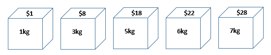
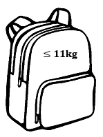
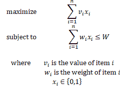
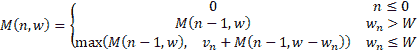

# 背包问题的 Java 实现

> 原文：<https://web.archive.org/web/20220930061024/https://www.baeldung.com/java-knapsack>

## 1.介绍

背包问题是一个有许多应用的组合优化问题。在本教程中，我们将用 Java 解决这个问题。

## 2.背包问题

在背包问题中，我们有一组项目。每件物品都有重量和价值:

我们想把这些东西放进背包里。但是，它有重量限制:

**因此，我们需要选择总重量不超过重量限制的物品，并且它们的总价值尽可能高。**例如，上例的最佳解决方案是选择 5 公斤和 6 公斤的物品，这样在重量限制内最大值为 40 美元。

背包问题有几种变体。在本教程中，我们将重点讨论 0-1 背包问题。**在 0-1 背包问题中，每个物品要么被选择，要么被留下。我们不能接受部分数量的商品。此外，我们不能拿一个项目多次。**

## 3.数学定义

现在让我们用数学符号来形式化 0-1 背包问题。给定一组`n`物品和重量限制`W`，我们可以将优化问题定义为:

这个问题是 NP 难的。因此，目前没有多项式时间算法来求解。但是，对于这个问题，有一个使用动态规划的[伪多项式时间算法](https://web.archive.org/web/20221129214352/https://en.wikipedia.org/wiki/Pseudo-polynomial_time)。

## 4.递归解

我们可以用一个递归公式来解决这个问题:

在这个公式中，`M(n,w)`是有重量限制`w`的`n`项的最优解。它是以下两个值中的最大值:

*   重量限制为`w`的 `(n-1)`项中的最优解(不包括第`n`项)
*   第`n`项的值加上第 `(n-1)`项的最优解和第`w`减去第`n`项(包括第`n`项)的权重

如果第`n`项的重量超过当前的重量限制，我们不包括它。因此，它属于上述两种情况的第一类。

我们可以用 Java 实现这个递归公式:

[PRE0]

在每个递归步骤中，我们需要评估两个次优解。因此，这个递归解的运行时间是`O(2^n).`

## 5.动态规划解决方案

动态规划是一种将原本指数级困难的规划问题线性化的策略。这个想法是存储子问题的结果，这样我们以后就不必重新计算它们了。

我们也可以用动态规划来解决 0-1 背包问题。为了使用动态编程，我们首先创建一个二维表，维度从 0 到`n`和 0 到`W`。然后，我们使用自下而上的方法通过下表计算最优解:

[PRE1]

在这个解决方案中，我们在商品编号`n` 和重量限制`W`上有一个嵌套循环。因此，它的运行时间是`O(nW)`。

## 6.结论

在本教程中，我们展示了 0-1 背包问题的数学定义。然后我们用 Java 实现提供了这个问题的递归解决方案。最后，我们使用动态规划来解决这个问题。

和往常一样，这篇文章的源代码可以在 GitHub 的[上找到。](https://web.archive.org/web/20221129214352/https://github.com/eugenp/tutorials/tree/master/algorithms-modules/algorithms-miscellaneous-5)