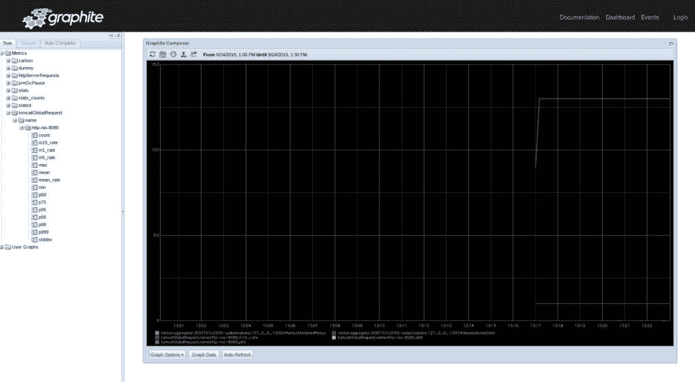
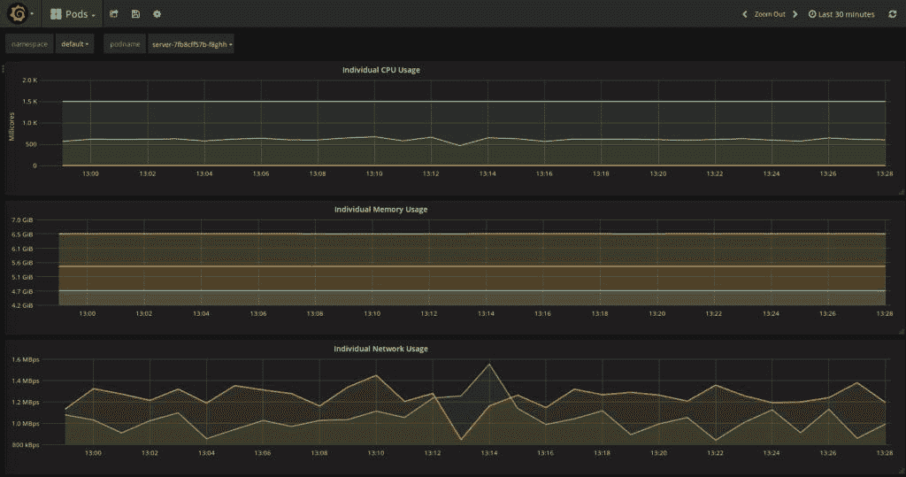

# Spring Boot 应用程序的自托管监控

> 原文：<https://web.archive.org/web/20220930061024/https://www.baeldung.com/spring-boot-self-hosted-monitoring>

## 1.介绍

Spring Boot 的许多伟大特征之一是内置的[致动器](/web/20220524022349/https://www.baeldung.com/spring-boot-actuators)。这些执行器提供了一种简单的方法来监控和控制 Spring Boot 应用的方方面面。

在本教程中，我们将了解如何使用[指标执行器](https://web.archive.org/web/20220524022349/https://docs.spring.io/spring-boot/docs/current/reference/html/production-ready-metrics.html)为 Spring Boot 应用程序创建自托管监控解决方案。

## 2.度量数据库

**监控 Spring Boot 应用程序的第一步是选择一个指标数据库**。默认情况下，Spring Boot 将在每个应用程序中配置一个[千分尺](https://web.archive.org/web/20220524022349/https://micrometer.io/)度量注册表。

这个默认实现收集一组预定义的应用程序指标，如内存和 CPU 使用情况、HTTP 请求和其他一些指标。但是**这些指标只存储在内存中**，这意味着它们会在应用程序重启时丢失。

要创建一个自托管的监控解决方案，我们应该首先选择一个位于 Spring Boot 应用程序之外的度量数据库。以下部分将讨论几种可用的自托管选项。

注意，每当 Spring Boot 在类路径上检测到另一个度量数据库时，它会自动禁用内存中的注册表。

### 2.1.InfluxDB

[InfluxDB](https://web.archive.org/web/20220524022349/https://www.influxdata.com/products/influxdb-overview/) 是一个开源的时间序列数据库。开始使用 InfluxDB 的最快方法是在本地将其作为 Docker 容器运行:

[PRE0]

请注意，这将在本地`/tmp`分区中存储指标。这对于开发和测试来说很好，但是对于生产环境来说不是一个好的选择。

一旦 InfluxDB 开始运行，**我们可以通过添加[适当的千分尺依赖项](https://web.archive.org/web/20220524022349/https://search.maven.org/search?q=g:io.micrometer%20a:micrometer-registry-influx)** 来配置我们的 Spring Boot 应用程序向其发布指标:

[PRE1]

此外，我们需要向`application.properties`文件添加一个新条目:

[PRE2]

开箱即用时，数据库名称被设置为`mydb`，而用户名和密码保持不变。

但是，我们可以使用专用属性覆盖默认值:

[PRE3]

**InfluxDB 没有提供原生可视化工具**。然而，它提供了一个名为[计时](https://web.archive.org/web/20220524022349/https://docs.influxdata.com/chronograf/)的独立工具，可以很好地可视化 InfluxDB 数据。

### 2.2.普罗米修斯

Prometheus 是一个开源的监控和警报工具包，最初由 SoundCloud 开发。它的工作方式与 InfluxDB 略有不同。

我们没有配置我们的应用程序向 Prometheus 发布指标，**而是配置 Prometheus 定期轮询我们的应用程序**。

首先，我们配置我们的 Spring Boot 应用程序来公开一个新的 Prometheus 执行器端点。我们通过包含[千分尺-配准-普罗米修斯](https://web.archive.org/web/20220524022349/https://search.maven.org/search?q=g:io.micrometer%20a:micrometer-registry-prometheus)相关性来做到这一点:

[PRE4]

这将创建一个新的致动器端点，以 Prometheus 理解的特殊格式产生度量数据。

接下来，我们必须配置 Prometheus，通过将我们想要的配置添加到一个`prometheus.yml`文件中来轮询我们的应用程序。

以下配置指示 Prometheus 使用新的执行器端点每 5 秒轮询一次我们的应用程序:

[PRE5]

最后，我们可以使用 Docker 启动一个本地 Prometheus 服务器。这假设我们的定制配置文件位于本地文件`/etc/prometheus/prometheus.yml`中:

[PRE6]

Prometheus 提供了自己的可视化工具来查看收集的指标。可以通过网址`http://localhost:9090/.`访问

### 

### 2.3.石墨

[Graphite](https://web.archive.org/web/20220524022349/https://graphiteapp.org/) 是另一个开源的时间序列数据库。它的架构比我们看到的其他数据库稍微复杂一些，但是使用 Docker，在本地运行一个实例很简单:

[PRE7]

然后，我们可以通过添加[micrometer-registry-graphite](https://web.archive.org/web/20220524022349/https://search.maven.org/search?q=g:io.micrometer%20a:micrometer-registry-graphite)依赖项来配置 Spring Boot 向我们的实例发布指标:

[PRE8]

以及将配置属性添加到`application.properties`:

[PRE9]

和普罗米修斯一样，Graphite 也有自己的可视化仪表板。它可以在 URL `http://localhost/`获得。

## 3.可视化工具

一旦我们有了在 Spring Boot 应用程序之外存储指标的解决方案，**下一个决定就是我们希望如何可视化数据**。

前面提到的一些度量数据库包括它们自己的可视化工具。对于我们的自托管监控解决方案，有一个独立的可视化工具值得关注。

### 3.1.格拉夫纳

Grafana 是一个开源的分析和监控工具。**它可以连接到前面提到的所有数据库，以及许多其他数据库**。

Grafana 通常提供比大多数内置可视化工具更好的配置和更高级的警告。它可以很容易地使用插件进行扩展，并且有许多预先构建的仪表板可以导入来快速创建我们自己的可视化。

要在本地运行 Grafana，我们可以使用 Docker:

[PRE10]

我们现在可以通过 URL `http://localhost:3000/`访问 Grafana 主页。

**此时，我们需要配置一个或多个数据源**。这可以是前面讨论过的任何度量数据库，也可以是各种其他受支持的工具。

一旦配置了数据源，我们就可以构建一个新的仪表板，或者导入一个我们想要的仪表板。

## 4.结论

在本文中，我们研究了如何为 Spring Boot 应用程序创建一个自托管的监控解决方案。

我们查看了 Spring Boot 随时支持的三个度量数据库，并了解了如何在本地运行它们。

我们还简要地看了 Grafana，这是一个强大的可视化工具，可以显示来自各种来源的度量数据。