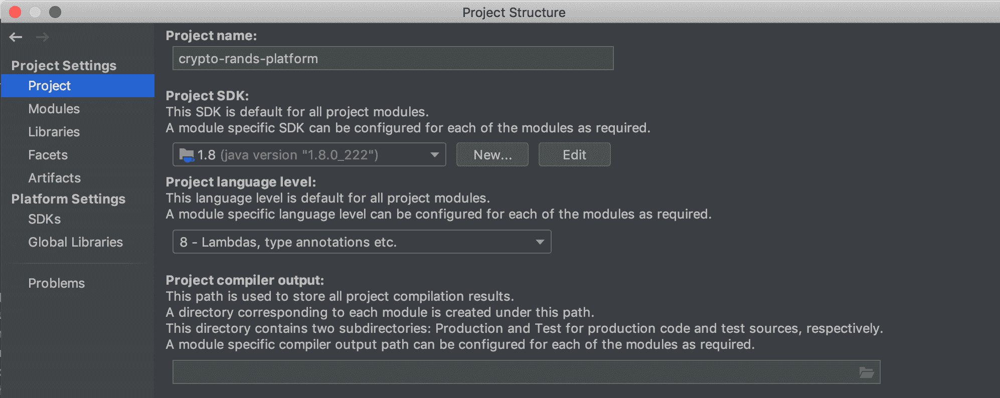

# 如何在 IntelliJ 项目中更改 Java 版本

> 原文:[https://web . archive . org/web/20220930061024/https://www . bael dung . com/intellij-change-Java-version](https://web.archive.org/web/20220930061024/https://www.baeldung.com/intellij-change-java-version)

## 1.概观

在本教程中，我们将学习如何在 IntelliJ 项目中**改变 JDK 版本。这将**在 IntelliJ 的社区版和终极版**上都有效。**

## 2.项目结构设置

IntelliJ 将项目使用的 JDK 版本存储在它的`Project Structure`中。有两种方法可以找到它:

*   通过**菜单导航**:
    *   导航至`File -> Project Structure`
*   通过**键盘快捷键**:
    *   对于 OSX，我们按`⌘ + ;`
    *   对于 Windows，我们按`Ctrl + Shift + Alt + S`

然后我们会看到一个弹出对话框，看起来像这样:

在`Project SDK`部分，我们将能够通过组合框**选择一个新的 JDK** 用于项目。在更新到 Java 的新版本之后，项目将开始重新索引它的源文件和库，以确保自动完成和其他 IDE 特性是同步的。

## 3.常见问题

当改变 JDK 时，我们需要记住**这只影响 IntelliJ** 使用的 JDK。因此，当通过命令行运行 Java 项目时，它仍然会使用在`JAVA_HOME `环境变量中指定的 JDK。

此外，更改**项目 SDK 不会更改所使用的构建工具**的 JVM 版本。所以当[在 IntelliJ 中使用 Maven](/web/20220718025227/https://www.baeldung.com/maven-java-version) 或 Gradle 时，改变项目 SDK 不会改变用于这些构建工具的 JVM。

## 4.结论

在本文中，我们举例说明了改变 IntelliJ 项目中使用的 Java 版本的两种方法。我们还强调了在更改 Java 版本时需要注意的注意事项。

要了解更多关于 IntelliJ 的`Project Structure,`信息，请访问官方[文档](https://web.archive.org/web/20220718025227/https://www.jetbrains.com/help/idea/project-page.html?keymap=primary_default_for_windows)。