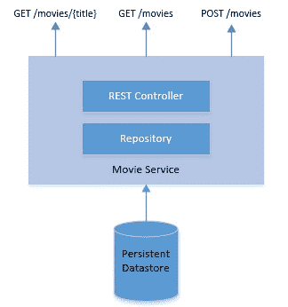

# Spring Boot 微服务中的十二因素方法

> 原文：<https://web.archive.org/web/20220930061024/https://www.baeldung.com/spring-boot-12-factor>

## 1.概观

在本教程中，我们将了解[十二因素 app 方法论](https://web.archive.org/web/20221206013430/https://12factor.net/)。

我们还将了解如何在 Spring Boot 的帮助下开发微服务。在这个过程中，我们将看到如何应用十二因素方法来开发这样的微服务。

## 2.什么是十二因素方法论？

**十二要素方法是一套开发应用程序的十二个最佳实践，这些应用程序是作为服务运行的**。这最初是 Heroku 在 2011 年为在云平台上部署为服务的应用程序起草的。随着时间的推移，这被证明对任何[软件即服务](https://web.archive.org/web/20221206013430/https://en.wikipedia.org/wiki/Software_as_a_service) (SaaS)开发都足够通用。

那么，我们所说的软件即服务是什么意思呢？传统上，我们设计、开发、部署和维护软件解决方案，以从中获取商业价值。但是，我们不一定要参与这个过程来达到同样的结果。例如，计算适用的税收是许多领域中的通用功能。

现在，我们可以决定自己构建和管理这项服务，或者**订阅商业服务产品**。这样的**服务产品就是我们所知的软件即服务**。

虽然软件即服务对开发它的架构没有任何限制；采用一些最佳实践是非常有用的。

如果我们设计的软件在现代云平台上是模块化的、可移植的和可扩展的，那么它很适合我们的服务产品。这就是十二因素方法论的作用所在。我们将在本教程的后面看到它们的运行。

## 3.Spring Boot 的微服务

微服务是一种将软件开发成松散耦合服务的架构风格。这里的关键需求是**服务应该围绕业务域边界**来组织。这通常是最难识别的部分。

此外，这里的服务对其数据拥有唯一的权限，并向其他服务公开操作。服务之间的通信通常通过轻量级协议，如 HTTP。这导致了可独立部署和可伸缩的服务。

现在，微服务架构和软件即服务互不依赖。但是，不难理解，当**开发软件即服务时，利用微服务架构是非常有益的**。它有助于实现我们之前讨论的许多目标，比如模块化和可伸缩性。

Spring Boot 是一个基于 Spring 的应用框架，它去掉了许多与开发企业应用相关的样板文件。它给了我们一个[非常固执己见](/web/20221206013430/https://www.baeldung.com/cs/opinionated-software-design)但是灵活的平台来开发微服务。在本教程中，我们将利用 Spring Boot 通过十二因素方法来提供微服务。

## 4.应用十二因素方法

现在让我们定义一个简单的应用程序，我们将尝试使用我们刚刚讨论过的工具和实践来开发它。我们都喜欢看电影，但跟踪我们已经看过的电影是一项挑战。

现在，谁愿意开始一部电影，然后后来又抛弃它？我们需要的是一个简单的服务来记录和查询我们已经看过的电影: [](/web/20221206013430/https://www.baeldung.com/wp-content/uploads/2019/09/12-factpr-app.jpg)

这是一个非常简单和标准的微服务，具有数据存储和 REST 端点。我们需要定义一个同样映射到持久性的模型:

```
@Entity
public class Movie {
    @Id
    private Long id;
    private String title;
    private String year;
    private String rating;
    // getters and setters
}
```

我们已经定义了一个带有 id 和一些其他属性的 JPA 实体。现在让我们看看 REST 控制器是什么样子的:

```
@RestController
public class MovieController {

    @Autowired
    private MovieRepository movieRepository;
    @GetMapping("/movies")
    public List<Movie> retrieveAllStudents() {
        return movieRepository.findAll();
    }

    @GetMapping("/movies/{id}")
    public Movie retrieveStudent(@PathVariable Long id) {
        return movieRepository.findById(id).get();
    }

    @PostMapping("/movies")
    public Long createStudent(@RequestBody Movie movie) {
        return movieRepository.save(movie).getId();
    }
}
```

这涵盖了我们简单服务的基础。当我们在下面的小节中讨论如何实现十二因素方法时，我们将浏览应用程序的其余部分。

### 4.1.代码库

十二要素应用程序的第一个最佳实践是在版本控制系统中跟踪它。Git 是当今最流行的版本控制系统，几乎无处不在。原则规定**一个应用应该在一个单独的代码库中被跟踪，并且不能与任何其他应用共享这个库**。

Spring Boot 提供了许多方便的方法来引导应用程序，包括命令行工具和 web 界面。一旦我们生成了引导应用程序，我们就可以将它转换成 git 存储库:

```
git init
```

该命令应该从应用程序的根目录运行。这个阶段的应用程序已经包含了一个. gitignore 文件，它有效地限制了生成文件的版本控制。因此，我们可以直接创建一个初始提交:

```
git add .
git commit -m "Adding the bootstrap of the application."
```

最后，如果我们愿意，我们可以添加一个远程，并将我们的提交推送到远程(这不是一个严格的要求):

```
git remote add origin https://github.com/<username>/12-factor-app.git
git push -u origin master
```

### 4.2.属国

接下来，**十二因素应用应该总是显式地声明它所有的依赖关系**。我们应该使用依赖声明清单来实现这一点。Java 有多种依赖管理工具，比如 Maven 和 Gradle。我们可以用其中一个来达到这个目的。

因此，我们的简单应用程序依赖于几个外部库，比如一个方便 REST APIs 和连接到数据库的库。让我们看看如何使用 Maven 来声明性地定义它们。

Maven 要求我们在一个 XML 文件中描述项目的依赖关系，通常称为[项目对象模型](https://web.archive.org/web/20221206013430/https://maven.apache.org/guides/introduction/introduction-to-the-pom.html) (POM):

```
<dependencies>
    <dependency>
        <groupId>org.springframework.boot</groupId>
        <artifactId>spring-boot-starter-web</artifactId>
    </dependency>
    <dependency>
        <groupId>com.h2database</groupId>
        <artifactId>h2</artifactId>
        <scope>runtime</scope>
    </dependency>
</dependencies>
```

虽然这看起来简单明了，但是这些依赖关系通常还有其他可传递的依赖关系。这在一定程度上使事情变得复杂，但有助于我们实现目标。现在，我们的应用程序没有没有明确描述的直接依赖关系。

### 4.3.配置

一个应用程序通常有许多配置，其中一些可能会在不同的部署之间有所不同，而其他的则保持不变。

在我们的例子中，我们有一个持久的数据库。我们需要数据库的地址和凭证来连接。这很可能在部署之间发生变化。

一个十二因素的应用程序应该将不同部署之间的所有配置具体化。这里的建议是对这样的配置使用环境变量。这导致了配置和代码的清晰分离。

Spring 提供了一个配置文件，我们可以在其中声明这样的配置并将其附加到环境变量:

```
spring.datasource.url=jdbc:mysql://${MYSQL_HOST}:${MYSQL_PORT}/movies
spring.datasource.username=${MYSQL_USER}
spring.datasource.password=${MYSQL_PASSWORD}
```

这里，我们将数据库 URL 和凭证定义为配置，并映射了从环境变量中选取的实际值。

在 Windows 上，我们可以在启动应用程序之前设置环境变量:

```
set MYSQL_HOST=localhost
set MYSQL_PORT=3306
set MYSQL_USER=movies
set MYSQL_PASSWORD=password
```

我们可以使用类似于 [Ansible](https://web.archive.org/web/20221206013430/https://www.ansible.com/) 或 [Chef](https://web.archive.org/web/20221206013430/https://www.chef.io/) 的配置管理工具来自动化这个过程。

### 4.4.后勤服务

后台服务是应用程序运行所依赖的服务。例如数据库或消息代理。十二要素应用程序应将所有此类支持服务视为附属资源。这实际上意味着不需要任何代码更改就可以交换兼容的支持服务。唯一的变化应该是在配置上。

在我们的应用程序中，我们使用了 [MySQL](https://web.archive.org/web/20221206013430/https://www.mysql.com/) 作为后台服务来提供持久性。

Spring JPA 使得代码对于实际的数据库提供者来说是不可知的。我们只需要定义一个提供所有标准操作的存储库:

```
@Repository
public interface MovieRepository extends JpaRepository<Movie, Long> {
}
```

正如我们所见，这并不直接依赖于 MySQL。Spring 检测类路径上的 MySQL 驱动程序，并动态提供该接口的特定于 MySQL 的实现。此外，它直接从配置中提取其他细节。

因此，如果我们必须从 MySQL 转换到 Oracle，我们所要做的就是替换依赖关系中的驱动程序并替换配置。

### 4.5.构建、发布和运行

十二要素方法学**将代码库转换为运行应用的过程**严格分为三个不同的阶段:

*   构建阶段:这是我们获取代码库、执行静态和动态检查，然后生成可执行包(如 JAR)的阶段。使用像 [Maven](https://web.archive.org/web/20221206013430/https://maven.apache.org/) 这样的工具，这相当简单:

```
 mvn clean compile test package
```

*   发布阶段:这是我们获取可执行包并将其与正确的配置相结合的阶段。在这里，我们可以使用 [Packer](https://web.archive.org/web/20221206013430/https://www.packer.io/) 和像 [Ansible](https://web.archive.org/web/20221206013430/https://www.ansible.com/) 这样的 provisioner 来创建 Docker 映像:

```
 packer build application.json
```

*   运行阶段:最后，这是我们在目标执行环境中运行应用程序的阶段。如果我们使用 [Docker](https://web.archive.org/web/20221206013430/https://www.docker.com/) 作为容器来发布我们的应用程序，那么运行应用程序会非常简单:

```
 docker run --name <container_id> -it <image_id>
```

最后，我们不一定要手动执行这些阶段。这就是詹金斯用他们的声明式管道非常方便的地方。

### 4.6.处理

一个十二因素的应用程序应该作为无状态进程在执行环境中运行。换句话说，它们不能在请求之间本地存储持久状态。它们可以生成需要存储在一个或多个有状态支持服务中的持久数据。

在我们的例子中，我们暴露了多个端点。在这些端点中的任何一个上的请求完全独立于在它之前的任何请求。例如，如果我们在内存中跟踪用户请求，并使用该信息来服务未来的请求，这违反了十二因素应用程序。

因此，12 因素应用程序没有像粘性会话这样的限制。这使得这样的应用程序具有高度的可移植性和可扩展性。在提供自动伸缩的云执行环境中，这是应用程序非常希望的行为。

### 4.7.端口绑定

Java 中的传统 web 应用程序是作为 WAR 或 web 档案开发的。这通常是一组具有依赖关系的 Servlets，它需要一个像 Tomcat 一样的一致性容器运行时。相反，一个 12 因素的应用程序不需要这样的运行时依赖。它是完全自包含的，只需要一个像 Java 一样的执行运行时。

在我们的例子中，我们使用 Spring Boot 开发了一个应用程序。除了许多其他好处，Spring Boot 为我们提供了一个默认的嵌入式应用服务器。因此，我们之前使用 Maven 生成的 JAR 完全能够在任何环境中执行，只需要有一个兼容的 Java 运行时:

```
java -jar application.jar
```

这里，我们的简单应用程序通过 HTTP 绑定将其端点暴露给特定端口，如 8080。按照上面的方法启动应用程序后，应该可以访问导出的服务，比如 HTTP。

通过绑定到多个端口，应用程序可以导出多个服务，如 FTP 或 [WebSocket](/web/20221206013430/https://www.baeldung.com/websockets-spring) 。

### 4.8.并发

Java 提供了`Thread`作为处理应用程序并发的经典模型。线程就像轻量级进程，代表程序中的多条执行路径。线程功能强大，但在帮助应用程序扩展的程度方面存在局限性。

**十二因素方法建议应用程序依赖流程进行扩展。**这实际上意味着应用程序应该被设计成跨多个进程分配工作负载。然而，单个流程可以在内部自由利用类似于`Thread`的并发模型。

Java 应用程序在启动时会获得一个绑定到底层 JVM 的进程。我们真正需要的是一种启动应用程序的多个实例的方法，并在它们之间智能地分配负载。因为我们已经将我们的应用程序打包成一个 [Docker](/web/20221206013430/https://www.baeldung.com/docker-java-api) 容器， [Kubernetes](/web/20221206013430/https://www.baeldung.com/kubernetes) 是这种编排的自然选择。

### 4.9.一次性

应用程序进程可以故意关闭，也可以因意外事件而关闭。在这两种情况下，**一个十二因素的应用程序应该可以优雅地处理它**。换句话说，应用程序应该是完全一次性的，没有任何不必要的副作用。此外，进程应该迅速开始

例如，在我们的应用程序中，其中一个端点是为电影创建一个新的数据库记录。现在，处理这种请求的应用程序可能会意外崩溃。但是，这不应该影响应用程序的状态。当客户端再次发送相同的请求时，不会导致重复的记录。

总之，应用程序应该公开[幂等](/web/20221206013430/https://www.baeldung.com/cs/idempotent-operations)服务。这是面向云部署的服务的另一个非常可取的属性。这提供了随时停止、移动或旋转新服务的灵活性，而无需任何其他考虑。

### 4.10.开发/生产平价

应用程序通常在本地机器上开发，在其他环境上测试，最后部署到生产环境中。通常情况下，这些环境是不同的。例如，开发团队在 Windows 机器上工作，而生产部署在 Linux 机器上进行。

**十二因素方法建议尽可能缩小开发和生产环境之间的差距。**这些差距可能是由长开发周期、不同团队参与或使用的不同技术堆栈造成的。

现在，像 Spring Boot 和 Docker 这样的技术在很大程度上自动弥合了这一差距。无论我们在哪里运行一个容器化的应用程序，它的行为都应该是一样的。我们也必须使用相同的后台服务，如数据库。

此外，我们应该有正确的流程，如持续集成和交付，以进一步缩小这一差距。

### 4.11.日志

日志是应用程序在其生命周期中生成的重要数据。它们为应用程序的工作提供了宝贵的见解。通常，应用程序可以在多个级别生成不同细节的日志，并以多种不同格式输出 ii。

然而，一个 12 因素应用程序将自己与日志生成及其处理分离开来。对于这样的应用程序来说，日志只不过是按时间顺序排列的事件流。它只是将这些事件写入执行环境的标准输出。这种流的捕获、存储、监管和归档应该由执行环境来处理。

为此，我们可以使用多种工具。首先，我们可以使用 [SLF4J](/web/20221206013430/https://www.baeldung.com/slf4j-with-log4j2-logback) 在我们的应用程序中抽象地处理日志。此外，我们可以使用像 [Fluentd](https://web.archive.org/web/20221206013430/https://www.fluentd.org/) 这样的工具从应用程序和后台服务中收集日志流。

我们可以将其输入到 [Elasticsearch](https://web.archive.org/web/20221206013430/https://www.elastic.co/) 中进行存储和索引。最后，我们可以在[基巴纳](https://web.archive.org/web/20221206013430/https://www.elastic.co/products/kibana)中为可视化生成有意义的仪表板。

### 4.12.管理流程

我们经常需要用应用程序状态执行一些一次性的任务或例行程序。例如，修复不良记录。现在，我们有各种各样的方法来实现这个目标。因为我们可能不经常需要它，所以我们可以编写一个小脚本，从另一个环境中单独运行它。

现在，**十二因素方法论强烈建议将这样的管理脚本与应用程序代码库**放在一起。这样做时，它应该遵循我们应用于主应用程序代码库的相同原则。还建议使用执行环境的内置 REPL 工具在生产服务器上运行这样的脚本。

在我们的例子中，我们如何用到目前为止已经看过的电影作为应用程序的种子呢？虽然我们可以使用我们的甜小端点，但这似乎是不切实际的。我们需要的是一个脚本来执行一次性加载。我们可以写一个小的 Java 函数，从一个文件中读取电影列表，批量保存到数据库中。

而且，我们可以使用与 Java runtime 集成的 [Groovy 来启动这样的进程。](/web/20221206013430/https://www.baeldung.com/groovy-java-applications)

## 5.实际应用

所以，现在我们已经看到了十二因素方法所暗示的所有因素。将一个应用程序开发成一个**十二要素的应用程序当然有它的好处，尤其是当我们希望将它们作为服务部署在云上**的时候。但是，像所有其他的指导方针、框架、模式一样，我们必须问，这是银弹吗？

老实说，在软件设计和开发中，没有一种方法声称是灵丹妙药。十二因素方法也不例外。虽然**这些因素中有一些是非常直观的**，而且很可能我们已经在做了，**其他的可能并不适用于我们**。在我们的目标背景下评估这些因素，然后做出明智的选择，这一点至关重要。

值得注意的是，所有这些因素**都有助于我们开发模块化、独立、可移植、可扩展和可观察的应用**。根据应用程序的不同，我们可以通过其他更好的方式来实现它们。也没有必要把所有的因素一起采纳，采纳其中的一些可能会让我们变得更好。

最后，这些因素相当简单和优雅。在我们要求应用程序具有更高的吞吐量和更低的延迟，并且几乎没有停机和故障的时代，它们显得更加重要。采用这些因素让我们从一开始就有一个正确的开始。结合微服务架构和应用的容器化，它们似乎正好击中了正确的位置。

## 6.结论

在本教程中，我们学习了十二因素方法的概念。我们讨论了如何利用 Spring Boot 的微服务架构来有效地交付它们。此外，我们详细探讨了每个因素以及如何将它们应用到我们的应用程序中。我们还探索了几种工具，以有效的方式成功地应用这些单独的因素。