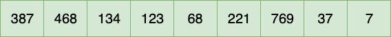
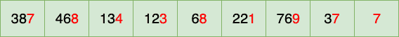
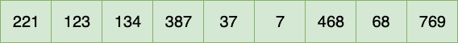
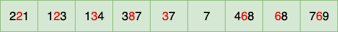
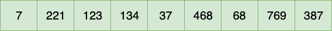
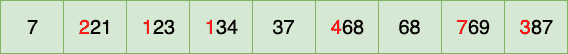
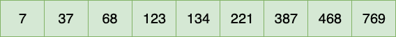

# Java 中的基数排序

> 原文:[https://web . archive . org/web/20220930061024/https://www . bael dung . com/Java-radix-sort](https://web.archive.org/web/20220930061024/https://www.baeldung.com/java-radix-sort)

## 1.介绍

在本教程中，我们将学习[基数排序](/web/20221126233111/https://www.baeldung.com/cs/radix-sort)，分析它的性能，并看看它的实现。

**这里我们重点介绍使用基数排序来对整数进行排序，但不仅限于数字。**我们也可以用它来排序其他类型，比如`String,`。

为了简单起见，我们将重点放在十进制系统上，在该系统中，数字以基数 10 表示。

## 2.算法概述

基数排序是一种排序算法，它根据数字的位置对数字进行排序。基本上，它使用的是一个数的位数。**不像其他大多数排序算法，比如[合并排序](/web/20221126233111/https://www.baeldung.com/java-merge-sort)、[插入排序](/web/20221126233111/https://www.baeldung.com/java-insertion-sort)、[冒泡排序](/web/20221126233111/https://www.baeldung.com/java-bubble-sort)，它不比较数字。**

基数排序使用一个[稳定排序算法](/web/20221126233111/https://www.baeldung.com/stable-sorting-algorithms)作为子程序对数字进行排序。我们在这里使用了计数排序的变体作为子例程，它使用基数对每个位置的数字进行排序。[计数排序](/web/20221126233111/https://www.baeldung.com/java-counting-sort)是一种稳定的排序算法，在实践中运行良好。

基数排序的工作方式是从最低有效位(LSD)到最高有效位(MSD)对数字进行排序。我们还可以实现基数排序来处理来自 MSD 的数字。

## 3.一个简单的例子

让我们用一个例子来看看它是如何工作的。让我们考虑以下阵列:

[](/web/20221126233111/https://www.baeldung.com/wp-content/uploads/2019/09/Array.png)

### 3.1。迭代 1

我们将通过处理来自 LSD 的数字并向 MSD 移动来对这个数组进行排序。

让我们从一位数开始:

[](/web/20221126233111/https://www.baeldung.com/wp-content/uploads/2019/09/Before-Iteration-1.png)

第一次迭代后，数组现在看起来像这样:

[](/web/20221126233111/https://www.baeldung.com/wp-content/uploads/2019/09/After-Iteration-1.png)

请注意，这些数字已经按照一位的数字进行了排序。

### 3.2。迭代 2

让我们来看看十位数:

[](/web/20221126233111/https://www.baeldung.com/wp-content/uploads/2019/09/Before-Iteration-2.png)

现在阵列看起来像:

[](/web/20221126233111/https://www.baeldung.com/wp-content/uploads/2019/09/After-Iteration-2.png)

我们看到数字 7 占据了数组的第一个位置，因为它在十位没有任何数字。我们也可以认为这是十进制的 0。

### 3.3。迭代 3

让我们来看看百位数:

[](/web/20221126233111/https://www.baeldung.com/wp-content/uploads/2019/09/Before-Iteration-3.png)

迭代之后，数组看起来像这样:

[](/web/20221126233111/https://www.baeldung.com/wp-content/uploads/2019/09/After-Iteration-3.png)

算法到此结束，所有元素都已排序。

## 4.履行

现在让我们看看实现。

```
void sort(int[] numbers) {
    int maximumNumber = findMaximumNumberIn(numbers);
    int numberOfDigits = calculateNumberOfDigitsIn(maximumNumber);
    int placeValue = 1;
    while (numberOfDigits-- > 0) {
        applyCountingSortOn(numbers, placeValue);
        placeValue *= 10;
    }
}
```

该算法的工作原理是找出数组中的最大数，然后计算其长度。这一步有助于我们确保为每个位置值执行子例程。

例如，在数组`[7, 37, 68, 123, 134, 221, 387, 468, 769]`中，最大数是 769，长度是 3。

因此，我们对每个位置的数字迭代并应用子例程三次:

```
void applyCountingSortOn(int[] numbers, int placeValue) {

    int range = 10 // decimal system, numbers from 0-9

    // ...

    // calculate the frequency of digits
    for (int i = 0; i < length; i++) {
        int digit = (numbers[i] / placeValue) % range;
        frequency[digit]++;
    }

    for (int i = 1; i < range; i++) {
        frequency[i] += frequency[i - 1];
    }

    for (int i = length - 1; i >= 0; i--) {
        int digit = (numbers[i] / placeValue) % range;
        sortedValues[frequency[digit] - 1] = numbers[i];
        frequency[digit]--;
    }

    System.arraycopy(result, 0, numbers, 0, length); 

}
```

在子例程中，我们使用基数`(range)`来计算每个数字的出现次数，并增加其频率。因此，从 0 到 9 范围内的每个 bin 将具有基于数字频率的某个值。然后，我们使用频率来定位数组中的每个元素。这也有助于我们最小化排序数组所需的空间。

现在让我们测试我们的方法:

```
@Test
public void givenUnsortedArray_whenRadixSort_thenArraySorted() {
    int[] numbers = {387, 468, 134, 123, 68, 221, 769, 37, 7};
    RadixSort.sort(numbers);
    int[] numbersSorted = {7, 37, 68, 123, 134, 221, 387, 468, 769};
    assertArrayEquals(numbersSorted, numbers); 
}
```

## 5.基数排序与计数排序

在子程序中，`frequency`数组的长度是 10 (0-9)。在计数排序的情况下，我们不使用`range`。`frequency`数组的长度将是数组中的最大数+ 1。所以我们不把它们分成仓，而基数排序使用仓来排序。

当数组的长度不比数组中的最大值小很多时，计数排序非常有效，而基数排序允许数组中有更大的值。

## 6.复杂性

基数排序的性能取决于为数字排序选择的稳定排序算法。

这里我们使用基数排序来对基数为`b`的`n`数字数组进行排序。在我们的例子中，基数是 10。我们已经应用了计数排序`d`次，其中`d`代表位数。所以基数排序的时间复杂度变成了`O(d * (n + b))`。

空间复杂度是`O(n + b)`,因为我们在这里使用了计数排序的变体作为子例程。

## 7.结论

在本文中，我们描述了基数排序算法，并举例说明了如何实现它。

像往常一样，代码实现可以在 Github 的[上获得。](https://web.archive.org/web/20221126233111/https://github.com/eugenp/tutorials/tree/master/algorithms-modules/algorithms-sorting)