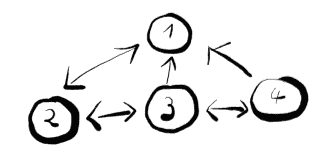

# SirixDB 指南

> 原文：<https://web.archive.org/web/20220930061024/https://www.baeldung.com/sirix>

## 1。概述

在本教程中，我们将概述什么是 SirixDB 及其最重要的设计目标。

接下来，我们将介绍一个低级的基于光标的事务 API。

## 2。SirixDB 功能

SirixDB 是一个日志结构的、临时的 [NoSQL](/web/20220706122839/https://www.baeldung.com/eclipse-jnosql) 文档存储，它存储进化数据。它从不覆盖磁盘上的任何数据。因此，我们能够高效地恢复和查询数据库中资源的完整修订历史。SirixDB 确保为每个新版本创建最小的存储开销。

目前，SirixDB 提供了两种内置的原生数据模型，即二进制 XML 存储和 JSON 存储。

### 2.1。设计目标

一些最重要的核心原则和设计目标是:

*   **并发性**–Siri xdb 包含很少的锁，旨在尽可能适用于多线程系统
*   **异步 REST API—**操作可以独立发生；每个事务都被绑定到一个特定的版本，并且一个资源上只允许一个读写事务与 N 个只读事务并发
*   **版本/修订历史–**Siri xdb 在数据库中存储每个资源的修订历史，同时将存储开销保持在最低水平。读写性能是可调的。这取决于版本类型，我们可以为创建资源指定版本类型
*   **数据完整性–**Siri xdb 和 ZFS 一样，在父页面中存储页面的完整校验和。这意味着将来几乎所有的数据损坏都可以在读取时被检测到，因为 SirixDB 开发人员的目标是将来对数据库进行分区和复制
*   **写入时复制语义—**与文件系统 Btrfs 和 ZFS 类似，SirixDB 使用 CoW 语义，这意味着 SirixDB 从不覆盖数据。相反，数据库页面片段被复制并写入新位置
*   **每次修订和每次记录版本化—**Siri xdb 不仅对每个页面进行版本化，还对每个记录进行版本化。因此，每当我们更改数据页中可能很小一部分
    记录时，不必复制整个页面并将其写入磁盘或闪存驱动器上的新位置。相反，我们可以在创建数据库资源的过程中指定备份系统中已知的几种版本控制策略之一或滑动快照算法。SirixDB 使用我们指定的版本控制类型对数据页面进行版本控制
*   **保证原子性(无 wall)–**系统永远不会进入不一致状态(除非出现硬件故障)，这意味着意外断电不会损坏系统。这是在没有预写日志开销的情况下完成的([沃尔](https://web.archive.org/web/20220706122839/https://en.wikipedia.org/wiki/Write-ahead_logging)
*   **日志结构和 SSD 友好—**Siri xdb 在提交期间将所有内容按顺序批量写入和同步到闪存驱动器。它从不覆盖提交的数据

在以后的文章中，我们首先要介绍以 JSON 数据为例的低级 API，然后再将重点转移到更高级别的 API。例如，用于查询 XML 和 JSON 数据库的 XQuery-API，或者异步的时态 RESTful API。我们基本上可以使用相同的低级 API，但有细微的差别，来存储、遍历和比较 XML 资源。

为了使用 SirixDB，**我们至少要使用 [Java 11](/web/20220706122839/https://www.baeldung.com/java-11-string-api) 。**

## 3。嵌入 SirixDB 的 Maven 依赖关系

为了遵循这些例子，我们首先必须包含[`sirix-core`依赖](https://web.archive.org/web/20220706122839/https://search.maven.org/search?q=g:io.sirix%20AND%20a:sirix-core&core=gav)，例如，通过 Maven:

```
<dependency>
    <groupId>io.sirix</groupId>
    <artifactId>sirix-core</artifactId>
    <version>0.9.3</version>
</dependency>
```

或通过 Gradle:

```
dependencies {
    compile 'io.sirix:sirix-core:0.9.3'
} 
```

## 4。SirixDB 中的树编码

SirixDB 中的一个节点通过`firstChild/leftSibling/rightSibling/parentNodeKey/nodeKey`编码引用其他节点:

[](/web/20220706122839/https://www.baeldung.com/wp-content/uploads/2019/08/encoding.png)

图中的数字是由一个简单的序列号生成器自动生成的唯一、稳定的节点 id。

每个节点可以具有第一子节点、左兄弟节点、右兄弟节点和父节点。此外，SirixDB 能够存储每个节点的子节点数、子节点数和哈希值。

在接下来的几节中，我们将介绍 SirixDB 的核心低级 JSON API。

## 5。用单个资源创建一个数据库

首先，我们想展示如何用单个资源创建数据库。该资源将从一个 JSON 文件导入，并以 SirixDB 的内部二进制格式持久存储:

```
var pathToJsonFile = Paths.get("jsonFile");
var databaseFile = Paths.get("database");

Databases.createJsonDatabase(new DatabaseConfiguration(databaseFile));

try (var database = Databases.openJsonDatabase(databaseFile)) {
    database.createResource(ResourceConfiguration.newBuilder("resource").build());

    try (var manager = database.openResourceManager("resource");
         var wtx = manager.beginNodeTrx()) {
        wtx.insertSubtreeAsFirstChild(JsonShredder.createFileReader(pathToJsonFile));
        wtx.commit();
    }
}
```

我们首先创建一个数据库。然后，我们打开数据库并创建第一个资源。创建资源有多种选择([参见官方文档](https://web.archive.org/web/20220706122839/https://sirix.io/documentation.html))。

然后我们在资源上打开**单个读写事务来导入 JSON 文件。该事务通过`moveToX`方法提供了一个导航光标。此外，该事务提供了插入、删除或修改节点的方法。注意，XML API 甚至提供了用于移动资源中的节点和从其他 XML 资源中复制节点的方法**。****

为了正确关闭打开的读写事务，资源管理器和数据库我们使用 Java 的 [`try-with-resources`](/web/20220706122839/https://www.baeldung.com/java-try-with-resources) 语句。

我们举例说明了在 JSON 数据上创建数据库和资源，但是创建 XML 数据库和资源几乎是一样的。

在下一节中，我们将在数据库中打开一个资源，并显示导航轴和方法。

## 6。打开数据库中的资源并导航

### 6.1.`JSON`资源中的预订导航

为了在树结构中导航，我们能够在提交后重用读写事务。但是，在下面的代码中，我们将再次打开资源，并在最近的修订版上开始一个只读事务:

```
try (var database = Databases.openJsonDatabase(databaseFile);
     var manager = database.openResourceManager("resource");
     var rtx = manager.beginNodeReadOnlyTrx()) {

    new DescendantAxis(rtx, IncludeSelf.YES).forEach((unused) -> {
        switch (rtx.getKind()) {
            case OBJECT:
            case ARRAY:
                LOG.info(rtx.getDescendantCount());
                LOG.info(rtx.getChildCount());
                LOG.info(rtx.getHash());
                break;
            case OBJECT_KEY:
                LOG.info(rtx.getName());
                break;
            case STRING_VALUE:
            case BOOLEAN_VALUE:
            case NUMBER_VALUE:
            case NULL_VALUE:
                LOG.info(rtx.getValue());
                break;
            default:
        }
    });
}
```

我们使用后代轴来迭代前序的所有节点(深度优先)。默认情况下，根据资源配置，所有节点的哈希都是自下而上构建的。

数组节点和对象节点没有名称，也没有值。我们可以使用相同的轴来遍历 XML 资源，只是节点类型不同。

SirixDB 为**提供了一系列轴，例如所有 XPath-axes** 来浏览 XML 和 JSON 资源。此外，它为链轴提供了一个`LevelOrderAxis`、一个 `PostOrderAxis,` 、一个 `NestedAxis` 和几个`ConcurrentAxis`变量，以并发和并行地获取节点。

在下一节中，我们将展示如何使用`VisitorDescendantAxis`，它在节点访问者的返回类型的指导下，按照预定顺序进行迭代。

### 6.2.访客后代轴

因为基于不同的节点类型定义行为是很常见的，所以 SirixDB 使用了访问者模式。

我们可以指定一个访问者作为一个名为`VisitorDescendantAxis` `.`的特殊轴的构建器参数。对于每种类型的节点，都有一个等价的访问方法。例如，对于对象关键节点，它是方法`VisitResult visit(ImmutableObjectKeyNode node).`

每个方法都返回一个类型为`VisitResult`的值。接口的唯一实现是下面的枚举:

```
public enum VisitResultType implements VisitResult {
    SKIPSIBLINGS,
    SKIPSUBTREE,
    CONTINUE,
    TERMINATE
}
```

`VisitorDescendantAxis` 按照前序遍历树结构。它使用`VisitResultType` s 来引导遍历:

*   `SKIPSIBLINGS` 表示遍历应该继续，而不访问光标指向的当前节点的右兄弟节点
*   `SKIPSUBTREE`表示继续而不访问该节点的后代
*   如果遍历应该按前序继续，我们使用`CONTINUE`
*   我们也可以使用`TERMINATE`来立即终止遍历

`Visitor` 接口中每个方法的默认实现为每个节点类型返回`VisitResultType.CONTINUE` 。因此，我们只需要实现我们感兴趣的节点的方法。如果我们已经实现了一个实现了名为`MyVisitor`的`Visitor` 接口的类，我们可以以如下方式使用`VisitorDescendantAxis`:

```
var axis = VisitorDescendantAxis.newBuilder(rtx)
  .includeSelf()
  .visitor(new MyVisitor())
  .build();

while (axis.hasNext()) axis.next();
```

为遍历中的每个节点调用`MyVisitor`中的方法。参数`rtx` 是一个只读事务。遍历从光标当前指向的节点开始。

### 6.3。时间旅行轴

SirixDB 最与众不同的特性之一是彻底的版本控制。因此，SirixDB 不仅提供了所有种类的轴来在一次修订中遍历树结构。我们还可以使用以下坐标轴之一进行时间导航:

*   `FirstAxis`
*   `LastAxis`
*   `PreviousAxis`
*   `NextAxis`
*   `AllTimeAxis`
*   `FutureAxis`
*   `PastAxis`

构造函数将资源管理器和事务游标作为参数。光标导航到每个修订中的同一节点。

如果 axis 中存在另一个修订，以及相应修订中的节点，那么 axis 将返回一个新的事务。返回值是在各自版本上打开的只读事务，而光标指向不同版本中的相同节点。

我们将为`PastAxis`展示一个简单的例子:

```
var axis = new PastAxis(resourceManager, rtx);
if (axis.hasNext()) {
    var trx = axis.next();
    // Do something with the transactional cursor.
}
```

### 6.4。过滤

SirixDB 提供了几个过滤器，我们可以将它们与`FilterAxis`结合使用。例如，下面的代码遍历一个对象节点的所有子节点，并使用关键字“a”过滤对象关键字节点，如`{“a”:1, “b”: “foo”}`中所示。

```
new FilterAxis<JsonNodeReadOnlyTrx>(new ChildAxis(rtx), new JsonNameFilter(rtx, "a"))
```

`FilterAxis`可选地将多个过滤器作为其参数。过滤器或者是一个`JsonNameFilter`，用于过滤对象关键字中的名称，或者是节点类型过滤器之一:`ObjectFilter`、`ObjectRecordFilter`、`ArrayFilter`、`StringValueFilter`、`NumberValueFilter`、`BooleanValueFilter`和`NullValueFilter`。

对于 JSON 资源，可以按如下方式使用该轴，通过名为“foobar”的对象键名进行过滤:

```
var axis = new VisitorDescendantAxis.Builder(rtx).includeSelf().visitor(myVisitor).build();
var filter = new JsonNameFilter(rtx, "foobar");
for (var filterAxis = new FilterAxis<JsonNodeReadOnlyTrx>(axis, filter); filterAxis.hasNext();) {
    filterAxis.next();
}
```

或者，我们可以简单地在轴上流过(根本不使用`FilterAxis`),然后通过谓词过滤。

在以下示例中,`rtx`属于类型`NodeReadOnlyTrx`:

```
var axis = new PostOrderAxis(rtx);
var axisStream = StreamSupport.stream(axis.spliterator(), false);

axisStream.filter((unusedNodeKey) -> new JsonNameFilter(rtx, "a"))
  .forEach((unused) -> /* Do something with the transactional cursor */);
```

## 7。修改数据库中的资源

显然，我们希望能够修改资源。每次提交时，SirixDB 都会存储一个新的压缩快照。

在打开一个资源后，我们必须像以前看到的那样启动单个读写事务。

### 7.1.简单的更新操作

导航到要修改的节点后，我们可以根据节点类型更新名称或值:

```
if (wtx.isObjectKey()) wtx.setObjectKeyName("foo");
if (wtx.isStringValue()) wtx.setStringValue("foo");
```

我们可以通过`insertObjectRecordAsFirstChild`和`insertObjectRecordAsRightSibling`插入新的对象记录。**所有节点类型都有类似的方法。**对象记录由两个节点组成:对象键节点和对象值节点。

SirixDB 检查一致性，因此，如果在特定的节点类型上不允许方法调用，它会抛出一个未检查的`SirixUsageException`。

例如，如果光标位于对象节点上，则对象记录(即键/值对)只能作为第一个子对象插入。我们用`insertObjectRecordAsX`方法插入一个对象键节点和一个其他节点类型作为值。

我们还可以链接更新方法——在这个例子中，`wtx`位于一个对象节点上:

```
wtx.insertObjectRecordAsFirstChild("foo", new StringValue("bar"))
   .moveToParent().trx()
   .insertObjectRecordAsRightSibling("baz", new NullValue());
```

首先，我们插入一个名为“foo”的对象键节点，作为对象节点的第一个子节点。然后，创建一个`StringValueNode`作为新创建的对象记录节点的第一个子节点。

方法调用后，光标移动到值节点。因此，我们首先必须将光标移动到对象关键点节点，再次移动到父节点。然后，我们能够插入下一个对象关键节点及其子节点，一个作为右兄弟节点的`NullValueNode`。

### 7.2.批量插入

还存在更复杂的批量插入方法，正如我们在导入 JSON 数据时已经看到的那样。SirixDB 提供了一种方法，将 JSON 数据作为第一个孩子(`insertSubtreeAsFirstChild`)和右兄弟(`insertSubtreeAsRightSibling`)插入。

要基于字符串插入新的子树，我们可以使用:

```
var json = "{\"foo\": \"bar\",\"baz\": [0, \"bla\", true, null]}";
wtx.insertSubtreeAsFirstChild(JsonShredder.createStringReader(json));
```

JSON API 目前不提供复制子树的可能性。但是，XML API 可以。我们能够从 SirixDB 中的另一个 XML 资源复制一个子树:

```
wtx.copySubtreeAsRightSibling(rtx);
```

这里，只读事务(`rtx`)当前指向的节点被复制，其子树作为读写事务(`wtx`)指向的节点的新的右兄弟。

在事务提交期间，SirixDB 始终**应用内存中的更改，然后将它们刷新到磁盘**或闪存驱动器。唯一的例外是，如果内存缓存由于内存限制而不得不将一些条目收回到临时文件中。

我们可以`commit()`或`rollback()`交易。注意，我们可以在两个方法调用之一后重用事务。

在调用批量插入时，SirixDB 也进行了一些优化。

在下一节中，我们将看到如何启动读写事务的其他可能性。

### 7.3.启动读写事务

正如我们已经看到的，我们可以通过调用`commit`方法开始一个读写事务并创建一个新的快照。但是，我们也可以启动自动提交事务游标:

```
resourceManager.beginNodeTrx(TimeUnit.SECONDS, 30);
resourceManager.beginNodeTrx(1000);
resourceManager.beginNodeTrx(1000, TimeUnit.SECONDS, 30);
```

我们要么每 30 秒自动提交一次，要么每 1000 次修改后自动提交一次，要么每 30 秒和每 1000 次修改自动提交一次。

我们还能够启动一个读写事务，然后恢复到以前的修订，我们可以将它提交为新的修订:

```
resourceManager.beginNodeTrx().revertTo(2).commit();
```

中间的所有修订仍然可用。提交多个修订后，我们可以通过指定确切的修订号或时间戳来打开特定的修订:

```
var rtxOpenedByRevisionNumber = resourceManager.beginNodeReadOnlyTrx(2);

var dateTime = LocalDateTime.of(2019, Month.JUNE, 15, 13, 39);
var instant = dateTime.atZone(ZoneId.of("Europe/Berlin")).toInstant();
var rtxOpenedByTimestamp = resourceManager.beginNodeReadOnlyTrx(instant);
```

## 8.比较修订

要计算存储在 SirixDB 中的资源的任意两个修订版之间的差异，我们可以调用 diff 算法:

```
DiffFactory.invokeJsonDiff(
  new DiffFactory.Builder(
    resourceManager,
    2,
    1,
    DiffOptimized.HASHED,
    ImmutableSet.of(observer)));
```

构建器的第一个参数是资源管理器，我们已经使用过几次了。接下来的两个参数是要比较的修订。第四个参数是 enum，我们用它来决定 SirixDB 是否应该考虑散列来加速 diff 计算。

如果一个节点由于 SirixDB 中的更新操作而发生变化，所有祖先节点也会调整它们的哈希值。如果两个修订版中的散列和节点键相同，SirixDB 在遍历两个修订版时会跳过子树，因为当我们指定`DiffOptimized.HASHED`时，子树中没有变化。

一组不变的观察者是最后一个论点。观察者必须实现以下接口:

```
public interface DiffObserver {
    void diffListener(DiffType diffType, long newNodeKey, long oldNodeKey, DiffDepth depth);
    void diffDone();
}
```

作为第一个参数的`diffListener` 方法指定了在每个修订中两个节点之间遇到的差异类型。接下来的两个参数是两个版本中比较节点的稳定唯一节点标识符。最后一个参数`depth` 指定了两个节点的深度，SirixDB 刚刚比较了这两个节点。

## 9。序列化到 JSON

在某个时候，我们希望将 SirixDBs 二进制编码的 JSON 资源序列化回 JSON:

```
var writer = new StringWriter();
var serializer = new JsonSerializer.Builder(resourceManager, writer).build();
serializer.call();
```

要序列化修订版 1 和 2:

```
var serializer = new
JsonSerializer.Builder(resourceManager, writer, 1, 2).build();
serializer.call();
```

和所有存储的修订:

```
var serializer = new
JsonSerializer.Builder(resourceManager, writer, -1).build();
serializer.call(); 
```

## 10。结论

我们已经看到了如何使用低级事务游标 API 来管理 SirixDB 中的 JSON 数据库和资源。更高级别的 API 隐藏了一些复杂性。

完整的源代码可以在 [GitHub](https://web.archive.org/web/20220706122839/https://github.com/eugenp/tutorials/tree/master/persistence-modules/sirix) 上找到。