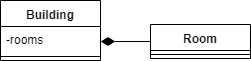
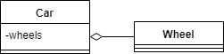
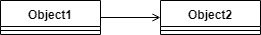
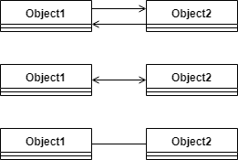
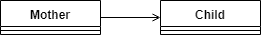
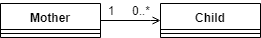

# Java 中的组合、聚合和关联

> 原文:[https://web . archive . org/web/20220930061024/https://www . bael dung . com/Java-composition-aggregation-association](https://web.archive.org/web/20220930061024/https://www.baeldung.com/java-composition-aggregation-association)

## 1.介绍

无论是在现实生活中还是在编程中，对象之间都有关系。有时很难理解或实现这些关系。

在本教程中，我们将关注 Java 对三种有时容易混淆的关系类型的处理:组合、聚合和关联。

## 2.作文

`Composition`是一种“隶属”类型的关系。这意味着其中一个对象是一个逻辑上更大的结构，它包含另一个对象。换句话说，它是另一个对象的一部分或成员。

或者，**我们通常称之为“有-有”关系**(相对于“是-有”关系，是[继承](/web/20221206005830/https://www.baeldung.com/java-inheritance))。

例如，一个房间属于一座建筑，或者换句话说，一座建筑有一个房间。所以基本上，我们称之为“属于”还是“拥有”只是一个观点的问题。

组合是一种很强的“has-a”关系，因为包含它的对象拥有它。因此，**对象的生命周期是固定的。这意味着，如果我们毁灭了所有者对象，它的成员也会随之毁灭。**例如，在我们之前的示例中，房间与建筑物一起被摧毁。

请注意，这并不意味着，没有它的任何部分，包含对象就不能存在。例如，我们可以拆掉一栋建筑内的所有墙壁，从而摧毁房间。但是这个建筑仍然会存在。

就基数而言，一个包含对象可以有任意多的部分。然而，**所有的部件都需要有一个容器**。

### 2.1.用户模式

在 UML 中，我们用以下符号表示组合:

[](/web/20221206005830/https://www.baeldung.com/wp-content/uploads/2019/08/composition.png)

请注意，菱形位于包含对象处，是线条的底部，而不是箭头。为了清楚起见，我们也经常画箭头:

[](/web/20221206005830/https://www.baeldung.com/wp-content/uploads/2019/08/composition-arrow.png)

因此，我们可以将这个 UML 结构用于我们的建筑房间示例:

[](/web/20221206005830/https://www.baeldung.com/wp-content/uploads/2019/08/composition-example.png)

### 2.2.源代码

在 Java 中，我们可以用一个非静态内部类对此建模:

```
class Building {
    class Room {}   
}
```

或者，我们也可以在方法体中声明该类。不管是命名类、匿名类还是 lambda:

```
class Building {
    Room createAnonymousRoom() {
        return new Room() {
            @Override
            void doInRoom() {}
        };
    }

    Room createInlineRoom() {
        class InlineRoom implements Room {
            @Override
            void doInRoom() {}
        }
        return new InlineRoom();
    }

    Room createLambdaRoom() {
        return () -> {};
    }

    interface Room {
        void doInRoom();
    }
}
```

请注意，我们的内部类应该是非静态的，因为它将其所有实例绑定到包含类。

通常，包含对象想要访问它的成员。因此，我们应该存储它们的引用:

```
class Building {
    List<Room> rooms;
    class Room {}   
}
```

请注意，所有内部类对象都存储了对其包含对象的隐式引用。因此，我们不需要手动存储它来访问它:

```
class Building {
    String address;

    class Room {
        String getBuildingAddress() {
            return Building.this.address;
        }   
    }   
}
```

## 3.聚合

聚合也是一种“有-有”关系。它与作曲的区别在于，它不涉及拥有。因此，对象的生命周期是不相关的:它们中的每一个都可以独立存在。

例如，一辆汽车和它的轮子。我们可以卸下车轮，但它们仍然存在。我们可以安装其他(已存在的)车轮，或者将它们安装到另一辆汽车上，一切都会正常工作。

当然，一辆没有轮子或轮子脱落的汽车不会像一辆有轮子的汽车那样有用。但这就是为什么这种关系首先存在:将各个部分组装成一个更大的结构，这个结构比它的各个部分能做更多的事情。

因为聚合不涉及拥有，**一个成员不需要只绑定到一个容器**。例如，三角形是由线段组成的。但是三角形可以共享线段作为它们的边。

### 3.1.用户模式

聚合与合成非常相似。唯一的逻辑区别是聚合是一种较弱的关系。

因此，UML 表示也非常相似。唯一的区别是钻石是空的:

[](/web/20221206005830/https://www.baeldung.com/wp-content/uploads/2019/08/aggregation.png)

对于汽车和车轮，我们会做:

[](/web/20221206005830/https://www.baeldung.com/wp-content/uploads/2019/08/aggregation-example.png)

### 3.2.源代码

在 Java 中，我们可以用一个简单的老参考来建模聚合:

```
class Wheel {}

class Car {
    List<Wheel> wheels;
}
```

成员可以是任何类型的类，非静态内部类除外。

在上面的代码片段中，两个类都有各自的源文件。但是，我们也可以使用静态内部类:

```
class Car {
    List<Wheel> wheels;
    static class Wheel {}
}
```

注意，Java 只会在非静态内部类中创建隐式引用。因此，我们必须在需要时手动维护关系:

```
class Wheel {
    Car car;
}

class Car {
    List<Wheel> wheels;
}
```

## 4.联合

联想是三者中最弱的关系。**这不是一个“有-有”关系**，没有一个对象是另一个的部件或成员。

**关联只意味着对象彼此“认识”。**比如一个母亲和她的孩子。

### 4.1.用户模式

在 UML 中，我们可以用箭头标记一个关联:

[](/web/20221206005830/https://www.baeldung.com/wp-content/uploads/2019/08/association.png)

如果关联是双向的，我们可以使用两个箭头，一个两端都有箭头的箭头，或者一条没有箭头的线:

[](/web/20221206005830/https://www.baeldung.com/wp-content/uploads/2019/08/association-bidirectional.png)

我们可以用 UML 表示一个母亲和她的孩子，那么:

[](/web/20221206005830/https://www.baeldung.com/wp-content/uploads/2019/08/association-example.png)

### 4.2.源代码

在 Java 中，我们可以用与聚合相同的方式对关联进行建模:

```
class Child {}

class Mother {
    List<Child> children;
}
```

但是等等，**我们怎么才能知道一个引用是指聚合还是关联呢？**

嗯，我们不能。差别只是逻辑上的:一个对象是否是另一个对象的一部分。

此外，我们必须在两端手动维护引用，就像我们对聚合所做的那样:

```
class Child {
    Mother mother;
}

class Mother {
    List<Child> children;
}
```

## 5.UML 旁注

为了清楚起见，有时我们想要在 UML 图上定义一个关系的基数。我们可以把它写在箭头的两端:

[](/web/20221206005830/https://www.baeldung.com/wp-content/uploads/2019/08/cardinality-1.png)

注意，把零写成基数是没有意义的，因为这意味着没有关系。唯一的例外是当我们想用一个范围来表示可选关系时:

[](/web/20221206005830/https://www.baeldung.com/wp-content/uploads/2019/08/cardinality-2.png)

还要注意，因为在组合中只有一个所有者，所以我们没有在图中指出它。

## 6.复杂的例子

让我们看一个(稍微)更复杂的例子！

我们将建立一所大学的模型，它有自己的系。教授们在每个系工作，他们之间也有朋友。

我们关闭大学后，这些系还会存在吗？当然不是，所以这是一篇作文。

但是教授们仍然会存在(希望如此)。我们必须决定哪一个更符合逻辑:我们是否将教授视为系的一部分。或者:他们是不是部门的成员？是的，他们是。因此它是一个集合。最重要的是，一个教授可以在多个部门工作。

教授之间的关系是关联，因为说一个教授是另一个教授的一部分没有任何意义。

因此，我们可以用下面的 UML 图来模拟这个例子:

[](/web/20221206005830/https://www.baeldung.com/wp-content/uploads/2019/08/complex-example.png)

Java 代码看起来像这样:

```
class University {
    List<Department> department;   
}

class Department {
    List<Professor> professors;
}

class Professor {
    List<Department> department;
    List<Professor> friends;
}
```

注意，如果我们**依赖于术语“has-a”、“belongs-to”、“member-of”、“part-of”**等等，我们可以更容易地识别我们的对象之间的关系。

## 7.结论

在本文中，我们看到了组合、聚合和关联的属性和表示。我们还看到了如何用 UML 和 Java 对这些关系进行建模。

像往常一样，这些例子可以在 GitHub 的[上找到。](https://web.archive.org/web/20221206005830/https://github.com/eugenp/tutorials/tree/master/core-java-modules/core-java-lang-oop-patterns)