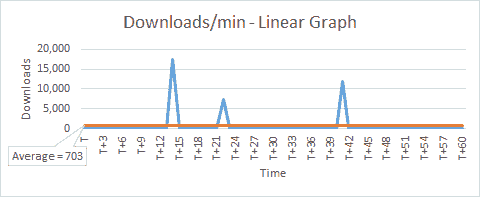
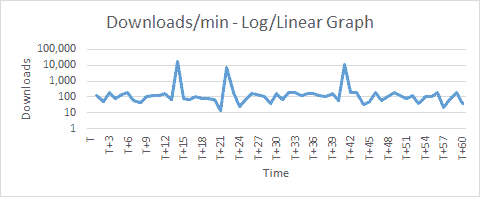
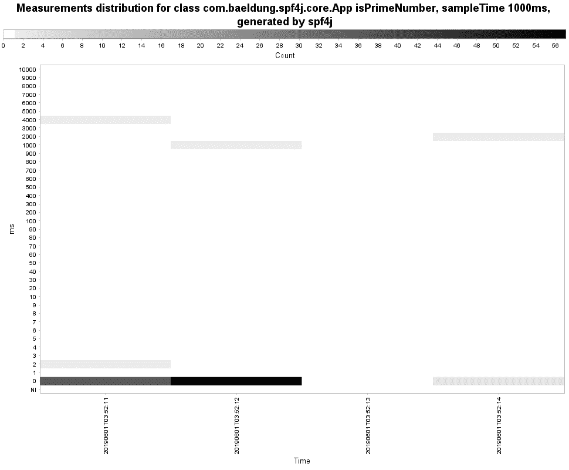
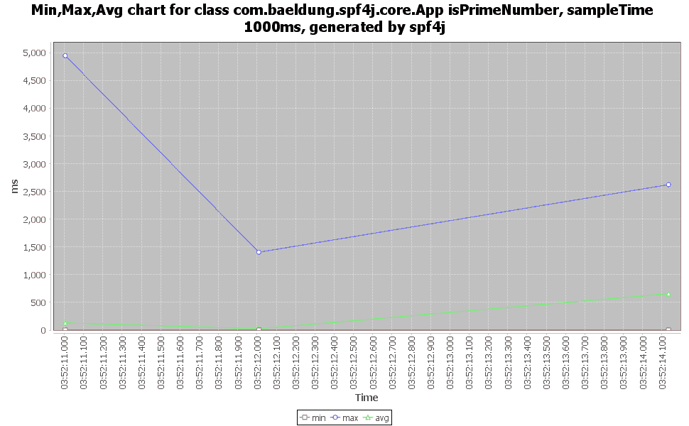
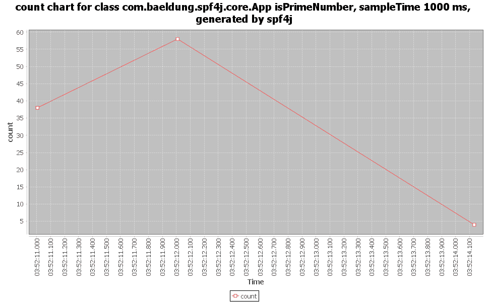

# SPF4J 简介

> 原文：<https://web.archive.org/web/20220930061024/https://www.baeldung.com/spf4j>

## 1.概观

性能测试是一项经常被推到软件开发周期最后阶段的活动。我们通常依靠[Java profiler](/web/20221205151829/https://www.baeldung.com/java-profilers)来帮助解决性能问题。

在本教程中，我们将介绍 Java 的简单性能框架(SPF4J)。它为我们提供了可以添加到代码中的 API。因此，我们可以将**性能监控作为组件**的一个组成部分。

## 2.度量捕获和可视化的基本概念

在开始之前，让我们用一个简单的例子来理解度量捕获和可视化的概念。

假设我们对监控应用商店中新发布的应用的下载感兴趣。为了学习，我们就想到手动做这个实验。

### 2.1.获取指标

首先，我们需要决定需要测量什么。我们感兴趣的指标是`downloads/min.` ，因此`,` 我们将测量下载次数。

第二，我们需要多久进行一次测量？让我们决定“每分钟一次”。

最后，应该监控多久？让我们决定“一个小时”。

有了这些规则，我们就可以进行实验了。一旦实验结束，我们就可以看到结果:

[PRE0]

前两列—`time`和`cumulative downloads`—是我们观察到的直接值。第三列`downloads/min`，是作为当前和先前`cumulative download`值之差计算的导出值。这给了我们这段时间的实际下载次数。

### 2.2.可视化指标

让我们画一个简单的`time`对`downloads/min`的线性图。

我们可以看到，有一些峰值表明在少数情况下发生了大量下载。由于用于`downloads`轴的线性刻度，下限值显示为一条直线。

让我们将`downloads`轴改为使用对数标度(基数为 10)并绘制一个对数/线性图。

现在我们实际上开始看到较低的值。他们更接近 100 (+/-)。注意，线性图显示的是平均值`703`，因为它也包括峰值。

如果我们将峰值作为偏差排除，我们可以从使用对数/线性图的实验中得出结论:

*   平均值约为 100 秒

## 3.函数调用的性能监控

通过前面的例子，我们已经了解了如何获取一个简单的指标并对其进行分析，现在让我们将它应用到一个简单的 Java 方法上— `isPrimeNumber`:

[PRE1]

使用 SPF4J，有两种方法可以捕获指标。让我们在下一节探索它们。

## 4.设置和配置

### 4.1.Maven 设置

SPF4J 为我们提供了许多用于不同目的的不同库，但是对于我们的简单示例，我们只需要几个。

核心库是 [`spf4j-core`](https://web.archive.org/web/20221205151829/https://search.maven.org/search?q=g:org.spf4j%20AND%20a:spf4j-core) ，它为我们提供了大部分必要的特性。

让我们将其添加为 Maven 依赖项:

[PRE2]

有一个更适合性能监控的库— `[spf4j-aspects](https://web.archive.org/web/20221205151829/https://search.maven.org/search?q=g:org.spf4j%20AND%20a:spf4j-aspects),` ，它使用了`AspectJ`。

我们将在我们的示例中探索这一点，所以我们也添加这一点:

[PRE3]

最后，SPF4J 还附带了一个简单的 UI，对于数据可视化非常有用，所以让我们也添加 [`spf4j-ui`](https://web.archive.org/web/20221205151829/https://search.maven.org/search?q=g:org.spf4j%20AND%20a:spf4j-ui) :

[PRE4]

### **4.2。输出文件的配置**

SPF4J 框架将数据写入时序数据库(TSDB ),也可以选择写入文本文件。

让我们配置它们并设置一个系统属性`spf4j.perf.ms.config`:

[PRE5]

### **4.3。记录器和信号源**

SPF4J 框架的核心功能是记录、聚集和保存指标，因此在分析时不需要后期处理。它通过使用`MeasurementRecorder`和`MeasurementRecorderSource` 类来实现。

这两个类提供了两种不同的方法来记录指标。关键的区别在于 **`MeasurementRecorder` 可以从任何地方调用，而`MeasurementRecorderSource` 只能用于注释。**

该框架为我们提供了一个`RecorderFactory` 类来为不同类型的聚合创建记录器和记录器源类的实例:

*   `createScalableQuantizedRecorder()` 和`createScalableQuantizedRecorderSource()`
*   `createScalableCountingRecorder()` 和`createScalableCountingRecorderSource()` 
*   `createScalableMinMaxAvgRecorder()` 和`createScalableMinMaxAvgRecorderSource()`
*   `createDirectRecorder()` 和`createDirectRecorderSource()`

对于我们的示例，让我们选择可伸缩的量化聚合。

### 4.4.创建记录器

首先，让我们创建一个助手方法来创建一个`MeasurementRecorder`的实例:

[PRE6]

让我们看看不同的设置:

*   `unitOfMeasurement`–被测量的单位值–对于性能监控场景，通常是时间单位
*   `sampleTimeMillis`–进行测量的时间段–换句话说，测量的频率
*   `factor`–用于绘制测量值的对数刻度的基数
*   `lowerMagnitude` –对数标度上的最小值–对于以 10 为底的对数，`lowerMagnitude` = 0 表示 10 的 0 次方= 1
*   `higherMagnitude`–对数标度上的最大值–对于以 10 为底的对数，`higherMagnitude` = 4 表示 10 的 4 次方= 10，000
*   `quantasPerMagnitude`–一个量级内的区段数–如果量级范围从 1000 到 10000，那么`quantasPerMagnitude` = 10 意味着该范围将被分成 10 个子范围

我们可以看到，这些值可以根据我们的需要进行更改。因此，为不同的度量创建单独的`MeasurementRecorder`实例可能是个好主意。

### 4.5.创建源

接下来，让我们使用另一个助手方法创建一个`MeasurementRecorderSource` 的实例:

[PRE7]

请注意，我们使用了与之前相同的设置值。

### 4.6.创建配置类

现在让我们创建一个方便的`Spf4jConfig`类，并将上述所有方法放入其中:

[PRE8]

### 4.7.配置`aop.xml`

SPF4J 为我们提供了注释方法的选项，以便进行性能测量和监控。它使用了 [AspectJ](/web/20221205151829/https://www.baeldung.com/aspectj) 库，该库允许在不修改代码本身的情况下向现有代码添加性能监控所需的额外行为。

让我们使用加载时编织器来编织我们的类和方面，并将`aop.xml`放在一个`META-INF` 文件夹下:

[PRE9]

## 5.使用`MeasurementRecorder`

现在让我们看看如何使用`MeasurementRecorder`来记录测试函数的性能指标。

### 5.1.记录指标

让我们生成 100 个随机数，并在一个循环中调用质数检查方法。在此之前，让我们调用我们的`Spf4jConfig`类进行初始化，并创建一个`MeasureRecorder`类的实例。使用这个实例，让我们调用`record()`方法来节省 100 个`isPrimeNumber()`调用所花费的时间:

[PRE10]

### 5.2.运行代码

我们现在准备测试简单函数`isPrimeNumber`()的性能。

让我们运行代码，看看结果:

[PRE11]

### 5.3.查看结果

让我们通过运行项目文件夹中的命令来启动 SPF4J UI:

[PRE12]

这将打开一个桌面 UI 应用程序。然后，从菜单中选择`File` > `Open`。之后，让我们使用浏览窗口找到并打开`spf4j-performance-monitoring.tsdb2`文件。

现在，我们可以看到一个新窗口打开，其中有一个树形视图，包含我们的文件名和一个子项。让我们单击子项，然后单击它上面的`Plot` 按钮。

这将生成一系列图表。

第一个图`measurement distribution`，是我们之前看到的对数线性图的变体。此图还显示了基于计数的热图。

第二张图显示了汇总数据，如最小值、最大值和平均值:

最后一张图显示了测量次数与时间的关系:

## 6.使用`MeasurementRecorderSource`

在上一节中，我们必须围绕我们的功能编写额外的代码来记录度量。在本节中，让我们使用另一种方法来避免这种情况。

### 6.1.记录指标

首先，我们将删除为捕获和记录指标而添加的额外代码:

[PRE13]

取代所有的样板文件，接下来，让我们使用`@PerformanceMonitor`注释`isPrimeNumber()`方法:

[PRE14]

让我们看看不同的设置:

*   `warnThresholdMillis`–允许方法运行而不出现警告消息的最长时间
*   `errorThresholdMillis`–方法运行而不出现错误消息的最长时间
*   `recorderSource`–一个`MeasurementRecorderSource`的实例

### 6.2.运行代码

让我们先做一个 Maven 构建，然后通过传递一个 Java 代理来执行代码:

[PRE15]

我们看到了结果:

[PRE16]

我们可以看到 SPF4J 框架记录了每个方法调用所花费的时间。每当它超过 100 ms 的`errorThresholdMillis`值时，它就将其记录为一个错误。传递给该方法的参数也会被记录。

### 6.3。查看结果

我们可以像前面使用 SPF4J UI 一样查看结果，因此我们可以参考前面的部分。

## 7.结论

在本文中，我们讨论了捕获和可视化指标的基本概念。

然后，我们借助一个简单的例子理解了 SPF4J 框架的性能监控功能。我们还使用内置的 UI 工具来可视化数据。

和往常一样，GitHub 上的[提供了这篇文章中的例子。](https://web.archive.org/web/20221205151829/https://github.com/eugenp/tutorials/tree/master/spf4j)