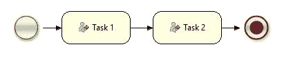
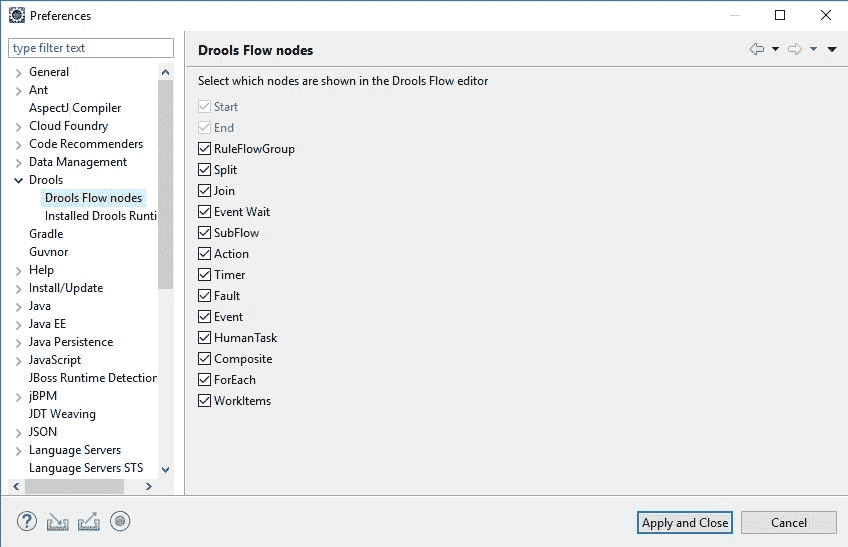
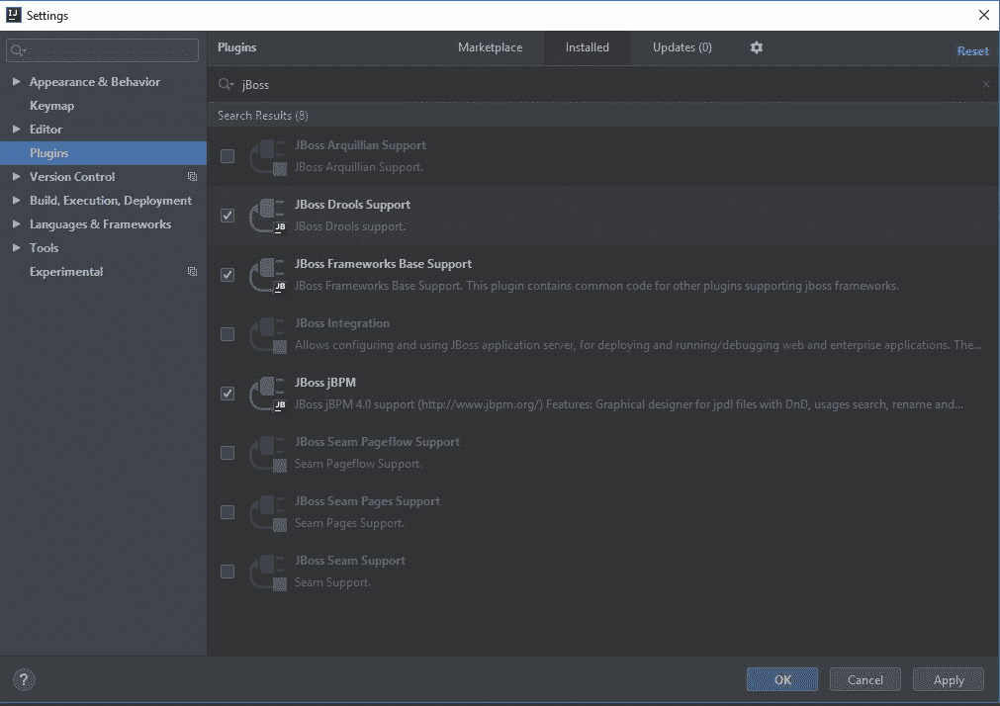
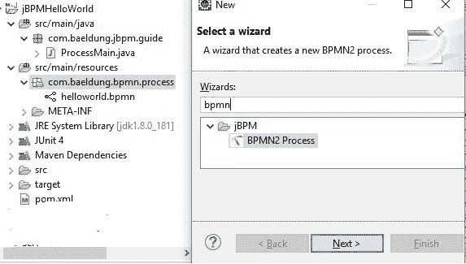
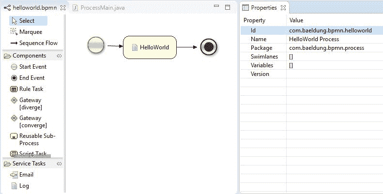

# Java jBPM 指南

> 原文：<https://web.archive.org/web/20220930061024/https://www.baeldung.com/jbpm-java>

## 1.介绍

在本教程中，我们将讨论业务流程管理(BPM)系统及其在 Java 中作为 [jBPM](https://web.archive.org/web/20221205171457/https://docs.jboss.org/jbpm/release/7.20.0.Final/jbpm-docs/html_single/) 系统的实现。

## 2.业务流程管理系统

我们可以将[业务流程管理](https://web.archive.org/web/20221205171457/https://en.wikipedia.org/wiki/Business_process_management)定义为一个领域，其范围从开发延伸到公司的所有方面。

BPM 提供了对公司功能流程的可见性。这允许我们通过使用迭代改进来找到由流程图描绘的最佳流程。改进的流程增加了利润，降低了成本。

BPM 定义了自己的目标、生命周期、实践以及所有参与者之间的通用语言，即业务流程。

## 3.`jBPM`系统

jBPM 是一个 BPM 系统在 Java 中的实现。它允许我们创建业务流程流，执行它，并监控它的生命周期。jBPM 的核心是一个用 Java 编写的工作流引擎，它为我们提供了一个使用最新的业务流程建模符号(BPMN) 2.0 规范创建和执行流程流的工具。

jBPM 主要关注可执行的业务流程。这些流程有足够的细节，因此可以在工作流引擎上执行。

以下是 BPMN 流程模型执行顺序的图形流程图示例，有助于我们的理解:

[](/web/20221205171457/https://www.baeldung.com/wp-content/uploads/2019/04/processModel.jpg)

1.  我们开始使用初始上下文执行流程，由绿色的开始节点表示
2.  首先，任务 1 将执行
3.  任务 1 完成后，我们将继续任务 2
4.  执行在遇到红色结束节点时停止

## 4.`jBPM`项目的`IDE`插件

让我们看看如何在 Eclipse 和 IntelliJ IDEA 中安装插件来创建 jBPM 项目和 BPMN 2.0 流程。

### 4.1.Eclipse 插件

我们需要安装一个插件来创建 jBPM 项目。让我们遵循以下步骤:

1.  在`Help` 部分，点击`Install New Software`
2.  添加 [Drools 和 jBPM 更新站点](https://web.archive.org/web/20221205171457/https://docs.jbpm.org/7.64.0.Final/jbpm-docs/html_single/#jbpmreleasenotes)
3.  接受许可协议条款并完成插件安装
4.  重启 Eclipse

一旦 Eclipse 重启，我们将需要转到`Windows -> Preferences -> Drools -> Drools Flow Nodes`:

[](/web/20221205171457/https://www.baeldung.com/wp-content/uploads/2019/04/Drools-config.jpg)

选择所有选项后，我们可以单击“应用并关闭”。现在，我们准备创建我们的第一个 **jBPM 项目**。

### 4.2.IntelliJ IDEA 插件

IntelliJ IDEA 默认安装了 jBPM 插件，但是它只存在于终极版中，而不存在于社区选项中。

我们只需要点击`Configure -> Settings -> Plugins -> Installed -> JBoss jBPM`来启用它:

[](/web/20221205171457/https://www.baeldung.com/wp-content/uploads/2019/04/Drools-config-IJI.jpg)

目前，这个 IDE 没有 BPMN 2.0 流程设计器，尽管我们可以从任何其他设计器导入`*.bpmn`文件并运行它们。

## 5.Hello World 示例

让我们动手创建一个简单的 Hello World 项目。

### 5.1.创建一个`jBPM`项目

为了在 Eclipse 中创建新的 jBPM 项目，我们将转到`File -> New -> Other -> jBPM Project (Maven)`。提供项目名称后，我们可以点击 finish。Eclipse 将为我们做所有的艰苦工作，并将下载所需的 Maven 依赖项，为我们创建一个示例 jBPM 项目。

要在 IntelliJ IDEA 中创建相同的，我们可以去`File -> New -> Project -> JBoss Drools`。IDE 将下载所有需要的依赖项，并将它们放在项目的`lib`文件夹中。

### 5.2.创建 Hello World 流程模型

让我们创建一个小的 BPM 流程模型，在控制台中打印“Hello World”。

为此，我们需要在`src/main/resources`下创建一个新的 BPMN 文件:

[](/web/20221205171457/https://www.baeldung.com/wp-content/uploads/2019/04/bpmn-file.jpg)

文件扩展名为`.bpmn`，它在 BPMN 设计器中打开:

[](/web/20221205171457/https://www.baeldung.com/wp-content/uploads/2019/04/bpmn-designer.jpg)

设计器的左侧面板列出了我们之前在设置 Eclipse 插件时选择的节点。我们将使用这些节点来创建我们的流程模型。中间的面板是工作区，我们将在这里创建流程模型。右侧是 properties 选项卡，我们可以在其中设置流程或节点的属性。

在这个`HelloWorld`模型中，我们将使用:

*   启动事件–启动流程实例所需的事件
*   脚本任务–启用 Java 片段
*   结束事件–结束流程实例所需的事件

如前所述，IntelliJ IDEA 没有 BPMN 设计器，但是我们可以导入在 Eclipse 或 web 设计器中设计的`.bpmn`文件。

### 5.3.声明并创建知识库(`kbase`)

**所有的 BPMN 文件都作为进程加载到`kbase`中。为了执行它们，我们需要将各自的流程`ids`传递给 jBPM 引擎。**

我们将用我们的`kbase`和 BPMN 文件包声明在`resources/META-INF`下创建`kmodule.xml`:

```
<kmodule >
    <kbase name="kbase" packages="com.baeldung.bpmn.process" />
</kmodule>
```

一旦声明完成，我们就可以使用`KieContainer`来加载`kbase`:

```
KieServices kService = KieServices.Factory.get();
KieContainer kContainer = kService.getKieClasspathContainer();
KieBase kbase = kContainer.getKieBase(kbaseId);
```

### 5.4.创建`jBPM`运行时管理器

我们将使用`org.jbpm.test`包中的`JBPMHelper `来构建一个示例运行时环境。

我们需要两样东西来创建环境:第一，创建`EntityManagerFactory`的数据源，第二，我们的`kbase`。

`JBPMHelper `有启动内存中的 H2 服务器和设置数据源的方法。使用同样的方法，我们可以创建`EntityManagerFactory`:

```
JBPMHelper.startH2Server();
JBPMHelper.setupDataSource();
EntityManagerFactory emf = Persistence.createEntityManagerFactory(persistenceUnit);
```

一旦一切准备就绪，我们就可以创建我们的`RuntimeEnvironment`:

```
RuntimeEnvironmentBuilder runtimeEnvironmentBuilder = 
  RuntimeEnvironmentBuilder.Factory.get().newDefaultBuilder();
RuntimeEnvironment runtimeEnvironment = runtimeEnvironmentBuilder.
  entityManagerFactory(emf).knowledgeBase(kbase).get();
```

使用`RuntimeEnvironment`，我们可以创建我们的 jBPM 运行时管理器:

```
RuntimeManager runtimeManager = RuntimeManagerFactory.Factory.get()
  .newSingletonRuntimeManager(runtimeEnvironment);
```

### 5.5.执行流程实例

最后，我们将使用`RuntimeManager`来获得`RuntimeEngine`:

```
RuntimeEngine engine = manager.getRuntimeEngine(initialContext);
```

使用`RuntimeEngine, `,我们将创建一个知识讲座并启动流程:

```
KieSession ksession = engine.getKieSession();
ksession.startProcess(processId);
```

该进程将启动并在 IDE 控制台上打印 **`Hello World`** 。

## 6.结论

在本文中，我们介绍了 BPM 系统，使用了它的 Java 实现— [jBPM](https://web.archive.org/web/20221205171457/https://www.jbpm.org/) 。

这是一个快速启动 jBPM 项目的指南。此处演示的示例使用了最小流程，以便对流程的执行有一个简单的了解，该示例可以在 [GitHub](https://web.archive.org/web/20221205171457/https://github.com/eugenp/tutorials/tree/master/libraries-2) 上找到。

要执行流程，我们只需运行`WorkflowProcessMain `类中的 main 方法。