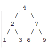
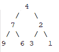

# 在 Java 中反转二叉树

> 原文：<https://web.archive.org/web/20220930061024/https://www.baeldung.com/java-reversing-a-binary-tree>

## 1.概观

反转二叉树是我们在技术面试中可能被要求解决的问题之一。

在这个快速教程中，我们将看到解决这个问题的几种不同的方法。

## 2.二叉树

**二叉树是一种数据结构，其中每个元素最多有两个孩子**，分别称为左孩子和右孩子。树的顶部元素是根节点，而**孩子是内部节点**。

然而，**如果一个节点没有子节点，它就叫做叶子。**

说到这里，让我们创建一个表示节点的对象:

[PRE0]

然后，让我们创建将在示例中使用的树:

[PRE1]

在前面的方法中，我们创建了以下结构:

通过从左到右反转树，我们将得到以下结构:

## 3.反转二叉树

### 3.1.递归方法

在第一个例子中，**我们将使用递归来反转树**。

首先，**我们将使用树根调用我们的方法，然后我们将分别在左边和右边的子节点上应用它**，直到我们到达树叶:

[PRE2]

### 3.2.迭代法

在第二个例子中，**我们将使用迭代方法来反转树。**为此，**我们将使用一个`LinkedList`，我们用我们的树根**初始化它。

然后，**对于我们从列表中轮询的每个节点，我们在置换它们之前将其子节点添加到列表中**。

我们不断从`LinkedList`开始添加和删除，直到到达树叶:

[PRE3]

## 4.结论

在这篇简短的文章中，我们探讨了反转二叉树的两种方法。我们从使用递归方法来反转它开始。然后，我们最终使用迭代的方式来实现相同的结果。

这些例子和单元测试用例[的完整源代码可以在 Github 上找到。](https://web.archive.org/web/20221127014806/https://github.com/eugenp/tutorials/tree/master/algorithms-modules/algorithms-miscellaneous-5)