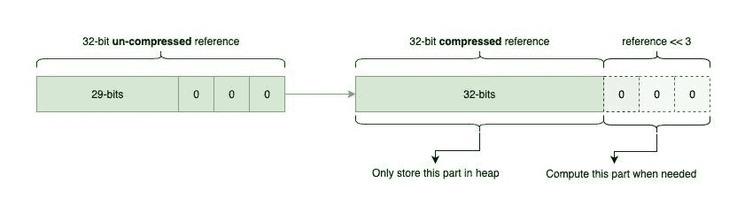

# JVM 中的压缩 OOPs

> 原文：<https://web.archive.org/web/20220930061024/https://www.baeldung.com/jvm-compressed-oops>

## **1。概述**

JVM 为我们管理内存。这消除了开发人员的内存管理负担，因此**我们不需要手动操作对象指针**，这被证明是耗时且容易出错的。

在幕后，JVM 结合了许多漂亮的技巧来优化内存管理过程。**一个技巧是使用** `**Compressed Pointers**,` ，我们将在本文中对其进行评估。首先，让我们看看 JVM 如何在运行时表示对象。

## **2。运行时对象表示**

HotSpot JVM 使用一种叫做 [`oop` s](/web/20221011080836/https://www.baeldung.com/java-memory-layout) 或`Ordinary Object Pointers`的数据结构来表示对象。这些`oops`相当于本机 C 指针。**`[instanceOop](https://web.archive.org/web/20221011080836/https://github.com/openjdk/jdk15/blob/master/src/hotspot/share/oops/instanceOop.hpp)`是一种特殊的`oop `，它代表 Java** 中的对象实例。此外，JVM 还支持一些保存在 [OpenJDK 源代码树](https://web.archive.org/web/20221011080836/http://hg.openjdk.java.net/jdk8/jdk8/hotspot/file/87ee5ee27509/src/share/vm/oops/)中的其他`oops`。

让我们看看 JVM 是如何在内存中布置`instanceOop`的。

### **2.1。对象内存布局**

`instanceOop`的内存布局很简单:它只是对象头，后面紧跟着零个或多个对实例字段的引用。

对象头的 JVM 表示包括:

*   **一个标记词**有多种用途，如`Biased Locking`、`Identity Hash Values,` 、`GC`。它不是一个`oop,`，但由于历史原因，它驻留在 [OpenJDK 的`oop`](https://web.archive.org/web/20221011080836/http://hg.openjdk.java.net/jdk8/jdk8/hotspot/file/87ee5ee27509/src/share/vm/oops/markOop.hpp) 源代码树中。此外，标记字状态仅包含一个`[uintptr_t](https://web.archive.org/web/20221011080836/https://github.com/openjdk/jdk15/blob/e208d9aa1f185c11734a07db399bab0be77ef15f/src/hotspot/share/oops/markWord.hpp#L96), `，因此，**其大小在 32 位和 64 位架构中分别在 4 和 8 个字节之间变化**
*   **一个可能是压缩的 Klass 字**，它代表指向类元数据的指针。在 Java 7 之前，他们指向了 [`Permanent Generation`](/web/20221011080836/https://www.baeldung.com/native-memory-tracking-in-jvm) ，但是从 Java 8 开始，他们指向了`[Metaspace](/web/20221011080836/https://www.baeldung.com/native-memory-tracking-in-jvm)`
*   **32 位间隙**强制对象对齐。这使得布局更加硬件友好，我们将在后面看到

**紧接在头部之后，有零个或多个对实例字段的引用。**在这种情况下，`word`是一个本机字，所以在传统的 32 位机器上是 32 位，在更现代的系统上是 64 位。

除了 mark 和 klass 字之外，数组的对象头还包含一个 32 位字[来表示它的长度。](https://web.archive.org/web/20221011080836/https://github.com/openjdk/jdk15/blob/e208d9aa1f185c11734a07db399bab0be77ef15f/src/hotspot/share/oops/arrayOop.hpp#L35)

### **2.2。**解剖废物

假设我们要从传统的 32 位架构转换到更现代的 64 位机器。首先，我们可能期望立即获得性能提升。然而，当涉及到 JVM 时，情况并非总是如此。

性能下降的主要原因是 64 位对象引用。 64 位引用占用的空间是 32 位引用的两倍，所以这通常会导致更多的内存消耗和更频繁的 GC 周期。用于 GC 周期的时间越多，应用程序线程的 CPU 执行片就越少。

那么，我们应该换回并再次使用那些 32 位架构吗？即使这是一个选项，如果不多做一点工作，我们也不能在 32 位进程空间中拥有超过 4 GB 的堆空间。

## **3。压缩哎呀**

事实证明，JVM 可以通过压缩对象指针或`oops, `来避免浪费内存，这样我们就可以两全其美:**在 64 位机器中允许超过 4 GB 的堆空间和 32 位引用！**

### **3.1。**基本优化

正如我们前面看到的，JVM 向对象添加了填充，因此它们的大小是 8 字节的倍数。**通过这些填充，`oops `中的最后三位总是零。**这是因为 8 的倍数在二进制中总是以`000`结尾。

因为 JVM 已经知道最后三位总是零，所以没有必要在堆中存储这些无关紧要的零。相反，它假设它们在那里，并存储我们以前无法放入 32 位的其他 3 个更重要的位。现在，我们有一个 32 位的地址，有 3 个右移的零，所以我们把一个 35 位的指针压缩成一个 32 位的。这意味着我们可以在不使用 64 位引用的情况下使用高达 32gb–232+3= 235= 32gb 的堆空间。

为了使这种优化工作，当 JVM 需要在内存**中找到一个对象时，它将指针向左移动 3 位**(基本上是将这些 3-0 加回到末尾)。另一方面，当加载一个指向堆的指针时，JVM 将指针向右移动 3 位，以丢弃那些先前添加的零。**基本上，JVM 执行稍微多一点的计算来节省一些空间。**幸运的是，对于大多数 CPU 来说，位移真的是一个微不足道的操作。

为了启用`oop `压缩，我们可以使用`-XX:+UseCompressedOops `调优标志。从 Java 7 开始，每当最大堆大小小于 32 GB 时，`oop `压缩就是默认行为。**当最大堆大小超过 32 GB 时，JVM 将自动关闭`oop `压缩。**因此，超过 32 Gb 堆大小的内存使用需要进行不同的管理。

### **3.2。**超过 32 GB

当 Java 堆的大小大于 32GB 时，也可以使用压缩指针。**虽然默认的对象对齐是 8 字节，但该值可使用`-XX:` `ObjectAlignmentInBytes `调整标志进行配置。指定值应该是 2 的幂，并且必须在 8 到 256** 的范围内。

我们可以使用压缩指针计算最大可能堆大小，如下所示:

[PRE0]

例如，当对象对齐是 16 字节时，我们可以使用 64 GB 的堆空间来压缩指针。

请注意，随着对齐值的增加，对象之间未使用的空间也可能增加。因此，我们可能意识不到使用大 Java 堆大小的压缩指针有什么好处。

### **3.3。**未来派 GCs

[ZGC](/web/20221011080836/https://www.baeldung.com/jvm-zgc-garbage-collector) ， [Java 11](https://web.archive.org/web/20221011080836/https://openjdk.java.net/jeps/333) 中的新成员，是一个实验性的可扩展的低延迟垃圾收集器。

它可以处理不同范围的堆大小，同时将 GC 暂停保持在 10 毫秒以下。由于 ZGC 需要使用 [64 位彩色指针](https://web.archive.org/web/20221011080836/https://youtu.be/kF_r3GE3zOo?t=643)，**它不支持压缩引用**。因此，使用像 ZGC 这样的超低延迟 GC 必须与使用更多内存进行权衡。

从 Java 15 开始，ZGC 支持压缩的类指针，但是仍然缺乏对压缩的 OOPs 的支持。

然而，所有新的 GC 算法都不会为了低延迟而牺牲内存。例如， [Shenandoah GC](https://web.archive.org/web/20221011080836/https://openjdk.java.net/jeps/379) 除了是一个暂停时间短的 GC 之外，还支持压缩引用。

此外，谢南多阿和 ZGC 都是在 Java 15 完成的[。](https://web.archive.org/web/20221011080836/https://openjdk.java.net/projects/jdk/15/)

## 4.结论

在本文中，我们描述了 64 位架构中的一个 JVM 内存管理问题。我们研究了**压缩指针和对象对齐**，我们看到了 JVM 如何解决这些问题，允许我们使用更大的堆大小，使用更少的浪费指针和最少的额外计算。

关于压缩引用的更详细的讨论，强烈建议查看来自[Aleksey shipilv](https://web.archive.org/web/20221011080836/https://shipilev.net/jvm/anatomy-quarks/23-compressed-references/)的另一篇精彩文章。另外，要了解对象分配在 HotSpot JVM 中是如何工作的，请查看 Java 文章中的[对象内存布局。](/web/20221011080836/https://www.baeldung.com/java-memory-layout)