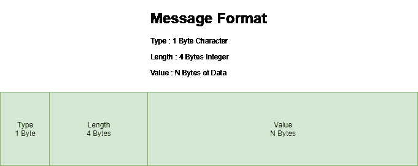

# 使用 Java 服务器套接字读取输入流

> 原文：<https://web.archive.org/web/20220930061024/https://www.baeldung.com/java-inputstream-server-socket>

## 1.概观

为了通过网络发送和接收数据，我们经常使用套接字。套接字不过是 IP 地址和端口号的组合，它可以唯一地标识在任何给定机器上运行的程序。

在本教程中，我们将展示如何读取通过套接字发送给我们的数据。

## 2.从套接字读取数据

让我们假设，我们已经对套接字编程有了基本的了解。

现在，我们将更深入地研究如何读取服务器正在监听的端口上的数据。

首先，我们需要声明并初始化`ServerSocket, Socket,`和`DataInputStream`变量:

[PRE0]

注意，我们选择将套接字的`InputStream`包装在`DataInputStream.` 中，这允许我们以可移植的方式读取文本行和 Java 原始数据类型。

这很好，因为现在，如果我们知道我们将接收的数据类型，**我们可以使用专门的方法，如`readChar(), readInt(), readDouble()`，和`readLine(). `**

然而，如果事先不知道数据的类型和长度，这将是一个挑战。

在这种情况下，我们将使用底层的`read()` 函数从套接字获取一个字节流。但是，这种方法有一个小问题:我们如何知道我们将得到的数据的长度和类型？

让我们在下一节探讨这个场景。

## 3.从套接字读取二进制数据

当读取以字节为单位的数据时，我们需要为服务器和客户端之间的通信定义自己的协议。我们能定义的最简单的协议叫做 TLV(类型长度值)。这意味着写入套接字的每条消息都是类型长度值的形式。

因此，我们将发送的每条消息定义为:

*   1 个代表数据类型的`byte`字符，如`s `代表`String`
*   一个 4 `byte`整数，表示数据的长度
*   然后是实际的数据，它的长度是刚刚指出的

一旦客户端和服务器建立了连接，每条消息都将遵循这种格式。然后，我们可以编写代码来解析每条消息，并读取特定类型的数据的`n`字节。

让我们看看如何使用一个简单的带有`String`消息的例子来实现这一点。

首先，我们需要调用`readChar()`函数来读取数据的类型，然后调用`readInt()`函数来读取数据的长度:

[PRE1]

之后，我们需要读取正在接收的数据。**这里需要注意的重要一点是`read()`函数可能无法在一次调用中读取所有数据。因此，我们需要在 while 循环中调用`read()`:**

[PRE2]

## 4.发送数据的客户端代码

而**客户端代码呢？**其实很简单:

[PRE3]

这就是我们的客户所做的一切！

## 5.结论

在本文中，我们讨论了如何从套接字读取数据。我们研究了帮助我们读取特定类型数据的不同函数。此外，我们看到了如何读取二进制数据。

本教程的完整实现可以在 GitHub 上找到[。](https://web.archive.org/web/20221006005119/https://github.com/eugenp/tutorials/tree/master/core-java-modules/core-java-networking)