# 如何在 Eclipse 项目中更改 Java 版本

> 原文：<https://web.archive.org/web/20220930061024/https://www.baeldung.com/eclipse-change-java-version>

## **1。概述**

在 Java 生态系统中，[由于 JDK 的新版本每年至少推出一次](/web/20221020020834/https://www.baeldung.com/oracle-jdk-vs-openjdk)，我们可能需要在某个时候切换到新版本。

在这个快速教程中，我们将展示如何检查可用的 JRE，如何将 JRE 添加到 Eclipse，以及如何在 Eclipse 项目中更改 Java 版本，以便我们在那个时候做好准备。

## **2。检查 JRE 在 Eclipse 中是否可用**

在确定[我们已经安装了想要使用的版本](/web/20221020020834/https://www.baeldung.com/java-check-is-installed)之后，我们需要确保它可以在 Eclipse 中使用。

我们来看看`Window ->` `Preferences`，而在这里面，`Java -> Installed JREs`:

[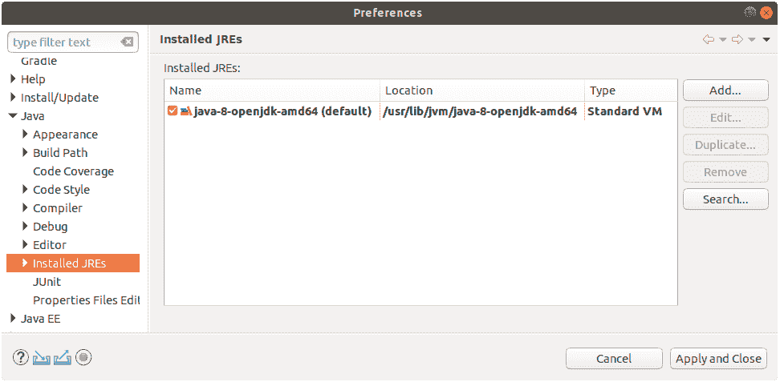](/web/20221020020834/https://www.baeldung.com/wp-content/uploads/2019/02/window-preferences-before-adding-jre-extended-window-1.png)

如果我们想要的 JRE 被列出来了，那我们就可以走了。

但是，假设我们需要使用 JRE 9、10 或 11。因为我们只安装了 JDK 8，我们必须把它添加到 Eclipse 中。

## **3。向 Eclipse 添加 JRE**

接下来，从`Window ->` `Preferences`对话框中，让我们点击`Add…`按钮。从这里开始，我们需要指定 JRE 类型。我们将选择`Standard VM`:

[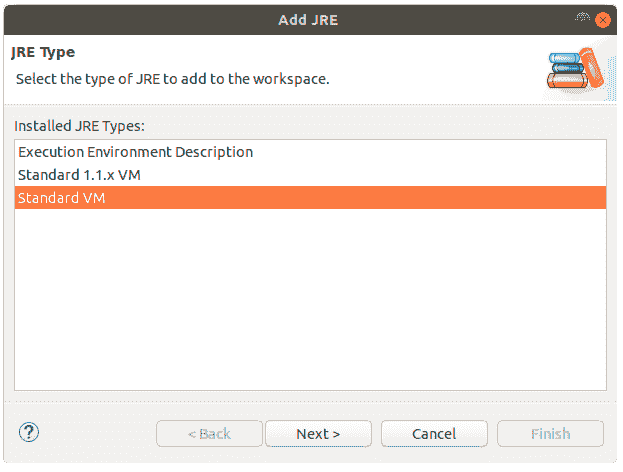](/web/20221020020834/https://www.baeldung.com/wp-content/uploads/2019/02/add-jre-standard-vm-option-1.png)

最后，让我们指定新 JRE 的位置(在`JRE home`下)并单击`Finish`:

[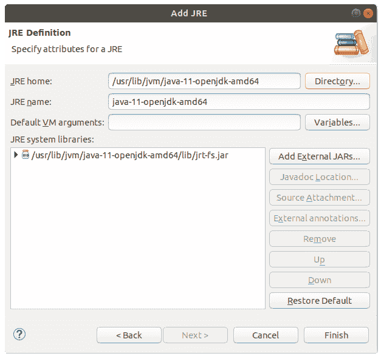](/web/20221020020834/https://www.baeldung.com/wp-content/uploads/2019/02/add-jre-with-location-1.png)

因此，我们现在在 IDE 中配置了两个 JRE:

[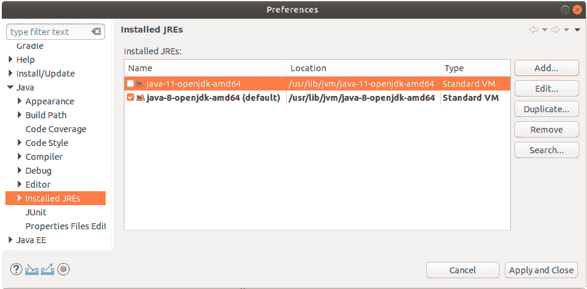](/web/20221020020834/https://www.baeldung.com/wp-content/uploads/2019/02/new-jre-added-2.png)

## **4。改变我们项目的 Java 版本**

现在，让我们假设我们在项目中使用 Java 8，现在我们想把它改成 Java 10:

[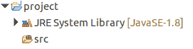](/web/20221020020834/https://www.baeldung.com/wp-content/uploads/2019/02/project-in-project-tree-before-changing-jdk.png)

首先，我们将导航到`Project properties`，然后导航到`Java Build Path`:

[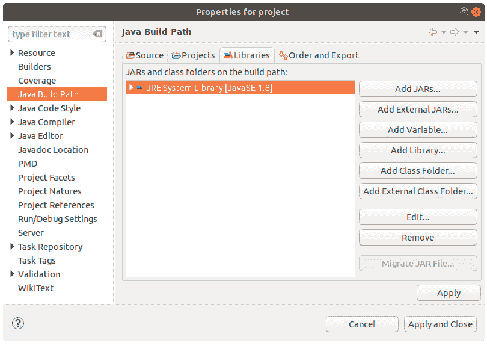](/web/20221020020834/https://www.baeldung.com/wp-content/uploads/2019/02/project-with-java8-before-changing-jdk-1.png)

并点击现有 JRE 上的`Remove`按钮:

[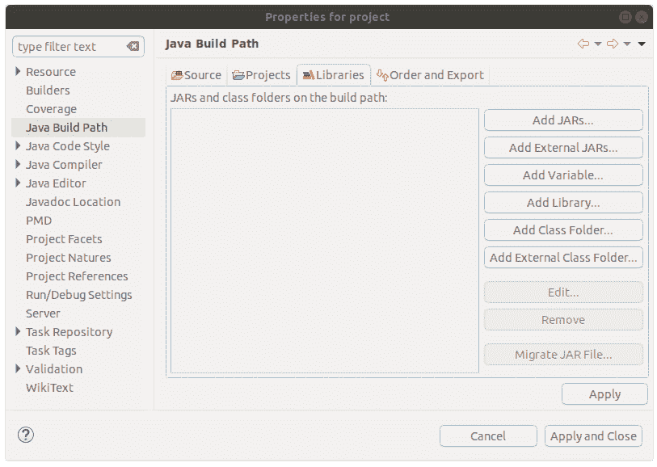](/web/20221020020834/https://www.baeldung.com/wp-content/uploads/2019/02/java-build-path-empty-1.png)

现在，我们将使用`Add Library`按钮并选择`JRE System Library`:

[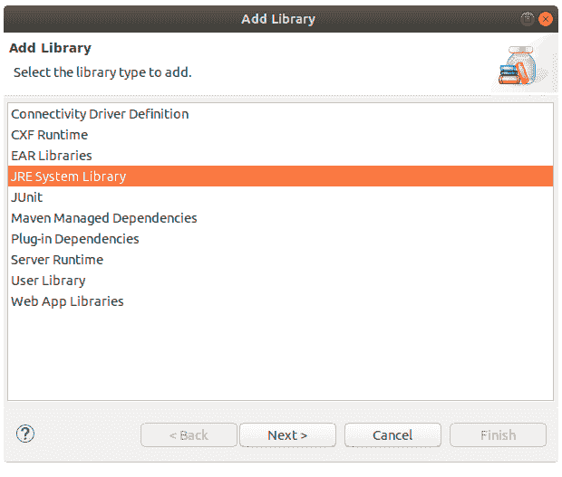](/web/20221020020834/https://www.baeldung.com/wp-content/uploads/2019/02/add-library-window-2.png)

**让我们从最近安装的 JDK**中选择 JavaSE-10，然后单击`Finish `按钮:

[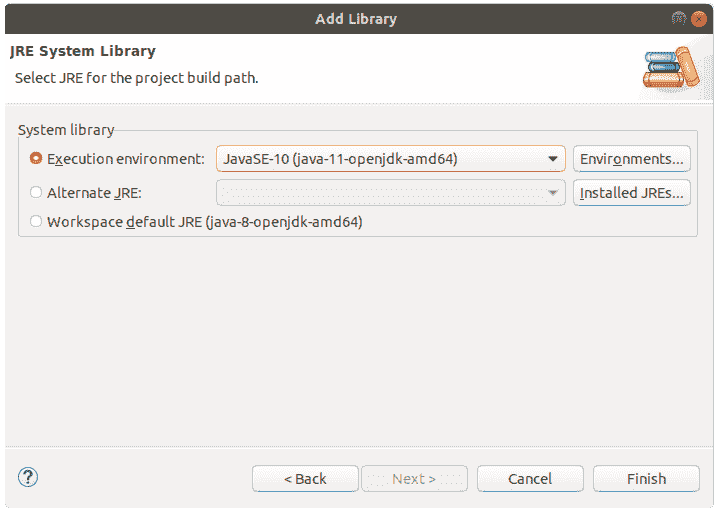](/web/20221020020834/https://www.baeldung.com/wp-content/uploads/2019/02/jre-system-library-window-1.png)

现在，如我们所见，我们已经正确配置了项目的 Java 构建路径:

[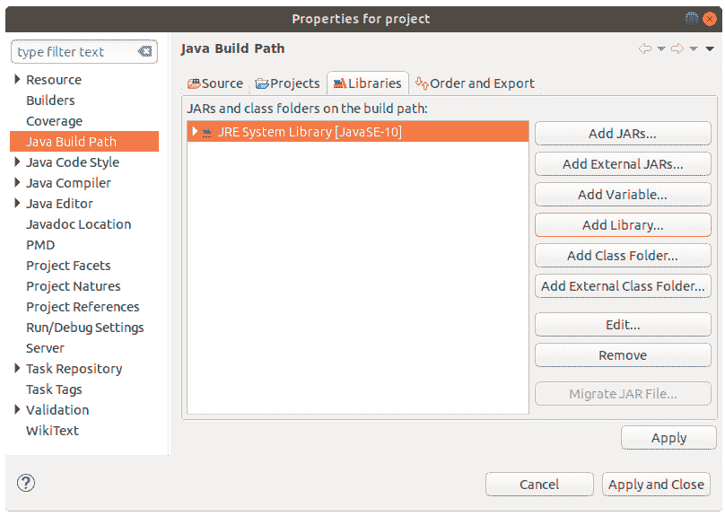](/web/20221020020834/https://www.baeldung.com/wp-content/uploads/2019/02/java-build-path-after-change-to-java-10-1.png)

我们需要做一个额外的步骤— **确保我们为 Java 编译器**使用了正确的编译器兼容级别:

[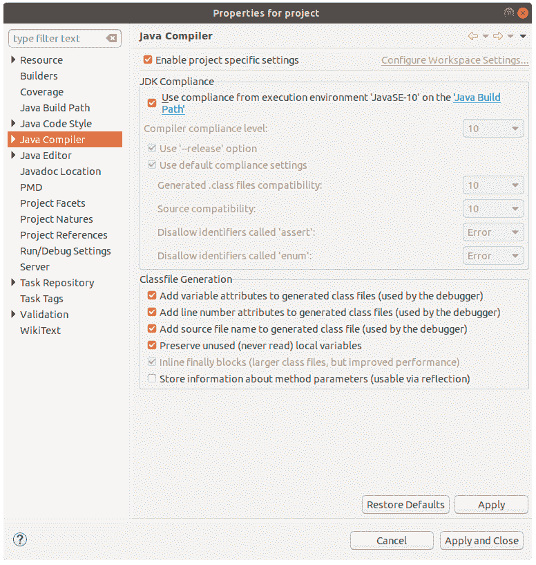](/web/20221020020834/https://www.baeldung.com/wp-content/uploads/2019/02/java-compiler-after-switch-1.png)

在我们的例子中，它显示的是 Java 10，所以我们都很好:

[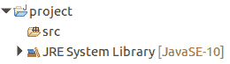](/web/20221020020834/https://www.baeldung.com/wp-content/uploads/2019/02/project-with-java-10.png)

如果编译器兼容级别不正确，我们可以简单地取消选择`Use compliance from execution environment`选项，选择正确的级别。

## **5。结论**

在这篇简短的文章中，我们学习了如何在 Eclipse 工作区中添加新的 JRE，以及如何在当前的 Eclipse 项目中切换到不同的 Java 版本。