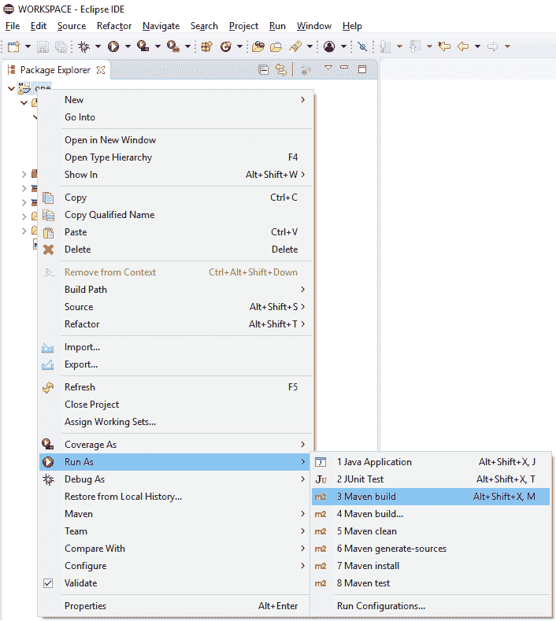
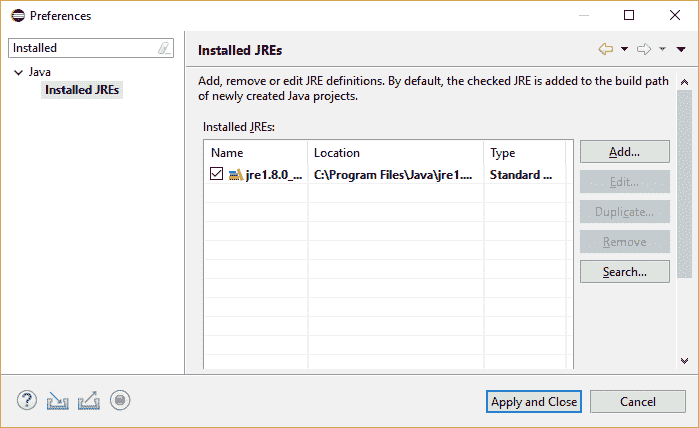
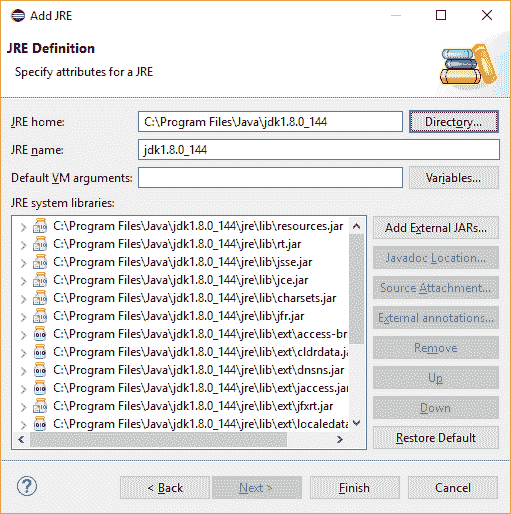
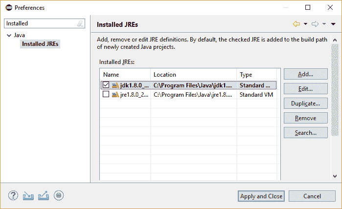

# Eclipse 中 Maven 构建的 JDK 配置

> 原文：<https://web.archive.org/web/20220930061024/https://www.baeldung.com/maven-eclipse-jdk-configuration>

## 1.概观

Eclipse IDE 是 Java 应用程序开发最常用的工具之一。它带有默认设置，使我们能够在 IDE 中立即构建和执行我们的代码。

然而，当我们试图在 Eclipse 中使用 Maven 构建时，这些默认设置有时是不够的。因此，我们会遇到构建错误。

在这个快速教程中，我们将演示我们需要进行的配置更改，以便我们可以在 IDE 中构建基于 Maven 的 Java 项目。

## 2.Eclipse 中的 Java 编译

在开始之前，让我们试着了解一点 Eclipse 中的编译过程。

Eclipse IDE 附带了自己的 Java 编译器，名为 Eclipse Compiler for Java (ECJ)。这是一个增量编译器，它可以只编译修改过的文件，而不必总是编译整个应用程序。

这一功能使得我们通过 IDE 所做的代码更改能够在我们键入时立即被编译并检查错误。

由于使用了 Eclipse 的内部 Java 编译器，我们不需要在系统中安装 JDK 来让 Eclipse 工作。

## 3.在 Eclipse 中编译 Maven 项目

Maven 构建工具帮助我们自动化我们的软件构建过程，Eclipse 作为插件与 Maven 捆绑在一起。然而，Maven **没有捆绑任何 Java 编译器。相反，它希望我们已经安装了 JDK。**

为了了解当我们尝试在 Eclipse 中构建 Maven 项目时会发生什么，假设 Eclipse 具有默认设置，让我们在 Eclipse 中打开任何 Maven 项目。

然后，在 Package Explorer 窗口中，让我们右键单击项目文件夹，然后左键单击`Run As > 3 Maven build`:

这将触发 Maven 构建过程。不出所料，我们会失败:

[PRE0]

该错误消息表明 Maven 无法找到 Java 编译器，该编译器只附带了一个 JDK，而没有 JRE。

## 4.Eclipse 中的 JDK 配置

现在让我们修复 Eclipse 中的 Maven 构建问题。

首先，我们需要下载最新版本的 JDK 并安装在我们的系统中。

之后，让我们通过导航到`Window > Preferences > Java > Installed JREs`将 JDK 作为运行时添加到 Eclipse 中:

我们可以看到 Eclipse 已经配置了 Java。然而，这是 JRE 而不是 JDK，所以让我们继续下一步。

现在，让我们点击`Add…` 按钮来调用`Add JRE`向导。这将要求我们选择 JRE 的类型。

这里，我们选择了默认选项`Standard VM`:

点击`Next`将把我们带到一个窗口，在这里我们将把`JRE home`的位置指定为我们的 JDK 安装的主目录。

接下来，向导将验证路径并获取其他详细信息:

我们现在可以点击`Finish`关闭向导。

这将把我们带回`Installed JREs`窗口，在这里我们可以看到新添加的 JDK，并选择它作为我们在 Eclipse 中的运行时:

让我们点击`Apply and Close`保存我们的更改。

## 5.测试 JDK 配置

现在让我们**再一次**触发 Maven 构建，与之前的方式相同。

我们可以看到它是成功的:

[PRE1]

## 6.结论

在本教程中，我们看到了如何在 IDE 中配置 Eclipse for Maven 版本。

通过进行一次性配置，我们能够利用 IDE 本身进行构建，而不必从外部设置 Maven。