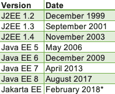

# 爪哇湾对 J2EE 对雅加达湾

> 原文:[https://web . archive . org/web/20220930061024/https://www . bael dung . com/Java-enterprise-evolution](https://web.archive.org/web/20220930061024/https://www.baeldung.com/java-enterprise-evolution)

## 1.介绍

听说过 Java EE 吗？J2EE 的 Java 2EE 或者现在的 Jakarta EE 怎么样？实际上，**这些都是同一事物的不同名称:一组扩展 Java SE 的企业规范。**

在这篇短文中，我们将描述 Java EE 的发展。

## 2.历史

在 Java 的第一个版本中，Java 企业扩展只是核心 JDK 的一部分。

然后，作为 1999 年 Java 2 的一部分，这些扩展脱离了标准的二进制文件，`J2EE`，或者说 [Java 2 平台企业版](https://web.archive.org/web/20220710163703/https://www.oracle.com/java/technologies/appmodel.html)诞生了。这个名字将一直保留到 2006 年。

对于 2006 年的 Java 5，J2EE 被重命名为 Java EE 或 Java 平台企业版。这个名字将一直延续到 2017 年 9 月，**，那时发生了一件大事**。

**参见，2017 年 9 月，[甲骨文决定将 Java EE 的权利赠送给 Eclipse 基金会](https://web.archive.org/web/20220710163703/https://blogs.oracle.com/theaquarium/opening-up-ee-update)(该语言仍归甲骨文所有)**。

## 3.过渡中

实际上，Eclipse Foundation 合法地`had`将 Java 重新命名为 EE。这是因为甲骨文拥有“Java”品牌的权利。

所以为了选择新名字，社区投票选出: **Jakarta EE。**在某种程度上，它仍然是`J` EE。

##### *宣布新名称

不过，这仍然是一个不断发展的故事，尘埃还没有完全落定。

例如，虽然甲骨文开源了源代码，但他们并没有开源所有的文档。关于这个问题还有很多讨论，因为法律问题使得与 JMS 和 EJB 相关的开源文档变得棘手。

尚不清楚新的 Eclipse Foundation 文档是否能够引用原始文档。

另外，奇怪的是，Eclipse Foundation 不能使用`javax`名称空间创建任何新的 Java 包，但是它可以在现有的类和子类下创建新的类和子类。

这种转变也意味着向 Jakarta EE 添加规范的新过程。为了更好地理解它，**让我们看看在 Oracle 下这个过程是什么样的，以及在 Eclipse Foundation 下它是如何变化的。**

## 4.未来

历史上，为了让一个特性成为“EE”，我们需要三样东西:**一个规范、一个参考实现和测试。**这三样东西可以由社区中的任何人提供，执行委员会将决定何时将它们添加到语言中。

为了更好地理解过去的过程，让我们仔细看看什么是**JSR、Glassfish 和 TCK，以及它们如何体现新的 EE 特性**。

我们也将对未来有所期待。

### 4.1.JCP 和现在的 EFSP

在过去，一个新的 EE 特性诞生的过程被称为 Java 社区过程( [JCP](https://web.archive.org/web/20220710163703/https://jcp.org/en/home/index) )。

Java SE 今天仍然使用 JCP。但是，由于 EE 已经改变了它的所有权，从 Oracle 到 Eclipse Foundation，我们有了一个新的独立的流程。这是 Eclipse 基础规范过程( [EFSP](https://web.archive.org/web/20220710163703/https://www.eclipse.org/projects/efsp/) )并且是 [Eclipse 开发过程的扩展。](https://web.archive.org/web/20220710163703/https://www.eclipse.org/projects/dev_process)

然而，有一些重要的差异，主要是围绕“透明性、开放性、共同负担和供应商中立性”。例如，EFSP 的组织者设想了供应商中立的协作工作组，自助式的认证流程，以及以精英管理方式运营和管理的组织。

### 4.2.JSRs

在 JCP 中，向 EE 添加特性的第一步是创建一个 JSR 或 Java 规范请求。**JSR 有点像 EE 功能的`interface`。**JCP 执行委员会审核并批准了一份完整的 JSR，然后 JSR 贡献者将对其进行编码并提供给社区。

一个很好的例子是[JSR-339](https://web.archive.org/web/20220710163703/https://jcp.org/en/jsr/detail?id=339)——或[JAX-RS](/web/20220710163703/https://www.baeldung.com/jax-rs-spec-and-implementations)——它最初是在 2011 年提出的，在 2012 年得到 JCP 的批准，最终在 2013 年发布。

虽然在讨论规范时，社区总是可以参与进来，但时间表明，实施优先的方法——就像在 [JSR 310](https://web.archive.org/web/20220710163703/https://jcp.org/en/jsr/detail?id=310) 、`[java.time](/web/20220710163703/https://www.baeldung.com/java-8-date-time-intro), `和[约达时间](/web/20220710163703/https://www.baeldung.com/joda-time)的情况中——倾向于创建更广泛接受的功能和 API。

因此，EFSP 在其声明的目标中反映了这种代码优先的观点:“EFSP 将首先基于动手实验和编码，作为证明某些东西值得在规范中记录的一种方式。”

### 4.3.玻璃鱼

然后，作为 JCP 的一部分，JSR 需要一个参考实现。**这有点像实现了`interface`的`class`。**参考实现帮助兼容库或其他组织的开发人员创建他们自己的规范实现。

对于 Java EE 特性，JCP 使用 Glassfish 作为其参考实现。

虽然 Glassfish 上的这种集中化简化了实现者的发现过程，但是这种集中化也需要更多的治理，并且有偏向一个供应商而不是另一个供应商的趋势。

因此，EFSP 不需要参考实现，而是只需要一个`compatible `实现。简而言之，这个微妙的变化使得像 Glassfish 这样的中央架构内部的**实现不会被基金会无意中偏爱。**

### 4.4.TCK

最后，JCP 要求通过技术兼容性工具包，或称 [TCK](https://web.archive.org/web/20220710163703/https://projects.eclipse.org/projects/ee4j.jakartaee-tck) 来测试 EE 特性。

TCK 是一套验证特定 EE JSR 的测试。简单地说，**为了符合 Java EE，应用服务器需要实现它所有的 JSR，并通过指定 TCK 上的所有测试。**

这里没什么变化。Oracle 开源了 TCK 和 EE JSRs。当然，所有未来的文档和 TCK 都将是开源的。

## 5.结论

Java EE 在那些年里确实发展了很多。很高兴看到它继续改变和改进。

前面有许多挑战，所以让我们希望平稳过渡。