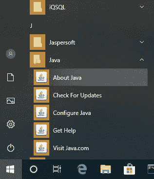
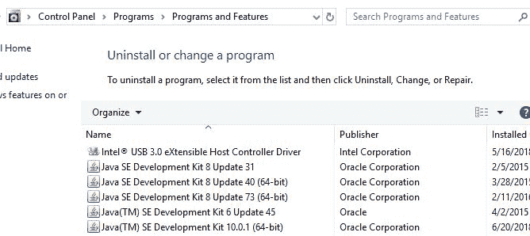
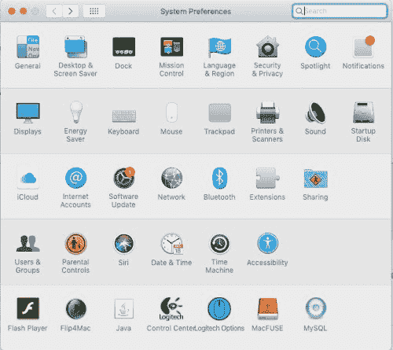

# 如何检查是否安装了 Java

> 原文:[https://web . archive . org/web/20220930061024/https://www . bael dung . com/Java-check-is-installed](https://web.archive.org/web/20220930061024/https://www.baeldung.com/java-check-is-installed)

## 1.概观

在这个简短的教程中，我们将看看几种方法来确定 Java 是否安装在一台机器上。

## 2.命令行

首先，**让我们打开一个命令窗口或终端，输入:**

```
> java -version
```

**如果安装了 Java**并且路径配置正确，我们的输出将类似于:

```
java version "1.8.0_31"
Java(TM) SE Runtime Environment (build 1.8.0_31-b13)
Java HotSpot(TM) Client VM (build 25.31-b07, mixed mode, sharing)
```

否则，我们将看到如下所示的错误消息，我们需要检查其他地方:

```
'java' is not recognized as an internal or external command,
operable program or batch file.
```

我们看到的确切消息会因使用的操作系统和安装的 Java 版本而异。

## 3.未设置路径时

去命令行输入`java -version `可以肯定的告诉我们是否安装了 Java。然而，如果我们看到一个错误消息，Java 可能仍然被安装——我们只需要进一步调查。

许多关于使用`java -version`的讨论都提到了 JAVA_HOME 环境变量。**这是误导，因为 JAVA_HOME 不会影响我们的`java -version`结果。**

此外，JAVA_HOME 应该指向一个 JDK，其他使用 JDK 特性的应用程序(如 Maven)也可以使用它。

更多信息，请查看我们的文章 [JAVA_HOME 应该指向 JDK](/web/20220820024017/https://www.baeldung.com/maven-java-home-jdk-jre) 和[如何设置 JAVA_HOME](/web/20220820024017/https://www.baeldung.com/java-home-on-windows-7-8-10-mac-os-x-linux) 。

因此，让我们看看找到 Java 的替代方法，以防命令行让我们失望。

### 3.1.Windows 10

在 Windows 上，我们可以在应用程序列表中找到它:

1.  按下`Start`按钮
2.  将应用程序列表向下滚动到 J
3.  打开`Java`文件夹
4.  点击`About Java`

[](/web/20220820024017/https://www.baeldung.com/wp-content/uploads/2018/12/how_to_check_if_java_installed_windows_apps_about_java.jpg)

我们还可以查看已安装的程序和功能:

1.  在`Search`栏中，输入`Control Panel`
2.  点击`Programs`
3.  如果`Java`图标出现，则 Java 已安装
4.  如果没有，点击`Programs and Features,` 并在 J 中查找已安装的 Java 版本

[](/web/20220820024017/https://www.baeldung.com/wp-content/uploads/2018/12/how_to_check_if_java_installed_windows_programs_features.jpg)

### 3.2.麦克·OS X

要查看 Mac 上是否安装了 Java 7 或更高版本，我们可以:

1.  转到`System Preferences`
2.  寻找`Java`图标

[](/web/20220820024017/https://www.baeldung.com/wp-content/uploads/2018/12/how_to_check_if_java_installed_mac_sys_prefs.jpg)

对于 Java 的早期版本，我们需要:

1.  打开`Finder`
2.  转到`Applications`文件夹
3.  转到`Utilities `文件夹
4.  寻找 `Java Preferences`应用程序

### 3.3.*Nix

在*nix 世界中，几乎没有不同的[包管理器](https://web.archive.org/web/20220820024017/https://www.tecmint.com/linux-package-management/)。

在基于 Debian 的发行版中，我们可以使用`aptitude search`命令:

```
$ sudo aptitude search jdk jre
```

如果在结果前有一个`i`，那么这意味着软件包已经安装:

```
...
i   oracle-java8-jdk                - Java™ Platform, Standard Edition 8 Develop
...
```

## 4.其他命令行工具

除了`java -version,`之外，我们还可以使用其他一些命令行工具来了解我们的 Java 安装。

### 4.1.Windows `where`命令

在 Windows 中，我们可以使用`where`命令找到我们的`java.exe`所在的位置:

```
> where java
```

我们的输出看起来会像这样:

```
C:\Apps\Java\jdk1.8.0_31\bin\java.exe
```

然而，与`java -version`一样，只有当我们的 PATH 环境变量指向 bin 目录时，这个命令才有用。

### 4.2.麦克·OS X 和*尼克斯`which`和`whereis`

在*nix 系统或 Mac 上的终端应用程序中，我们可以使用`which`命令:

```
$ which java
```

输出告诉我们 Java 命令在哪里:

```
/usr/bin/java
```

现在让我们使用`whereis`命令:

```
$ whereis java -b
```

`whereis`命令还为我们提供了 Java 安装的路径:

```
/usr/bin/java
```

与`java -version`一样，这些命令只在 Java 位于路径上时才会找到它。当我们安装了 Java，但想知道在使用`java`命令时到底会运行什么时，我们可以使用这些。

## 5.结论

在这篇短文中，我们讨论了如何找出 Java 是否安装在 Windows 10、Mac OS X 或 Linux/Unix 机器上，即使它不在 PATH 中。

我们还查看了一些用于定位 Java 安装的有用命令。