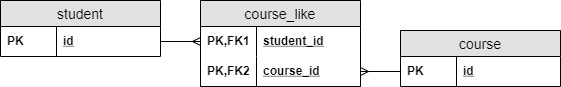
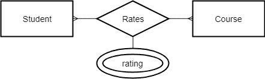
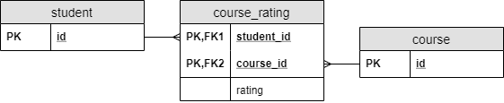
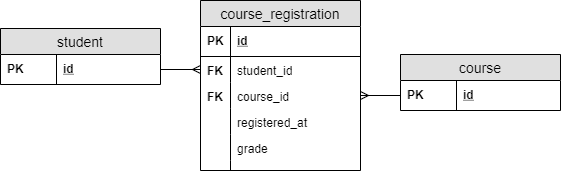

# JPA 中的多对多关系

> 原文:[https://web . archive . org/web/20220930061024/https://www . bael dung . com/JPA-多对多](https://web.archive.org/web/20220930061024/https://www.baeldung.com/jpa-many-to-many)

## 1.概观

在本教程中，我们将看到使用 JPA 处理多对多关系的多种方式。

我们将使用学生、课程以及它们之间各种关系的模型。

为了简单起见，在代码示例中，我们将只显示与多对多关系相关的属性和 JPA 配置。

## 延伸阅读:

## [用 JPA 将实体类名映射到 SQL 表名](/web/20221205203259/https://www.baeldung.com/jpa-entity-table-names)

Learn how table names are generated by default and how to override that behavior.[Read more](/web/20221205203259/https://www.baeldung.com/jpa-entity-table-names) →

## [JPA/Hibernate 级联类型概述](/web/20221205203259/https://www.baeldung.com/jpa-cascade-types)

A quick and practical overview of JPA/Hibernate Cascade Types.[Read more](/web/20221205203259/https://www.baeldung.com/jpa-cascade-types) →

## 2.基本的多对多

### 2.1.建模多对多关系

关系是两种类型的实体之间的连接。在多对多关系的情况下，双方都可以关联到另一方的多个实例。

请注意，实体类型有可能与自身存在关系。想一想建立家谱模型的例子:每个节点都是一个人，所以如果我们谈论父子关系，两个参与者都将是一个人。

然而，无论我们谈论的是单个还是多个实体类型之间的关系，都没有什么不同。因为考虑两个不同实体类型之间的关系更容易，所以我们将用它来说明我们的案例。

我们以学生给自己喜欢的课程打分为例。

一个学生可以喜欢**多个**课程，而**多个**学生可以喜欢同一门课程:

[](/web/20221205203259/https://www.baeldung.com/wp-content/uploads/2018/11/simple-er.png)

众所周知，在 RDBMSs 中，我们可以创建与外键的关系。由于双方都应该能够引用对方，**我们需要创建一个单独的表来保存外键**:

[](/web/20221205203259/https://www.baeldung.com/wp-content/uploads/2018/11/simple-model-updated.png)

这种表称为**连接表。**在一个连接表中，外键的组合将是它的复合主键。

### 2.2.在 JPA 中实施

**用 POJO**建立多对多关系很容易。我们应该**在两个类**中都包含一个`Collection`，它包含了其他类的元素。

之后，我们需要用`@Entity`标记类，用`@Id`标记主键，使它们成为合适的 JPA 实体。

另外，我们应该配置关系类型。所以，**我们用`@ManyToMany`** 标注来标注收藏:

```
@Entity
class Student {

    @Id
    Long id;

    @ManyToMany
    Set<Course> likedCourses;

    // additional properties
    // standard constructors, getters, and setters
}

@Entity
class Course {

    @Id
    Long id;

    @ManyToMany
    Set<Student> likes;

    // additional properties
    // standard constructors, getters, and setters
}
```

此外，我们必须配置如何在 RDBMS 中对关系建模。

所有者端是我们配置关系的地方。我们将使用`Student`类。

**我们可以用`Student`类中的`@JoinTable`注释来做这件事。**我们提供连接表的名称(`course_like`)以及带有`@JoinColumn`注释的外键。`joinColumn`属性将连接到关系的所有者一方，而`inverseJoinColumn`将连接到另一方:

```
@ManyToMany
@JoinTable(
  name = "course_like", 
  joinColumns = @JoinColumn(name = "student_id"), 
  inverseJoinColumns = @JoinColumn(name = "course_id"))
Set<Course> likedCourses;
```

注意，使用`@JoinTable`甚至`@JoinColumn`并不是必需的。JPA 将为我们生成表名和列名。然而，JPA 使用的策略并不总是符合我们使用的命名约定。因此，我们需要配置表名和列名的可能性。

在目标端，我们只需提供映射关系的字段名称。

因此，我们在`Course`类中设置了`@ManyToMany`注释的`mappedBy`属性:

```
@ManyToMany(mappedBy = "likedCourses")
Set<Student> likes;
```

请记住，由于**多对多关系在数据库**中没有所有者端，我们可以在`Course`类中配置连接表，并从`Student` 类中引用它。

## 3.使用组合键的多对多

### 3.1.建模关系属性

假设我们想让学生给课程打分。一个学生可以评定任意数量的课程，任意数量的学生可以评定同一门课程。因此，这也是一种多对多的关系。

这个例子之所以有点复杂，是因为**和评级之间的关系远不止它的存在。我们需要存储学生在课程中给出的评分分数。**

我们可以在哪里存储这些信息？我们不能把它放在`Student`实体中，因为一个学生可以给不同的课程不同的评分。类似地，将它存储在`Course`实体中也不是一个好的解决方案。

这是一种关系本身具有属性的情况。

使用此示例，在 ER 图中，将属性附加到关系看起来像这样:

[](/web/20221205203259/https://www.baeldung.com/wp-content/uploads/2018/11/relation-attribute-er.png)

我们可以用与简单的多对多关系几乎相同的方式对其建模。 **唯一的区别是我们给连接表添加了一个新的属性:**

[](/web/20221205203259/https://www.baeldung.com/wp-content/uploads/2018/11/relation-attribute-model-updated.png)

### 3.2.在 JPA 中创建组合键

简单的多对多关系的实现相当简单。唯一的问题是，我们不能以这种方式向关系中添加属性，因为我们直接连接了实体。因此，**我们没有办法向关系本身添加属性。**

由于我们将 DB 属性映射到 JPA 中的类字段，**我们需要为关系创建一个新的实体类。**

当然，每个 JPA 实体都需要一个主键。因为我们的主键是一个组合键，我们必须创建一个新的类来保存键的不同部分:

```
@Embeddable
class CourseRatingKey implements Serializable {

    @Column(name = "student_id")
    Long studentId;

    @Column(name = "course_id")
    Long courseId;

    // standard constructors, getters, and setters
    // hashcode and equals implementation
}
```

注意，组合键类必须满足一些**键需求**:

*   我们必须用`@Embeddable`来标记它。
*   它必须实现`java.io.Serializable`。
*   我们需要提供`hashcode()`和`equals()`方法的实现。
*   任何字段本身都不能是实体。

### 3.3.在 JPA 中使用组合键

使用这个组合键类，我们可以创建实体类，它对连接表进行建模:

```
@Entity
class CourseRating {

    @EmbeddedId
    CourseRatingKey id;

    @ManyToOne
    @MapsId("studentId")
    @JoinColumn(name = "student_id")
    Student student;

    @ManyToOne
    @MapsId("courseId")
    @JoinColumn(name = "course_id")
    Course course;

    int rating;

    // standard constructors, getters, and setters
}
```

这段代码非常类似于常规的实体实现。然而，我们有一些关键的区别:

*   我们使用 **`@EmbeddedId`来标记主键**，它是`CourseRatingKey`类的一个实例。
*   **我们用`@MapsId`标记了`student`和`course`字段。**

意味着我们将这些字段绑定到键的一部分，它们是多对一关系的外键。我们需要它，因为正如我们提到的，我们不能在组合键中有实体。

之后，我们可以像以前一样在`Student`和`Course`实体中配置反向引用:

```
class Student {

    // ...

    @OneToMany(mappedBy = "student")
    Set<CourseRating> ratings;

    // ...
}

class Course {

    // ...

    @OneToMany(mappedBy = "course")
    Set<CourseRating> ratings;

    // ...
}
```

注意，还有一种使用组合键的替代方法: [`@IdClass`](/web/20221205203259/https://www.baeldung.com/hibernate-identifiers) 注释。

### 3.4.其他特征

**我们将`Student`和`Course`类的关系配置为`@ManyToOne`。我们可以这样做，因为有了新的实体，我们在结构上将多对多关系分解为两个多对一关系。**

为什么我们能够做到这一点？如果我们仔细检查前一个案例中的表，我们可以看到它包含两个多对一关系。换句话说，在 RDBMS 中没有任何多对多的关系。我们称用连接表创建的结构为多对多关系，因为这是我们建模的内容。

此外，如果我们谈论多对多关系，这就更清楚了，因为这是我们的意图。同时，连接表只是一个实现细节；我们其实并不在乎。

此外，这个解决方案还有一个我们还没有提到的特性。简单的多对多解决方案在两个实体之间创建了一种关系。因此，我们不能将关系扩展到更多的实体。但是我们在这个解决方案中没有这个限制:**我们可以对任意数量的实体类型之间的关系进行建模。**

例如，当多个教师可以教授一门课程时，学生可以对特定教师教授特定课程的方式进行评级。这样，评级将是三个实体之间的关系:学生、课程和教师。

## 4.新实体的多对多

### 4.1.建模关系属性

假设我们想让学生注册课程。此外，我们需要存储学生注册特定课程的时间点。除此之外，我们还想存储她在课程中获得的分数。

在理想的情况下，我们可以使用前面的解决方案来解决这个问题，其中我们有一个带有组合键的实体。然而，世界远非理想，学生并不总是一次就完成一门课程。

在这种情况下，在相同的学生-课程对之间有**多个连接，或者多行有相同的`student_id-course_id`对。我们不能使用任何以前的解决方案来建模，因为所有的主键都必须是唯一的。所以，我们需要使用一个单独的主键。**

因此，**我们可以引入一个实体**，它将保存注册的属性:

[](/web/20221205203259/https://www.baeldung.com/wp-content/uploads/2018/11/relation-entity-er-updated.png)

在这种情况下，**注册实体表示其他两个实体之间的关系**。

因为它是一个实体，所以它有自己的主键。

在前面的解决方案中，记得我们有一个从两个外键创建的复合主键。

现在这两个外键将不再是主键的一部分:

[](/web/20221205203259/https://www.baeldung.com/wp-content/uploads/2018/11/relation-entity-model-updated.png)

### 4.2.在 JPA 中实施

由于`course_registration`变成了一个常规表，我们可以创建一个普通的旧 JPA 实体来对它建模:

```
@Entity
class CourseRegistration {

    @Id
    Long id;

    @ManyToOne
    @JoinColumn(name = "student_id")
    Student student;

    @ManyToOne
    @JoinColumn(name = "course_id")
    Course course;

    LocalDateTime registeredAt;

    int grade;

    // additional properties
    // standard constructors, getters, and setters
}
```

我们还需要配置`Student`和`Course`类中的关系:

```
class Student {

    // ...

    @OneToMany(mappedBy = "student")
    Set<CourseRegistration> registrations;

    // ...
}

class Course {

    // ...

    @OneToMany(mappedBy = "course")
    Set<CourseRegistration> registrations;

    // ...
}
```

同样，我们在前面配置了关系，所以我们只需要告诉 JPA 在哪里可以找到那个配置。

我们还可以使用这个解决方案来解决之前学生对课程评分的问题。然而，除非万不得已，否则创建专用主键感觉很奇怪。

此外，从 RDBMS 的角度来看，这没有多大意义，因为将两个外键组合起来就形成了一个完美的组合键。此外，那个**组合键有一个明确的含义:我们在关系中连接哪些实体。**

否则，这两种实现之间的选择往往只是个人偏好。

## 5.结论

在本文中，我们看到了什么是多对多关系，以及如何使用 JPA 在 RDBMS 中对其建模。

我们看到了三种在 JPA 中建模的方法。就这些方面而言，这三者都有不同的优势和劣势:

*   代码清晰度
*   DB 清晰度
*   向关系分配属性的能力
*   我们可以将多少个实体与关系联系起来
*   支持相同实体之间的多个连接

像往常一样，这些例子可以在 GitHub 的[上找到。](https://web.archive.org/web/20221205203259/https://github.com/eugenp/tutorials/tree/master/persistence-modules/spring-jpa-2)